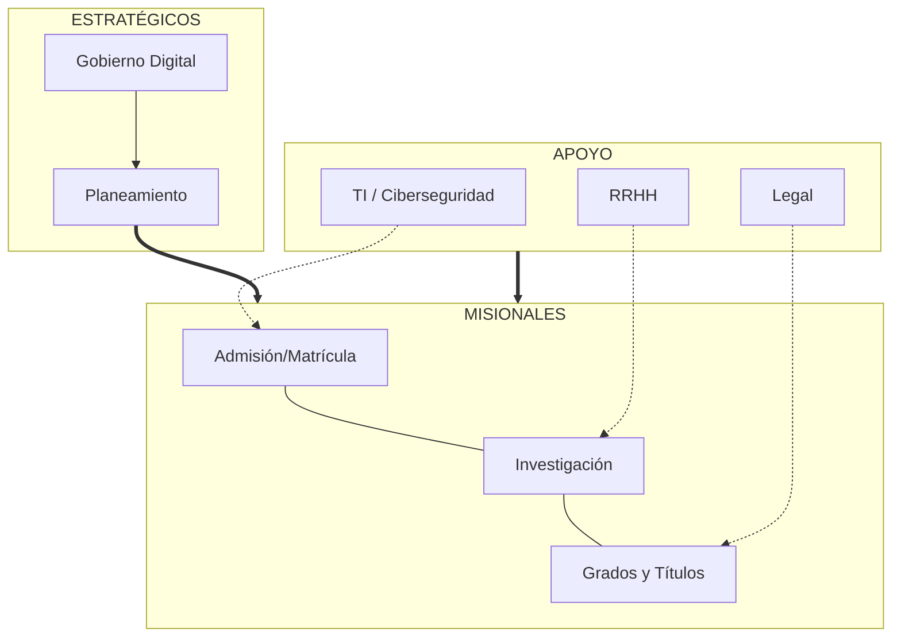

---
title: "Manual del Sistema de Gestión de Seguridad de la Información (SGSI)"
subtitle: "ISO/IEC 27001:2022"
author: "Universidad Nacional del Centro del Perú (UNCP)"
date: "Huancayo, 2026"
toc: true
toc-depth: 3
numbersections: true
...

\newpage

\newpage
# Control Documental

## D-SGSI-00: Marco de Referencia Terminológico y Normativo

**Organización:** Universidad Nacional del Centro del Perú (UNCP)
**Versión:** 1.0 (Enfoque Semántico y Multi-marco)
**Normas Base:** ISO/IEC 27000:2018, NIST SP 800-53, MITRE ATT&CK v14

\vspace{0.3cm}\hrule\vspace{0.3cm}

### 1. Propósito
Establecer el lenguaje común y el mapa normativo que rige el SGSI de la UNCP. Este marco garantiza la interoperabilidad semántica entre los equipos de Auditoría (Cumplimiento), la OTI (Técnicos) y la Alta Dirección (Estratégicos), eliminando ambigüedades en la interpretación de riesgos y controles.

### 2. Ontología de Seguridad (Relaciones Semánticas)
A diferencia de un glosario lineal, la UNCP adopta una **Ontología Dinámica** donde los términos se relacionan jerárquicamente para facilitar el razonamiento de riesgo:

*   **ACTIVO (ISO)** tiene un **VALOR (ISO)** y posee **VULNERABILIDADES (ISO/NIST)**.
*   **AMENAZA (ISO)** explota una **VULNERABILIDAD** mediante una **TÉCNICA/TÁCTICA (MITRE)**.
*   **INCIDENTE (ISO)** impacta la **CID (ISO)**.
*   **CONTROL (ISO/NIST)** mitiga el **RIESGO (ISO 31000)**.
*   **DESARROLLO SEGURO (POL-SGSI-01)** garantiza la seguridad de las **APLICACIONES** en entornos **MÓVILES (POL-SGSI-05)**.

### 3. Niveles de Aplicación y Cumplimiento
Dado el ecosistema de la UNCP, se definen dos niveles de control sobre los activos:
1.  **Nivel Mandatorio (Personal Administrativo y Docente):** El cumplimiento de las políticas (especialmente **POL-SGSI-05**) es de carácter obligatorio debido al alto riesgo de acceso a bases de datos críticas y sistemas de gestión.
2.  **Nivel de Concientización (Estudiantes):** Al no tener la universidad control técnico directo sobre los dispositivos personales de los alumnos, la estrategia se centra en **Campañas de Concientización** permanentes para promover el uso seguro de los servicios digitales.

### 4. Diccionario Crítico Interoperable (ISO / NIST / MITRE)

| Término (ISO 27000) | Definición Semántica | Correspondencia NIST / MITRE |
| :--- | :--- | :--- |
| **Activo** | Cualquier cosa que tiene valor para la UNCP. | **Asset:** Enfoque en datos y sistemas críticos. |
| **Riesgo** | Efecto de la incertidumbre sobre los objetivos de seguridad. | **Risk:** Probabilidad x Impacto (ISO 31000). |
| **Amenaza** | Causa potencial de un incidente no deseado. | **Threat Actor / Campaign:** Identificado en MITRE ATT&CK. |
| **Vulnerabilidad** | Debilidad de un activo o control que puede ser explotada. | **Weakness (CWE) / Vulnerability (CVE).** |
| **Control** | Medida que modifica el riesgo. | **Security Control:** NIST SP 800-53 (High/Mod/Low). |
| **Incidente** | Evento inesperado que tiene probabilidad de comprometer la CID. | **Detection & Response:** Alineado a NIST CSF. |
| **Técnica** | (Extensión UNCP) Método operativo de ataque. | **MITRE Technique:** Ejemplo: *Phishing (T1566)*. |

### 4. Mapa de Referencias Normativas

#### 4.1. Normas Internacionales (Frameworks)
*   **ISO/IEC 27001:2022:** Requisitos del Sistema de Gestión.
*   **ISO/IEC 27002:2022:** Guía de controles de seguridad.
*   **ISO 31000:2018:** Directrices para la gestión de riesgos.
*   **NIST Cybersecurity Framework (CSF) 2.0:** Resiliencia y respuesta operativa.

#### 4.2. Normativa Nacional (Perú)
*   **Ley N° 29733:** Ley de Protección de Datos Personales y su Reglamento (D.S. 016-2024-JUS).
*   **Decreto Legislativo N° 1412:** Ley de Gobierno Digital.
*   **MAGERIT v3:** Metodología de Análisis y Gestión de Riesgos de los Sistemas de Información (Sector Público).

### 5. Procedimiento de Actualización Continua

Para evitar la obsolescencia del marco normativo, el Oficial de Seguridad realizará las siguientes acciones:

1.  **Suscripción a Alertas:** Monitoreo mensual de la **Plataforma OBP de ISO** y la **Electropedia de IEC** para detectar cambios en términos técnicos.
2.  **Sincronización MITRE/NIST:** Revisión semestral de las actualizaciones de la matriz ATT&CK y el glosario NIST para integrar nuevos vectores de ataque al diccionario de la UNCP.
3.  **Mantenimiento de Versiones:** Cualquier cambio en un término crítico será comunicado al Comité de Gobierno Digital y actualizado en el repositorio de Micro-Auditorías (R-SGSI-01).

\vspace{0.3cm}\hrule\vspace{0.3cm}

**Este marco es la referencia definitiva para toda la documentación del SGSI-UNCP.**

## P-SGSI-00: Procedimiento de Control de Documentos y Registros

**Organización:** Universidad Nacional del Centro del Perú (UNCP)
**Versión:** 1.0
**Referencia:** ISO/IEC 27001:2022 (Cláusula 7.5)

\vspace{0.3cm}\hrule\vspace{0.3cm}

### 1. Objetivo
Establecer las directrices para la creación, revisión, aprobación, distribución y control de los documentos y registros que conforman el SGSI de la UNCP.

### 2. Codificación Documental
Todos los documentos del SGSI seguirán el siguiente formato de código:
**[TIPO]-[PROYECTO]-[NRO]**

*   **TIPO:** D (Directiva), P (Procedimiento), POL (Política), R (Registro/Formato), RPT (Reporte).
*   **PROYECTO:** SGSI.
*   **NRO:** Correlativo de tres dígitos (ej. 001).

**Ejemplo:** P-SGSI-001 (Procedimiento 001 del SGSI).

### 3. Control de Versiones
*   La versión inicial de todo documento es la **1.0**.
*   Cambios menores (ortografía, formato) incrementan el decimal (ej. 1.1).
*   Cambios sustanciales (cambio de fondo, nuevos requisitos) incrementan el entero (ej. 2.0).

### 4. Ciclo de Vida del Documento
1.  **Elaboración:** Por el responsable del área o el Oficial de Seguridad.
2.  **Revisión:** Por un par técnico o jefe inmediato.
3.  **Aprobación:** Por el Director General de Administración o el Rector (según jerarquía).
4.  **Distribución:** Se realiza de forma digital a través del repositorio institucional oficial.
5.  **Control de Obsoletos:** Los documentos antiguos se marcan con una marca de agua "OBSOLETO" y se archivan para evitar su uso accidental.

### 5. Control de Registros
*   Los registros (evidencias) deben ser legibles e identificables.
*   El tiempo de retención estándar es de **5 años**, a menos que la ley exija uno mayor.
*   El almacenamiento puede ser digital (preferido) o físico en el Archivo Central.

\vspace{0.3cm}\hrule\vspace{0.3cm}

**Aprobado por:**
Comité de Gobierno Digital - UNCP

## R-SGSI-00: Lista Maestra de Documentos del SGSI (Sincronizada)

**Organización:** Universidad Nacional del Centro del Perú (UNCP)
**Última Actualización:** 03/06/2026
**Norma:** ISO/IEC 27001:2022 (Cláusula 7.5)

\vspace{0.3cm}\hrule\vspace{0.3cm}

| Código | Nombre del Documento | Versión | Carpeta Destino |
| :--- | :--- | :--- | :--- |
| **D-SGSI-00** | Marco de Referencia Terminológico y Normativo | 1.0 | 00_\hspace{0pt}CONTROL_\hspace{0pt}DOCUMENTAL |
| **P-SGSI-00** | Procedimiento de Control de Documentos y Registros | 1.0 | 00_\hspace{0pt}CONTROL_\hspace{0pt}DOCUMENTAL |
| **R-SGSI-00** | Lista Maestra de Documentos del SGSI | 1.0 | 00_\hspace{0pt}CONTROL_\hspace{0pt}DOCUMENTAL |
| **D-SGSI-01** | Análisis del Contexto Estratégico (PESTEL/MEFE) | 1.0 | 01_\hspace{0pt}CONTEXTO_\hspace{0pt}DE_\hspace{0pt}LA_\hspace{0pt}ORGANIZACION |
| **D-SGSI-02** | Alcance del SGSI (Vanguardia) | 2.0 | 01_\hspace{0pt}CONTEXTO_\hspace{0pt}DE_\hspace{0pt}LA_\hspace{0pt}ORGANIZACION |
| **D-SGSI-06** | Marco Conceptual del SGSI | 1.0 | 01_\hspace{0pt}CONTEXTO_\hspace{0pt}DE_\hspace{0pt}LA_\hspace{0pt}ORGANIZACION |
| **D-SGSI-07** | Mapa de Procesos del SGSI | 1.0 | 01_\hspace{0pt}CONTEXTO_\hspace{0pt}DE_\hspace{0pt}LA_\hspace{0pt}ORGANIZACION |
| **D-SGSI-03** | Política General de Seguridad de la Información | 1.0 | 02_\hspace{0pt}LIDERAZGO |
| **ACT-SGSI-01**| Acta de Compromiso de la Alta Dirección | 1.0 | 02_\hspace{0pt}LIDERAZGO |
| **D-SGSI-04** | Metodología de Gestión de Riesgos | 1.0 | 03_\hspace{0pt}PLANIFICACION |
| **D-SGSI-05** | Declaración de Aplicabilidad (SoA) | 1.0 | 03_\hspace{0pt}PLANIFICACION |
| **R-SGSI-01** | Inventario de Activos de Información | 1.0 | 03_\hspace{0pt}PLANIFICACION |
| **R-SGSI-02** | Matriz de Evaluación y Tratamiento de Riesgos | 1.0 | 03_\hspace{0pt}PLANIFICACION |
| **P-SGSI-08** | Plan de Capacitación y Concientización | 1.0 | 04_\hspace{0pt}SOPORTE |
| **P-SGSI-02** | Marco de Respuesta a Incidentes (CSIRT) | 1.0 | 05_\hspace{0pt}OPERACION |
| **P-SGSI-03** | Gestión de Identidades (Zero Trust) | 1.0 | 05_\hspace{0pt}OPERACION |
| **P-SGSI-04** | Procedimiento de Gestión de Cambios | 1.0 | 05_\hspace{0pt}OPERACION |
| **P-SGSI-05** | Resiliencia y Continuidad en Nube Híbrida | 1.0 | 05_\hspace{0pt}OPERACION |
| **P-SGSI-06** | Procedimiento de Gestión de Seguridad con Proveedores | 1.0 | 05_\hspace{0pt}OPERACION |
| **P-SGSI-07** | Procedimiento de Eliminación Segura de Información | 1.0 | 05_\hspace{0pt}OPERACION |
| **P-SGSI-09** | Metodología de Auditoría Basada en Riesgos | 1.0 | 06_\hspace{0pt}EVALUACION_\hspace{0pt}DEL_\hspace{0pt}DESEMPEÑO |
| **R-SGSI-03** | Cuadro de Mando de Verificación (KPIs) | 1.0 | 06_\hspace{0pt}EVALUACION_\hspace{0pt}DEL_\hspace{0pt}DESEMPEÑO |
| **R-SGSI-04** | Programa Maestro de Auditoría | 1.0 | 06_\hspace{0pt}EVALUACION_\hspace{0pt}DEL_\hspace{0pt}DESEMPEÑO |
| **Plantillas** | Planes, Informes y Listas de Auditoría | 1.0 | 06_\hspace{0pt}EVALUACION_\hspace{0pt}DEL_\hspace{0pt}DESEMPEÑO |
| **D-SGSI-08** | Guía de Implementación de Controles (ISO 27002) | 1.0 | 08_\hspace{0pt}ANEXO_\hspace{0pt}A_\hspace{0pt}CONTROLES |
| **POL-SGSI-07**| Política de Seguridad Física y Áreas Seguras | 1.0 | 08_\hspace{0pt}ANEXO_\hspace{0pt}A_\hspace{0pt}CONTROLES |
| **POL-SGSI-01**| Política de Desarrollo Seguro y APIs | 1.0 | 09_\hspace{0pt}POLITICAS_\hspace{0pt}Y_\hspace{0pt}PROCEDIMIENTOS |
| **POL-SGSI-02**| Política de Uso Aceptable, Escritorio y Teletrabajo | 1.0 | 09_\hspace{0pt}POLITICAS_\hspace{0pt}Y_\hspace{0pt}PROCEDIMIENTOS |
| **POL-SGSI-03**| Política de Respaldo e Información | 1.0 | 09_\hspace{0pt}POLITICAS_\hspace{0pt}Y_\hspace{0pt}PROCEDIMIENTOS |
| **POL-SGSI-04**| Política de Seguridad con Proveedores | 1.0 | 09_\hspace{0pt}POLITICAS_\hspace{0pt}Y_\hspace{0pt}PROCEDIMIENTOS |
| **POL-SGSI-05**| Política de Dispositivos Móviles | 1.0 | 09_\hspace{0pt}POLITICAS_\hspace{0pt}Y_\hspace{0pt}PROCEDIMIENTOS |
| **POL-SGSI-06**| Política de Contraseñas | 1.0 | 09_\hspace{0pt}POLITICAS_\hspace{0pt}Y_\hspace{0pt}PROCEDIMIENTOS |
| **F-SGSI-01** | Formato de Solicitud de Alta/Baja de Acceso | 1.0 | 10_\hspace{0pt}FORMATOS |
| **F-SGSI-02** | Registro de Asistencia a Capacitación | 1.0 | 10_\hspace{0pt}FORMATOS |
| **F-SGSI-03** | Formato de Baja y Devolución de Activos | 1.0 | 10_\hspace{0pt}FORMATOS |
| **F-SGSI-04** | Reporte de Acción Correctiva (RAC) | 1.0 | 10_\hspace{0pt}FORMATOS |
| **F-SGSI-05** | Acta de Eliminación Segura de Activos | 1.0 | 10_\hspace{0pt}FORMATOS |
| **F-SGSI-06** | Bitácora de Acceso a Áreas Críticas | 1.0 | 10_\hspace{0pt}FORMATOS |
| **D-SGSI-12** | Estrategia de Certificación ISO 27001 | 1.0 | 12_\hspace{0pt}CERTIFICACION |

\vspace{0.3cm}\hrule\vspace{0.3cm}

*Este registro centraliza el control de toda la documentación oficial del SGSI-UNCP.*

\newpage
# Contexto De La Organizacion

## D-SGSI-01: Análisis del Contexto Estratégico del SGSI-UNCP

**Organización:** Universidad Nacional del Centro del Perú (UNCP)
**Versión:** 1.0 (Análisis 360°: PESTEL, Porter, MEFE, MEFI, CAME)
**Referencia:** ISO/IEC 27001:2022 (Cláusula 4)

\vspace{0.3cm}\hrule\vspace{0.3cm}

### Fase 1: Análisis del Entorno (Cláusula 4.1)

#### 1.1. Análisis PESTEL (Macroentorno)

| Factor | Descripción y Diagnóstico | Impacto en SGSI |
| :--- | :--- | :--- |
| **Político** | Mandato nacional de Transformación Digital (PCM/SGTD). | **Alto.** Obliga a la implementación del SGSI por ley. |
| **Económico** | Presupuesto institucional (Canon/RDR) sujeto a priorización. | **Medio.** Riesgo de retraso en compras de hardware crítico. |
| **Social** | Generación de estudiantes digitalmente nativos con alta expectativa. | **Alto.** Exige disponibilidad 24/7 y servicios móviles seguros. |
| **Tecnológico** | Auge de la Inteligencia Artificial y servicios Cloud (Huawei Cloud). | **Crítico.** Requiere controles de seguridad avanzados y auditoría de IA. |
| **Ecológico** | Política de "Cero Papel" y eco-eficiencia (Green IT). | **Medio.** Impulsa la digitalización segura y reducción de energía en DC. |
| **Legal** | Nueva Ley de Protección de Datos (D.S. 016-2024-JUS) y Ciberdefensa. | **Alto.** Incrementa las sanciones por brechas de datos. |

#### 1.2. Las 5 Fuerzas de Porter (Microentorno)

1.  **Rivalidad entre competidores:** Universidades públicas y privadas compiten por prestigio y licenciamiento SUNEDU. La seguridad es un diferenciador de calidad.
2.  **Poder de negociación de proveedores:** Alta dependencia de proveedores de Nube (Huawei) e Internet. Se requiere gestión de SLAs (A.15).
3.  **Amenaza de nuevos competidores:** Programas de educación virtual global. Exige una plataforma UNCP resiliente y segura.
4.  **Amenaza de productos sustitutos:** Cursos online y certificaciones técnicas. La UNCP debe proteger su valor oficial (Grados y Títulos).
5.  **Poder de negociación de los alumnos:** Los estudiantes demandan transparencia y protección de su privacidad.

\vspace{0.3cm}\hrule\vspace{0.3cm}

### Fase 2: Diagnóstico Estratégico Cuantificado

#### 2.1. Matriz de Evaluación de Factores Internos (MEFI)

| Fortaleza / Debilidad | Peso | Calificación | Ponderado |
| :--- | :--- | :--- | :--- |
| **F1:** Comité de Gobierno Digital formalizado (Res. 1862). | 0.15 | 4 | 0.60 |
| **F2:** Infraestructura Cloud Huawei Cloud operativa. | 0.15 | 4 | 0.60 |
| **D1:** Nivel de madurez digital inicial (1.569). | 0.20 | 1 | 0.20 |
| **D2:** Resistencia al cambio cultural en personal antiguo. | 0.20 | 2 | 0.40 |
| **D3:** Limitada segmentación de red en facultades. | 0.30 | 1 | 0.30 |
| **TOTAL** | **1.00** | - | **2.10** |
*(Nota: Un puntaje de 2.10 indica una posición interna débil; se requiere fortalecer la segmentación y la cultura).*

#### 2.2. Matriz de Evaluación de Factores Externos (MEFE)

| Oportunidad / Amenaza | Peso | Calificación | Ponderado |
| :--- | :--- | :--- | :--- |
| **O1:** Presupuesto asignado al PGTD (S/ 6.4M). | 0.25 | 4 | 1.00 |
| **O2:** Apoyo técnico de la PCM/SGTD para interoperabilidad. | 0.15 | 3 | 0.45 |
| **A1:** Incremento de ataques de Ransomware a universidades. | 0.35 | 1 | 0.35 |
| **A2:** Nuevas exigencias legales de protección de datos (JUS). | 0.25 | 2 | 0.50 |
| **TOTAL** | **1.00** | - | **2.30** |
*(Nota: Un puntaje de 2.30 indica que la UNCP está respondiendo de forma promedio a las amenazas externas; debe acelerar el SGSI).*

\vspace{0.3cm}\hrule\vspace{0.3cm}

### Fase 3: Estrategia Proactiva (Análisis CAME)

Basado en el FODA cruzado, se establecen las siguientes acciones:

| Estrategia | Acción Concreta (Plan de Acción) |
| :--- | :--- |
| **Corregir (D3+O1)** | Ejecutar el proyecto PGTD-04 para implementar **Microsegmentación ZTNA** y remediar la debilidad de red. |
| **Afrontar (A1+F2)** | Utilizar la **Resiliencia Cloud** y backups inmutables en Huawei Cloud para defenderse del Ransomware. |
| **Mantener (F1+O2)** | Fortalecer la gobernanza del Comité de Gobierno Digital mediante la auditoría continua (P-SGSI-09). |
| **Explotar (O2+D1)** | Aprovechar los lineamientos de la PCM para elevar rápidamente el nivel de madurez en servicios digitales. |

\vspace{0.3cm}\hrule\vspace{0.3cm}

### Fase 4: Definición del Alcance Basado en Riesgos (Cláusula 4.3)

El alcance del SGSI (definido en `Alcance-SGSI-UNCP.md`) se ratifica considerando que los mayores riesgos provienen de la **interacción de la red de facultades con servicios externos**. Se confirma la necesidad de un enfoque **Zero Trust** para mitigar las debilidades internas detectadas en la MEFI.

\vspace{0.3cm}\hrule\vspace{0.3cm}

**Resultado del Diagnóstico:** La UNCP posee una base tecnológica sólida (Cloud) pero una infraestructura de red y una cultura orgánica vulnerables. El SGSI debe priorizar la **Capacitación (OGTD6)** y la **Seguridad de Red (ZTNA)** para equilibrar la balanza estratégica.

## D-SGSI-02: Alcance del SGSI - Universidad Nacional del Centro del Perú

### 1. Organización

**Universidad Nacional del Centro del Perú (UNCP)**  
RUC: 20172030258  
Domicilio legal: Av. Mariscal Ramón Castilla km. 5, N° 3809-4089, El Tambo, Huancayo  
Naturaleza: Universidad pública peruana, con autonomía académica, normativa y económica (Ley N° 30220).

\vspace{0.3cm}\hrule\vspace{0.3cm}

### 2. Definición del Alcance Estratégico (Enfoque de Excelencia)

El Sistema de Gestión de Seguridad de la Información (SGSI) de la UNCP adopta una **Definición de Alcance Superior**, integrando los requisitos de la norma ISO/IEC 27001:2022 con metodologías de vanguardia para garantizar la protección de la información sin importar su ubicación, formato o método de acceso.

#### 2.1 Filosofía de Implementación
*   **Enfoque Zero Trust (Confianza Cero):** El alcance no se limita a las paredes del campus. Se aplica una segmentación lógica estricta y verificación continua para cada intento de acceso, tratando las redes locales y remotas (VPN/Internet) con el mismo nivel de escrutinio.
*   **Ubicación Agnóstica y Ciclo de Vida del Dato:** La seguridad "viaja" con el dato. El alcance protege la información crítica (notas, datos personales, investigación) en tránsito, en uso y en reposo, ya sea que resida en servidores locales, dispositivos de usuarios o en la nube (Huawei Cloud / Microsoft 365).
*   **Inventario Dinámico y Mitigación de Shadow IT:** El alcance incluye todos los activos identificados mediante procesos de descubrimiento automático, asegurando que dispositivos no registrados o de reciente incorporación (IoT, BYOD) queden bajo el control del SGSI.
*   **Resiliencia NIST CSF:** El alcance está diseñado para soportar no solo la protección (ISO 27001), sino también las capacidades operativas de detección y respuesta rápida ante incidentes.

#### 2.2 Ámbito Organizacional y Procesos Críticos
El SGSI abarca el flujo completo de los datos en los siguientes macroprocesos:
- **Gestión Académica:** Desde la admisión y matrícula hasta la emisión de grados y títulos (ERP ADESA).
- **Investigación y Propiedad Intelectual:** Protección de tesis y proyectos (Repositorio DSpace).
- **Gestión Administrativa y Financiera:** Planillas, tesorería y abastecimiento (SIGA / SIAF).
- **Educación Digital:** Plataformas de aprendizaje y colaboración (Moodle / Teams).

#### 2.3 Ámbito Tecnológico (Infraestructura Híbrida)
| Activo / Entorno | Descripción del Alcance |
| :--- | :--- |
| **Infraestructura On-Premise** | Datacenter Huancayo, redes de facultades (Sedes Mantaro, Satipo, Tarma). |
| **Infraestructura Cloud** | IaaS/PaaS en Huawei Cloud, SaaS en Microsoft 365. |
| **Acceso Remoto / VPN** | Todos los túneles IPsec y accesos SSL-VPN utilizados por administrativos y docentes. |
| **Dispositivos Finales** | Laptops, tablets y estaciones de trabajo (incluyendo BYOD autorizados). |

#### 2.4 Ámbito Geográfico
El SGSI protege la información en las 4 sedes de la UNCP y en cualquier ubicación remota desde la cual se acceda a los sistemas institucionales bajo los controles de seguridad establecidos.

\vspace{0.3cm}\hrule\vspace{0.3cm}

### 3. Justificación de Inclusiones Basada en Riesgos

La delimitación de este alcance responde a los siguientes riesgos críticos identificados:
1.  **Fuga de datos sensibles:** Debido al acceso remoto masivo de docentes y administrativos.
2.  **Alteración de registros académicos:** Por debilidades en la segmentación de la red de facultades.
3.  **Indisponibilidad de servicios:** Ante fallas en la infraestructura local o ataques dirigidos (DDoS).

Al incluir el ciclo de vida del dato y el enfoque Zero Trust, la UNCP garantiza que la seguridad sea consistente independientemente de las fronteras físicas.

\vspace{0.3cm}\hrule\vspace{0.3cm}

### 4. Mapa de Dependencias Críticas

| Proceso | Activo Crítico | Dependencia Tecnológica |
| :--- | :--- | :--- |
| Matrícula / Notas | Base de Datos ADESA | Huawei Cloud / IdM Keycloak |
| Gestión de Pagos | Sistema de Tesorería | SIAF / Pasarela de Pagos |
| Educación Virtual | Campus Virtual (Moodle) | Almacenamiento S3 / Contenedores |
| Investigación | Repositorio Digital | Red de Telemetría / SIEM |

\vspace{0.3cm}\hrule\vspace{0.3cm}

### 5. Exclusiones Obligatorias
No se excluye ninguno de los requisitos de las cláusulas 4 a 10 de la norma ISO/IEC 27001:2022, ya que son indispensables para la conformidad del sistema. Se excluyen únicamente activos físicos de infraestructura civil (edificaciones, mobiliario) que no procesan ni almacenan información.

\vspace{0.3cm}\hrule\vspace{0.3cm}

**Declaración de Conformidad:** Este documento establece los límites y aplicabilidad del SGSI-UNCP, alineado a la excelencia operativa y la protección integral del patrimonio informativo de la universidad.

*Versión 2.0 (Enfoque Vanguardia) - Aprobado para el proyecto SGSI-UNCP 2026.*

## D-SGSI-06: Marco Conceptual del SGSI

### Universidad Nacional del Centro del Perú (UNCP)
#### Marco Conceptual General

\vspace{0.3cm}\hrule\vspace{0.3cm}

\newpage

### 1. ¿Qué es un SGSI?

Sistema de gestión basado en la norma **ISO/IEC 27001** que permite establecer, implementar, mantener y mejorar continuamente la seguridad de la información en una organización.

Cubre **TODO tipo de información**, sin importar su formato:

| Tipo | Ejemplos en UNCP |
|---|---|
| **Digital** | Bases de datos, sistemas (SIGA, campus virtual, correo), archivos, respaldos |
| **Física (papel)** | Actas de notas, expedientes de estudiantes, contratos, resoluciones, informes |
| **Transmitida** | Videoconferencias, llamadas, conversaciones |
| **Almacenada en medios** | Discos duros, USB, CD/DVD, cintas de backup |

Principios fundamentales: **Confidencialidad, Integridad, Disponibilidad (CID)**.

\vspace{0.3cm}\hrule\vspace{0.3cm}

\newpage

### 2. Información Física vs. Digital - Tratamiento Diferenciado

#### Información Física (soporte papel)

| Aspecto | Consideraciones UNCP |
|---|---|
| **Archivos físicos** | Oficinas de registros académicos, tesorería, recursos humanos, secretarías de facultad |
| **Expedientes** | Almacenados en estantes, archivadores, cajas. Control de acceso físico |
| **Actas de notas** | Firmadas manualmente, resguardadas en archivos centrales |
| **Contratos** | Versiones impresas con firmas ológrafas |
| **Resoluciones** | Emitidas por rectorado y facultades, archivadas en físico |
| **Tesis** | Copias físicas en bibliotecas central y facultades |

#### Protección de información física (Controles A.7, A.11)

| Medida | Descripción |
|---|---|
| **Control de acceso físico** | Puertas con llave, tarjetas de proximidad, biométricos |
| **Áreas seguras** | Sala de servidores, archivos centrales, tesorería |
| **Perímetro de seguridad** | Vigilancia, cámaras, alarmas en edificios clave |
| **Escritorios limpios (A.11.2.9)** | Documentos sensibles guardados bajo llave al retirarse |
| **Pantallas limpias (A.11.2.9)** | Bloqueo de pantalla automático, documentos visibles solo a personal autorizado |
| **Destrucción segura** | Trituradoras de papel certificadas para documentos confidenciales |
| **Archivo histórico** | Control de acceso, condiciones ambientales (temperatura, humedad, plagas) |

\vspace{0.3cm}\hrule\vspace{0.3cm}

\newpage

### 3. Estructura del SGSI según ISO 27001 (Cláusulas 4-10)

#### Cl. 4 - Contexto de la organización

**Partes interesadas internas:**
- Rectorado, vicerrectorados, decanos, directores de escuela
- Docentes, estudiantes, personal administrativo
- Comité Electoral Universitario, Asamblea Universitaria

**Partes interesadas externas:**
- SUNEDU, MINEDU, CGR, PCM
- Proveedores de servicios TI (internet, cloud, licencias)
- Postulantes y público en general

**Requisitos legales aplicables:**
- Ley N° 29158 - Ley Orgánica del Poder Ejecutivo
- Ley N° 29733 - Ley de Protección de Datos Personales
- **D.S. N° 016-2024-JUS** - Nuevo Reglamento de la Ley N° 29733, vigente desde marzo 2025. Introduce DPIA, regulación de IA y transferencias internacionales de datos
- Decreto Legislativo N° 1412 - Ley de Gobierno Digital
- D.S. N° 029-2021-PCM - Reglamento de la Ley de Gobierno Digital
- **D.S. N° 098-2025-PCM** - Modifica el D.S. N° 029-2021-PCM. Actualiza condiciones de identidad digital, servicios digitales, interoperabilidad y gestión documental electrónica en el Estado
- D.S. N° 033-2018-PCM - Plataforma Digital Única del Estado Peruano
- D.S. N° 103-2023-PCM - Política Nacional de Transformación Digital
- **Ley N° 31814 y D.S. N° 115-2025-PCM** - Ley que promueve el uso de la IA y su Reglamento. Exige auditoría de algoritmos, supervisión humana y gestión de riesgos éticos en entidades públicas
- R.M. N° 119-2018-PCM - Comité de Gobierno Digital
- R.S. N° 005-2018-PCM/SGTD - Lineamientos para formulación del PGTD
- R.S. N° 004-2018-PCM/SGTD - Lineamientos para gestión del Gobierno Digital
- **R.S. N° 001-2025-PCM/SGTD** - Lineamiento para el diseño y desarrollo de servicios digitales accesibles para personas con discapacidad (WCAG 2.2)
- **Directiva N° 001-2025-PCM/SGTD** - Directiva que regula el consumo seguro de los servicios de información de la PIDE y establece medidas de seguridad digital
- Ley N° 27209 - Ley de Presupuesto del Sector Público
- Directiva N° 006-2019-CG/INTEG - Sistema de Control Interno
- Resolución N° 322-2026-CG - Plan de Gobierno y Transformación Digital CGR
- Estatuto de la UNCP

#### Cl. 5 - Liderazgo

Conforme a la R.M. N° 119-2018-PCM y los Lineamientos del PGTD (R.S. N° 005-2018-PCM/SGTD):

| Rol | Responsabilidad |
|---|---|
| **Rector** | Titular de la entidad, preside el Comité de Gobierno Digital, máxima responsabilidad del SGSI |
| **Comité de Gobierno Digital** | Dirige, evalúa y supervisa la transformación digital y el SGSI |
| **Secretario Técnico del Comité** | Elabora actas, coordina agenda, registra información del PGTD |
| **Oficial de Seguridad y Confianza Digital** | Lidera el SGSI operativamente, reporta al Comité |
| **Decanos / Directores** | Responsables de la seguridad de la información en sus unidades |
| **Todos los colaboradores** | Obligación de reportar incidentes de seguridad |

#### Cl. 6 - Planificación

**Evaluación de riesgos:**
- Identificación de activos (digitales y físicos)
- Identificación de amenazas y vulnerabilidades
- Análisis de impacto (pérdida de notas, filtración de datos personales, interrupción de matrícula)
- Plan de tratamiento de riesgos

**Declaración de Aplicabilidad (SoA):**
- Define qué controles del Anexo A son aplicables a la UNCP

#### Cl. 7 - Soporte

**Recursos:**
- Presupuesto para seguridad (software, hardware, personal)
- Infraestructura física y lógica

**Competencia:**
- Capacitación obligatoria en seguridad para todo el personal
- Formación específica para el equipo SGSI

**Concientización:**
- Campañas de phishing simuladas
- Charlas sobre seguridad de información física y digital
- Inducción para nuevos ingresantes y personal

**Documentación:**
- Política SGSI, procedimientos, registros, manuales

#### Cl. 8 - Operación

- Implementación de controles
- Gestión de riesgos en operaciones diarias
- Gestión de cambios (nuevos sistemas, procesos, personal)
- Gestión de incidentes de seguridad

#### Cl. 9 - Evaluación

- Auditorías internas periódicas
- Revisión del SGSI por la alta dirección (anual)
- Medición de indicadores de eficacia

#### Cl. 10 - Mejora

- Gestión de no conformidades
- Acciones correctivas y preventivas
- Mejora continua del SGSI

\vspace{0.3cm}\hrule\vspace{0.3cm}

\newpage

### 4. Controles del Anexo A ISO 27001 --- Aplicación en UNCP

| Dominio | Controles clave | Digital | Física |
|---|---|---|---|
| **A.5 Políticas** | Política de seguridad, revisión | x | x |
| **A.6 Organización interna** | Roles, segregación, contacto autoridades | x | x |
| **A.7 RRHH** | Inducción, capacitación, disciplinario, desvinculación | x | x |
| **A.8 Gestión de activos** | Inventario, clasificación, manejo de medios | x | x |
| **A.9 Control de acceso** | Acceso a sistemas, VPN, roles, privilegios | x | x |
| **A.10 Criptografía** | Cifrado de datos sensibles, firmas digitales | x | |
| **A.11 Seguridad física** | Perímetro, salas seguras, escritorio limpio, CCTV | | x |
| **A.12 Operaciones** | Backups, protección malware, gestión cambios, logs | x | |
| **A.13 Comunicaciones** | Firewall, segmentación de red, VPN, correo seguro | x | |
| **A.14 Adquisiciones** | Desarrollo seguro, pruebas, aceptación | x | |
| **A.15 Relaciones proveedores** | Contratos con ISPs, servicios cloud, SaaS | x | x |
| **A.16 Incidentes** | Reporte, clasificación, respuesta, lecciones aprendidas | x | x |
| **A.17 Continuidad** | BCP y DRP para sistemas críticos | x | x |
| **A.18 Cumplimiento** | Ley 29733, D.L. 1412, transparencia, CGR | x | x |

\vspace{0.3cm}\hrule\vspace{0.3cm}

\newpage

### 5. Activos críticos de información en la UNCP

#### Digitales

| Activo | Riesgo si se pierde/filtra |
|---|---|
| Base de datos académica (matrícula, notas, grados) | Pérdida de historial académico, procesos judiciales |
| Sistema de tesorería / recaudación | Fraude financiero, pérdida económica |
| Correo institucional | Suplantación, phishing, fuga de información |
| Plataforma campus virtual | Interrupción de servicio educativo |
| Repositorio de tesis e investigación | Pérdida de propiedad intelectual |
| Sistema de planillas (RRHH) | Fuga de datos personales de trabajadores |
| Servidor de archivos compartidos | Pérdida de documentos institucionales |

#### Físicos

| Activo | Ubicación | Riesgo |
|---|---|---|
| Actas de notas originales | Archivo central / facultades | Pérdida, deterioro, incendio |
| Expedientes de grados y títulos | Secretaría general | Pérdida, falsificación |
| Contratos y convenios | Oficina de planeamiento / legal | Pérdida, disputas legales |
| Resoluciones rectorales | Archivo central | Pérdida de legalidad de actos |
| Declaraciones juradas | RRHH / OCI | Fuga de datos personales |
| Tesis impresas | Biblioteca central / facultades | Deterioro, extravío |

\vspace{0.3cm}\hrule\vspace{0.3cm}

\newpage

### 6. Mapa de transición AS-IS → TO-BE (vista general)

| Dimensión | AS-IS (actual) | TO-BE (deseado) |
|---|---|---|
| **Políticas** | Dispersas, no formalizadas | Política SGSI aprobada por rectorado, comunicada a toda la UNCP |
| **Organización** | Sin Oficial de Seguridad designado | Comité de Gobierno Digital activo + Oficial de Seguridad |
| **Seguridad física** | Acceso sin control en sedes académicas y administrativas | Controles perimetrales, archivadores con llave, cámaras, bitácoras |
| **Seguridad digital** | Sin segmentación de red, backups no validados | Red segmentada, backups periódicos probados, firewall |
| **Documentos físicos** | Archivos sin clasificación de seguridad | Documentos clasificados (público, interno, confidencial, secreto) |
| **Control de acceso** | Usuarios compartidos, contraseñas débiles | Acceso por roles, 2FA, política de contraseñas |
| **Incidentes** | No se reportan formalmente | Procedimiento de gestión de incidentes, CSIRT universitario |
| **Concientización** | Mínima o nula | Programa permanente de capacitación y simulacros |
| **Cumplimiento legal** | Parcial (Ley 29733, D.L. 1412) | Cumplimiento auditado, reportes a CGR y PCM |
| **Mejora continua** | No existe ciclo de mejora | Auditorías internas, revisión por dirección, acciones correctivas |
| **Monitoreo de red** | Sin TAP, IDS/IPS ni SNMPv3 | TAP físico en Datacenter + SPAN en facultades + NetFlow/IPFIX en routers + SNMPv3 cifrado (AES) |
| **Alta disponibilidad** | Servidores físicos sin clustering ni replicación | Nube Híbrida Activo-Activo (Proxmox/Ceph o vSAN) + GSLB + Contenedores Docker/Kubernetes |
| **Segmentación de red** | Ausente en la mayoría de facultades | Microsegmentación ZTNA + VLANs por tipo de usuario + 802.1X |
| **Conectividad entre sedes** | VPNs estáticas sin priorización | SD-WAN con túneles IPsec dinámicos entre 4 sedes |
| **Conectividad cloud** | Ninguna | AWS Direct Connect / Azure ExpressRoute a PNGD-PCM |
| **SIEM** | Inexistente | Wazuh / Microsoft Sentinel con IA para detección de DDoS y SQLi |

\vspace{0.3cm}\hrule\vspace{0.3cm}

\newpage

### 7. Normativa peruana relacionada

| Norma | Relación con SGSI |
|---|---|
| **Ley N° 29733** - Protección de Datos Personales | Exige medidas de seguridad para datos personales (estudiantes, docentes) |
| **D.S. N° 016-2024-JUS** - Nuevo Reglamento de la Ley N° 29733 | Introduce DPIA, regulación de IA y transferencias internacionales de datos. Vigente desde marzo 2025 |
| **D.L. N° 1412** - Ley de Gobierno Digital | Marco para gobierno digital en entidades públicas |
| **D.S. N° 029-2021-PCM** - Reglamento de la Ley de Gobierno Digital | Procedimientos y condiciones para gobierno digital |
| **D.S. N° 098-2025-PCM** - Modificatoria del D.S. N° 029-2021-PCM | Actualiza condiciones de identidad digital, servicios digitales, interoperabilidad y gestión documental electrónica |
| **D.S. N° 033-2018-PCM** - Plataforma Digital Única | Digitalización de servicios públicos |
| **D.S. N° 103-2023-PCM** - PNTD | Alinea al Sistema Nacional de Transformación Digital |
| **Ley N° 31814 y D.S. N° 115-2025-PCM** - Ley de IA y su Reglamento | Exige auditoría de algoritmos, supervisión humana y registro de sistemas de riesgo alto en entidades públicas |
| **R.M. N° 119-2018-PCM** - Comité de Gobierno Digital | Crea el Comité de Gobierno Digital en cada entidad |
| **R.S. N° 005-2018-PCM/SGTD** - Lineamientos PGTD | Estructura y contenido mínimo del Plan de Gobierno y Transformación Digital |
| **R.S. N° 001-2025-PCM/SGTD** - Lineamiento de accesibilidad digital | Diseño y desarrollo de servicios digitales accesibles para personas con discapacidad (WCAG 2.2) |
| **Directiva N° 001-2025-PCM/SGTD** - Consumo seguro de servicios PIDE | Regula las medidas de seguridad digital para interoperabilidad y respuesta a incidentes |
| **Resolución N° 322-2026-CG** - Plan de Gobierno y Transformación Digital CGR | Directrices para implementación en entidades sujetas a control |
| **Directiva N° 006-2019-CG/INTEG** - SCI | Implementación del Sistema de Control Interno |
| **ISO/IEC 27001:2022** | Estándar internacional para SGSI |

\vspace{0.3cm}\hrule\vspace{0.3cm}

\newpage

### 8. SGSI y Plan de Gobierno y Transformación Digital (PGTD)

El SGSI se articula directamente con el Plan de Gobierno y Transformación Digital (PGTD) de la UNCP en los siguientes aspectos:

| Componente PGTD | Relación con SGSI |
|---|---|
| **Objetivo OGD.01** - Servicios digitales | Requiere controles de seguridad (A.9, A.13, A.14) |
| **Objetivo OGD.02** - Seguridad de la información | Núcleo del SGSI (todas las cláusulas 4-10) |
| **Objetivo OGD.04** - Modernización TI | Implementa controles de infraestructura (A.11, A.12, A.13) |
| **Proyecto PGTD-01** - Implementación SGSI | Proyecto principal de seguridad basado en ISO 27001 |
| **Proyecto PGTD-06** - Gestión de incidentes | Control A.16 - Gestión de incidentes de seguridad |
| **Desafío 5** - Seguridad de la información | Alineado con los 3 principios CID del SGSI |

El PGTD de la UNCP incluye el proyecto PGTD-01 "Implementación del SGSI basado en ISO 27001" con un horizonte 2026-2030 y un presupuesto estimado de S/ 850,000.

\vspace{0.3cm}\hrule\vspace{0.3cm}

\newpage

### 9. Próximos pasos

1. **AS-IS (actual):** Levantamiento completo de activos (digitales + físicos), procesos, riesgos actuales, brechas
2. **TO-BE (deseado):** Arquitectura objetivo, controles a implementar, procesos rediseñados
3. **Plan de implementación:** Cronograma, recursos, presupuesto, responsables
4. **Certificación:** Auditoría interna → certificación ISO 27001

\vspace{0.3cm}\hrule\vspace{0.3cm}

*Documento: SGCI-UNCP-MC-001*
*Versión: 1.1*
*Estado: Borrador conceptual (mejorado)*
*Documentos relacionados: PGTD-UNCP 2026-2030, R.S. N° 005-2018-PCM/SGTD*

## D-SGSI-07: Mapa de Procesos del SGSI

**Organización:** Universidad Nacional del Centro del Perú (UNCP)
**Versión:** 1.0
**Alineamiento:** ISO/IEC 27001:2022 (Cláusula 4.4)

\vspace{0.3cm}\hrule\vspace{0.3cm}

### 1. Clasificación de Procesos para la Seguridad
El SGSI protege la información que fluye a través de los siguientes niveles de procesos:

#### A. Procesos Estratégicos (Gestión y Gobierno)
*Son los procesos que definen la dirección de la seguridad y supervisan el cumplimiento.*
1.  **Gobierno Digital:** Liderazgo del Comité de Gobierno Digital (CGD).
2.  **Planeamiento Estratégico:** Alineamiento del SGSI con el PEI y PGTD.
3.  **Gestión de Calidad y Mejora Continua:** Auditorías internas y revisión por la dirección.
4.  **Gestión de Riesgos Institucionales:** Aplicación de ISO 31000.

#### B. Procesos Misionales (El "Core" Universitario)
*Son los procesos que generan valor a la sociedad. Su interrupción es crítica.*
1.  **Gestión Académica:** Admisión, matrícula, formación profesional, grados y títulos (Activo crítico: ERP ADESA).
2.  **Investigación y Posgrado:** Desarrollo de tesis, patentes y publicaciones (Activo crítico: DSpace).
3.  **Responsabilidad Social:** Proyección social y extensión universitaria.
4.  **Servicios Estudiantiles:** Comedor, Centro Médico y Bienestar (Activo crítico: Historias Clínicas).

#### C. Procesos de Apoyo (Soporte Técnico y Administrativo)
*Son los procesos necesarios para que los misionales funcionen de forma segura.*
1.  **Tecnologías de la Información (OTI):** Gestión de infraestructura, redes, cloud y seguridad (CSIRT).
2.  **Gestión de Recursos Humanos:** Contratación, capacitación y desvinculación segura.
3.  **Gestión Financiera y Abastecimiento:** Contabilidad, tesorería y relación con proveedores (Activo crítico: SIGA/SIAF).
4.  **Gestión Documentaria:** Mesa de partes, archivo central y expedientes digitales.
5.  **Asesoría Jurídica:** Cumplimiento legal (Protección de Datos / Ciberdefensa).

\vspace{0.3cm}\hrule\vspace{0.3cm}

### 2. Diagrama de Interacción de Seguridad

*Nota: La seguridad de la información (TI/CSIRT) actúa como un habilitador transversal para todos los procesos misionales.*

\newpage
# Liderazgo

## ACT-SGSI-01: Acta de Compromiso de la Alta Dirección con el SGSI

**Organización:** Universidad Nacional del Centro del Perú (UNCP)
**Fecha:** [Fecha]
**Participantes:** Rectorado, Vicerrectorados, Dirección General de Administración (DGA).

\vspace{0.3cm}\hrule\vspace{0.3cm}

### 1. Declaración de Intención
La Alta Dirección de la Universidad Nacional del Centro del Perú (UNCP) reconoce que la información y los sistemas que la soportan son activos fundamentales para el éxito de nuestra misión académica e investigativa. Por ello, mediante la presente acta, manifestamos nuestro compromiso incondicional con el establecimiento, implementación, mantenimiento y mejora continua del **Sistema de Gestión de Seguridad de la Información (SGSI)** basado en la norma internacional **ISO/IEC 27001:2022**.

### 2. Compromisos Específicos
Para asegurar la eficacia del SGSI, la Alta Dirección se compromete a:

1.  **Liderazgo:** Actuar como promotores de la cultura de seguridad en toda la comunidad universitaria.
2.  **Recursos:** Asignar el presupuesto y el personal necesario para la ejecución de los proyectos del PGTD relacionados con la seguridad (Proyecto PGTD-01).
3.  **Alineamiento Estratégico:** Asegurar que los objetivos de seguridad estén alineados con los Objetivos Estratégicos Institucionales (OEI) del PEI 2026-2030.
4.  **Revisión:** Participar activamente en las revisiones periódicas del sistema para asegurar su conveniencia y adecuación.
5.  **Comunicación:** Promover la importancia de una gestión de seguridad eficaz y de cumplir con los requisitos del SGSI.

### 3. Designación de Autoridad
Se ratifica al **Director(a) General de Administración** como el Líder de Gobierno y Transformación Digital y al **Oficial de Seguridad y Confianza Digital** como el responsable operativo del SGSI, con plena autoridad para la toma de decisiones técnicas en materia de seguridad.

\vspace{0.3cm}\hrule\vspace{0.3cm}

**Firmas de la Alta Dirección:**

_\hspace{0pt}_\hspace{0pt}_\hspace{0pt}_\hspace{0pt}_\hspace{0pt}_\hspace{0pt}_\hspace{0pt}_\hspace{0pt}_\hspace{0pt}_\hspace{0pt}_\hspace{0pt}_\hspace{0pt}_\hspace{0pt}_\hspace{0pt}_\hspace{0pt}_\hspace{0pt}_\hspace{0pt}_\hspace{0pt}_\hspace{0pt}_\hspace{0pt}_\hspace{0pt}_\hspace{0pt}_\hspace{0pt}_\hspace{0pt}_\hspace{0pt}_\hspace{0pt}_\hspace{0pt}
**Rector de la UNCP**
Presidente del Comité de Gobierno Digital

_\hspace{0pt}_\hspace{0pt}_\hspace{0pt}_\hspace{0pt}_\hspace{0pt}_\hspace{0pt}_\hspace{0pt}_\hspace{0pt}_\hspace{0pt}_\hspace{0pt}_\hspace{0pt}_\hspace{0pt}_\hspace{0pt}_\hspace{0pt}_\hspace{0pt}_\hspace{0pt}_\hspace{0pt}_\hspace{0pt}_\hspace{0pt}_\hspace{0pt}_\hspace{0pt}_\hspace{0pt}_\hspace{0pt}_\hspace{0pt}_\hspace{0pt}_\hspace{0pt}_\hspace{0pt}
**Vicerrector Académico**

_\hspace{0pt}_\hspace{0pt}_\hspace{0pt}_\hspace{0pt}_\hspace{0pt}_\hspace{0pt}_\hspace{0pt}_\hspace{0pt}_\hspace{0pt}_\hspace{0pt}_\hspace{0pt}_\hspace{0pt}_\hspace{0pt}_\hspace{0pt}_\hspace{0pt}_\hspace{0pt}_\hspace{0pt}_\hspace{0pt}_\hspace{0pt}_\hspace{0pt}_\hspace{0pt}_\hspace{0pt}_\hspace{0pt}_\hspace{0pt}_\hspace{0pt}_\hspace{0pt}_\hspace{0pt}
**Director(a) General de Administración**
Líder de Gobierno y Transformación Digital

## D-SGSI-03: Política General de Seguridad de la Información

**Organización:** Universidad Nacional del Centro del Perú (UNCP)
**Aprobado por:** Rector / Presidente del Comité de Gobierno Digital
**Versión:** 1.0
**Fecha:** [Fecha de Aprobación]
**Norma:** ISO/IEC 27001:2022 (Cláusula 5.2)

\vspace{0.3cm}\hrule\vspace{0.3cm}

### 1. Declaración de Compromiso

La Universidad Nacional del Centro del Perú (UNCP), consciente de que la información es un activo crítico para el cumplimiento de sus fines misionales (formación, investigación y responsabilidad social) y en alineación con el Plan de Gobierno y Transformación Digital (PGTD 2026-2030), establece la presente Política General de Seguridad de la Información.

La Alta Dirección (Rectorado y Comité de Gobierno Digital) se compromete a liderar, respaldar y dotar de los recursos necesarios para la implementación, mantenimiento y mejora continua del Sistema de Gestión de Seguridad de la Información (SGSI), garantizando la confidencialidad, integridad y disponibilidad de la información institucional, protegiendo así los intereses de estudiantes, docentes, administrativos y la sociedad.

### 2. Objetivos de Seguridad de la Información

El SGSI de la UNCP se alinea al Objetivo de Gobierno y Transformación Digital 3 (OGTD3) y persigue los siguientes objetivos específicos:

1.  **Confidencialidad:** Garantizar que la información académica, personal y médica (datos sensibles según Ley N° 29733) sea accesible únicamente al personal autorizado.
2.  **Integridad:** Proteger la exactitud y completitud de los registros académicos (notas, grados, títulos) e información financiera contra modificaciones no autorizadas, asegurando la confiabilidad de los procesos digitales.
3.  **Disponibilidad:** Asegurar que los servicios tecnológicos críticos (Campus Virtual, ERP ADESA, correo institucional y portal web) operen con los niveles de disponibilidad establecidos en el PGTD, respaldando la continuidad del negocio.
4.  **Cumplimiento Normativo:** Cumplir estrictamente con la Ley N° 29733 (Ley de Protección de Datos Personales), Decreto Legislativo N° 1412 (Ley de Gobierno Digital), Ley de Ciberdefensa, y los requisitos de la SUNEDU aplicables a los sistemas de información.
5.  **Cultura de Seguridad:** Desarrollar un nivel óptimo de cultura digital (OGTD5 y OGTD6), concienciando a toda la comunidad universitaria sobre sus responsabilidades en ciberseguridad.

### 3. Alcance

Esta política es de cumplimiento obligatorio para:
*   Todo el personal docente, administrativo, autoridades y estudiantes de la UNCP.
*   Proveedores de servicios tecnológicos (ej. proveedores Cloud) y contratistas con acceso a los activos de información de la UNCP.
*   Todos los procesos, servicios e infraestructuras contemplados en el documento "Alcance-SGSI-UNCP".

### 4. Principios y Directrices Generales

1.  **Gestión de Riesgos:** Las medidas de seguridad se adoptarán con base en la evaluación periódica de riesgos, buscando mitigarlos hasta un nivel aceptable para la UNCP.
2.  **Seguridad desde el Diseño:** Todo nuevo proyecto tecnológico (como los definidos en el PGTD) debe incorporar requisitos de seguridad y privacidad desde su concepción.
3.  **Gestión de Incidentes:** Todo usuario tiene la obligación de reportar de inmediato cualquier evento, debilidad o incidente de seguridad sospechoso a través de los canales oficiales establecidos por la Oficina de Tecnologías de la Información (OTI).
4.  **Sanciones:** El incumplimiento de esta política y de los controles del SGSI estará sujeto a medidas disciplinarias conforme a la normativa interna de la UNCP y la legislación vigente, sin perjuicio de las responsabilidades civiles o penales aplicables.

### 5. Responsabilidades

*   **Comité de Gobierno Digital (CGD):** Aprobar y revisar anualmente esta política, asegurando su alineación con los objetivos estratégicos de la UNCP.
*   **Oficial de Seguridad de la Información:** Diseñar, implementar, operar y evaluar el SGSI, reportando su desempeño a la Alta Dirección.
*   **Oficina de Tecnologías de la Información (OTI):** Ejecutar los controles técnicos y operativos definidos por el SGSI.
*   **Dueños de Procesos/Activos:** Identificar, clasificar y proteger la información bajo su responsabilidad.
*   **Usuarios (Comunidad Universitaria):** Leer, comprender y aplicar las normativas de seguridad en su trabajo diario.

### 6. Revisión y Mejora Continua

La presente política será revisada al menos una vez al año por el Comité de Gobierno Digital o cuando ocurran cambios significativos en el entorno tecnológico, normativo o estratégico de la UNCP, con el fin de asegurar su conveniencia, adecuación y eficacia continua.

\vspace{0.3cm}\hrule\vspace{0.3cm}

**Firmas de Aprobación:**

_\hspace{0pt}_\hspace{0pt}_\hspace{0pt}_\hspace{0pt}_\hspace{0pt}_\hspace{0pt}_\hspace{0pt}_\hspace{0pt}_\hspace{0pt}_\hspace{0pt}_\hspace{0pt}_\hspace{0pt}_\hspace{0pt}_\hspace{0pt}_\hspace{0pt}_\hspace{0pt}_\hspace{0pt}_\hspace{0pt}_\hspace{0pt}_\hspace{0pt}_\hspace{0pt}_\hspace{0pt}_\hspace{0pt}_\hspace{0pt}_\hspace{0pt}_\hspace{0pt}_\hspace{0pt}
**Rector de la UNCP**
Presidente del Comité de Gobierno Digital

_\hspace{0pt}_\hspace{0pt}_\hspace{0pt}_\hspace{0pt}_\hspace{0pt}_\hspace{0pt}_\hspace{0pt}_\hspace{0pt}_\hspace{0pt}_\hspace{0pt}_\hspace{0pt}_\hspace{0pt}_\hspace{0pt}_\hspace{0pt}_\hspace{0pt}_\hspace{0pt}_\hspace{0pt}_\hspace{0pt}_\hspace{0pt}_\hspace{0pt}_\hspace{0pt}_\hspace{0pt}_\hspace{0pt}_\hspace{0pt}_\hspace{0pt}_\hspace{0pt}_\hspace{0pt}
**Director(a) General de Administración**
Líder de Gobierno y Transformación Digital

_\hspace{0pt}_\hspace{0pt}_\hspace{0pt}_\hspace{0pt}_\hspace{0pt}_\hspace{0pt}_\hspace{0pt}_\hspace{0pt}_\hspace{0pt}_\hspace{0pt}_\hspace{0pt}_\hspace{0pt}_\hspace{0pt}_\hspace{0pt}_\hspace{0pt}_\hspace{0pt}_\hspace{0pt}_\hspace{0pt}_\hspace{0pt}_\hspace{0pt}_\hspace{0pt}_\hspace{0pt}_\hspace{0pt}_\hspace{0pt}_\hspace{0pt}_\hspace{0pt}_\hspace{0pt}
**Oficial de Seguridad de la Información**

\newpage
# Planificacion

## D-SGSI-04: Metodología de Evaluación y Tratamiento de Riesgos de Seguridad de la Información

**Organización:** Universidad Nacional del Centro del Perú (UNCP)
**Versión:** 1.0
**Norma:** ISO/IEC 27001:2022 (Cláusula 6.1.2 y 6.1.3)

\vspace{0.3cm}\hrule\vspace{0.3cm}

### 1. Objetivo
Establecer el marco metodológico sistemático para identificar, analizar, evaluar y tratar los riesgos de seguridad de la información que puedan afectar la confidencialidad, integridad y disponibilidad de los activos de la UNCP.

### 2. Alcance
Esta metodología se aplica a todos los procesos, sistemas (ej. ERP ADESA, Campus Virtual) e infraestructura tecnológica detallados en el alcance del SGSI de la UNCP.

### 3. Frecuencia de Evaluación
La evaluación de riesgos se realizará:
*   De forma planificada, al menos una vez al año.
*   Cuando ocurran cambios significativos en la infraestructura tecnológica (ej. migración a Huawei Cloud).
*   Después de un incidente de seguridad grave (ej. brecha de datos).
*   Al implementar nuevos proyectos del PGTD (ej. Portal de Servicios Digitales).

### 4. Fases de la Metodología

#### Fase 1: Identificación de Activos
Se utilizará el **R-SGSI-03: Inventario de Activos de Información** para listar los activos críticos. Se identificará al "Dueño" de cada activo.

#### Fase 2: Identificación de Riesgos
Para cada activo, se identificarán los riesgos asociados considerando:
*   **Vulnerabilidades:** Debilidades del activo (ej. software desactualizado, falta de cifrado).
*   **Amenazas:** Causas potenciales de un incidente (ej. ataque ransomware, falla eléctrica, error humano).

#### Fase 3: Análisis de Riesgos
El análisis se realizará calculando el Nivel de Riesgo (NR) mediante la combinación de la **Probabilidad de Ocurrencia (O)** y el **Impacto (I)**.

**Fórmula: NR = Ocurrencia × Impacto**

##### 3.1. Escala de Ocurrencia (Probabilidad)
| Valor | Nivel | Descripción |
| :--- | :--- | :--- |
| 1 | Baja | Es muy poco probable que la amenaza se materialice (ej. 1 vez cada 5 años). |
| 2 | Media | Es posible que la amenaza se materialice (ej. 1 vez al año). |
| 3 | Alta | Es muy probable que la amenaza se materialice (ej. 1 vez al mes). |
| 4 | Muy Alta | Es casi seguro que la amenaza se materialice (ej. diariamente). |

##### 3.2. Escala de Impacto (Consecuencia)
Se evaluará el impacto sobre la Confidencialidad, Integridad y Disponibilidad (CID). Se tomará el valor más alto de los tres.
| Valor | Nivel | Descripción (Ejemplo para la UNCP) |
| :--- | :--- | :--- |
| 1 | Menor | Interrupción breve de servicios no críticos. Sin pérdida de datos. |
| 2 | Moderado | Interrupción temporal del ERP o Campus Virtual (< 4 hrs). Afectación a procesos internos. |
| 3 | Significativo | Fuga de datos personales, interrupción de matrícula, impacto a la imagen institucional. |
| 4 | Catastrófico | Pérdida total de bases de datos, paralización prolongada de la universidad, sanciones de SUNEDU/Autoridad Nacional de Protección de Datos Personales. |

#### Fase 4: Evaluación de Riesgos (Matriz de Riesgos)
El Nivel de Riesgo (NR) se determina multiplicando Ocurrencia por Impacto (NR = O x I).

| Nivel de Riesgo (NR) | Puntuación | Acción Requerida |
| :--- | :--- | :--- |
| **Bajo** | 1 - 4 | Riesgo Aceptable. Mantener controles actuales. |
| **Medio** | 5 - 8 | Requiere tratamiento planificado. |
| **Alto** | 9 - 12 | Requiere tratamiento urgente. |
| **Crítico** | 13 - 16 | Intolerable. Acción inmediata por parte del CGD. |

**Criterio de Aceptación del Riesgo:** La UNCP acepta convivir con riesgos cuyo Nivel de Riesgo sea **Bajo (1 a 4)**. Cualquier riesgo con un valor de 5 o superior debe tener un plan de tratamiento.

#### Fase 5: Tratamiento de Riesgos
Para cada riesgo no aceptable (NR >= 5), el dueño del riesgo seleccionará una de las siguientes opciones de tratamiento:

1.  **Mitigar (Modificar):** Aplicar controles de seguridad (del Anexo A de ISO 27001) para reducir la probabilidad o el impacto. (Es la opción más común).
2.  **Evitar (Evadir):** Eliminar la causa del riesgo, por ejemplo, cancelando un proceso o desactivando un sistema vulnerable.
3.  **Transferir (Compartir):** Trasladar el impacto financiero o de gestión a un tercero (ej. contratar un seguro cibernético, tercerizar en Huawei Cloud con SLAs estrictos).
4.  **Aceptar (Retener):** Aceptar el riesgo conscientemente (solo si el costo de mitigación supera el impacto y es aprobado por el Rectorado).

#### Fase 6: Declaración de Aplicabilidad (SoA)
Los controles seleccionados en la fase de mitigación se documentarán en el **D-SGSI-05: Declaración de Aplicabilidad (SoA)**, justificando su inclusión y su estado de implementación.

### 5. Documentos Relacionados
*   R-SGSI-01: Matriz de Evaluación y Tratamiento de Riesgos (Plantilla Excel).
*   R-SGSI-02: Plan de Tratamiento de Riesgos.
*   D-SGSI-05: Declaración de Aplicabilidad (SoA).

## D-SGSI-05: Declaración de Aplicabilidad (Statement of Applicability - SoA)

**Organización:** Universidad Nacional del Centro del Perú (UNCP)
**Versión:** 1.0
**Norma:** ISO/IEC 27001:2022 (Cláusula 6.1.3 d)

\vspace{0.3cm}\hrule\vspace{0.3cm}

### 1. Introducción
Este documento define cuáles de los 93 controles de seguridad enumerados en el Anexo A de la norma ISO/IEC 27001:2022 aplican al Sistema de Gestión de Seguridad de la Información (SGSI) de la UNCP, cuáles se excluyen, la justificación de ambas decisiones, y su estado actual de implementación.

### 2. Metodología de Selección
La selección de los controles se ha basado en los resultados obtenidos tras aplicar la "Metodología de Evaluación y Tratamiento de Riesgos" (D-SGSI-04) a los activos críticos de la UNCP, así como en los requisitos legales (ej. Ley N° 29733) y los objetivos del PGTD 2026-2030.

### 3. Matriz de Declaración de Aplicabilidad (Muestra Representativa ISO 27001:2022)

*(Nota: Esta es una plantilla con los controles más críticos según el PGTD de la UNCP. Durante la implementación real, la matriz en Excel (R-SGSI-01) deberá contener la evaluación de los 93 controles).*

#### 5. Controles Organizacionales (37 controles)

| Control ISO 27001:2022 | ¿Aplica? | Justificación de Inclusión / Exclusión | Estado Actual de Implementación |
| :--- | :--- | :--- | :--- |
| **5.1 Políticas para la seguridad de la información** | Sí | Requerido por la norma y vital para establecer directrices. | **Implementado.** (D-SGSI-03: Política General SGSI aprobada). |
| **5.2 Roles y responsabilidades de seguridad de la información** | Sí | Necesario para asignar responsabilidades claras en la UNCP. | **Implementado.** (Oficial de Seguridad designado por Res. N° 2143-R-2023). |
| **5.9 Inventario de información y otros activos asociados** | Sí | Crítico para proteger el ERP ADESA, Campus Virtual y SIGA. | **En Proceso.** (Existe inventario 2025, requiere actualización SGSI). |
| **5.10 Uso aceptable de la información y de los activos** | Sí | Fundamental para regular el comportamiento de los 10,000 estudiantes y personal. | **Planificado.** (Requiere redacción de POL-01). |
| **5.19 Seguridad de la información en las relaciones con proveedores**| Sí | Vital debido a los servicios alojados en Huawei Cloud. | **Planificado.** (Requiere P-SGSI-07). |

#### 6. Controles de Personas (8 controles)

| Control ISO 27001:2022 | ¿Aplica? | Justificación de Inclusión / Exclusión | Estado Actual de Implementación |
| :--- | :--- | :--- | :--- |
| **6.1 Investigación de antecedentes** | Sí | Necesario para personal de OTI y áreas que manejan datos sensibles (Centro Médico). | **En Proceso.** (A cargo de la Unidad de Recursos Humanos). |
| **6.3 Concienciación, educación y formación en SI** | Sí | Alineado al OGTD5 y OGTD6 del PGTD (Competencias digitales). | **Planificado.** (Proyecto PGTD-05). |
| **6.7 Trabajo a distancia (Teletrabajo)** | Sí | Aplica para personal administrativo con acceso VPN remoto. | **Planificado.** (Requiere POL-05). |

#### 7. Controles Físicos (14 controles)

| Control ISO 27001:2022 | ¿Aplica? | Justificación de Inclusión / Exclusión | Estado Actual de Implementación |
| :--- | :--- | :--- | :--- |
| **7.1 Perímetros de seguridad física** | Sí | Necesario para proteger el Datacenter principal en Huancayo y sedes. | **En Proceso.** (Control de acceso existente, requiere mejora). |
| **7.7 Equipo de escritorio y pantalla despejados** | Sí | Prevenir fugas de información visual en oficinas y mesa de partes. | **Planificado.** (Requiere POL-02). |

#### 8. Controles Tecnológicos (34 controles)

| Control ISO 27001:2022 | ¿Aplica? | Justificación de Inclusión / Exclusión | Estado Actual de Implementación |
| :--- | :--- | :--- | :--- |
| **8.2 Gestión de derechos de acceso con privilegios** | Sí | Crucial para proteger las bases de datos (ERP ADESA, SIGA). | **En Proceso.** (Requiere integración con PGTD-02 / IdM). |
| **8.8 Gestión de vulnerabilidades técnicas** | Sí | Necesario para el mantenimiento de los servidores (locales y cloud). | **En Proceso.** (Análisis periódicos por la OTI). |
| **8.13 Copias de seguridad de la información** | Sí | Crítico para la continuidad ante desastres o ransomware. | **Implementado Parcialmente.** (Cloud Backup 4TB, requiere POL-04). |
| **8.16 Actividades de seguimiento (Monitoreo)** | Sí | Requerido por la Ley de Ciberdefensa y para detectar intrusiones. | **Planificado.** (Implementación del TAP físico, NetFlow y SIEM según Anexo H.2 del PGTD). |
| **8.24 Uso de criptografía** | Sí | Requerido por la Ley N° 29733 para proteger datos personales. | **En Proceso.** (Certificados SSL y SNMPv3 según Anexo H.2 del PGTD). |

\vspace{0.3cm}\hrule\vspace{0.3cm}

### 4. Aprobación
El presente documento (SoA) ha sido revisado, refleja los riesgos actuales de la organización, y los controles listados son los adecuados para mitigar dichos riesgos.

_\hspace{0pt}_\hspace{0pt}_\hspace{0pt}_\hspace{0pt}_\hspace{0pt}_\hspace{0pt}_\hspace{0pt}_\hspace{0pt}_\hspace{0pt}_\hspace{0pt}_\hspace{0pt}_\hspace{0pt}_\hspace{0pt}_\hspace{0pt}_\hspace{0pt}_\hspace{0pt}_\hspace{0pt}_\hspace{0pt}_\hspace{0pt}_\hspace{0pt}_\hspace{0pt}_\hspace{0pt}_\hspace{0pt}_\hspace{0pt}_\hspace{0pt}_\hspace{0pt}_\hspace{0pt}
**Oficial de Seguridad de la Información**

_\hspace{0pt}_\hspace{0pt}_\hspace{0pt}_\hspace{0pt}_\hspace{0pt}_\hspace{0pt}_\hspace{0pt}_\hspace{0pt}_\hspace{0pt}_\hspace{0pt}_\hspace{0pt}_\hspace{0pt}_\hspace{0pt}_\hspace{0pt}_\hspace{0pt}_\hspace{0pt}_\hspace{0pt}_\hspace{0pt}_\hspace{0pt}_\hspace{0pt}_\hspace{0pt}_\hspace{0pt}_\hspace{0pt}_\hspace{0pt}_\hspace{0pt}_\hspace{0pt}_\hspace{0pt}
**Director(a) General de Administración (Líder GD)**

## R-SGSI-01: Inventario de Activos de Informacion - UNCP

### Instrucciones

1. El responsable de cada unidad organizacional debe completar una fila por activo.
2. Los niveles de clasificacion (Confidencialidad, Integridad, Disponibilidad) se asignan segun la Sección 2.
3. Entregar a la Oficina de Tecnologías de la Información (OTI) para consolidacion.
4. Actualizar semestralmente o ante cambios significativos.

\vspace{0.3cm}\hrule\vspace{0.3cm}

### 1. Registro Maestro de Activos

\begin{compacttable}[Inventario de Activos Críticos (Parte A)]
\begin{tabularx}{\textwidth}{|c|L{1.5cm}|L{2cm}|Y|L{2cm}|L{1.5cm}|L{1.5cm}|}
\hline
\tableheader \# & ID & Nombre & Descripcion & Tipo & Prop. & Cust. \\ \hline
1 & HW-001 & Servidor ADESA & Gestion documental principal & Hardware & OTI & OTI \\ \hline
2 & SW-001 & Sistema GESDOC & Tramite documentario & Software & OTI & OTI \\ \hline
3 & DT-001 & BD Matricula & Registro de estudiantes & Dato & Acad. & OTI \\ \hline
4 & PR-001 & Red LAN & Red cableada central & Red & OTI & OTI \\ \hline
5 & PE-001 & Personal OTI & Administradores & Persona & OTI & RRHH \\ \hline
\end{tabularx}
\end{compacttable}

\begin{compacttable}[Inventario de Activos Críticos (Parte B: Ubicación y Soporte)]
\begin{tabularx}{\textwidth}{|L{1.5cm}|L{2.5cm}|L{2.5cm}|L{2cm}|Y|}
\hline
\tableheader ID & Ubicacion Fisica & Ubicacion Logica & Soporte & Usuarios \\ \hline
HW-001 & Data Center & 192.168.x.x & Servidor & Administrativos \\ \hline
SW-001 & Servidor ADESA & gesdoc.uncp.edu.pe & Web App & Comunidad UNCP \\ \hline
DT-001 & Servidor BD & db.uncp.edu.pe & BD Digital & Academica, OTI \\ \hline
PR-001 & Campus & 10.0.0.0/16 & Fisico-Red & Sede Central \\ \hline
PE-001 & Oficina OTI & N/A & Humano & N/A \\ \hline
\end{tabularx}
\end{compacttable}

\vspace{0.3cm}\hrule\vspace{0.3cm}

### 2. Clasificacion de Seguridad (C-I-D)

| ID Activo | Confidencialidad | Integridad | Disponibilidad | Criticidad | Fecha |
|---|---|---|---|---|---|
| HW-001 | 2 - Interno | 3 - Alta | 3 - Alta | Alta | 2026-06-03 |
| SW-001 | 1 - Publico | 2 - Media | 2 - Media | Media | 2026-06-03 |
| DT-001 | 3 - Confidencial | 3 - Alta | 3 - Alta | Critico | 2026-06-03 |
| PR-001 | 1 - Publico | 2 - Media | 3 - Alta | Alta | 2026-06-03 |
| PE-001 | 2 - Interno | 2 - Media | 2 - Media | Media | 2026-06-03 |

\vspace{0.3cm}\hrule\vspace{0.3cm}

### 3. Controles Asociados (ISO 27001:2022)

| ID Activo | Controles Aplicables | Estado | Observaciones |
|---|---|---|---|
| HW-001 | A.5.9, A.7.9, A.8.1 | Pendiente | Sin biometría |
| SW-001 | A.5.23, A.8.8, A.8.20 | Pendiente | Versión antigua |
| DT-001 | A.5.13, A.5.33, A.8.11 | Pendiente | Requiere cifrado |

\vspace{0.3cm}\hrule\vspace{0.3cm}

### 4. Formulario de Auditoria por Unidad

#### 4.1 Identificación de la Unidad
| Campo | Información |
| :--- | :--- |
| **Unidad Organizacional:** | _\hspace{0pt}_\hspace{0pt}_\hspace{0pt}_\hspace{0pt}_\hspace{0pt}_\hspace{0pt}_\hspace{0pt}_\hspace{0pt}_\hspace{0pt}_\hspace{0pt}_\hspace{0pt}_\hspace{0pt}_\hspace{0pt}_\hspace{0pt}_\hspace{0pt}_\hspace{0pt}_\hspace{0pt}_\hspace{0pt}_\hspace{0pt}_\hspace{0pt}_\hspace{0pt}_\hspace{0pt}_\hspace{0pt}_\hspace{0pt}_\hspace{0pt}_\hspace{0pt}_\hspace{0pt}_\hspace{0pt}_\hspace{0pt}_\hspace{0pt}_\hspace{0pt}_\hspace{0pt}_\hspace{0pt} |
| **Responsable Inventario:** | _\hspace{0pt}_\hspace{0pt}_\hspace{0pt}_\hspace{0pt}_\hspace{0pt}_\hspace{0pt}_\hspace{0pt}_\hspace{0pt}_\hspace{0pt}_\hspace{0pt}_\hspace{0pt}_\hspace{0pt}_\hspace{0pt}_\hspace{0pt}_\hspace{0pt}_\hspace{0pt}_\hspace{0pt}_\hspace{0pt}_\hspace{0pt}_\hspace{0pt}_\hspace{0pt}_\hspace{0pt}_\hspace{0pt}_\hspace{0pt}_\hspace{0pt}_\hspace{0pt}_\hspace{0pt}_\hspace{0pt}_\hspace{0pt}_\hspace{0pt}_\hspace{0pt}_\hspace{0pt}_\hspace{0pt} |
| **Fecha de Registro:** | _\hspace{0pt}_\hspace{0pt}_\hspace{0pt}_\hspace{0pt}_\hspace{0pt}_\hspace{0pt}_\hspace{0pt}_\hspace{0pt}_\hspace{0pt}_\hspace{0pt}_\hspace{0pt}_\hspace{0pt}_\hspace{0pt}_\hspace{0pt}_\hspace{0pt}_\hspace{0pt}_\hspace{0pt}_\hspace{0pt}_\hspace{0pt}_\hspace{0pt}_\hspace{0pt}_\hspace{0pt}_\hspace{0pt}_\hspace{0pt}_\hspace{0pt}_\hspace{0pt}_\hspace{0pt}_\hspace{0pt}_\hspace{0pt}_\hspace{0pt}_\hspace{0pt}_\hspace{0pt}_\hspace{0pt} |

#### 4.2 Detalle del Activo (Completar por cada activo)
| Atributo | Espacio para Registro |
| :--- | :--- |
| **ID Activo / \#:** | _\hspace{0pt}_\hspace{0pt}_\hspace{0pt}_\hspace{0pt}_\hspace{0pt}_\hspace{0pt}_\hspace{0pt}_\hspace{0pt}_\hspace{0pt}_\hspace{0pt}_\hspace{0pt}_\hspace{0pt}_\hspace{0pt}_\hspace{0pt}_\hspace{0pt}_\hspace{0pt}_\hspace{0pt}_\hspace{0pt}_\hspace{0pt}_\hspace{0pt}_\hspace{0pt}_\hspace{0pt}_\hspace{0pt}_\hspace{0pt}_\hspace{0pt}_\hspace{0pt}_\hspace{0pt}_\hspace{0pt}_\hspace{0pt}_\hspace{0pt}_\hspace{0pt}_\hspace{0pt}_\hspace{0pt} |
| **Nombre del Activo:** | _\hspace{0pt}_\hspace{0pt}_\hspace{0pt}_\hspace{0pt}_\hspace{0pt}_\hspace{0pt}_\hspace{0pt}_\hspace{0pt}_\hspace{0pt}_\hspace{0pt}_\hspace{0pt}_\hspace{0pt}_\hspace{0pt}_\hspace{0pt}_\hspace{0pt}_\hspace{0pt}_\hspace{0pt}_\hspace{0pt}_\hspace{0pt}_\hspace{0pt}_\hspace{0pt}_\hspace{0pt}_\hspace{0pt}_\hspace{0pt}_\hspace{0pt}_\hspace{0pt}_\hspace{0pt}_\hspace{0pt}_\hspace{0pt}_\hspace{0pt}_\hspace{0pt}_\hspace{0pt}_\hspace{0pt} |
| **Descripción:** | _\hspace{0pt}_\hspace{0pt}_\hspace{0pt}_\hspace{0pt}_\hspace{0pt}_\hspace{0pt}_\hspace{0pt}_\hspace{0pt}_\hspace{0pt}_\hspace{0pt}_\hspace{0pt}_\hspace{0pt}_\hspace{0pt}_\hspace{0pt}_\hspace{0pt}_\hspace{0pt}_\hspace{0pt}_\hspace{0pt}_\hspace{0pt}_\hspace{0pt}_\hspace{0pt}_\hspace{0pt}_\hspace{0pt}_\hspace{0pt}_\hspace{0pt}_\hspace{0pt}_\hspace{0pt}_\hspace{0pt}_\hspace{0pt}_\hspace{0pt}_\hspace{0pt}_\hspace{0pt}_\hspace{0pt} |
| **Tipo:** | $\square$ Hardware $\square$ Software $\square$ Dato $\square$ Red $\square$ Persona |
| **Ubicación Lógica:** | _\hspace{0pt}_\hspace{0pt}_\hspace{0pt}_\hspace{0pt}_\hspace{0pt}_\hspace{0pt}_\hspace{0pt}_\hspace{0pt}_\hspace{0pt}_\hspace{0pt}_\hspace{0pt}_\hspace{0pt}_\hspace{0pt}_\hspace{0pt}_\hspace{0pt}_\hspace{0pt}_\hspace{0pt}_\hspace{0pt}_\hspace{0pt}_\hspace{0pt}_\hspace{0pt}_\hspace{0pt}_\hspace{0pt}_\hspace{0pt}_\hspace{0pt}_\hspace{0pt}_\hspace{0pt}_\hspace{0pt}_\hspace{0pt}_\hspace{0pt}_\hspace{0pt}_\hspace{0pt}_\hspace{0pt} |
| **Usuarios Autorizados:** | _\hspace{0pt}_\hspace{0pt}_\hspace{0pt}_\hspace{0pt}_\hspace{0pt}_\hspace{0pt}_\hspace{0pt}_\hspace{0pt}_\hspace{0pt}_\hspace{0pt}_\hspace{0pt}_\hspace{0pt}_\hspace{0pt}_\hspace{0pt}_\hspace{0pt}_\hspace{0pt}_\hspace{0pt}_\hspace{0pt}_\hspace{0pt}_\hspace{0pt}_\hspace{0pt}_\hspace{0pt}_\hspace{0pt}_\hspace{0pt}_\hspace{0pt}_\hspace{0pt}_\hspace{0pt}_\hspace{0pt}_\hspace{0pt}_\hspace{0pt}_\hspace{0pt}_\hspace{0pt}_\hspace{0pt} |
| **Valor C-I-D:** | C:$\square$ I:$\square$ D:$\square$ |

\vspace{0.3cm}\hrule\vspace{0.3cm}

*Este documento es propiedad de la Universidad Nacional del Centro del Perú.*

## R-SGSI-02: Matriz de Evaluación y Plan de Tratamiento de Riesgos

**Organización:** Universidad Nacional del Centro del Perú (UNCP)
**Versión:** 1.0 (Plantilla Operativa)
**Metodología:** D-SGSI-04 (O x I)

\vspace{0.3cm}\hrule\vspace{0.3cm}

### 1. Evaluación de Riesgos (Muestra)

| ID | Activo | Amenaza | Vulnerabilidad | O | I | NR | Nivel | Tratamiento |
| :--- | :--- | :--- | :--- | :--- | :--- | :--- | :--- | :--- |
| R01 | ERP ADESA (BD) | Inyección SQL | Código no auditado | 2 | 4 | 8 | **Medio** | Mitigar |
| R02 | Campus Virtual | Ransomware | Falta de backups inmutables | 2 | 4 | 8 | **Medio** | Mitigar |
| R03 | Centro Médico (HC) | Acceso no autorizado | Falta de MFA | 3 | 4 | 12 | **Alto** | Mitigar |
| R04 | Red de Facultades | Sniffing | Tráfico no cifrado | 3 | 3 | 9 | **Alto** | Mitigar |

### 2. Plan de Tratamiento de Riesgos (Acciones)

| ID Riesgo | Control ISO 27001 Seleccionado | Acción de Tratamiento | Responsable | Fecha Límite | Estado |
| :--- | :--- | :--- | :--- | :--- | :--- |
| **R01** | A.8.25 (Desarrollo Seguro) | Implementar SAST en el pipeline de desarrollo. | OTI (Desarrollo) | Q2-2026 | Pendiente |
| **R02** | A.8.13 (Copias de Seguridad) | Activar Cloud Backup inmutable en Huawei Cloud. | OTI (Sistemas) | Q1-2026 | En Proceso |
| **R03** | A.5.15 (Acceso) | Implementar MFA vía Keycloak para acceso a HC. | OTI (Seguridad) | Q1-2026 | Pendiente |
| **R04** | A.8.20 (Seguridad Redes) | Desplegar microsegmentación ZTNA y 802.1X. | OTI (Redes) | Q2-2026 | Pendiente |

\vspace{0.3cm}\hrule\vspace{0.3cm}

**Nota:** El Nivel de Riesgo (NR) = Ocurrencia (O) x Impacto (I). NR >= 5 requiere tratamiento.

\newpage
# Soporte

## P-SGSI-08: Plan Anual de Capacitación y Concientización en Seguridad

**Organización:** Universidad Nacional del Centro del Perú (UNCP)
**Año:** 2026
**Responsable:** Oficial de Seguridad / Unidad de RRHH
**Alineamiento:** OGTD6 (Desarrollar competencias digitales)

\vspace{0.3cm}\hrule\vspace{0.3cm}

### 1. Objetivos
*   Elevar el nivel de cultura digital de la comunidad universitaria.
*   Reducir la probabilidad de incidentes causados por error humano (phishing, pérdida de credenciales).
*   Garantizar que el personal técnico posea las competencias para operar los nuevos controles (Cloud, SIEM, ZTNA).

### 2. Programa de Capacitación (Técnico)
*Dirigido al personal de la OTI y administradores de sistemas.*

| Tema | Modalidad | Duración | Mes |
| :--- | :--- | :--- | :--- |
| Implementación de ISO 27001:2022 | Virtual/Presencial | 16 hrs | Marzo |
| Administración Segura en Huawei Cloud | Virtual | 20 hrs | Abril |
| Gestión de Incidentes y Forense Digital | Presencial | 24 hrs | Junio |
| Desarrollo Seguro de Software (DevSecOps) | Virtual | 16 hrs | Agosto |

### 3. Programa de Concientización (General)
*Dirigido a todos los administrativos, docentes y estudiantes.*

| Actividad | Canal | Frecuencia |
| :--- | :--- | :--- |
| Tips de Seguridad (Contraseñas, Phishing) | Correo Institucional | Mensual |
| Video-Cápsulas: "Protege tus Datos" | Redes Sociales UNCP | Trimestral |
| Simulacro de Phishing | Correo Institucional | Semestral |
| Curso: Fundamentos de Ciberseguridad | Moodle (Obligatorio) | Anual |

### 4. Evaluación del Plan
*   **Métrica de Cobertura:** % de trabajadores que completaron el curso obligatorio (Meta: 100%).
*   **Métrica de Eficacia:** % de reducción en clics de simulacros de phishing (Meta: < 5%).
*   **Métrica de Competencia:** % de personal técnico aprobado en certificaciones.

\vspace{0.3cm}\hrule\vspace{0.3cm}

**Aprobado por:**
Jefe de la Unidad de Recursos Humanos - UNCP

\newpage
# Operacion

## P-SGSI-02: Marco de Respuesta Dinámica ante Incidentes de Seguridad (CSIRT-UNCP)

**Organización:** Universidad Nacional del Centro del Perú (UNCP)
**Versión:** 1.0 (Enfoque DevSecOps)
**Norma:** ISO/IEC 27001:2022 (Controles A.5.24 - A.5.28)
**Alineamiento:** PGTD-06 (Sistema de Gestión de Incidentes)

\vspace{0.3cm}\hrule\vspace{0.3cm}

### 1. Propósito y Enfoque Ágil
Este procedimiento establece un ciclo de vida dinámico para la detección, reporte, respuesta y aprendizaje ante incidentes de seguridad. A diferencia de los métodos tradicionales, la UNCP adopta un enfoque de **Monitoreo Continuo**, donde la detección es automatizada y la respuesta se basa en *playbooks* (guías de acción rápida) para minimizar el impacto en los servicios académicos y administrativos.

### 2. El Ciclo de Vida del Incidente (Enfoque PHVA Dinámico)

#### 2.1. Planificar (Preparación y Visibilidad)
*   **Telemetría Total:** Se integra la captura de tráfico mediante TAP físicos y NetFlow (Anexo H.2 del PGTD) para tener visibilidad de "línea de base" de la red universitaria.
*   **SIEM Universitario:** Centralización de logs de Huawei Cloud, ERP ADESA y Moodle en el SIEM (Wazuh/Sentinel) para detectar anomalías en tiempo real.
*   **Canales de Reporte:**
    *   **Automático:** Alertas generadas por el SIEM.
    *   **Manual:** Portal de auto-servicio para la comunidad universitaria y correo `incidentes-seguridad@uncp.edu.pe`.

#### 2.2. Hacer (Detección y Respuesta Ágil)
Ante una alerta, se activa el CSIRT (Computer Security Incident Response Team) de la OTI bajo los siguientes pasos:
1.  **Triaje y Categorización:** Clasificación inmediata (Baja, Media, Alta, Crítica) según el impacto en la disponibilidad del Campus Virtual o integridad de notas.
2.  **Contención Inmediata (Shift Left):** Si se detecta un ataque DDoS o inyección SQL, el WAF (Huawei Cloud) o el API Gateway deben aplicar reglas de bloqueo automáticas antes de la intervención humana.
3.  **Erradicación y Recuperación:** Limpieza de sistemas afectados y restauración de servicios mediante el uso de contenedores y *snapshots* de nube.

#### 2.3. Verificar (Monitoreo y Análisis de Datos)
*   **Dashboards de Seguridad:** Visualización en tiempo real del estado de los incidentes.
*   **Indicadores de Gestión (KPIs):**
    *   **MTTD (Tiempo Medio de Detección):** Meta < 2 horas para incidentes críticos.
    *   **MTTR (Tiempo Medio de Respuesta):** Meta < 24 horas para resolución.
*   **Análisis Forense Ágil:** Identificación de la causa raíz mediante el análisis de logs centralizados.

#### 2.4. Actuar (Optimización y Prevención)
*   **Lecciones Aprendidas:** Reunión de "post-mortem" después de incidentes Críticos/Altos para ajustar la configuración de seguridad.
*   **Actualización de Playbooks:** Si un incidente reveló una vulnerabilidad nueva, se actualizan las reglas del Firewall/WAF inmediatamente para evitar recurrencia.

### 3. Clasificación de Impacto para la UNCP
| Nivel | Ejemplo de Incidente | Acción Requerida |
| :--- | :--- | :--- |
| **Crítico** | Alteración de notas en ERP ADESA o caída total de red durante matrícula. | Activación inmediata del CGD y respuesta en < 1 hora. |
| **Alto** | Infección masiva por Ransomware en una facultad. | Aislamiento de red (VLAN) y recuperación de backups. |
| **Medio** | Phishing dirigido a correos institucionales. | Bloqueo de remitente y reseteo de contraseñas masivo. |
| **Bajo** | Escaneo de puertos sin éxito desde IP externa. | Monitoreo y registro en el SIEM. |

### 4. Responsabilidades
*   **Oficial de Seguridad:** Liderar el CSIRT y coordinar con el Centro Nacional de Seguridad Digital (PCM).
*   **Equipo OTI (DevOps):** Implementar las reglas técnicas de contención y recuperación de servicios.
*   **Usuarios:** Reportar actividades sospechosas de forma temprana.

\vspace{0.3cm}\hrule\vspace{0.3cm}

**Este documento es una guía dinámica y se actualiza trimestralmente según la evolución de las amenazas detectadas.**

## P-SGSI-03: Gestión de Identidades y Control de Acceso (Identity-First)

**Organización:** Universidad Nacional del Centro del Perú (UNCP)
**Versión:** 1.0 (Enfoque Zero Trust)
**Norma:** ISO/IEC 27001:2022 (Controles A.5.15 - A.5.18, A.8.2 - A.8.5)
**Alineamiento:** TRV-01 (Gestión de Identidades IdM/SSO)

\vspace{0.3cm}\hrule\vspace{0.3cm}

### 1. Filosofía de Control: Zero Trust (Confianza Cero)
La UNCP adopta un modelo de "Nunca confiar, siempre verificar". El acceso a los activos de información (ERP ADESA, Campus Virtual, SIGA) no depende de la ubicación física (estar en el campus), sino de la verificación sólida de la identidad y la salud del dispositivo.

### 2. Ciclo de Vida de la Identidad Digital
#### 2.1. Registro y Alta (Onboarding)
*   **Estudiantes/Docentes:** Automatizado mediante la sincronización entre el sistema de Admisión/RRHH y el Directorio Activo (Azure AD B2C / Keycloak).
*   **Principio de Privilegio Mínimo:** Todo usuario nace con acceso nulo y se le asignan roles estrictamente necesarios para su función.

#### 2.2. Autenticación Robusta (MFA)
*   Es obligatorio el uso de **Autenticación de Múltiple Factor (MFA)** para administrativos, docentes y personal con acceso a datos sensibles o privilegios de red.

#### 2.3. Control de Acceso Dinámico (SSO)
*   Implementación de **Single Sign-On (SSO)** para eliminar silos de contraseñas.
*   **Acceso basado en Riesgo:** El sistema puede solicitar una verificación adicional si detecta un inicio de sesión desde una ubicación inusual o un dispositivo no reconocido.

#### 2.4. Revisión y Baja (Offboarding)
*   **Baja Automática:** Al cesar la relación laboral o condición de estudiante, los accesos se deshabilitan en tiempo real mediante la sincronización del IdM.
*   **Revisión Trimestral:** Los dueños de activos deben validar la lista de usuarios con privilegios elevados.

### 3. Gestión de Cuentas Privilegiadas (PAM)
*   El personal de la OTI (Administradores de Bases de Datos y Nube) utilizará cuentas nominativas para tareas de administración, quedando prohibido el uso compartido de la cuenta "admin" o "root".
*   Toda acción privilegiada debe ser auditada y registrada en el SIEM.

### 4. Control de Acceso Físico
*   Acceso al Datacenter restringido mediante biometría y registro electrónico.
*   Uso de videovigilancia con analítica para detectar accesos no autorizados en zonas críticas.

## P-SGSI-04: Procedimiento de Gestión de Cambios en TI

**Organización:** Universidad Nacional del Centro del Perú (UNCP)
**Versión:** 1.0 (Enfoque Ágil)
**Norma:** ISO/IEC 27001:2022 (Control A.8.32)

\vspace{0.3cm}\hrule\vspace{0.3cm}

### 1. Objetivo
Asegurar que los cambios en los sistemas de información e infraestructura de la UNCP se realicen de forma controlada, minimizando el impacto en la disponibilidad y seguridad.

### 2. Tipos de Cambio
1.  **Cambio Estándar:** Cambios de bajo riesgo, rutinarios y pre-aprobados (ej. parches de seguridad mensuales).
2.  **Cambio Normal:** Requiere evaluación por el Comité de Cambios (CAB) o el Jefe de la OTI (ej. actualización de versión del ERP ADESA).
3.  **Cambio de Emergencia:** Requiere implementación inmediata ante un incidente crítico (ej. caída de base de datos).

### 3. Flujo del Cambio
1.  **Solicitud:** Se registra el requerimiento en el sistema de tickets.
2.  **Evaluación de Impacto:** Se analiza el riesgo, los recursos necesarios y el plan de retroceso (rollback).
3.  **Aprobación:** Según el tipo de cambio.
4.  **Implementación:** Se realiza en el horario de menor impacto (ventana de mantenimiento).
5.  **Pruebas de Aceptación:** Se valida que el cambio no afectó la seguridad ni la funcionalidad.
6.  **Cierre y Registro:** Documentación del resultado.

\vspace{0.3cm}\hrule\vspace{0.3cm}

## P-SGSI-05: Marco de Resiliencia y Continuidad en Nube Híbrida

**Organización:** Universidad Nacional del Centro del Perú (UNCP)
**Versión:** 1.0 (Enfoque Resiliencia Activa)
**Norma:** ISO/IEC 27001:2022 (Control A.5.30)
**Alineamiento:** OGTD4 y Anexo H.3 (Estrategia de Alta Disponibilidad)

\vspace{0.3cm}\hrule\vspace{0.3cm}

### 1. Estrategia de Continuidad: Activo-Activo
La UNCP garantiza la continuidad de sus servicios críticos (ERP ADESA, Campus Virtual) mediante una arquitectura de **Nube Híbrida**. Los servicios no dependen de un solo centro de datos; operan simultáneamente entre el Datacenter Local (Huancayo) y Huawei Cloud.

### 2. Niveles de Recuperación (RTO / RPO)
| Servicio Crítico | RTO (Tiempo de Recuperación) | RPO (Punto de Recuperación) | Estrategia Técnica |
| :--- | :--- | :--- | :--- |
| **ERP ADESA (Notas/Matrícula)** | < 1 hora | < 15 minutos | Replicación sincrónica de BD + Balanceo GSLB. |
| **Campus Virtual (Moodle)** | < 2 horas | < 1 hora | Clúster de contenedores autoescalables. |
| **Correo Institucional** | Inmediato | Inmediato | Servicio SaaS (Microsoft 365). |

### 3. Plan de Recuperación ante Desastres (DRP)
#### 3.1. Detección de Falla
*   Monitoreo mediante **GSLB (Global Server Load Balancing)**. Si el nodo local no responde, el tráfico se redirige automáticamente al nodo Cloud en milisegundos.

#### 3.2. Activación de Contingencia
*   **Modo Degradado:** En caso de falla masiva de internet, se activan los enlaces de respaldo (SD-WAN) priorizando el tráfico administrativo sobre el recreativo.

#### 3.3. Restauración de Datos
*   Uso de **Cloud Backup and Recovery (CBR)** para restaurar volúmenes de datos en caso de corrupción o ataque de ransomware.

### 4. Pruebas de Continuidad (Ejercicios de Resiliencia)
*   Se realizarán pruebas de "conmutación por error" (failover) semestralmente, sin previo aviso a los administradores de sistemas, para validar la eficacia de los automatismos.

### 5. Gestión de la Comunicación
*   En caso de interrupción mayor, la OTI activará el protocolo de comunicación institucional para informar a los 10,000 estudiantes a través de redes sociales oficiales y SMS.

## P-SGSI-06: Procedimiento de Gestión de Seguridad con Proveedores

**Organización:** Universidad Nacional del Centro del Perú (UNCP)
**Versión:** 1.0
**Norma:** ISO/IEC 27001:2022 (Controles A.5.19 - A.5.23)

\vspace{0.3cm}\hrule\vspace{0.3cm}

### 1. Alcance
Aplica a todos los proveedores con acceso a información o infraestructura de la UNCP (ej. Huawei Cloud, ISPs, soporte de software).

### 2. Requisitos de Seguridad
*   **Contratos:** Deben incluir cláusulas de confidencialidad y cumplimiento del SGSI.
*   **SLA de Seguridad:** Se deben definir tiempos de respuesta ante incidentes detectados en la plataforma del proveedor.
*   **Derecho a Auditoría:** La UNCP se reserva el derecho de solicitar reportes de seguridad (SOC2 o equivalentes) al proveedor.

### 3. Monitoreo y Revisión
*   Revisión anual del desempeño de seguridad del proveedor.
*   Cierre de accesos inmediato al finalizar la vigencia del contrato.

## P-SGSI-07: Procedimiento de Eliminación Segura de Información

**Organización:** Universidad Nacional del Centro del Perú (UNCP)
**Versión:** 1.0
**Norma:** ISO/IEC 27001:2022 (Controles A.8.10, A.8.11)

\vspace{0.3cm}\hrule\vspace{0.3cm}

### 1. Destrucción de Medios Físicos (Papel)
*   Documentos clasificados como **Confidenciales** (actas de notas, planillas) nunca deben desecharse íntegros en la basura.
*   Es obligatorio el uso de trituradoras de papel que garanticen un corte de partículas irreconstruible.

### 2. Eliminación de Medios Digitales
*   Antes de desechar o reutilizar un equipo, los discos duros deben ser sometidos a un borrado seguro (Wipe) mediante software especializado o destrucción física si están dañados.
*   Los medios extraíbles (USB/CD) que contuvieron datos sensibles deben ser destruidos físicamente.

### 3. Registro de Destrucción
*   Toda eliminación masiva de activos o documentos debe quedar registrada en el formato **F-SGSI-05 (Acta de Eliminación)**.

\newpage
# Evaluacion Del Desempeño

## P-SGSI-09: Metodología de Auditoría Basada en Riesgos y Procesos

**Organización:** Universidad Nacional del Centro del Perú (UNCP)
**Versión:** 1.0 (Integración ISO 31000 / MAGERIT / NIST CSF)
**Norma:** ISO/IEC 27001:2022 (Cláusula 9.2)

\vspace{0.3cm}\hrule\vspace{0.3cm}

### 1. Enfoque Estratégico
La UNCP abandona el modelo de auditoría estática anual por un enfoque de **Auditoría Continua y Basada en Riesgos**. El objetivo no es solo verificar el cumplimiento (ISO 27001), sino evaluar la resiliencia operativa (NIST) y el valor de los activos (MAGERIT).

### 2. Criterios de Evaluación y Priorización (Basado en Riesgo)
Siguiendo la **ISO 31000**, la frecuencia y profundidad de la auditoría se determinan mediante el Nivel de Riesgo del proceso.

| Nivel de Riesgo (NR) | Frecuencia de Auditoría | Tipo de Auditoría |
| :--- | :--- | :--- |
| **Crítico (13-16)** | Trimestral | Técnica (Pen-testing / Revisión de Configuración) |
| **Alto (9-12)** | Semestral | Operativa (Verificación de evidencias y logs) |
| **Medio (5-8)** | Anual | Administrativa (Revisión de políticas y registros) |
| **Bajo (1-4)** | Bienal | Muestreo aleatorio |

### 3. Estructura del Equipo Auditor (Competencias)
Para garantizar la independencia y competencia, el equipo se conformará por:
*   **Auditor Líder:** Certificado en ISO 27001 LA, responsable de la estrategia y comunicación con el CGD.
*   **Auditor Técnico (Ciberseguridad):** Especialista en Nube (Huawei Cloud) y Redes, encargado de validar controles NIST.
*   **Auditor de Procesos:** Conocedor de la normativa universitaria y administrativa.

### 4. Flujo del Proceso de Auditoría
1.  **Planificación (NIST Identify):** Definición del alcance basado en los activos críticos del inventario MAGERIT.
2.  **Ejecución (NIST Protect/Detect):** Pruebas de cumplimiento de controles de la SoA y verificación de la efectividad de la detección de incidentes.
3.  **Informe y Comunicación:** Reporte de hallazgos (Conformidades, No Conformidades, Oportunidades de Mejora).
4.  **Seguimiento de No Conformidades (NIST Respond/Recover):** Verificación de la implementación de acciones correctivas de manera ágil.

### 5. Integración con el Dashboard de Seguridad (KRIs)
La auditoría utilizará los **KRIs (Key Risk Indicators)** definidos en el `R-SGSI-01` para disparar auditorías no programadas si un indicador (ej. intentos de acceso fallidos) supera el umbral crítico.

## Plantilla: Informe de Auditoría Interna del SGSI

**Organización:** Universidad Nacional del Centro del Perú (UNCP)
**Auditoría ID:** AUD-202X-XXX
**Fecha del Informe:** [Fecha]

\vspace{0.3cm}\hrule\vspace{0.3cm}

### 1. Resumen Ejecutivo
[Breve resumen de los resultados generales de la auditoría. Mencionar si el SGSI es eficaz y si se recomienda continuar con el proceso de certificación].

### 2. Resultados por Áreas/Cláusulas
*   **Contexto y Liderazgo:** [Hallazgos]
*   **Gestión de Riesgos:** [Hallazgos]
*   **Operaciones y Controles:** [Hallazgos]
*   **Evaluación del Desempeño:** [Hallazgos]

### 3. Resumen de Hallazgos

| Tipo de Hallazgo | Cantidad |
| :--- | :--- |
| **Fortalezas** | 0 |
| **No Conformidades Mayores** | 0 |
| **No Conformidades Menores** | 0 |
| **Oportunidades de Mejora** | 0 |

### 4. Detalle de No Conformidades (NC) y Observaciones (OBS)

| ID Hallazgo | Referencia (Cl./Control) | Descripción del Hallazgo (Evidencia) | Clasificación |
| :--- | :--- | :--- | :--- |
| H01 | A.5.15 | No se evidenció el uso de MFA en la cuenta de administración de Huawei Cloud. | NC Menor |
| H02 | Cl. 7.2 | Tres trabajadores administrativos no han completado el curso de capacitación anual. | OBS |

### 5. Conclusiones
[Resumen de la capacidad de la organización para cumplir con los objetivos del SGSI].

### 6. Firmas

_\hspace{0pt}_\hspace{0pt}_\hspace{0pt}_\hspace{0pt}_\hspace{0pt}_\hspace{0pt}_\hspace{0pt}_\hspace{0pt}_\hspace{0pt}_\hspace{0pt}_\hspace{0pt}_\hspace{0pt}_\hspace{0pt}_\hspace{0pt}_\hspace{0pt}_\hspace{0pt}_\hspace{0pt}_\hspace{0pt}_\hspace{0pt}_\hspace{0pt}_\hspace{0pt}_\hspace{0pt}_\hspace{0pt}_\hspace{0pt}_\hspace{0pt}_\hspace{0pt}_\hspace{0pt}
**Auditor Líder**

_\hspace{0pt}_\hspace{0pt}_\hspace{0pt}_\hspace{0pt}_\hspace{0pt}_\hspace{0pt}_\hspace{0pt}_\hspace{0pt}_\hspace{0pt}_\hspace{0pt}_\hspace{0pt}_\hspace{0pt}_\hspace{0pt}_\hspace{0pt}_\hspace{0pt}_\hspace{0pt}_\hspace{0pt}_\hspace{0pt}_\hspace{0pt}_\hspace{0pt}_\hspace{0pt}_\hspace{0pt}_\hspace{0pt}_\hspace{0pt}_\hspace{0pt}_\hspace{0pt}_\hspace{0pt}
**Oficial de Seguridad (Recibido)**

## Plantilla: Lista de Chequeo de Auditoría ISO 27001:2022

**Organización:** Universidad Nacional del Centro del Perú (UNCP)
**Auditor:** [Nombre]
**Fecha:** [Fecha]

\vspace{0.3cm}\hrule\vspace{0.3cm}

| Requisito / Control | Pregunta de Verificación | Evidencia Objetiva / Hallazgo | C/NC/OM* |
| :--- | :--- | :--- | :--- |
| **Cl. 4.1 Contexto** | ¿Se han identificado los factores internos y externos en un documento (PESTEL/MEFE)? | | |
| **Cl. 5.2 Política** | ¿Existe una Política del SGSI aprobada por el Rector y es conocida por el personal? | | |
| **Cl. 6.1.2 Riesgos** | ¿Se ha realizado la evaluación de riesgos siguiendo la metodología aprobada? | | |
| **Cl. 6.1.3 SoA** | ¿La Declaración de Aplicabilidad incluye los 93 controles y justifica las exclusiones? | | |
| **A.5.15 Accesos** | ¿Se utiliza MFA para el acceso a servidores críticos y Huawei Cloud? | | |
| **A.5.24 Incidentes** | ¿Existe evidencia de reportes de incidentes y su gestión según el procedimiento ágil? | | |
| **A.5.30 Continuidad**| ¿Se han realizado pruebas de conmutación (failover) entre Sede Local y Cloud? | | |
| **A.8.25 Desarrollo** | ¿Se realizan escaneos de vulnerabilidades (SAST) antes de subir cambios al ERP? | | |
| **Cl. 9.3 Revisión** | ¿Hay actas de reunión del Comité de Gobierno Digital revisando el SGSI? | | |

**Leyenda:**
*   **C:** Cumple
*   **NC:** No Conformidad
*   **OM:** Oportunidad de Mejora

\vspace{0.3cm}\hrule\vspace{0.3cm}

**Notas del Auditor:**
[Espacio para notas adicionales]

## Plantilla: Plan de Auditoría Interna del SGSI

**Organización:** Universidad Nacional del Centro del Perú (UNCP)
**Referencia:** ISO/IEC 27001:2022 (Cláusula 9.2)
**ID de Auditoría:** AUD-202X-XXX

\vspace{0.3cm}\hrule\vspace{0.3cm}

### 1. Objetivos de la Auditoría
*   Verificar el cumplimiento del SGSI con los requisitos de la norma ISO/IEC 27001:2022.
*   Evaluar la eficacia de los controles implementados según la Declaración de Aplicabilidad (SoA).
*   Identificar oportunidades de mejora en los procesos de seguridad.

### 2. Alcance de la Auditoría
[Definir si es una auditoría total o parcial. Ejemplo: Procesos de Matrícula y Notas en la Sede Central].

### 3. Criterios de Auditoría
*   Norma ISO/IEC 27001:2022.
*   Políticas y procedimientos internos del SGSI-UNCP.
*   Ley N° 29733 (Protección de Datos Personales).
*   Reglamento de Gobierno Digital (D.L. 1412).

### 4. Equipo Auditor
*   **Auditor Líder:** [Nombre]
*   **Auditor Técnico:** [Nombre]
*   **Observadores/Expertos:** [Nombre]

### 5. Cronograma de Actividades (Agenda)

| Fecha / Hora | Proceso / Área | Auditado (Responsable) | Auditor |
| :--- | :--- | :--- | :--- |
| 08:30 - 09:00 | Reunión de Apertura | Comité de Gobierno Digital | Auditor Líder |
| 09:00 - 11:00 | Revisión de Contexto y Liderazgo (Cl. 4 y 5) | Rectorado / DGA | Auditor Líder |
| 11:00 - 13:00 | Gestión de Riesgos y SoA (Cl. 6) | Oficial de Seguridad | Auditor Líder |
| 14:00 - 16:00 | Operaciones TI y Nube (Controles Anexo A) | OTI (Jefe de Infraestructura) | Auditor Técnico |
| 16:00 - 17:00 | Revisión de Hallazgos (Equipo Auditor) | N/A | Equipo Auditor |
| 17:00 - 17:30 | Reunión de Cierre | Comité de Gobierno Digital | Auditor Líder |

### 6. Recursos Necesarios
*   Acceso a la documentación del SGSI (Carpeta compartida).
*   Acceso a evidencias técnicas (Logs de Firewall, Consola Cloud, Listas de Acceso).
*   Sala de reuniones o plataforma de videoconferencia.

\vspace{0.3cm}\hrule\vspace{0.3cm}

**Aprobado por:**
[Nombre y Firma del Responsable]

## Plantilla: Acta de Revisión del SGSI por la Dirección

**Organización:** Universidad Nacional del Centro del Perú (UNCP)
**Fecha:** [Fecha]
**Lugar:** [Sala de Reuniones / Virtual]
**Participantes:** Comité de Gobierno Digital (Rector, DGA, OTI, Oficial de Seguridad, Asesoría Jurídica y RRHH)

\vspace{0.3cm}\hrule\vspace{0.3cm}

### 1. Orden del Día (Entradas de la Revisión)
De acuerdo con la Cláusula 9.3 de ISO 27001, se revisan los siguientes puntos:
1.  Estado de las acciones de revisiones anteriores.
2.  Cambios en las cuestiones externas e internas (Contexto).
3.  Retroalimentación sobre el desempeño de la seguridad (Tendencias en incidentes, resultados de monitoreo).
4.  Resultados de las auditorías (Internas y de certificación).
5.  Cumplimiento de los objetivos de seguridad de la información.
6.  Estado de las acciones correctivas.
7.  Necesidad de recursos y oportunidades de mejora continua.

### 2. Resumen de Discusión y Hallazgos
[Describir los puntos clave discutidos en cada punto del orden del día].

### 3. Decisiones y Acuerdos (Salidas de la Revisión)
Se toman las siguientes decisiones para la mejora del SGSI:

| Acuerdo / Decisión | Responsable | Fecha Límite |
| :--- | :--- | :--- |
| Aprobar presupuesto adicional para el SIEM | Rector | [Fecha] |
| Actualizar el alcance para incluir la nueva sede | Oficial Seg. | [Fecha] |
| Reforzar la capacitación en Ransomware | Jefe RRHH | [Fecha] |

### 4. Conclusión de la Alta Dirección
La Alta Dirección manifiesta que el SGSI de la UNCP es [Adecuado / Inadecuado], [Conveniente / No conveniente] y [Eficaz / Ineficaz] para los objetivos de la universidad.

\vspace{0.3cm}\hrule\vspace{0.3cm}

**Firmas de los Asistentes:**

[Lista de nombres y firmas]

## R-SGSI-03: Cuadro de Mando de Seguridad y Verificación Continua

**Organización:** Universidad Nacional del Centro del Perú (UNCP)
**Versión:** 1.0 (Dashboard Dinámico)
**Norma:** ISO/IEC 27001:2022 (Cláusula 9.1)

\vspace{0.3cm}\hrule\vspace{0.3cm}

### 1. Monitoreo del Desempeño (KPIs de Seguridad)
La UNCP mide la efectividad del SGSI mediante indicadores en tiempo real integrados en el SIEM.

| Indicador | Meta | Frecuencia | Fuente de Datos |
| :--- | :--- | :--- | :--- |
| **MTTR (Tiempo de Respuesta)** | < 24 horas | Diario | Sistema de Tickets / SIEM |
| **Uptime Servicios Críticos** | > 99.5% | Continuo | Monitoreo Cloud/NMS |
| **Parches Críticos Aplicados** | 100% (< 48h) | Semanal | Gestor de Vulnerabilidades |
| **Cumplimiento de Capacitación** | > 80% anual | Trimestral | Campus Virtual (Moodle) |
| **Intentos de Acceso Fallidos** | Alerta > 10/min | Tiempo Real | Keycloak / WAF |

### 2. Auditoría Interna Ágil
En lugar de una auditoría anual masiva, se realizarán **Micro-Auditorías trimestrales** enfocadas en procesos específicos:
*   **Q1:** Gestión de Accesos y Altas/Bajas.
*   **Q2:** Seguridad en el Desarrollo (ERP ADESA).
*   **Q3:** Resiliencia y Backups (Huawei Cloud).
*   **Q4:** Gestión de Incidentes y Cumplimiento Legal.

### 3. Revisión por la Dirección (Insights)
El Comité de Gobierno Digital recibirá un informe mensual automatizado con los hallazgos de las micro-auditorías y el estado de los riesgos, permitiendo una toma de decisiones basada en hechos recientes, no en reportes pasados.

## R-SGSI-04: Programa Maestro de Auditoría Basada en Riesgos (Ciclo 2026)

**Organización:** Universidad Nacional del Centro del Perú (UNCP)
**Versión:** 1.0
**Alineamiento:** PGTD-01 (Implementación SGSI)

\vspace{0.3cm}\hrule\vspace{0.3cm}

### 1. Cronograma de Auditorías Priorizadas (Q1-Q4)

| Periodo | Proceso / Área a Auditar | Nivel de Riesgo | Metodología Aplicada |
| :--- | :--- | :--- | :--- |
| **Q1 (Ene-Mar)** | Gestión de Accesos e Identidades (SGA/ERP) | **Crítico** | NIST (Access Control) / ISO 27001 |
| **Q1 (Mar)** | Verificación de SoA (Estratégico) | - | ISO 27001 (Cláusula 6.1.3) |
| **Q2 (Abr-Jun)** | Seguridad en el Desarrollo y APIs (OTI) | **Alto** | MAGERIT (Análisis de Código) / NIST (Protect) |
| **Q3 (Jul-Sep)** | Resiliencia y Continuidad (Nube Huawei) | **Crítico** | NIST (Recover) / ISO 22301 (Alineado) |
| **Q4 (Oct-Dic)** | Gestión de Incidentes y Privacidad (Leyes) | **Alto** | NIST (Respond) / Ley N° 29733 |

### 2. Objetivos de la Auditoría 2026
1.  Verificar la implementación del 100% de los controles "Planificados" en la SoA.
2.  Evaluar la efectividad del CSIRT Universitario ante simulacros de ransomware.
3.  Validar el cumplimiento del Reglamento de Protección de Datos Personales en el Centro Médico.

### 3. Recursos Necesarios
*   **Presupuesto:** S/ 45,000 para auditoría externa de pre-certificación (Q4).
*   **Herramientas:** Licencias de escaneo de vulnerabilidades y acceso a dashboards de Huawei Cloud.

### 4. Seguimiento y Cierre
Toda no conformidad detectada deberá tener un Plan de Acción en un plazo no mayor a 15 días hábiles. El Oficial de Seguridad reportará mensualmente al CGD el estado de cierre de hallazgos.

\newpage
# Mejora Continua

## Plantilla: Informe de No Conformidad y Acción Correctiva (RAC)

**Organización:** Universidad Nacional del Centro del Perú (UNCP)
**ID de RAC:** RAC-202X-XXX
**ID de Auditoría (si aplica):** AUD-202X-XXX

\vspace{0.3cm}\hrule\vspace{0.3cm}

### 1. Descripción de la No Conformidad
**Fecha de Detección:** [Fecha]
**Detectado por:** [Nombre]
**Fuente:** [Auditoría Interna / Incidente / Revisión / Queja]

**Descripción Detallada:**
[Describir el incumplimiento detectado y la evidencia objetiva encontrada].

\vspace{0.3cm}\hrule\vspace{0.3cm}

### 2. Análisis de Causa Raíz
**Método Utilizado:** [5 Porqués / Ishikawa / Lluvia de ideas]
**Resultado del Análisis:**
[Explicar por qué ocurrió la no conformidad].

\vspace{0.3cm}\hrule\vspace{0.3cm}

### 3. Plan de Acción (Corrección y Acción Correctiva)
*   **Corrección (Acción inmediata):** [Qué se hizo para solucionar el problema puntual].
*   **Acción Correctiva (Para evitar recurrencia):** [Qué cambios se harán en el proceso o controles].

**Responsable:** [Nombre]
**Fecha Límite:** [Fecha]

\vspace{0.3cm}\hrule\vspace{0.3cm}

### 4. Verificación de la Eficacia
**Fecha de Verificación:** [Fecha]
**Verificado por:** [Oficial de Seguridad / Auditor]

**Resultado:**
$\square$ Eficaz (Se cierra el RAC)
$\square$ No Eficaz (Se requiere nuevo análisis de causa)

**Evidencia de Verificación:**
[Describir las pruebas realizadas para confirmar que el problema no volvió a ocurrir].

\vspace{0.3cm}\hrule\vspace{0.3cm}

**Firmas:**

_\hspace{0pt}_\hspace{0pt}_\hspace{0pt}_\hspace{0pt}_\hspace{0pt}_\hspace{0pt}_\hspace{0pt}_\hspace{0pt}_\hspace{0pt}_\hspace{0pt}_\hspace{0pt}_\hspace{0pt}_\hspace{0pt}_\hspace{0pt}_\hspace{0pt}_\hspace{0pt}_\hspace{0pt}_\hspace{0pt}_\hspace{0pt}_\hspace{0pt}_\hspace{0pt}_\hspace{0pt}_\hspace{0pt}_\hspace{0pt}_\hspace{0pt}_\hspace{0pt}_\hspace{0pt}
**Responsable del Área**

_\hspace{0pt}_\hspace{0pt}_\hspace{0pt}_\hspace{0pt}_\hspace{0pt}_\hspace{0pt}_\hspace{0pt}_\hspace{0pt}_\hspace{0pt}_\hspace{0pt}_\hspace{0pt}_\hspace{0pt}_\hspace{0pt}_\hspace{0pt}_\hspace{0pt}_\hspace{0pt}_\hspace{0pt}_\hspace{0pt}_\hspace{0pt}_\hspace{0pt}_\hspace{0pt}_\hspace{0pt}_\hspace{0pt}_\hspace{0pt}_\hspace{0pt}_\hspace{0pt}_\hspace{0pt}
**Oficial de Seguridad**

\newpage
# Anexo A Controles

## D-SGSI-08: Guía de Implementación de Controles Críticos (ISO 27002:2022)

**Organización:** Universidad Nacional del Centro del Perú (UNCP)
**Versión:** 1.0 (Enfoque Zero Trust y Automatización)
**Basado en:** ISO/IEC 27002:2022

\vspace{0.3cm}\hrule\vspace{0.3cm}

### 1. Matriz de Controles de Vanguardia (Muestra Crítica)

Esta tabla detalla los controles priorizados para los activos críticos de la UNCP (ERP ADESA, Campus Virtual, Datos Personales), integrando los atributos de la norma y mejoras de automatización.

| ID | Control | Propósito | Atributos (Tipo/CIA/Concepto) | Guía de Implementación Mejorada (Zero Trust / Automatización) |
| :--- | :--- | :--- | :--- | :--- |
| **5.7** | **Inteligencia de Amenazas** | Proporcionar conciencia del entorno de amenazas. | Preventivo / CIA / Identificar | **Automatización:** Integración de feeds de amenazas (OTX, MISP) directamente en el SIEM/WAF para bloquear IPs maliciosas de forma proactiva sin intervención humana. |
| **8.2** | **Derechos de Acceso con Privilegios** | Restringir el acceso a funciones críticas. | Preventivo / CI / Proteger | **Zero Trust:** Acceso Just-In-Time (JIT). Los privilegios de DBA en el ERP ADESA se otorgan solo por el tiempo necesario y bajo aprobación MFA. Nunca confianza permanente. |
| **8.16** | **Seguimiento de Actividades (Monitoreo)** | Detectar comportamientos anomalos. | Detectivo / CIA / Detectar | **Inteligencia:** Uso de análisis de comportamiento (UBA) para detectar si un docente accede a notas desde un país inusual o en horario no laboral, disparando alerta inmediata. |
| **8.20** | **Seguridad de Redes** | Proteger la información en las redes. | Preventivo / CIA / Proteger | **Microsegmentación:** Aplicación de ZTNA (Zero Trust Network Access) para que un alumno en el Wi-Fi de la facultad no tenga visibilidad lógica de los servidores de tesorería. |
| **8.25** | **Ciclo de Vida de Desarrollo Seguro** | Integrar seguridad en el desarrollo. | Preventivo / CI / Proteger | **DevSecOps:** Escaneo automático de vulnerabilidades en el código del ERP ADESA (SAST) antes de cada despliegue a producción en Huawei Cloud. |
| **8.31** | **Separación de Entornos** | Evitar contaminación de datos. | Preventivo / CI / Proteger | **Automatización:** Los entornos de desarrollo y pruebas se despliegan como "infraestructura como código" (IaC), garantizando que nunca toquen datos reales de producción. |

\vspace{0.3cm}\hrule\vspace{0.3cm}

### 2. Acciones de Mejora (Superando el Estándar)

Para que la UNCP alcance el nivel de madurez deseado en el PGTD, se sugieren las siguientes metodologías de mejora:

#### A. Implementación de SOAR (Security Orchestration, Automation, and Response)
*   **Concepto:** Superar el SIEM tradicional automatizando la respuesta.
*   **Aplicación:** Si el SIEM detecta un ataque de fuerza bruta, el SOAR instruye automáticamente al Firewall perimetral para bloquear la IP atacante y notifica al Oficial de Seguridad por Teams.

#### B. Adopción de DevSecOps Integral
*   **Concepto:** La seguridad no es una fase, es parte del flujo.
*   **Aplicación:** Integrar herramientas de análisis de dependencias (SBOM) para asegurar que ninguna librería utilizada en el Campus Virtual (Moodle) tenga vulnerabilidades conocidas (CVEs).

#### C. Estrategia de Salida de Nube (Multi-Cloud / Hybrid Resilience)
*   **Concepto:** Evitar el secuestro tecnológico (Vendor Lock-in).
*   **Aplicación:** Mantener la capacidad de mover cargas de trabajo críticas (ERP) desde Huawei Cloud hacia un entorno local o una segunda nube pública en menos de 4 horas mediante el uso de contenedores (Kubernetes).

\vspace{0.3cm}\hrule\vspace{0.3cm}

### 3. Restricción de Confidencialidad y Cumplimiento
Todas las recomendaciones contenidas en esta guía están diseñadas para cumplir con la **Ley N° 29733** y el **D.L. N° 1412**. Este documento es para uso interno de la UNCP; su distribución externa requiere la anonimización de activos específicos.

_\hspace{0pt}_\hspace{0pt}_\hspace{0pt}_\hspace{0pt}_\hspace{0pt}_\hspace{0pt}_\hspace{0pt}_\hspace{0pt}_\hspace{0pt}_\hspace{0pt}_\hspace{0pt}_\hspace{0pt}_\hspace{0pt}_\hspace{0pt}_\hspace{0pt}_\hspace{0pt}_\hspace{0pt}_\hspace{0pt}_\hspace{0pt}_\hspace{0pt}_\hspace{0pt}_\hspace{0pt}_\hspace{0pt}_\hspace{0pt}_\hspace{0pt}_\hspace{0pt}_\hspace{0pt}
**Oficial de Seguridad de la Información**
Presidente del Equipo de Respuesta a Incidentes (CSIRT)

\newpage
# Politicas Y Procedimientos

## POL-SGSI-01: Política de Seguridad en el Desarrollo de Software y APIs

**Organización:** Universidad Nacional del Centro del Perú (UNCP)
**Versión:** 1.0 (Enfoque DevSecOps / Shift-Left)
**Norma:** ISO/IEC 27001:2022 (Controles A.8.25 - A.8.30)
**Alineamiento:** PGTD (Digitalización de procesos academicos)

\vspace{0.3cm}\hrule\vspace{0.3cm}

### 1. Alcance
Aplica a todos los desarrollos internos (OTI), mantenimiento del ERP ADESA y desarrollos por terceros contratados por la UNCP.

### 2. Seguridad desde el Diseño (Shift-Left)
*   **Análisis de Requisitos:** Todo requerimiento de software debe incluir criterios de seguridad y privacidad desde su definición.
*   **Desarrollo Móvil:** Las aplicaciones desarrolladas para uso en dispositivos móviles deben heredar los controles de la **POL-SGSI-05**, asegurando el manejo seguro de datos en entornos no controlados (BYOD).
*   **Revisiones de Código:** Se integrarán escaneos estáticos de seguridad (SAST) en los *pipelines* de integración continua (CI/CD).

### 3. Seguridad en APIs
*   Toda API expuesta debe pasar por el **API Gateway (TRV-02)** para control de acceso, rate-limiting y auditoría.
*   Uso mandatorio de protocolos seguros (HTTPS, TLS 1.3) y autenticación basada en tokens (OAuth2/OIDC).

### 4. Gestión de Vulnerabilidades y Parches
*   Se prohíbe el uso de bibliotecas de terceros con vulnerabilidades conocidas (CVE).
*   Mantenimiento de un **SBOM (Software Bill of Materials)** para rastrear todas las dependencias del software institucional.

### 5. Entornos de Desarrollo y Pruebas
*   Los datos de producción (reales) **nunca** se utilizarán en entornos de desarrollo o pruebas. Se deben aplicar técnicas de enmascaramiento o generación de datos sintéticos.

## POL-SGSI-02: Política de Uso Aceptable, Escritorio y Teletrabajo (Uso Aceptable, Escritorio Limpio y Teletrabajo)

**Organización:** Universidad Nacional del Centro del Perú (UNCP)
**Versión:** 1.0
**Referencia:** ISO/IEC 27001:2022

\vspace{0.3cm}\hrule\vspace{0.3cm}

### 1. Política de Uso Aceptable (Control A.5.10)
*   Los activos de información de la UNCP son exclusivamente para fines institucionales.
*   Queda prohibido el uso de los sistemas para actividades ilegales, acoso, o descarga de software sin licencia.
*   La cuenta de usuario es personal e intransferible.

### 2. Política de Escritorio y Pantalla Limpia (Control A.7.7)
*   No se debe dejar información confidencial (ej. actas de notas, contraseñas) a la vista en escritorios desatendidos.
*   Las pantallas de las computadoras deben bloquearse automáticamente tras 5 minutos de inactividad (Win+L).

### 3. Política de Teletrabajo y Movilidad (Control A.6.7)
*   El personal que realice teletrabajo debe utilizar obligatoriamente la **VPN institucional**.
*   Se prohíbe el uso de redes Wi-Fi públicas abiertas para acceder a sistemas críticos (ERP, SIGA).
*   Se debe reportar de inmediato el robo o pérdida de cualquier dispositivo móvil institucional.

\vspace{0.3cm}\hrule\vspace{0.3cm}

## POL-SGSI-03: Política de Respaldo e Información e Información (Clasificación y Backup)

### 1. Clasificación de la Información (Control A.5.12)
La UNCP clasifica su información en:
1.  **Pública:** Información de transparencia (ej. Portal web).
2.  **Uso Interno:** Manuales, memorandos internos.
3.  **Confidencial:** Datos personales de estudiantes, notas, planillas, historias clínicas.

### 2. Política de Respaldos (Control A.8.13)
*   **Frecuencia:** Diaria para bases de datos críticas; semanal para servidores de archivos.
*   **Ubicación:** Se debe mantener al menos una copia fuera del Datacenter principal (Regla 3-2-1). Se utiliza **Huawei Cloud CBR** para el respaldo externo.
*   **Pruebas:** Se realizarán pruebas de restauración trimestrales para validar la integridad de los datos.

\vspace{0.3cm}\hrule\vspace{0.3cm}

## POL-SGSI-04: Política de Seguridad con Proveedores y Continuidad

*(Consolidado con los procedimientos operativos de la carpeta 05).*

## POL-SGSI-05: Política de Dispositivos Móviles y Seguridad Móvil

**Organización:** Universidad Nacional del Centro del Perú (UNCP)
**Versión:** 1.0
**Norma:** ISO/IEC 27001:2022 (Control A.8.1)

\vspace{0.3cm}\hrule\vspace{0.3cm}

### 1. Objetivo y Alcance Diferenciado
Establecer las medidas de seguridad para proteger la información institucional procesada o almacenada en dispositivos móviles (laptops, smartphones, tablets).

*   **Alcance Mandatorio:** Aplica de forma obligatoria a todo el **Personal Administrativo, Docente y Autoridades** que utilicen dispositivos (propios o institucionales) para acceder a sistemas críticos de la universidad.
*   **Alcance Informativo (Estudiantes):** Debido a la falta de control técnico de la universidad sobre el hardware personal de los alumnos, para este grupo se aplicarán **Campañas de Concientización** que promuevan estas prácticas de seguridad para proteger su propia información académica.

### 2. Requisitos de Seguridad (Obligatorios para Personal)
1.  **Cifrado Obligatorio:** Todo dispositivo móvil que acceda a correos o sistemas de la UNCP debe tener el almacenamiento cifrado.
2.  **Bloqueo de Pantalla:** Uso obligatorio de PIN, patrón complejo o biometría con bloqueo automático tras 2 minutos de inactividad.
3.  **Software Original:** Se prohíbe el acceso desde dispositivos con "Jailbreak" o "Root", ya que comprometen la seguridad del sistema operativo.
4.  **Actualizaciones:** El usuario es responsable de mantener el sistema operativo y las aplicaciones de seguridad actualizadas.

### 3. Registro y Pérdida
*   Todo dispositivo móvil institucional debe estar inventariado en la OTI.
*   En caso de pérdida o robo, el usuario debe reportarlo en **menos de 2 horas** a la OTI para proceder al borrado remoto de la cuenta institucional.

\vspace{0.3cm}\hrule\vspace{0.3cm}

## POL-SGSI-06: Política de Contraseñas y Autenticación Segura

**Organización:** Universidad Nacional del Centro del Perú (UNCP)
**Versión:** 1.0
**Norma:** ISO/IEC 27001:2022 (Control A.5.17)

\vspace{0.3cm}\hrule\vspace{0.3cm}

### 1. Robustez de Contraseñas
Las contraseñas de acceso a los sistemas de la UNCP (ERP, SIGA, Correo) deben cumplir:
*   Longitud mínima: 12 caracteres.
*   Complejidad: Combinación de mayúsculas, minúsculas, números y símbolos.
*   Historial: No se pueden repetir las últimas 5 contraseñas.

### 2. Gestión de Credenciales
*   **Prohibición de Compartir:** Las credenciales son personales e intransferibles.
*   **Doble Factor (MFA):** El uso de MFA es obligatorio para todo el personal administrativo y técnico.
*   **Cambio Forzado:** Se requerirá el cambio de contraseña ante cualquier sospecha de compromiso.

### 3. Bloqueo de Cuenta
Las cuentas se bloquearán automáticamente tras 5 intentos fallidos de inicio de sesión para prevenir ataques de fuerza bruta.

\newpage
# Formatos

## F-SGSI-01: Formato de Solicitud de Alta / Baja / Cambio de Acceso

**Organización:** Universidad Nacional del Centro del Perú (UNCP)
**Fecha de Solicitud:** [Fecha]

\vspace{0.3cm}\hrule\vspace{0.3cm}

### 1. Datos del Usuario
*   **Nombre Completo:** [Nombre]
*   **DNI:** [DNI]
*   **Unidad Orgánica:** [Facultad/Oficina]
*   **Cargo:** [Cargo]
*   **Correo Institucional:** [Correo]

### 2. Tipo de Solicitud
$\square$ **Alta de Usuario** (Nuevo Ingreso)
$\square$ **Baja de Usuario** (Cese / Renuncia)
$\square$ **Cambio de Perfil** (Promoción / Traslado)
$\square$ **Acceso Temporal** (Proveedor / Prácticas)

### 3. Sistemas / Recursos Requeridos
$\square$ ERP ADESA (Módulo: _\hspace{0pt}_\hspace{0pt}_\hspace{0pt}_\hspace{0pt}_\hspace{0pt}_\hspace{0pt}_\hspace{0pt}_\hspace{0pt}_\hspace{0pt}_\hspace{0pt})
$\square$ SIGA / SIAF
$\square$ Campus Virtual (Rol: _\hspace{0pt}_\hspace{0pt}_\hspace{0pt}_\hspace{0pt}_\hspace{0pt}_\hspace{0pt}_\hspace{0pt}_\hspace{0pt}_\hspace{0pt}_\hspace{0pt})
$\square$ VPN / Acceso Remoto
$\square$ Carpeta de Red Compartida

### 4. Autorizaciones
*   **Jefe Inmediato:** [Firma]
*   **Oficial de Seguridad (Si es acceso crítico):** [Firma]
*   **Ejecutado por (OTI):** [Firma]

\vspace{0.3cm}\hrule\vspace{0.3cm}

## F-SGSI-02: Registro de Asistencia a Capacitación

**Tema:** [Tema]
**Instructor:** [Nombre]
**Fecha:** [Fecha]

| Nro | Nombre y Apellido | DNI | Facultad/Oficina | Firma |
| :--- | :--- | :--- | :--- | :--- |
| 1 | | | | |
| 2 | | | | |
| 3 | | | | |
| 4 | | | | |
| 5 | | | | |

\vspace{0.3cm}\hrule\vspace{0.3cm}

**Observaciones:**
[Espacio para notas del instructor]

## F-SGSI-03: Formato de Baja de Usuario y Devolución de Activos

**Organización:** Universidad Nacional del Centro del Perú (UNCP)
**Fecha de Cese:** [Fecha]

\vspace{0.3cm}\hrule\vspace{0.3cm}

### 1. Datos del Colaborador
*   **Nombre Completo:** [Nombre]
*   **Unidad Orgánica:** [Facultad/Oficina]
*   **Motivo de Baja:** [Renuncia / Término de Contrato / Despido / Jubilación]

### 2. Devolución de Activos Físicos
| Activo | Estado | Recibido por (Firma) |
| :--- | :--- | :--- |
| Laptop / Computadora | $\square$ OK $\square$ Dañado | |
| Celular Institucional | $\square$ OK $\square$ Dañado | |
| Tarjetas de Acceso / Llaves | $\square$ OK $\square$ Extraviado | |
| Activos Adicionales Asignados | $\square$ OK $\square$ Dañado | |

### 3. Deshabilitación de Accesos Digitales (Uso OTI)
$\square$ Correo Institucional Desactivado
$\square$ Acceso ERP ADESA Eliminado
$\square$ Acceso SIGA / SIAF Eliminado
$\square$ VPN / Carpetas de Red Eliminado

\vspace{0.3cm}\hrule\vspace{0.3cm}

## F-SGSI-04: Reporte de Acción Correctiva (RAC)

**ID RAC:** [Año]-[Nro]
**Fecha:** [Fecha]

### 1. Descripción de la No Conformidad
[Describir detalladamente el hallazgo o falla detectada].

### 2. Análisis de Causa Raíz
[Explicar por qué sucedió el problema - Ejemplo: 5 Porqués].

### 3. Plan de Acción
*   **Acción de Corrección:** [Solución inmediata]
*   **Acción Correctiva:** [Cambio en el proceso para que no vuelva a pasar]

**Responsable:** [Nombre]
**Fecha de Cierre:** [Fecha]

\vspace{0.3cm}\hrule\vspace{0.3cm}

**Validación de Eficacia (Oficial de Seguridad):**
[Firma y Fecha]

## F-SGSI-05: Acta de Eliminación Segura de Activos / Información

**Organización:** Universidad Nacional del Centro del Perú (UNCP)
**Fecha:** [Fecha]
**Lugar:** [Oficina/Sede]

\vspace{0.3cm}\hrule\vspace{0.3cm}

### 1. Descripción de los Elementos a Eliminar
| Tipo (Digital/Físico) | Descripción del Activo / Serie | Clasificación | Método de Destrucción |
| :--- | :--- | :--- | :--- |
| Digital | Disco Duro 500GB S/N: 12345 | Confidencial | Destrucción Física (Perforación) |
| Físico | 10 Cajas Actas Académicas 2010 | Confidencial | Trituración Industrial |
| Digital | 20 Memorias USB Dañadas | Uso Interno | Incineración Controlada |

### 2. Declaración de Cumplimiento
Certificamos que los activos y la información descrita anteriormente han sido eliminados siguiendo los protocolos establecidos en el procedimiento **P-SGSI-10**, garantizando que la información contenida es ahora irreconstruible e ilegible.

### 3. Responsables de la Supervisión
*   **Representante de OTI:** [Nombre y Firma]
*   **Representante de Control Patrimonial:** [Nombre y Firma]
*   **Oficial de Seguridad (Veedor):** [Nombre y Firma]

\vspace{0.3cm}\hrule\vspace{0.3cm}

## F-SGSI-06: Bitácora de Acceso a Áreas Críticas (Datacenter)

**Área:** Datacenter Principal UNCP
**Mes / Año:** [Mes] / [Año]

| Fecha | Hora Ingreso | Hora Salida | Nombre del Visitante / Personal | Empresa / Oficina | Motivo del Ingreso | Firma |
| :--- | :--- | :--- | :--- | :--- | :--- | :--- |
| | | | | | | |
| | | | | | | |
| | | | | | | |

\newpage
# Evidencias

\newpage
# Certificacion Y Auditorias Externas

## D-SGSI-12: Estrategia de Certificación ISO 27001:2022

**Organización:** Universidad Nacional del Centro del Perú (UNCP)
**Periodo:** 2026-2027

\vspace{0.3cm}\hrule\vspace{0.3cm}

### 1. Selección de Entidad Certificadora
Se recomienda invitar a cotizar a las siguientes entidades con presencia en Perú y acreditación internacional (IAF/DAkkS/ANAB):

1.  **AENOR (Asociación Española de Normalización):** Alta presencia en el sector público peruano.
2.  **SGS (Société Générale de Surveillance):** Reconocimiento global y auditores locales.
3.  **BSI (British Standards Institution):** Los creadores del estándar, alto prestigio.
4.  **ICONTEC:** Muy fuerte en el sector educativo latinoamericano.

### 2. Proceso de Certificación (Fases)
1.  **Auditoría de Etapa 1 (Revisión Documental):** Verificación de que el SGSI está diseñado y documentado. (Fecha sugerida: Q1-2027).
2.  **Auditoría de Etapa 2 (Verificación en Campo):** Auditoría exhaustiva de la implementación y evidencias (logs, entrevistas). (Fecha sugerida: Q3-2027).
3.  **Emisión del Certificado:** Tras el cierre de no conformidades mayores (si existieran).
4.  **Auditorías de Vigilancia:** Anuales durante los 3 años de vigencia del certificado.

### 3. Preparación Final (Pre-auditoría)
Se recomienda realizar una auditoría de "Brecha" o "Pre-certificación" con una consultora externa en Q4-2026 para asegurar que no existan fallos críticos antes de la auditoría oficial.

\vspace{0.3cm}\hrule\vspace{0.3cm}

**Elaborado por:**
Oficial de Seguridad y Confianza Digital - UNCP

