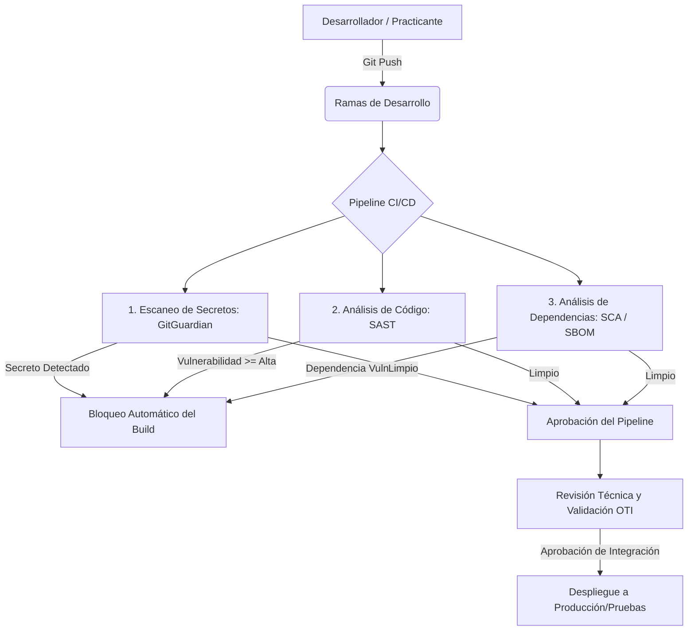

---
title: "Manual del Sistema de Gestión de Seguridad de la Información (SGSI)"
subtitle: "ISO/IEC 27001:2022"
author: "Universidad Nacional del Centro del Perú (UNCP)"
date: "Huancayo, 2026"
toc: true
toc-depth: 3
numbersections: true
...

\newpage

\newpage
# Control Documental

**Organización:** Universidad Nacional del Centro del Perú (UNCP)

**Código del Documento:** D-SGSI-00

**Clasificación:** Público Interno --- Uso exclusivo del SGSI-UNCP

**Normas Base:** ISO/IEC 27000:2024, ISO/IEC 27001:2022, ISO/IEC 27002:2022, ISO 31000:2018, NIST SP 800-53 Rev. 5, NIST CSF 2.0, MITRE ATT&CK v14, MAGERIT v3

## Control Documental

### Roles y Responsabilidades

| Rol | Responsabilidad | Cargo |
|:---|---|:---|
| Elaborador | Redactar y mantener el marco terminológico y el diccionario interoperable | Oficial de Seguridad y Confianza Digital |
| Revisor | Validar coherencia semántica, alineación normativa y aplicabilidad al contexto UNCP | Comité de Gobierno Digital (CGTD-UNCP) |
| Aprobador | Autorizar la entrada en vigor y asignar recursos para su implementación | Rectorado UNCP |

### Distribución y Acceso

| Medio | Ubicación | Nivel de Acceso |
|:---|---|:---|
| Intranet institucional | uncp.edu.pe/sgsi/documentos | Público interno |
| Copia controlada impresa | Oficina de Gestión de la Calidad (SIGC) | Solo versión vigente |

## Propósito

El presente marco constituye el **léxico oficial** del Sistema de Gestión de Seguridad de la Información (SGSI) de la UNCP. Su propósito es triple:

Unificar el lenguaje entre los tres niveles organizacionales. El nivel estratégico (Alta Dirección, Rectorado) requiere comprender el riesgo en términos de impacto al negocio universitario. El nivel táctico (OTI, Planeamiento, Modernización) traduce los requisitos de seguridad en controles técnicos y procedimientos. El nivel operativo (Auditores, Docentes, Administrativos) ejecuta los controles y reporta incidentes bajo una nomenclatura común.

Mapear el ecosistema normativo que rige el SGSI-UNCP, estableciendo una jerarquía entre normas internacionales (ISO, NIST), nacionales (Ley 29733, D.L. 1412) e internas (Resoluciones, Directivas).

Eliminar ambigüedades en la interpretación de términos durante evaluaciones de riesgo, auditorías, comunicación de incidentes y redacción de políticas.

### Obligatoriedad

| Aspecto | Disposición |
|:---|---|
| Alcance | Toda la documentación del SGSI-UNCP: políticas, procedimientos, instructivos, registros e informes |
| Desviación | No conformidad menor. Corrección en max. 30 días calendario |
| Fiscalización | Auditorías internas del SGSI |

## Alcance

### Cobertura

| Ámbito | Incluye |
|:---|---|
| Activos de información | Los identificados en el Inventario de Activos (R-SGSI-02): sede Huancayo, Mantaro, Satipo y Tarma |
| Procesos y sistemas | Los que soportan la misión académica, administrativa y de investigación |
| Personal | Administrativo, docente, estudiantes, contratistas y terceros |
| Proveedores externos | Los que procesen, almacenen o transmitan datos UNCP (POL-SGSI-07) |

### Exclusiones

| Exclusión | Motivo |
|:---|---|
| Términos técnicos de infraestructura (configuraciones de red, comandos de SO) | Definidos en procedimientos operativos de la OTI |
| Jerga coloquial en comunicaciones informales | Fuera de la documentación formal del SGSI |

## Arquitectura Ontológica del SGSI-UNCP

### Modelo de Relaciones Semánticas

La UNCP adopta una ontología dinámica donde los términos se relacionan jerárquicamente para facilitar el razonamiento de riesgo, siguiendo ISO/IEC 27000:2024 y extendiéndose con NIST CSF 2.0 y MITRE ATT&CK v14.

| Componente | Descripción | Relación |
|:---|---|:---|
| Contexto Organizacional | Misión, partes interesadas, requisitos legales | Define el valor de los activos |
| Activo de Información | Personas, procesos, tecnología, instalaciones | Tiene valor, posee vulnerabilidades, requiere CID |
| Amenaza | Origen interno/externo, vector de ataque | Explota vulnerabilidades |
| Vulnerabilidad | CWE, CVE, debilidad de proceso | Es explotada por amenazas |
| Control | Preventivo, Detective, Correctivo, Recuperativo | Mitiga riesgos y protege activos |
| Incidente | Impacta la CID, requiere respuesta NIST CSF | Se documenta en R-SGSI-04 |

### Relaciones Jerárquicas Formales

| Relación | Origen | Destino | Descripción |
|:---|---|---|---|
| tiene_\hspace{0pt}valor | ACTIVO | VALOR | Valor según criticidad definida en Metodología de Evaluación de Riesgos |
| posee_\hspace{0pt}vulnerabilidad | ACTIVO | VULNERABILIDAD | El activo presenta debilidades explotables |
| explota | AMENAZA | VULNERABILIDAD | La amenaza usa una vulnerabilidad para materializar un incidente |
| materializa | AMENAZA + VULNERABILIDAD | INCIDENTE | Combinación que concreta un incidente de seguridad |
| impacta | INCIDENTE | CID | Afecta la Confidencialidad, Integridad y/o Disponibilidad |
| mitiga | CONTROL | RIESGO | Reduce la probabilidad y/o el impacto del riesgo |
| protege | CONTROL | ACTIVO | Salvaguarda el activo de información |
| se_\hspace{0pt}alinea_\hspace{0pt}con | CONTROL | NORMA | Implementa los requisitos de una norma específica |
| reporta_\hspace{0pt}a | INCIDENTE | OFICIAL_\hspace{0pt}SEGURIDAD | Todo incidente se reporta al Oficial de Seguridad |

### Taxonomía de Activos de Información

Clasificación según ISO/IEC 27002:2022 (Controles 5.9, 5.10, 5.13):

| Categoría | Subcategoría | Ejemplos UNCP |
|:---|---|---|
| Información | Digital | Bases de datos ADESA, registros de investigación, resoluciones rectorales |
| Información | Física | Expedientes estudiantiles, libros de actas, contratos, convenios |
| Software | Misional | ADESA, GESDOC, SIGA, Moodle, Repositorio DSpace |
| Software | Soporte | Microsoft 365, MyLOFT, Turnitin, CTI Vitae |
| Hardware | Servidores | Físicos y virtuales en Data Center Huancayo |
| Hardware | Estaciones | Equipos de escritorio y portátiles de personal |
| Hardware | Red | Switches, routers, firewalls, APs Wi-Fi (4 sedes) |
| Personas | Interno | Autoridades, docentes, administrativos, OTI |
| Personas | Terceros | Proveedores cloud, contratistas de mantenimiento |
| Servicios | Digitales | Correo, portal web, matrícula en línea, mesa de partes |
| Servicios | Físicos | Data center, centros de computo, laboratorios |
| Instalaciones | Infraestructura | Data center principal, cuartos de comunicaciones |

## Niveles de Aplicación y Cumplimiento

### Modelo de Segregación por Perfil

| Nivel | Población | Fundamento | Acciones | Consecuencias |
|:---|---|---|---|---|
| I --- Mandatorio | Administrativos y Docentes | Acceso a sistemas críticos (ADESA, SIGA, GESDOC, M365) y datos personales (Ley 29733) | POL-SGSI-05, Acuerdo Conf., 4h/año capacitación, MFA obligatorio | Leves: amonestación. Graves: susp. acceso + DGA. Críticas: OCI + legal |
| II --- Concientización | Estudiantes | Sin control sobre dispositivos personales. Riesgo gestionado via educación | Campañas, módulo inducción 2h, Guía de BDP | Bienestar Univ. y Defensoría, sin sanciones técnicas |

### Matriz de Controles por Perfil

| Control | Alta Dirección | Personal Admin. | Docentes | Estudiantes | Proveedores |
|:---|---|---|---|---|---|
| POL-SGSI-01 (Desarrollo Seguro) | Aplica | Parcial | Aplica | No aplica | Aplica |
| POL-SGSI-02 (Control de Acceso) | Aplica | Aplica | Aplica | Parcial | Aplica |
| POL-SGSI-03 (Clasificación) | Aplica | Aplica | Aplica | Concientización | Aplica |
| POL-SGSI-04 (Incidentes) | Aplica | Aplica | Aplica | Reporta | Aplica |
| POL-SGSI-05 (Uso Aceptable TIC) | Aplica | Aplica | Aplica | Concientización | Aplica |
| POL-SGSI-06 (Continuidad) | Aplica | Parcial | Parcial | Concientización | Parcial |
| POL-SGSI-07 (Proveedores) | Aplica | Parcial | Parcial | No aplica | Aplica |
| POL-SGSI-08 (Cifrado y Claves) | Aplica | Aplica | Aplica | Concientización | Aplica |

## Diccionario Crítico Interoperable

Correspondencia entre ISO/IEC 27000, NIST SP 800-53, MITRE ATT&CK v14 y MAGERIT v3.

### Términos Fundamentales

#### Activo de Información

| Atributo | Descripción |
|:---|---|
| Definicion ISO 27000 | Cualquier cosa que tiene valor para la organizacion |
| Definicion UNCP | Recurso (informacion, software, hardware, personas, servicios, instalaciones) necesario para la mision universitaria |
| Clasificacion UNCP | Critico / Alto / Medio / Bajo |
| NIST | Asset (FAM: Asset Management) |
| MAGERIT | Activo (dimensiones: D, S, SW, HW, COM, AUX, L, P) |
| Ejemplo UNCP | Base de datos de estudiantes en ADESA (Critico). Portal web (Alto) |

#### Amenaza

| Atributo | Descripción |
|:---|---|
| Definicion ISO 27000 | Causa potencial de un incidente no deseado |
| Origen | Interna (personal, procesos) / Externa (ciberdelincuentes, desastres, proveedores) |
| Clasificacion UNCP | Natural / Humana intencional / Humana no intencional / Tecnologica / Fisica |
| MITRE | Threat Actor / Campaign (T1566 Phishing, T1190 Exploit) |
| MAGERIT | Amenaza (catalogo: N, I, P, A) |
| Ejemplo UNCP | Phishing dirigido a docentes con marca UNCP. Falla electrica en Data Center |

#### Vulnerabilidad

| Atributo | Descripción |
|:---|---|
| Definicion ISO 27000 | Debilidad de un activo o control explotable por una o mas amenazas |
| NIST | Weakness (CWE) / Vulnerability (CVE) |
| MAGERIT | Debilidad en la salvaguarda |
| Ejemplo UNCP | Servidor Moodle sin parche. Red sin segmentacion entre laboratorios y servidores. OTI: 2 personas para 17 sistemas |

#### Riesgo

| Atributo | Descripción |
|:---|---|
| Definicion ISO 27000 | Efecto de la incertidumbre sobre los objetivos |
| Definicion ISO 31000 | Probabilidad x Impacto |
| Formula UNCP | Riesgo = Probabilidad de materializacion x Impacto en CID |
| Niveles UNCP | Muy Alto (15-25) / Alto (10-14) / Medio (5-9) / Bajo (1-4) |
| NIST | Risk (SP 800-30 Rev. 1) |
| Ejemplo UNCP | Filtracion de datos de 20,000 estudiantes por falta de cifrado en ADESA. Multas hasta 30 UIT |

#### Control / Salvaguarda

| Atributo | Descripción |
|:---|---|
| Definicion ISO 27000 | Medida que modifica el riesgo |
| Tipos | Preventivo / Detective / Correctivo / Disuasivo / Recuperativo |
| Naturaleza | Admin. (politicas) / Tecnico (firewall, MFA) / Fisico (CCTV, cerraduras) |
| NIST | Security Control (SP 800-53: Low, Moderate, High) |
| ISO 27001 | A.5 (organizacionales) / A.6 (personas) / A.7 (fisicos) / A.8 (tecnologicos) |
| Ejemplo UNCP | A.5.15: MFA para ADESA (Preventivo, Tecnico). A.7.8: CCTV en Data Center (Detective, Fisico) |

#### Incidente de Seguridad

| Atributo | Descripción |
|:---|---|
| Definicion ISO 27000 | Evento con probabilidad de comprometer operaciones y seguridad de la informacion |
| Clasificacion UNCP | Incidente de Confidencialidad / Integridad / Disponibilidad |
| NIST CSF 2.0 | Detect (DE) / Respond (RS) / Recover (RC) |
| Ejemplo UNCP | Caida de matricula en linea (Disponibilidad). Acceso no autorizado a correo docente (Confidencialidad). Modificacion de notas en ADESA (Integridad) |

#### CID (Confidencialidad, Integridad, Disponibilidad)

| Atributo | Confidencialidad | Integridad | Disponibilidad |
|:---|---|---|---|
| Definicion ISO 27000 | Informacion no revelada a no autorizados | Exactitud y completez de los activos | Accesible y utilizable a demanda |
| Pregunta de auditoria | Quien puede acceder | Esta completa y es correcta | Esta disponible cuando se necesita |
| Ejemplo UNCP | Notas solo para docentes autorizados y Admision | Registros de investigacion con control de versiones | Portal de matricula 24/7 en periodo de admision |

### Terminos Complementarios

| Termino | Definicion UNCP | Marco |
|:---|---|:---|
| Analisis de Riesgos | Identificacion de amenazas y vulnerabilidades, estimacion de probabilidad e impacto | ISO 31000, MAGERIT v3 |
| Tratamiento de Riesgos | Seleccion de medidas para modificar el riesgo (Reducir, Retener, Evitar, Transferir) | ISO 27001 (Clausula 6.2) |
| Declaracion de Aplicabilidad (SoA) | Lista de controles del Anexo A con justificacion de inclusion/exclusion | ISO 27001 (Clausula 6.1.3 d) |
| Plan de Tratamiento | Acciones, recursos, responsables y plazos para implementar controles | ISO 27001 (Clausula 6.2) |
| Auditoria Interna | Proceso independiente y documentado para evaluar el cumplimiento del SGSI | ISO 27001 (Clausula 9.2) |
| No Conformidad | Incumplimiento de un requisito del SGSI (Mayor o Menor) | ISO 27001 (Clausula 10.1) |
| KPI | Métrica cuantificable de eficacia de controles (ej.: % sistemas con parches al dia) | ISO 27001 (Clausula 9.1) |
| Parte Interesada | Entidad que afecta o es afectada por el SGSI (SUNEDU, OCI, MINEDU, estudiantes) | ISO 27001 (Clausula 4.2) |
| Contexto Organizacional | Entorno interno y externo de la UNCP | ISO 27001 (Clausula 4.1) |

## Mapa de Referencias Normativas

### Jerarquia Normativa

| Nivel | Marco | Ejemplos |
|:---|---|---|
| 1 --- Internacional | ISO, NIST | ISO/IEC 27001:2022, NIST CSF 2.0, MITRE ATT&CK v14 |
| 2 --- Nacional Peruano | Leyes, Decretos, Resoluciones | Ley 29733, D.L. 1412, D.S. 029-2021-PCM |
| 3 --- Sectorial | SUNEDU, MINEDU | Ley Universitaria 30220, Modelo de Licenciamiento |
| 4 --- Interno UNCP | Resoluciones, Directivas, Planes | PGTD 2026-2030, PEI, ROF, MOF |
| 5 --- Documentacion SGSI | Politicas, Procedimientos, Registros | POL-SGSI-01 a 08, M-SGSI-01, R-SGSI-02 a 04 |

### Normas Internacionales

| Norma | Componente | Aplicacion en UNCP |
|:---|---|---|
| ISO/IEC 27001:2022 | Clausulas 4 a 10 (requisitos auditables) | Base para diseno, implementacion y certificacion del SGSI-UNCP |
| ISO/IEC 27001:2022 | Anexo A (93 controles en A.5, A.6, A.7, A.8) | Base para la SoA y seleccion de controles |
| ISO/IEC 27002:2022 | Guia de implementacion de controles | Referencia tecnica para diseno de controles |
| ISO 31000:2018 | Principios y proceso de gestion del riesgo | Integracion con el Sistema de Control Interno (SCI) |
| NIST CSF 2.0 | Govern, Identify, Protect, Detect, Respond, Recover | Alineacion del SGSI con el PGTD 2026-2030 |
| MITRE ATT&CK v14 | Tacticas, Tecnicas, Procedimientos | Modelado de amenazas y reglas de deteccion en SIEM |
| MAGERIT v3 | Catalogo de elementos y procedimientos | Valoracion de activos en el sector publico |

### Normativa Nacional Peruana

| Norma | Componente | Implicancia para el SGSI-UNCP |
|:---|---|---|
| Ley N° 29733 | Art. 3 (Principios), Art. 9 (Seguridad) | Controles de acceso, cifrado e incidentes sobre bases de datos con datos personales |
| D.S. N° 016-2024-JUS | Exige DPIA para tratamientos de alto riesgo | Realizar DPIAs antes de nuevos sistemas con datos personales a gran escala |
| D.L. N° 1412 | Art. 4, 13 (Confianza Digital), 17 (Interoperabilidad) | SGSI demuestra seguridad digital. Sistemas PIDE deben cumplir Directiva 001-2025-PCM/SGTD |
| D.S. N° 029-2021-PCM | Designacion del Oficial de Seguridad | R. N° 2143-R-2023 integra al CGD a la Mg. Rocio Rosanna Damian Alvarado como Oficial de Seguridad de la Informacion. Accion prioritaria: evidenciar suplencia, dedicacion y recursos operativos |
| D.S. N° 141-2025-PCM | Quinta Disposicion: uso intensivo de tecnologias digitales | SGSI como habilitador de tecnologia digital segura |
| Ley Universitaria 30220 | Autonomia, licenciamiento, calidad educativa | SGSI contribuye a CBC 6 (Infraestructura) y CBC 7 (Gestion de calidad) |
| D.S. N° 051-2018-PCM | 1% de presupuesto TI para software público | UNCP debe priorizar software público en adquisiciones y desarrollo |
| R.M. N° 119-2024-PCM | Lineamientos de Transformación Digital | Establece obligaciones de seguridad digital para todas las entidades del Estado |
| D.L. N° 1646 | Ciberseguridad y confianza digital | Define el marco de ciberseguridad nacional aplicable a universidades públicas |
| Ley N° 31814 | Ley de Ciberseguridad | Exige implementación de controles mínimos de seguridad en infraestructura crítica |

### Normativa Interna UNCP

| Documento | Año | Relacion con el SGSI |
|:---|---|---|
| PGTD 2026-2030 | 2026 | Define el proyecto PGTD-01 (SGSI) con presupuesto de S/ 850,000 |
| PEI 2024-2030 | 2024 | Objetivos estrategicos que el SGSI apoya mediante gestion de riesgos |
| R. N° 1862-R-2023 | 2023 | Designa el Comite de Gobierno Digital de la UNCP y establece sus funciones conforme a la R.M. N° 119-2018-PCM |
| R. N° 2143-R-2023 | 2023 | Integra al Comite de Gobierno Digital a la Mg. Rocio Rosanna Damian Alvarado, Jefa de la OTI, como Oficial de Seguridad de la Informacion |
| R. N° 2140-R-2023 | 2023 | Designa a la Mg. Rocio Rosanna Damian Alvarado como Funcionaria Responsable del Software Publico |
| R. N° 3255-R-2024 | 2024 | Aprueba el Plan de Continuidad Operativa; complementa controles A.5.29 y A.5.30 |
| R. N° 3524-R-2025 y R. N° 3526-R-2025 | 2025 | Aprueban el Mapa de Procesos Nivel 0 y Nivel 1; identifican procesos criticos a proteger |
| Directiva de Correo Electronico | 2022 | Primer documento formal de seguridad. Integrado en POL-SGSI-05 |
| ROF, MOF, CAP, PAP | 2014-2025 | Unidades y cargos responsables de seguridad de la informacion |

**Fuentes institucionales pendientes de control documental:** las resoluciones rectorales se verifican en `https://uncp.edu.pe/la-universidad/resoluciones-rectorales/` y el repositorio embebido `https://resoluciones.uncp.edu.pe/documentos/R-RE`; las resoluciones directorales se verifican en `https://uncp.edu.pe/la-universidad/resoluciones-directorales/` y `https://resoluciones.uncp.edu.pe/documentos/R-DR`. Las resoluciones citadas deben conservarse como anexos Markdown/PDF controlados antes de aprobar la version final del SGSI.

## Matriz de Correspondencia entre Marcos Normativos

| Concepto | ISO 27001:2022 | NIST CSF 2.0 | NIST SP 800-53 | MITRE ATT&CK |
|:---|---|---|---|---|
| Activo | A.5.9 | ID.AM | CM-8 | T1583 (Adquisición de Infraestructura) |
| Riesgo | Clausula 6.1 | GV.RM | RA-3 | No equivalente directo |
| Amenaza | A.5.7 | ID.RA | RA-3, SI-4 | Tactic / Technique |
| Vulnerabilidad | A.8.8 | ID.RA | RA-5 | CVE / CWE |
| Control de Acceso | A.5.15, A.5.16, A.5.18, A.8.2, A.8.3, A.8.5 | PR.AA | AC-1 a AC-25 | TA0001 (Persistencia) |
| Concientizacion | A.6.3 | PR.AT | AT-2, AT-3 | T1566 (Phishing) |
| Respuesta a Incidentes | A.5.24, A.5.25, A.5.26 | RS.MA | IR-4 a IR-7 | T1078 (Cuentas Válidas) / T1059 (Ejecución) |
| Continuidad del Negocio | A.5.29, A.5.30 | RC.RP | CP-2, CP-10 | T1490 (Denegación de Servicio) / T1485 (Destrucción) |
| Cifrado | A.5.32, A.8.11, A.8.24 | PR.DS | SC-8, SC-13 | TA0010 (Exfiltración) |

## Vigencia, Revision y Mantenimiento

### Periodicidad de Revision

| Tipo | Periodicidad | Responsable | Disparador |
|:---|---|---|---|
| Programada | Anual (enero) | Oficial de Seguridad | Calendario de revisiones del SGSI |
| Extraordinaria | Cuando ocurra un cambio significativo | Oficial de Seguridad | Nueva normativa nacional, actualizacion ISO 27001, incidente critico |
| Sincronizacion MITRE/NIST | Semestral (julio y enero) | Oficial de Seguridad + OTI | Nueva version de MITRE ATT&CK o NIST SP 800-53 |

### Procedimiento de Actualizacion

| Fase | Accion | Responsable |
|:---|---|:---|
| 1. Deteccion | Monitorear ISO OBP, IEC Electropedia, Portal PCM, El Peruano, MITRE Releases, NIST News | Oficial de Seguridad |
| 2. Evaluacion | Determinar si el cambio requiere modificacion, adicion o eliminacion de terminos | Oficial de Seguridad |
| 3. Actualizacion | Elaborar nueva version segun control documental (Seccion 1) | Oficial de Seguridad |
| 4. Comunicacion | Notificar al CGTD, publicar en repositorio, emitir boletin si el cambio es critico | Oficial de Seguridad |
| 5. Registro | Actualizar historial y conservar version anterior en archivo | Oficial de Seguridad |

### Indicadores de Eficacia

| KPI | Formula | Meta | Frecuencia |
|:---|---|---|---|
| Documentos sin desviaciones terminologicas | (Conformes / Total) x 100 | >= 95% | Trimestral |
| Tiempo de incorporacion de nuevos terminos | Dias desde publicacion de norma hasta actualizacion | <= 30 dias | Por evento |
| Personal que comprende terminos criticos | (Calificacion >= 80% / Total evaluado) x 100 | >= 90% | Anual |

## Anexos

### Anexo A: Abreviaturas y Acronimos

| Abreviatura | Significado |
|:---|---|
| CID | Confidencialidad, Integridad, Disponibilidad |
| CGTD | Comite de Gobierno Digital |
| DGA | Direccion General de Administracion |
| DPIA | Data Protection Impact Assessment |
| MFA | Autenticacion Multifactor |
| OCI | Organo de Control Institucional |
| OTI | Oficina de Tecnologias de la Informacion |
| PGTD | Plan de Gobierno y Transformacion Digital |
| PIDE | Plataforma de Interoperabilidad del Estado |
| SCI | Sistema de Control Interno |
| SGSI | Sistema de Gestion de Seguridad de la Informacion |
| SGTD | Secretaria de Gobierno y Transformacion Digital |
| SIEM | Security Information and Event Management |
| SIGC | Sistema Integrado de Gestion de la Calidad |
| SoA | Statement of Applicability |
| UIT | Unidad Impositiva Tributaria |

### Anexo B: Referencias Bibliograficas

| Codigo | Referencia |
|:---|---|
| ISO 27000 | [ISO/IEC 27000:2024 --- Overview and vocabulary](https://www.iso.org/standard/82875.html) |
| ISO 27001 | [ISO/IEC 27001:2022 --- Requirements](https://www.iso.org/standard/27001) |
| ISO 27002 | [ISO/IEC 27002:2022 --- Information security controls](https://www.iso.org/standard/27002) |
| ISO 31000 | [ISO 31000:2018 --- Risk management guidelines](https://www.iso.org/standard/65694.html) |
| NIST SP 800-53 | [NIST SP 800-53 Rev. 5](https://csrc.nist.gov/publications/detail/sp/800-53/rev-5/final) |
| NIST CSF 2.0 | [NIST Cybersecurity Framework 2.0](https://www.nist.gov/cyberframework) |
| MITRE ATT&CK | [MITRE ATT&CK v14](https://attack.mitre.org/) |
| MAGERIT | [MAGERIT v3 --- Metodologia de Analisis y Gestion de Riesgos](https://administracionelectronica.gob.es/pae_\hspace{0pt}Home/pae_\hspace{0pt}Documentacion/pae_\hspace{0pt}Metodolog/pae_\hspace{0pt}Magerit.html) |
| Ley 29733 | [Ley de Proteccion de Datos Personales](https://www.gob.pe/institucion/congreso/normas-legales/243470-29733) |
| D.S. 016-2024-JUS | [Reglamento de la Ley 29733](https://busquedas.elperuano.pe/dispositivo/NL/2306705-1) |
| D.L. 1412 | [Decreto Legislativo de Gobierno Digital](https://www.gob.pe/institucion/pcm/normas-legales/289696-1412) |

## Cierre

El presente Marco de Referencia Terminologico y Normativo (D-SGSI-00) constituye la base documental fundamental del SGSI-UNCP. Todos los documentos del sistema deben alinearse a las definiciones, clasificaciones y jerarquias aqui establecidas. El incumplimiento de esta directriz sera tratado como una no conformidad en las auditorias internas del SGSI.

La version vigente de este documento se encuentra en el repositorio documental del SGSI. Se debe verificar que se esta utilizando la version correcta antes de referenciarlo.

**Organización:** Universidad Nacional del Centro del Perú (UNCP)

**Código del Documento:** P-SGSI-00

**Versión:** 1.0

**Norma Base:** ISO/IEC 27001:2022 (Cláusula 7.5 --- Información Documentada)

**Alineamiento:** D-SGSI-00 (Marco Terminológico), R-SGSI-00 (Lista Maestra), R.S. Nº 001-2017-PCM/SEGDI (Modelo de Gestión Documental), Ley N° 29733 (Protección de Datos Personales)

## Objetivo

Establecer las directrices para la creación, codificación, revisión, aprobación, distribución, almacenamiento y control de la información documentada (documentos y registros) del Sistema de Gestión de Seguridad de la Información (SGSI) de la UNCP, garantizando la integridad, disponibilidad, trazabilidad y confidencialidad de la documentación del sistema conforme a ISO/IEC 27001:2022.

## Alcance

Este procedimiento aplica a toda la información documentada del SGSI-UNCP, incluyendo:

- Políticas de seguridad (POL-SGSI)
- Procedimientos (P-SGSI)
- Documentos de referencia y directrices (D-SGSI)
- Registros y formatos (R-SGSI, F-SGSI)
- Actas y compromisos (ACT-SGSI)
- Documentos de origen externo (normas ISO, leyes peruanas, directivas PCM/SGTD)
- Versiones obsoletas y documentos retenidos para fines legales

Queda excluida la documentación del Sistema Integrado de Gestión de la Calidad (SIGC) no vinculada al SGSI, y la documentación técnica de infraestructura de la OTI que se rige por sus propios procedimientos operativos.

## Roles y Responsabilidades

| Rol | Responsabilidad Documental | Cargo |
|:---|---|:---|
| Elaborador | Redactar el documento, aplicar el formato y codificación establecidos, gestionar la revisión por pares | Oficial de Seguridad y Confianza Digital / Responsable de área |
| Revisor | Validar la coherencia técnica, aplicabilidad al contexto UNCP y alineación normativa | Comité de Gobierno Digital (CGTD-UNCP) / Jefe de OTI / Dueño de Proceso |
| Aprobador | Autorizar la entrada en vigor, asignar recursos para su implementación | Rectorado UNCP / DGA (según jerarquía del documento) |
| Custodio | Mantener el repositorio documental, controlar versiones, asegurar la accesibilidad | Oficial de Seguridad y Confianza Digital |
| Archivador | Conservar versiones obsoletas con fines legales y de auditoría | Oficina de Gestión de la Calidad (SIGC) |
| Usuario | Consultar, usar y custodiar la versión vigente del documento en su ámbito de competencia | Todo el personal UNCP alcanzado por el SGSI |

## Sistema de Codificación Documental

Todos los documentos del SGSI-UNCP se identifican mediante un código único conforme al siguiente formato:

**[TIPO]-SGSI-[NRO]**

### Tipos Documentales

| Tipo | Prefijo | Descripción | Ejemplos |
|:---|---|---|---|
| Documento de Referencia | D-SGSI | Documentos normativos, guías, marcos conceptuales, análisis | D-SGSI-00 (Marco Terminológico), D-SGSI-01 (Contexto Estratégico) |
| Procedimiento | P-SGSI | Procedimientos documentados obligatorios por ISO 27001 | P-SGSI-02 (Gestión de Incidentes), P-SGSI-03 (Control de Acceso) |
| Política | POL-SGSI | Políticas de seguridad de alto nivel aprobadas por Rectorado | POL-SGSI-01 (Desarrollo Seguro), POL-SGSI-06 (Contraseñas) |
| Registro / Lista Maestra | R-SGSI | Registros obligatorios, inventarios, matrices de riesgo | R-SGSI-00 (Lista Maestra), R-SGSI-01 (Inventario de Activos) |
| Formato / Plantilla | F-SGSI | Formatos de solicitud, actas, reportes, bitácoras | F-SGSI-01 (Solicitud de Acceso), F-SGSI-05 (Acta de Eliminación) |
| Acta / Acuerdo | ACT-SGSI | Actas de compromiso, reuniones del CGTD | ACT-SGSI-01 (Acta de Compromiso de Alta Dirección) |

### Reglas de Codificación

- El código se asigna correlativamente dentro de cada tipo, según el orden de creación.
- No se reutilizan códigos de documentos dados de baja.
- Los documentos en borrador no reciben código hasta su aprobación.
- Los documentos externos (normas ISO, leyes) se referencian por su identificador oficial, no reciben código SGSI.
- Las versiones mantienen el mismo código; solo cambia el número de versión.

## Estructura de Documentos

### Encabezado (Metadatos Obligatorios)

Todo documento oficial del SGSI-UNCP debe incluir al inicio:

| Campo | Descripción | Ejemplo |
|:---|---|:---|
| Título | Nombre completo del documento | Procedimiento de Gestión de Cambios en TI |
| Código | Código único según Sección 4 | P-SGSI-04 |
| Versión | Versión actual según Sección 6 | 2.0 |
| Organización | Nombre institucional | Universidad Nacional del Centro del Perú (UNCP) |
| Norma Base | Cláusula ISO 27001 o control aplicable | ISO/IEC 27001:2022 (Control A.8.32) |
| Alineamiento | Otros documentos SGSI relacionados | P-SGSI-02, P-SGSI-05 |

### Estructura Recomendada

1. **Objetivo** --- Propósito del documento (qué problema resuelve)
2. **Alcance** --- Límites de aplicación (qué incluye y qué excluye)
3. **Roles y Responsabilidades** --- Tabla de roles con responsabilidades específicas
4. **Desarrollo** --- Contenido sustantivo del documento (procedimiento, política, directriz)
5. **Referencias** --- Documentos relacionados y normas aplicables
6. **Control de Cambios** --- Historial de versiones

### Formato

- Fuente: Palatino (serif) para cuerpo, Helvética (sans-serif) para títulos.
- Alineación: Texto justificado a la izquierda (RaggedRight) para facilitar la lectura en pantalla.
- Tablas: Uso de `booktabs` con cabeceras alineadas y texto fluido.
- Código: Letra Courier para rutas, comandos y referencias técnicas.
- Numeración: Automática mediante LaTeX (pandoc).

## Control de Versiones

### Esquema de Versionado

| Componente | Cambio | Ejemplo |
|:---|---|---|
| Versión Mayor (X.0) | Cambios sustanciales en el contenido, nuevos requisitos normativos, reestructuración completa | 1.0 → 2.0 |
| Versión Menor (X.Y) | Cambios parciales, adición de secciones, actualización de referencias | 1.0 → 1.1 |
| Revisión (X.Y.Z) | Correcciones ortográficas, ajustes de formato, erratas | 1.0 → 1.0.1 |

### Historial de Cambios

Todo documento debe incluir una tabla de control de cambios al final:

| Versión | Fecha | Descripción del Cambio | Elaborador | Revisor | Aprobador |
|:---|---|---|---|---|---|
| 1.0 | 2026-06-07 | Versión inicial | Oficial de Seguridad | CGTD-UNCP | Rectorado |

## Ciclo de Vida del Documento

### Diagrama del Ciclo de Vida

| Fase | Secuencia |
|:---|:---|
| Creación → Revisión → Aprobación → Publicación | Flujo principal de incorporación de documentos |
| Distribución → Uso → Revisión Periódica | Flujo de operación y mantenimiento |
| Obsoleto → Archivo (Retención) | Flujo de disposición al terminar la vigencia |

### Etapas

| Etapa | Acción | Responsable | Tiempo Máximo |
|:---|---|---|---|
| 1. Creación | Redactar el documento según el formato y codificación establecidos | Elaborador | 15 días hábiles |
| 2. Revisión Técnica | Validar contenido, referencias y aplicabilidad | Revisor (CGTD / Jefe OTI / Dueño de Proceso) | 7 días hábiles |
| 3. Revisión Normativa | Verificar alineación con ISO 27001, normativa peruana y PGTD | Oficial de Seguridad | 5 días hábiles |
| 4. Aprobación | Autorizar la entrada en vigor mediante resolución o acta | Aprobador (Rector / DGA) | 7 días hábiles |
| 5. Publicación | Asignar código, registrar en R-SGSI-00, subir al repositorio | Custodio | 2 días hábiles |
| 6. Distribución | Notificar a los usuarios alcanzados, publicar en intranet | Custodio | 1 día hábil |
| 7. Uso | Consultar, aplicar y custodiar la versión vigente | Usuario | Permanente |
| 8. Revisión Periódica | Evaluar vigencia y actualización necesaria | Custodio + Revisor | Anual (enero) |
| 9. Obsoleto | Marcar como versión obsoleta, retirar de circulación | Custodio | Inmediato tras nueva versión |
| 10. Archivo | Conservar versión obsoleta con fines legales y de auditoría | Archivador | Según tabla de retención |

### Documentos de Origen Externo

Los documentos externos (normas ISO, leyes, directivas PCM/SGTD, resoluciones) se controlan mediante:

- Identificación en la Lista Maestra (R-SGSI-00) como referencias externas.
- Verificación semestral de vigencia por el Oficial de Seguridad.
- Notificación al CGTD cuando una norma externa sufra modificaciones que impacten el SGSI.
- Las versiones descargadas para consulta interna se marcan con la fecha de descarga y la advertencia: "Documento externo --- Verificar vigencia en la fuente oficial".

## Distribución y Acceso

### Repositorio Oficial

El repositorio documental del SGSI-UNCP está estructurado por cláusulas ISO 27001:

| Carpeta | Contenido |
|:---|---|
| 00_\hspace{0pt}CONTROL_\hspace{0pt}DOCUMENTAL | Marco terminológico, procedimiento de control documental, lista maestra |
| 01_\hspace{0pt}CONTEXTO_\hspace{0pt}DE_\hspace{0pt}LA_\hspace{0pt}ORGANIZACION | Análisis de contexto, alcance, mapa de procesos, marco conceptual |
| 02_\hspace{0pt}LIDERAZGO | Política general, acta de compromiso |
| 03_\hspace{0pt}PLANIFICACION | Metodología de riesgos, SoA, inventario de activos, matriz de riesgos |
| 04_\hspace{0pt}SOPORTE | Plan de capacitación y concientización |
| 05_\hspace{0pt}OPERACION | Procedimientos de incidentes, acceso, cambios, continuidad, proveedores, eliminación |
| 06_\hspace{0pt}EVALUACION_\hspace{0pt}DEL_\hspace{0pt}DESEMPEÑO | KPIs, programa de auditoría, metodología, plantillas |
| 07_\hspace{0pt}MEJORA_\hspace{0pt}CONTINUA | No conformidades, acciones correctivas |
| 09_\hspace{0pt}POLITICAS_\hspace{0pt}Y_\hspace{0pt}PROCEDIMIENTOS | Políticas de seguridad (desarrollo, uso aceptable, clasificación, etc.) |
| 10_\hspace{0pt}FORMATOS | Formatos y plantillas (solicitudes, actas, bitácoras) |

### Niveles de Acceso

| Clasificación | Descripción | Medio | Permiso |
|:---|---|:---|:---|
| Público Interno | Documentos de consulta general (políticas, procedimientos aprobados) | Intranet UNCP / Repositorio SGSI | Lectura para todo el personal UNCP |
| Restringido | Documentos con información sensible (inventario de activos, matriz de riesgos, SoA) | Repositorio SGSI (controlado) | Lectura: CGTD, OTI, auditores. Edición: Oficial de Seguridad |
| Confidencial | Documentos de auditoría, incidentes críticos, data personal | Repositorio SGSI (cifrado) | Solo Oficial de Seguridad y CGTD |

### Control de Copias

- La copia oficial es la versión electrónica publicada en el repositorio SGSI.
- Las copias impresas se consideran copias no controladas.
- Cuando se emite una copia controlada impresa (para auditorías externas, reuniones del CGTD), se marca con sello de "Copia Controlada", número de copia y responsable.
- El usuario debe verificar que está utilizando la versión vigente antes de referenciar o aplicar el documento.

## Control de Registros

### Identificación

Los registros (evidencias) se identifican mediante su código de formato (F-SGSI) más la fecha de generación:

**Formato:** `[CÓDIGO-FORMATO]_\hspace{0pt}[DESCRIPCIÓN]_\hspace{0pt}[YYYY-MM-DD].[ext]`

**Ejemplo:** `F-SGSI-01_\hspace{0pt}Solicitud-Acceso_\hspace{0pt}Juan-Perez_\hspace{0pt}2026-06-07.pdf`

### Almacenamiento

| Tipo | Medio | Ubicación |
|:---|---|:---|
| Digital (preferido) | Repositorio documental SGSI (cifrado en reposo) | Servidor UNCPro / Huawei Cloud OBS |
| Físico (excepcional) | Archivador con llave, folder por código de documento | Archivo Central UNCP (Oficina de Gestión de la Calidad - SIGC) |

### Protección contra Alteraciones

- Los registros digitales se almacenan en formato no editable (PDF/A-2u) con firma digital del custodio.
- Los registros físicos se almacenan en folders con numeración correlativa de folios y sello de recepción.
- Cualquier modificación posterior a un registro debe realizarse mediante un nuevo registro que anule al anterior (no se permite sobrescritura ni edición directa).

### Tiempos de Retención

| Tipo de Registro | Plazo Mínimo | Fundamento Legal |
|:---|---|:---|
| Políticas y procedimientos (vigentes) | Vigencia + 5 años | ISO 27001:2022 Cláusula 7.5, Ley 29733 Art. 9 |
| Registros de capacitación | 5 años | Directiva SGSI-UNCP |
| Reportes de incidentes de seguridad | 5 años | ISO 27001:2022 Cláusula 10.1 |
| Auditorías internas y externas | 7 años | Ley Universitaria 30220, Estatuto UNCP |
| Matriz de riesgos y SoA | Vigencia + 5 años | ISO 27001:2022 Cláusula 6.1, 6.2 |
| Solicitudes de acceso y bajas | 2 años después de la desvinculación | Ley 29733 Art. 38, D.S. 016-2024-JUS |
| Datos personales (expedientes estudiantiles) | 10 años | Ley Universitaria 30220 Art. 103 |
| Actas de eliminación segura | 5 años | P-SGSI-07, NIST SP 800-88 Rev. 1 |

### Disposición Final

Al vencer el plazo de retención, el Oficial de Seguridad evalúa:

1. **Destrucción segura** del registro (según P-SGSI-07) si no tiene valor legal, histórico o de auditoría.
2. **Archivo histórico** si el registro tiene valor institucional (resoluciones rectorales, actas fundacionales, convenios marco).
3. **Transferencia al Archivo General de la UNCP** si corresponde según la Directiva de Archivo Universitario.

Toda disposición se documenta mediante el F-SGSI-05 (Acta de Eliminación Segura) o el documento de transferencia correspondiente.

## Revisión y Mantenimiento

### Revisión Periódica

| Tipo | Periodicidad | Responsable | Criterio |
|:---|---|---|---|
| Programada | Anual (enero) | Oficial de Seguridad | Verificar vigencia normativa, aplicabilidad y coherencia con otros documentos del SGSI |
| Extraordinaria | Cuando ocurra un cambio significativo | Oficial de Seguridad | Nueva versión de ISO 27001, nueva normativa nacional, cambio organizacional, incidente crítico |

### Indicadores de Eficacia (KPI)

| Indicador | Fórmula | Meta | Frecuencia |
|:---|---|---|---|
| Documentos con código asignado correctamente | (Documentos conforme / Total documentado) × 100 | $\ge$ 98% | Trimestral |
| Documentos aprobados dentro del plazo | (Aprobados dentro de 30 días / Total aprobados) × 100 | $\ge$ 90% | Trimestral |
| Lista Maestra actualizada | (Documentos listados / Total documentos oficiales) × 100 | 100% | Mensual |
| Registros con retención cumplida | (Registros eliminados al vencer / Total registros vencidos) × 100 | 100% | Anual |
| Personal que conoce el procedimiento documental | (Aprobados en evaluación / Total evaluados) × 100 | $\ge$ 85% | Anual |

## Referencias

| Código | Referencia |
|:---|---|
| ISO 27001 | ISO/IEC 27001:2022 --- Cláusula 7.5 (Información Documentada), Anexo A Controles 5.9, 5.10, 5.13 |
| ISO 27002 | ISO/IEC 27002:2022 --- Controles 5.9 (Inventario), 5.10 (Aceptación), 5.13 (Etiquetado) |
| NIST CSF 2.0 | Identify (ID.AM), Protect (PR.DS) |
| R.S. 001-2017-PCM | Modelo de Gestión Documental (MGD) --- Secretaría de Gestión Pública |
| Ley 29733 | Ley de Protección de Datos Personales --- Art. 9 (Seguridad), Art. 38 (Plazos de conservación) |
| D.S. 016-2024-JUS | Reglamento de la Ley 29733 |
| D.L. 1412 | Decreto Legislativo de Gobierno Digital --- Art. 17 (Interoperabilidad) |
| P-SGSI-07 | Procedimiento de Eliminación Segura de Información y Activos |
| R-SGSI-00 | Lista Maestra de Documentos del SGSI |

**Organización:** Universidad Nacional del Centro del Perú (UNCP)

**Código del Documento:** R-SGSI-00

**Norma Base:** ISO/IEC 27001:2022 (Cláusula 7.5 --- Información Documentada)

**Registro Controlado:** Sí --- Toda modificación debe ser aprobada por el Oficial de Seguridad y registrada en el historial de cambios.

## Objetivo

Mantener un registro único, actualizado y trazable de toda la información documentada que conforma el Sistema de Gestión de Seguridad de la Información (SGSI) de la UNCP, permitiendo la identificación rápida del código, nombre, versión vigente y ubicación de cada documento.

## Instrucciones de Uso

- Esta lista maestra es el **único punto de verdad** para la documentación oficial del SGSI-UNCP.
- Para localizar un documento, ubicar su código en la tabla y dirigirse a la carpeta indicada en `Carpeta Destino`.
- La columna **Versión** refleja la versión vigente. Toda copia impresa debe verificar contra esta lista que corresponde a la versión más reciente.
- Los documentos marcados con código **Plantillas** agrupan múltiples archivos de formato homogéneo bajo una misma carpeta.

## Lista Maestra

| Código | Nombre del Documento | Versión | Carpeta Destino |
|:-------|:---------------------|:--------|:----------------|
| D-SGSI-00 | Marco de Referencia Terminológico y Normativo | 1.0 | 00_\hspace{0pt}CONTROL_\hspace{0pt}DOCUMENTAL |
| P-SGSI-00 | Procedimiento de Control de Documentos y Registros | 1.0 | 00_\hspace{0pt}CONTROL_\hspace{0pt}DOCUMENTAL |
| R-SGSI-00 | Lista Maestra de Documentos del SGSI | 2.0 | 00_\hspace{0pt}CONTROL_\hspace{0pt}DOCUMENTAL |
| D-SGSI-01 | Análisis del Contexto Estratégico (PESTEL/MEFE) | 1.0 | 01_\hspace{0pt}CONTEXTO_\hspace{0pt}DE_\hspace{0pt}LA_\hspace{0pt}ORGANIZACION |
| D-SGSI-02 | Alcance del SGSI (Vanguardia) | 2.0 | 01_\hspace{0pt}CONTEXTO_\hspace{0pt}DE_\hspace{0pt}LA_\hspace{0pt}ORGANIZACION |
| D-SGSI-06 | Marco Conceptual del SGSI | 1.0 | 01_\hspace{0pt}CONTEXTO_\hspace{0pt}DE_\hspace{0pt}LA_\hspace{0pt}ORGANIZACION |
| D-SGSI-07 | Mapa de Procesos del SGSI | 2.0 | 01_\hspace{0pt}CONTEXTO_\hspace{0pt}DE_\hspace{0pt}LA_\hspace{0pt}ORGANIZACION |
| D-SGSI-03 | Política General de Seguridad de la Información | 1.0 | 02_\hspace{0pt}LIDERAZGO |
| ACT-SGSI-01 | Acta de Compromiso de la Alta Dirección | 1.0 | 02_\hspace{0pt}LIDERAZGO |
| D-SGSI-04 | Metodología de Gestión de Riesgos | 1.0 | 03_\hspace{0pt}PLANIFICACION |
| D-SGSI-05 | Declaración de Aplicabilidad (SoA) | 1.0 | 03_\hspace{0pt}PLANIFICACION |
| R-SGSI-01 | Inventario de Activos de Información | 1.0 | 03_\hspace{0pt}PLANIFICACION |
| R-SGSI-02 | Matriz de Evaluación y Tratamiento de Riesgos | 1.0 | 03_\hspace{0pt}PLANIFICACION |
| P-SGSI-08 | Plan de Capacitación y Concientización | 2.0 | 04_\hspace{0pt}SOPORTE |
| P-SGSI-02 | Marco de Respuesta a Incidentes (CSIRT) | 1.0 | 05_\hspace{0pt}OPERACION |
| P-SGSI-03 | Gestión de Identidades y Control de Acceso (Zero Trust) | 2.0 | 05_\hspace{0pt}OPERACION |
| P-SGSI-04 | Procedimiento de Gestión de Cambios (ITIL + Ágil) | 2.0 | 05_\hspace{0pt}OPERACION |
| P-SGSI-05 | Resiliencia y Continuidad en Nube Híbrida | 1.0 | 05_\hspace{0pt}OPERACION |
| P-SGSI-06 | Procedimiento de Gestión de Seguridad con Proveedores | 2.0 | 05_\hspace{0pt}OPERACION |
| P-SGSI-07 | Procedimiento de Eliminación Segura de Información | 2.0 | 05_\hspace{0pt}OPERACION |
| P-SGSI-09 | Metodología de Auditoría Basada en Riesgos | 2.0 | 06_\hspace{0pt}EVALUACION_\hspace{0pt}DEL_\hspace{0pt}DESEMPEÑO |
| R-SGSI-03 | Cuadro de Mando de Seguridad y Verificación Continua (KPIs) | 2.0 | 06_\hspace{0pt}EVALUACION_\hspace{0pt}DEL_\hspace{0pt}DESEMPEÑO |
| R-SGSI-04 | Programa Maestro de Auditoría Basada en Riesgos | 2.0 | 06_\hspace{0pt}EVALUACION_\hspace{0pt}DEL_\hspace{0pt}DESEMPEÑO |
| Plantillas | Planes, Informes, Listas de Chequeo y Revisión por la Dirección | 2.0 | 06_\hspace{0pt}EVALUACION_\hspace{0pt}DEL_\hspace{0pt}DESEMPEÑO |
| D-SGSI-08 | Guía de Implementación de Controles (ISO 27002) --- 20 Controles Críticos | 2.0 | 08_\hspace{0pt}ANEXO_\hspace{0pt}A_\hspace{0pt}CONTROLES |
| POL-SGSI-07 | Política de Seguridad Física y Áreas Seguras | 2.0 | 08_\hspace{0pt}ANEXO_\hspace{0pt}A_\hspace{0pt}CONTROLES / A7_\hspace{0pt}CONTROLES_\hspace{0pt}FISICOS |
| POL-SGSI-01 | Política de Desarrollo Seguro y APIs (DevSecOps/Shift-Left) | 2.0 | 09_\hspace{0pt}POLITICAS_\hspace{0pt}Y_\hspace{0pt}PROCEDIMIENTOS |
| POL-SGSI-02 | Política de Uso Aceptable, Escritorio Limpio y Teletrabajo | 2.0 | 09_\hspace{0pt}POLITICAS_\hspace{0pt}Y_\hspace{0pt}PROCEDIMIENTOS |
| POL-SGSI-03 | Política de Clasificación de la Información y Respaldos | 2.0 | 09_\hspace{0pt}POLITICAS_\hspace{0pt}Y_\hspace{0pt}PROCEDIMIENTOS |
| POL-SGSI-04 | Política de Seguridad en las Relaciones con Proveedores | 2.0 | 09_\hspace{0pt}POLITICAS_\hspace{0pt}Y_\hspace{0pt}PROCEDIMIENTOS |
| POL-SGSI-05 | Política de Seguridad para Dispositivos Móviles del Personal | 2.0 | 09_\hspace{0pt}POLITICAS_\hspace{0pt}Y_\hspace{0pt}PROCEDIMIENTOS |
| POL-SGSI-06 | Política de Contraseñas y Autenticación Segura (NIST SP 800-63B) | 2.0 | 09_\hspace{0pt}POLITICAS_\hspace{0pt}Y_\hspace{0pt}PROCEDIMIENTOS |
| POL-SGSI-08 | Política de Privacidad y Protección de Datos Personales (Ley N.° 29733) | 1.0 | 09_\hspace{0pt}POLITICAS_\hspace{0pt}Y_\hspace{0pt}PROCEDIMIENTOS |
| F-SGSI-01 | Formato de Solicitud de Alta/Baja/Cambio de Acceso | 1.0 | 10_\hspace{0pt}FORMATOS |
| F-SGSI-02 | Registro de Asistencia a Capacitación | 1.0 | 10_\hspace{0pt}FORMATOS |
| F-SGSI-03 | Formato de Baja de Usuario y Devolución de Activos | 1.0 | 10_\hspace{0pt}FORMATOS |
| F-SGSI-04 | Reporte de Acción Correctiva (RAC) | 1.0 | 10_\hspace{0pt}FORMATOS |
| F-SGSI-05 | Acta de Eliminación Segura de Activos/Información | 1.0 | 10_\hspace{0pt}FORMATOS |
| F-SGSI-06 | Bitácora de Acceso a Áreas Críticas (Datacenter) | 1.0 | 10_\hspace{0pt}FORMATOS |
| D-SGSI-12 | Estrategia de Certificación ISO 27001:2022 | 2.0 | 12_\hspace{0pt}CERTIFICACION_\hspace{0pt}Y_\hspace{0pt}AUDITORIAS_\hspace{0pt}EXTERNAS |

## Resumen por Tipo Documental

| Tipo | Prefijo | Cantidad | Documentos |
|:-----|:--------|:---------|:-----------|
| Documento de Referencia | D-SGSI | 8 | D-00, D-01, D-02, D-03, D-04, D-05, D-06, D-07, D-08, D-12 |
| Procedimiento | P-SGSI | 7 | P-00, P-02, P-03, P-04, P-05, P-06, P-07, P-08, P-09 |
| Política | POL-SGSI | 8 | POL-01 a POL-08 |
| Registro | R-SGSI | 5 | R-00, R-01, R-02, R-03, R-04 |
| Formato | F-SGSI | 6 | F-01 a F-06 |
| Acta | ACT-SGSI | 1 | ACT-01 |

## Referencias

| Referencia | Descripción |
|:-----------|:------------|
| ISO/IEC 27001:2022 Cláusula 7.5 | Información documentada --- requisitos de control de documentos y registros |
| ISO/IEC 27002:2022 Controles 5.9, 5.10, 5.13 | Inventario de activos, aceptación de activos, etiquetado de información |
| P-SGSI-00 | Procedimiento de Control de Documentos y Registros del SGSI-UNCP |
| Ley 29733 | Ley de Protección de Datos Personales |

\newpage
# Contexto De La Organizacion

**Organización:** Universidad Nacional del Centro del Perú (UNCP)

**Referencia Normativa:** ISO/IEC 27001:2022 --- Cláusula 4.1 (Comprensión de la organización y su contexto), 4.2 (Comprensión de las necesidades y expectativas de las partes interesadas), 4.3 (Determinación del alcance del SGSI)

**Documentos Relacionados:** D-SGSI-02 (Alcance del SGSI), D-SGSI-06 (Marco Conceptual), PEI 2024-2030, PGTD-UNCP 2026-2030, Mapa de Procesos Nivel 0 y Nivel 1 (R. 3524-R-2025, R. 3526-R-2025)

## Introducción

El presente documento desarrolla el análisis del contexto estratégico de la UNCP como requisito de la Cláusula 4 de la norma ISO/IEC 27001:2022. Comprende la determinación de las cuestiones internas y externas que afectan la capacidad de la organización para alcanzar los resultados previstos de su Sistema de Gestión de Seguridad de la Información (SGSI).

La UNCP, fundada en 1959, cuenta con aproximadamente 10,000 estudiantes, 1,200 docentes y 500 trabajadores administrativos distribuidos en 4 sedes (Huancayo, Mantaro, Satipo, Tarma), 38 carreras profesionales, 46 programas de maestría y 7 doctorados. Su presupuesto anual de tecnologías de la información asciende a S/ 1,900,000, equivalente al 1.2% del presupuesto institucional total.

## Análisis del Entorno Externo

### Análisis PESTEL

| Factor | Descripción y Diagnóstico | Impacto en SGSI |
|:-------|:--------------------------|:-----------------|
| **Político** | Mandato nacional de Transformación Digital (Ley N° 31814, D.L. N° 1412). La PCM/SGTD exige a todas las entidades públicas la implementación de un SGSI como parte del Marco de Confianza Digital (D.S. 126-2025-PCM). La Quinta Disposición Complementaria Final del D.S. N° 141-2025-PCM establece la obligatoriedad del uso intensivo de tecnologías digitales y datos en todas las entidades públicas. El PNTD al 2030 (D.S. N° 103-2023-PCM) fija 5 objetivos prioritarios que vinculan directamente a la UNCP. | **Crítico.** El SGSI no es optativo; su implementación responde a mandatos legales con plazos establecidos. El incumplimiento genera riesgos de sanción administrativa y afectación reputacional. |
| **Económico** | Presupuesto TI anual de S/ 1,900,000 (1.2% del presupuesto total). El proyecto PGTD-01 (SGSI) cuenta con S/ 850,000 asignados en un horizonte de 30 meses. El financiamiento proviene de Canon/RDR, sujeto a fluctuaciones anuales. La UNCP gestiona 8 fundos experimentales que generan ingresos propios. El subempleo de egresados universitarios (meta PEDN: 16.0% para 2027) impacta la demanda de carreras. | **Alto.** El presupuesto es suficiente para el SGSI basal pero no para acelerar la implementación. El riesgo de recorte presupuestal por factores macroeconómicos podría retrasar los proyectos de seguridad. Dependencia de Canon/RDR crea incertidumbre en la sostenibilidad plurianual. |
| **Social** | Comunidad universitaria de ~11,700 personas. Solo el 29% de peruanos mayores de 14 años sabe copiar o mover un archivo (PNTD). El 71% de estudiantes son nativos digitales con alta expectativa de disponibilidad 24/7. Cultura organizacional con resistencia al cambio digital (madurez dimensión D5: 1.175/5.0). La UNCP atiende a población de la región Junín con brecha digital significativa en zonas rurales. Las personas constituyen el activo más expuesto y vulnerable del SGSI por errores, phishing, ingeniería social, manejo inseguro de credenciales y baja cultura de reporte. | **Alto.** La baja cultura digital del personal administrativo incrementa el riesgo de errores humanos e incidentes de seguridad. Los estudiantes exigen servicios digitales seguros, móviles y disponibles permanentemente. La diversidad en competencias digitales obliga a programas de concientización segmentados, simulaciones de phishing, mensajes simples y mecanismos de reporte temprano sin enfoque punitivo. |
| **Tecnológico** | Madurez digital institucional: 1.569/5.0 (Nivel Inicial-Experimental, FONAFE). Infraestructura: 4 Gbps internet, Huawei Cloud (IaaS/PaaS), 8 servidores físicos, 3 virtualizados, 12 TB almacenamiento objeto, 4 TB backup. 9 firewalls con licencias vencidas, firewall perimetral obsoleto. 3,736 equipos de escritorio, 1,861 laptops, 143 APs, 137 PoE switches. Plataformas críticas: ERP ADESA (23 módulos), SIGA/SIAF, Moodle 4.1, DSpace, KOHA, Microsoft 365. Sin SIEM, sin SSO centralizado, sin integración PIDE. El auge de IA (D.S. N° 115-2025-PCM) exige nuevos controles. | **Crítico.** La infraestructura de seguridad presenta obsolescencia crítica (firewalls, segmentación). La ausencia de SIEM y monitoreo centralizado imposibilita la detección temprana de incidentes. La dependencia de Microsoft 365 y Huawei Cloud introduce riesgos de proveedor único. La falta de integración PIDE limita la interoperabilidad. La IA emergente requiere controles de auditoría de algoritmos. |
| **Ecológico** | Política Ambiental UNCP (R. N° 0835-R-2022) y Plan Ambiental 2023-2025. Comité de Gestión Ambiental formalizado. OGTD4 del PGTD-UNCP establece meta de reducción del 15% de consumo energético en Data Center. 13 centros de investigación ambiental (CENAA, IBIG, CIAM, CER, etc.) que generan datos científicos sensibles. Alineación con la ecoeficiencia del sector público (MINAM). SINIA y REDIAM como referentes. | **Medio.** El Green IT se integra como criterio de diseño en la modernización del Data Center. Los centros de investigación generan activos de información ambiental con requisitos específicos de integridad y disponibilidad. La reducción del consumo energético debe balancearse con los requisitos de alta disponibilidad del SGSI. |
| **Legal** | Siete nuevas normas en 2024-2025 que impactan directamente al SGSI: D.S. N° 016-2024-JUS (Reglamento Ley N° 29733 --- Protección de Datos, vigente marzo 2025); D.S. N° 115-2025-PCM (Reglamento Ley N° 31814 --- IA, auditoría de algoritmos); D.S. N° 098-2025-PCM (modifica D.S. N° 029-2021-PCM --- identidad digital, interoperabilidad); R.SGTD N° 001-2025-PCM/SGTD (accesibilidad WCAG 2.2); Directiva N° 001-2025-PCM/SGTD (consumo seguro de servicios PIDE); D.S. 126-2025-PCM (Marco de Confianza Digital); Ley N° 29733 (Protección de Datos Personales). El PEDN al 2050 establece como objetivo prioritario la transformación digital del país (ON3). | **Crítico.** El volumen de nuevas obligaciones legales en 2024-2025 es sin precedentes. El D.S. N° 016-2024-JUS incrementa significativamente las sanciones por brechas de datos personales. El D.S. N° 115-2025-PCM exige auditorías de algoritmos para sistemas de IA que la UNCP ya utiliza o planea implementar. El Marco de Confianza Digital (D.S. 126-2025-PCM) establece requisitos específicos de seguridad que deben incorporarse al SGSI. |

### Análisis del Microentorno

| Fuerza | Diagnóstico | Implicancia para el SGSI |
|:-------|:------------|:-------------------------|
| **Rivalidad entre competidores** | 42 universidades licenciadas por SUNEDU. Las universidades privadas invierten agresivamente en plataformas digitales y certificaciones de seguridad. La UNCP compite por prestigio académico, investigación y acreditación. La seguridad de la información es un diferenciador de calidad en rankings y licenciamiento. | **Alta.** El SGSI y la eventual certificación ISO 27001:2022 constituyen una ventaja competitiva frente a universidades que no priorizan la seguridad. La confianza digital se convierte en un factor de atracción de estudiantes e investigadores. |
| **Poder de negociación de proveedores** | Alta dependencia de Huawei Cloud (IaaS/PaaS) como único proveedor cloud. Contrato Microsoft 365 con condiciones estándar. Proveedor de internet con 4 Gbps (contrato plurianual). 9 firewalls sin renovación de licencias. El ERP ADESA es un sistema Propietario con dependencia del proveedor para actualizaciones y soporte. | **Alta.** La dependencia de proveedores únicos (Huawei, Microsoft, ADESA) crea riesgos de concentración que deben gestionarse mediante cláusulas contractuales de seguridad (A.15 ISO 27002) y planes de contingencia. La falta de renovación de licencias de firewall representa un riesgo operativo inminente. |
| **Amenaza de nuevos competidores** | Programas de educación virtual global (Coursera, edX, plataformas internacionales). Nuevas universidades privadas con modelos 100% digitales. La SUNEDU exige condiciones mínimas de infraestructura tecnológica para el licenciamiento. | **Media.** La UNCP debe proteger el valor oficial de sus grados y títulos mediante la integridad y disponibilidad de sus registros académicos. La educación virtual global compite directamente con la oferta de pregrado y posgrado. |
| **Amenaza de productos sustitutos** | Certificaciones técnicas cortas, microcredenciales, bootcamps de programación. Cursos MOOC masivos. Plataformas de educación continua que no requieren infraestructura universitaria tradicional. | **Media.** La propuesta de valor de la UNCP debe incluir la seguridad y confianza como atributos diferenciadores frente a opciones no formales. Los registros académicos digitales deben contar con integridad garantizada para mantener su validez oficial. |
| **Poder de negociación de los estudiantes** | 10,000 estudiantes con expectativas crecientes de servicios digitales: matriculación en línea, acceso a notas, emisión de certificados, biblioteca virtual, aulas híbridas. Encuestas de satisfacción vinculadas a la evaluación institucional. Acceso a redes sociales como canal de reclamos públicos. | **Alta.** Los estudiantes son el grupo de interés más sensible a la disponibilidad y privacidad de los servicios digitales. Una brecha de seguridad con exposición de datos personales generaría daño reputacional severo y posible fuga de matrícula. La protección de datos personales (Ley N° 29733) es un derecho exigible. |

## Análisis del Entorno Interno

### Descripción de la Organización

La UNCP está organizada en 4 sedes académicas, 38 carreras profesionales, 46 maestrías y 7 doctorados. Su estructura de gobierno digital incluye un Comité de Gobierno Digital formalizado por R. N° 1862-R-2023, la Mg. Rocio Rosanna Damian Alvarado integrada al CGD como Oficial de Seguridad de la Informacion por R. N° 2143-R-2023, y una Oficina de Tecnologías de la Información (OTI) con solo 2 profesionales para atender a ~11,700 miembros de la comunidad universitaria.

La gestión de procesos se formaliza mediante el Mapa de Procesos Nivel 0 y Nivel 1 (R. 3524-R-2025, R. 3526-R-2025). El Plan Estratégico Institucional (PEI 2024-2030) y el Plan de Gobierno y Transformación Digital (PGTD 2026-2030) constituyen los instrumentos de gestión que enmarcan el SGSI.

### Valoración de la Madurez Digital Institucional

| Dimensión | Puntaje (1-5) | Interpretación |
|:----------|:--------------|:---------------|
| D1: Estrategia y Organización | 2.175 | Nivel 2 --- En desarrollo. CGD formalizado pero sin reuniones periódicas. |
| D2: Habilitadores de Gestión | 1.800 | Nivel 1 --- Inicial. Procesos digitalizados de forma aislada, sin integración. |
| D3: Habilitadores Tecnológicos | 1.475 | Nivel 1 --- Inicial. Infraestructura con obsolescencia crítica (firewalls, licencias). |
| D4: Servicios al Ciudadano | 1.350 | Nivel 1 --- Inicial. Pocos servicios digitales integrales. Sin PIDE. |
| D5: Cultura Digital | 1.175 | Nivel 1 --- Inicial. Resistencia al cambio, baja adopción de herramientas digitales. |
| **Índice Global** | **1.569** | **Nivel 1-2: Inicial-Experimental** |
| Meta 2027 | 2.500 | Nivel 2 --- En desarrollo |
| Meta 2028 | 3.500 | Nivel 3 --- Integrado |

### Inventario de Activos Críticos Identificados

| Activo | Tipo | Riesgo Principal |
|:-------|:-----|:-----------------|
| ERP ADESA (23 módulos) | Software / Base de datos | Integridad y disponibilidad comprometidas. Sin plan de contingencia documentado. |
| Sistema de Tesorería / Recaudación | Software | Fraude financiero. Control de acceso débil. |
| Microsoft 365 (Correo, Teams, SharePoint) | Servicio Cloud | Phishing, fuga de información. Sin DLP implementado. |
| Moodle 4.1 (Campus Virtual) | Software | Interrupción del servicio. Sin redundancia. |
| DSpace / KOHA (Biblioteca) | Software | Pérdida de propiedad intelectual. Disponibilidad limitada. |
| Historias Clínicas (Centro Médico) | Base de datos | Acceso no autorizado a datos sensibles de salud (categoría especial Ley N° 29733). |
| Sistema de Investigación / Tesis | Software / Base de datos | Fuga de propiedad intelectual. Sin respaldo off-site. |
| Huawei Cloud (IaaS/PaaS) | Infraestructura | Dependencia de proveedor único. Sin plan de salida. |

## Matriz de Evaluación de Factores Internos

| Fortaleza o Debilidad | Peso | Calificación | Ponderado |
|:----------------------|:-----|:-------------|:----------|
| **F1:** Comité de Gobierno Digital formalizado (R. N° 1862-R-2023) con representación de todas las sedes. | 0.08 | 4 | 0.32 |
| **F2:** Oficial de Seguridad de la Informacion integrado al CGD por R. N° 2143-R-2023. | 0.07 | 4 | 0.28 |
| **F3:** Infraestructura Cloud Huawei Cloud operativa con IaaS, PaaS, WAF y Anti-DDoS. | 0.10 | 4 | 0.40 |
| **F4:** Equipo de respuesta a emergencias y 13 centros de investigación ambiental. | 0.04 | 3 | 0.12 |
| **F5:** Microsoft 365 implantado con capacidades de seguridad nativas (MFA, Conditional Access). | 0.06 | 3 | 0.18 |
| **D1:** Nivel de madurez digital inicial (1.569/5.0) --- lejos de la meta 2028 (3.500). | 0.12 | 1 | 0.12 |
| **D2:** Personal de OTI insuficiente (2 profesionales) para ~11,700 usuarios. | 0.12 | 1 | 0.12 |
| **D3:** Resistencia al cambio cultural en personal docente y administrativo (D5: 1.175). | 0.10 | 2 | 0.20 |
| **D4:** Firewall perimetral obsoleto y 9 firewalls sin licencias vigentes. | 0.12 | 1 | 0.12 |
| **D5:** Ausencia de SIEM, monitoreo centralizado e integración PIDE. | 0.10 | 1 | 0.10 |
| **D6:** Segmentación de red limitada entre facultades y sedes (sin SD-WAN). | 0.09 | 1 | 0.09 |
| **TOTAL** | **1.00** | --- | **2.05** |

Interpretación: El puntaje ponderado de 2.05 (por debajo de 2.50) indica una posición interna débil. Las debilidades en madurez digital, capacidad del personal OTI y obsolescencia de infraestructura de seguridad contrarrestan las fortalezas en gobernanza formal y disponibilidad de Cloud.

## Matriz de Evaluación de Factores Externos

| Oportunidad o Amenaza | Peso | Calificación | Ponderado |
|:----------------------|:-----|:-------------|:----------|
| **O1:** Presupuesto asignado al PGTD-01 (SGSI) por S/ 850,000 en 30 meses. | 0.10 | 4 | 0.40 |
| **O2:** Apoyo técnico de la PCM/SGTD para interoperabilidad (Directiva N° 001-2025-PCM/SGTD, PIDE). | 0.08 | 3 | 0.24 |
| **O3:** Marco normativo favorable: D.S. 126-2025-PCM (Marco de Confianza Digital) impulsa la seguridad desde la alta dirección. | 0.07 | 3 | 0.21 |
| **O4:** Meta PEDN al 2050 de transformación digital del país (ON3) --- respaldo político al más alto nivel. | 0.05 | 3 | 0.15 |
| **O5:** Alineación con la ecoeficiencia MINAM --- posibilidad de cofinanciamiento para Green IT. | 0.04 | 2 | 0.08 |
| **O6:** Network Readiness Index (NRI) meta 63.22 para Perú en 2026 --- incentiva la inversión en infraestructura digital. | 0.04 | 2 | 0.08 |
| **A1:** Incremento de ciberataques: Perú registró 96 ataques por minuto en 2021 (3.er país más atacado de Latinoamérica), con crecimiento del 71%. Ransomware dirigido a universidades. | 0.18 | 1 | 0.18 |
| **A2:** Nuevas exigencias legales: D.S. N° 016-2024-JUS incrementa sanciones por brechas de datos personales. D.S. N° 115-2025-PCM exige auditoría de algoritmos de IA. | 0.15 | 2 | 0.30 |
| **A3:** Restricciones presupuestales del sector público: el TI representa solo el 1.2% del presupuesto institucional. La regla fiscal puede contraer el Canon. | 0.12 | 2 | 0.24 |
| **A4:** Fuga de talento digital del sector público al privado --- la OTI con 2 personas no es sostenible. | 0.10 | 1 | 0.10 |
| **A5:** Obsolescencia normativa no actualizada: el Plan de Continuidad Operativa 2024 requiere alineación con ISO 27001. | 0.07 | 2 | 0.14 |
| **TOTAL** | **1.00** | --- | **2.12** |

Interpretación: El puntaje ponderado de 2.12 indica que la UNCP está respondiendo por debajo del promedio a las amenazas externas. La velocidad del cambio normativo y el crecimiento exponencial de ciberataques superan la capacidad actual de respuesta institucional.

## Estrategia Proactiva

### Matriz CAME

| Estrategia | Acción Concreta | Código de Proyecto | Indicador de Éxito |
|:-----------|:----------------|:-------------------|:-------------------|
| **Corregir** debilidades internas aprovechando oportunidades | Ejecutar PGTD-01 (SGSI) para implementar controles ISO 27001:2022 priorizando: segmentación ZTNA (ZTNA), SIEM, y renovación de firewalls. | PGTD-01 + PGTD-04 | 90% de procesos incorporados al SGSI al 2028. |
| **Afrontar** amenazas externas con fortalezas internas | Utilizar la resiliencia de Huawei Cloud (backups inmutables, WAF, Anti-DDoS) para defenderse de ransomware y ataques DDoS. Implementar MFA obligatorio en Microsoft 365. | PGTD-01 / Control A.8.16 | Tiempo de respuesta a incidentes < 24 horas. |
| **Mantener** fortalezas para consolidar la posición | Fortalecer la gobernanza del Comité de Gobierno Digital con calendario formal de sesiones, auditorías internas trimestrales (P-SGSI-09), actas de seguimiento y reportes al rectorado. | P-SGSI-09 | 4 auditorías internas por año y actas CGTD trazables. |
| **Explotar** oportunidades externas para acelerar la transformación | Aprovechar los lineamientos de la SGTD, el Marco de Confianza Digital (D.S. 126-2025-PCM) y la Directiva PIDE para elevar el nivel de madurez digital de 1.569 a 2.500 al 2027. Integrar servicios con PIDE (RENIEC, SUNEDU). | PGTD-02 + PIDE | Madurez digital 2.500 al 2027. |

### Mapa de Acciones por Horizonte

| Horizonte | Acciones Clave | Meta de Madurez |
|:----------|:---------------|:-----------------|
| **Corto plazo** (2026) | Ratificar vigencia operativa, suplencia y recursos del Oficial de Seguridad de la Informacion integrado por R. N° 2143-R-2023. Iniciar auditoría AS-IS de activos. Renovar licencias de firewall. Implementar MFA obligatorio. Realizar primera campaña de concientización. | 1.800 |
| **Mediano plazo** (2027) | Implementar SIEM y SOC básico. Iniciar segmentación ZTNA. Integrar PIDE (RENIEC, SUNEDU). Certificar al personal OTI en ISO 27001. Alcanzar 50% de procesos en SGSI. | 2.500 |
| **Largo plazo** (2028) | Completar implementación del SGSI con 90% de procesos. Preparar auditoría de certificación ISO 27001:2022. Implementar Gobierno de Datos. Consolidar Centro de Operaciones de Seguridad (SOC). | 3.500 |

## Conclusión: Posicionamiento Estratégico

El análisis integrado de los factores internos y externos revela que la UNCP se encuentra en una **posición estratégica defensiva** con puntajes MEFI (2.05) y MEFE (2.12) por debajo del umbral de 2.50. Esto significa que las debilidades internas y las amenazas externas superan a las fortalezas y oportunidades, respectivamente.

La estrategia prioritaria es **corregir las debilidades internas críticas** (obsolescencia de infraestructura de seguridad, falta de personal OTI, madurez digital incipiente) antes de que las amenazas externas materialicen riesgos con consecuencias graves. El proyecto PGTD-01 (SGSI) constituye el vehículo principal para esta corrección, con un presupuesto de S/ 850,000 y un horizonte de 30 meses.

La ventana de oportunidad es estrecha: el aluvión normativo de 2024-2025 exige acciones inmediatas, y el crecimiento de ciberataques a universidades no se detendrá. Cada mes de retraso en la implementación del SGSI incrementa la exposición a riesgos legales, operativos y reputacionales.

**Organización:** Universidad Nacional del Centro del Perú (UNCP)

**RUC:** 20172030258

**Domicilio Legal:** Av. Mariscal Ramón Castilla km. 5, N° 3809-4089, El Tambo, Huancayo

**Naturaleza:** Universidad pública peruana, con autonomía académica, normativa y económica (Ley Universitaria N° 30220)

**Referencia Normativa:** ISO/IEC 27001:2022 --- Cláusula 4.3 (Determinación del alcance del SGSI), Cláusula 4.4 (Sistema de Gestión de Seguridad de la Información)

**Documentos Relacionados:** D-SGSI-01 (Contexto Estratégico), D-SGSI-06 (Marco Conceptual), PGTD-UNCP 2026-2030, R-SGSI-01 (Inventario de Activos), D-SGSI-05 (Declaración de Aplicabilidad)

## Organización

La Universidad Nacional del Centro del Perú (UNCP) es una institución educativa superior pública fundada en 1959, con sede central en Huancayo (Región Junín). Cuenta con aproximadamente 10,000 estudiantes, 1,200 docentes y 500 trabajadores administrativos distribuidos en 4 sedes académicas.

El SGSI se implementa bajo el proyecto PGTD-01 del Plan de Gobierno y Transformación Digital 2026-2030, con un presupuesto de S/ 850,000 y un horizonte de 30 meses, con la meta de incorporar el 90% de los procesos institucionales al sistema y obtener la certificación ISO/IEC 27001:2022.

## Alcance del SGSI

### Declaración de Alcance

El Sistema de Gestión de Seguridad de la Información (SGSI) de la UNCP abarca la protección de la información generada, procesada, almacenada y transmitida por los procesos académicos, administrativos y de investigación de la universidad, independientemente de su ubicación física o lógica, formato o método de acceso, aplicando controles basados en riesgo bajo el modelo Zero Trust y gestionando el ciclo de vida completo del dato.

### Ámbito Organizacional

| Macroproceso | Unidades y Procesos Incluidos | Activos Críticos Asociados |
|:-------------|:------------------------------|:---------------------------|
| **Gestión Académica** | Admisión, Matrícula, Registro de Notas, Grados y Títulos, Certificaciones, Biblioteca | ERP ADESA (23 módulos), DSpace (Repositorio), KOHA (Biblioteca), Moodle 4.1 (Campus Virtual) |
| **Investigación y Propiedad Intelectual** | Gestión de proyectos de investigación, Repositorio de tesis, Publicaciones científicas, 13 centros de investigación | Sistema de Investigación, DSpace, Laboratorios de investigación, Base de datos de patentes |
| **Gestión Administrativa y Financiera** | Planillas, Tesorería, Abastecimiento, Contabilidad, Recursos Humanos, Bienestar Universitario | SIGA, SIAF, ERP ADESA (módulos financieros), Sistema de Tesorería, Planillas |
| **Educación Digital y Colaboración** | Educación virtual, Comunicación institucional, Trabajo remoto | Microsoft 365 (Teams, SharePoint, Exchange Online), Moodle 4.1 |
| **Gestión de Salud Universitaria** | Centro Médico Universitario, Seguro Estudiantil | Historia Clínica Electrónica, Base de datos de pacientes |
| **Gestión de la Investigación Ambiental** | 13 centros de investigación: CENAA (agua), CEPREANDES (prevención de riesgos), IBIG (biotecnología), CIAM (alta montaña), CER (energías renovables), Nanotecnología, Biología Molecular, CIMMA (medicina de altura) | Datos de investigación ambiental, estaciones de monitoreo, SINIA/REDIAM |

### Ámbito Tecnológico

| Capa | Componentes Incluidos | Excluido del Alcance |
|:-----|:----------------------|:--------------------|
| **Infraestructura On-Premise** | Data Center Huancayo: 8 servidores físicos, 3 virtualizados, 12 TB almacenamiento objeto, 4 TB backup. Redes de facultades: 4 sedes (Huancayo, Mantaro, Satipo, Tarma), 143 APs, 137 PoE switches, 9 firewalls. **Se incluye de forma explícita el aseguramiento de todas las APIs y servicios locales expuestos en cualquiera de las sedes periféricas como fronteras críticas.** | Infraestructura civil (edificaciones, mobiliario) que no procesa ni almacena información |
| **Infraestructura Cloud** | Huawei Cloud (IaaS/PaaS): servidores virtuales, balanceadores, WAF, Anti-DDoS. Microsoft 365 (SaaS): Exchange Online, SharePoint, Teams, OneDrive | Servicios cloud personales no autorizados (Shadow IT no descubierto) |
| **Red y Conectividad** | 4 Gbps internet, VPN IPsec, SSL-VPN para acceso remoto (con obligatoriedad de cumplimiento de directivas de seguridad y validación de postura de red), segmentación de red actual (sin ZTNA aún). **Se incluyen las interfaces y endpoints de APIs que integran servicios externos.** | Redes de terceros no administradas por la UNCP (a excepción de las APIs y canales de comunicación desarrollados o controlados por la UNCP que actúan como integraciones) |
| **Dispositivos Finales** | 3,736 equipos de escritorio, 1,861 laptops, dispositivos móviles institucionales y BYOD voluntario autorizado para funciones laborales | Dispositivos personales de estudiantes y docentes usados para servicios académicos generales; se gestionan mediante concientización, MFA cuando esté disponible y condiciones de acceso por cuenta |
| **Seguridad Perimetral** | Firewalls existentes (con licencias vencidas --- en proceso de renovación), WAF Huawei Cloud | --- |
| **Monitoreo** | Sin SIEM al inicio del proyecto. Se implementará durante la ejecución del PGTD-01 | --- |

### Ámbito Geográfico

| Sede | Ubicación | Procesos Principales | Tipo de Conexión |
|:-----|:-----------|:--------------------|:-----------------|
| **Sede Central Huancayo** | Av. Mariscal Ramón Castilla km. 5, El Tambo | Rectorado, OTI, Administración Central, Facultades | Fibra óptica 4 Gbps |
| **Sede Mantaro** | Distrito de El Mantaro, Jauja | Facultad de Ciencias Agrarias | Fibra óptica |
| **Sede Satipo** | Satipo, Junín | Facultad de Ciencias Agrarias --- Satipo | Fibra óptica |
| **Sede Tarma** | Tarma, Junín | Facultad de Ciencias Agrarias --- Tarma | Fibra óptica |
| **Acceso Remoto** | Domicilios de docentes y administrativos, trabajo de campo, sedes temporales | Todos los procesos con acceso remoto autorizado | VPN / Internet |

### Ámbito Temporal

El SGSI se implementa en fases progresivas conforme al cronograma del PGTD-01:

| Fase | Periodo | Hito |
|:-----|:--------|:-----|
| **Fase 0 --- Diagnóstico AS-IS** | 2026 Q2-Q3 | Auditoría inicial de activos, definición de políticas, ratificación de roles y matriz RACI |
| **Fase 1 --- Implementación Basal** | 2026 Q4 --- 2027 Q2 | Controles críticos (A.5, A.6, A.7, A.8), SIEM básico, MFA obligatorio |
| **Fase 2 --- Consolidación** | 2027 Q3 --- 2028 Q1 | Segmentación ZTNA, integración PIDE, SOC básico, 50% procesos en SGSI |
| **Fase 3 --- Certificación** | 2028 Q2-Q4 | Auditoría interna, auditoría de certificación ISO 27001:2022, 90% procesos en SGSI |

## Partes Interesadas y sus Requisitos

| Parte Interesada | Requisitos Clave para el SGSI | Expectativa |
|:-----------------|:------------------------------|:------------|
| **Estudiantes (~10,000)** | Disponibilidad 24/7 de servicios académicos, protección de datos personales (Ley N° 29733), privacidad de calificaciones | Confianza en la plataforma digital |
| **Docentes (~1,200)** | Acceso remoto seguro, integridad de investigaciones y publicaciones, protección de propiedad intelectual | Continuidad del trabajo académico |
| **Personal Administrativo (~500)** | Confidencialidad de datos financieros y de personal, disponibilidad de sistemas de gestión | Eficiencia operativa |
| **OTI (11 profesionales + equipo de soporte/practicantes)** | Herramientas de monitoreo y respuesta, procesos documentados, autonomía técnica, soporte de red y aseguramiento de APIs en todas las sedes | Capacidad de gestión de seguridad y resiliencia operativa |
| **Organismo Supervisor (SUNEDU)** | Licenciamiento institucional, calidad educativa, infraestructura tecnológica adecuada | Cumplimiento normativo |
| **PCM / SGTD** | Implementación del Marco de Confianza Digital (D.S. 126-2025-PCM), interoperabilidad PIDE, reporte de avance PGTD | Cumplimiento de política nacional |
| **Proveedores (Huawei, Microsoft)** | SLA de seguridad, continuidad del servicio, protección de datos en cloud | Cumplimiento contractual |
| **RENIEC / SUNEDU (PIDE)** | Interoperabilidad segura, autenticación de identidad, verificación de grados | Integración digital del Estado |
| **Sociedad / Región Junín** | Transparencia, protección de datos de exalumnos y postulantes, continuidad del servicio educativo | Confianza institucional |

## Límites del SGSI

### Inclusiones

Todas las cláusulas 4 a 10 de ISO/IEC 27001:2022 se incluyen sin exclusión, siendo indispensables para la conformidad del sistema:

| Cláusula ISO 27001:2022 | Aplicación en UNCP |
|:------------------------|:-------------------|
| **4. Contexto de la organización** | Documentado en D-SGSI-01 (Análisis de Contexto Estratégico) y el presente documento |
| **5. Liderazgo** | Política de Seguridad (D-SGSI-03), Acta de Compromiso (ACT-SGSI-01), roles y responsabilidades |
| **6. Planificación** | Metodología de Gestión de Riesgos (D-SGSI-04), SoA (D-SGSI-05), objetivos de seguridad |
| **7. Soporte** | Recursos, competencias, concientización (P-SGSI-08), comunicación, información documentada (P-SGSI-00) |
| **8. Operación** | Planificación operativa, evaluación de riesgos, tratamiento de riesgos, controles A.5-A.8 |
| **9. Evaluación del desempeño** | Monitoreo, medición, auditoría interna (P-SGSI-09), revisión por la dirección |
| **10. Mejora** | No conformidades, acciones correctivas, mejora continua |

### Exclusiones

Se excluyen del alcance del SGSI los siguientes elementos, por no procesar ni almacenar información objeto de protección:

- Infraestructura civil (edificaciones, mobiliario, instalaciones eléctricas no asociadas a TI)
- Vehículos y activos de transporte
- Activos de consumo (material de oficina, suministros de limpieza)
- Sistemas de información de entidades externas sobre los cuales la UNCP no tenga control directo (sin embargo, los endpoints, APIs y canales de integración desarrollados o consumidos por la UNCP para interactuar con estos sistemas externos sí están incluidos en el alcance del SGSI para mitigar vectores de ataque externos)

No se excluye ningún requisito de las cláusulas 4 a 10 de la norma ISO/IEC 27001:2022.

## Justificación Basada en Riesgos

La delimitación del alcance responde a los riesgos críticos identificados en el análisis de contexto (D-SGSI-01) y la matriz de evaluación de riesgos (R-SGSI-02):

| Riesgo Crítico | Factor de Riesgo | Justificación de Inclusión en el Alcance |
|:----------------|:-----------------|:-----------------------------------------|
| Fuga de datos sensibles de estudiantes | Acceso remoto masivo, ausencia de DLP, MFA parcial | Se incluye el control de acceso remoto, la segmentación de red y la implementación de DLP progresivo |
| Alteración de registros académicos | APIs expuestas sin autenticación segura en sedes, vulnerabilidades de red periféricas, segmentación de red deficiente, ausencia de ZTNA | Se incluye la seguridad y auditoría de APIs en todas las sedes, la infraestructura de red de facultades y el proyecto de microsegmentación (ZTNA) |
| Indisponibilidad de servicios críticos | Dependencia de Huawei Cloud sin plan de salida, firewall obsoleto | Se incluye la gestión de continuidad del negocio y la resiliencia cloud |
| Incumplimiento normativo | 7 nuevas normas 2024-2025, sanciones por brecha de datos | Se incluye el cumplimiento legal como requisito transversal del SGSI |
| Fuga de propiedad intelectual | Repositorio DSpace sin controles de acceso granular, tesis sin respaldo off-site | Se incluye el sistema de investigación y el repositorio digital |
| Ataque de ransomware | 96 ataques/min en Perú, universidades como blanco prioritario | Se incluyen controles A.8.16 (backups inmutables) y A.8.7 (protección contra malware) |

## Mapa de Dependencias Críticas

| Proceso | Activo Crítico | Dependencia Tecnológica | Dependencia Humana |
|:--------|:---------------|:------------------------|:-------------------|
| Matrícula / Notas | Base de Datos ADESA | Huawei Cloud / Keycloak IdM | OTI (Equipo técnico y de desarrollo) |
| Gestión de Pagos | Sistema de Tesorería | SIAF / Pasarela de Pagos | Dirección de Finanzas |
| Educación Virtual | Moodle 4.1 | Huawei Cloud S3 / Contenedores | Equipo de Educación Virtual |
| Investigación | Repositorio DSpace | Red de Telemetría / Backup | Vicerrectorado de Investigación |
| Comunicación | Microsoft 365 | Exchange Online / Teams | OTI / Comunicaciones |
| Salud Universitaria | Historias Clínicas | Base de datos Centro Médico | Centro Médico Universitario |

## Declaración de Conformidad

El presente documento establece los límites y la aplicabilidad del SGSI-UNCP, alineado con los requisitos de la Cláusula 4.3 de ISO/IEC 27001:2022. El alcance definido ha sido determinado considerando las cuestiones internas y externas identificadas en el análisis de contexto (D-SGSI-01), las necesidades y expectativas de las partes interesadas, y los resultados de la evaluación de riesgos inicial.

El SGSI será objeto de revisión periódica durante las auditorías internas y las revisiones por la dirección, pudiendo ajustarse su alcance cuando ocurran cambios significativos en la organización, su contexto o sus activos de información.

**Organización:** Universidad Nacional del Centro del Perú (UNCP)

**Referencia Normativa:** ISO/IEC 27001:2022, ISO/IEC 27002:2022, ISO/IEC 27000:2018

**Documentos Relacionados:** D-SGSI-00 (Marco Terminológico y Normativo), D-SGSI-01 (Contexto Estratégico), D-SGSI-02 (Alcance), PGTD-UNCP 2026-2030

**Propósito:** Establecer el modelo conceptual que integra los elementos del SGSI, sus relaciones, principios fundamentales y ciclo de vida, adaptado al contexto de la UNCP.

\newpage

## Concepto y Principios del SGSI

### Definición

Un Sistema de Gestión de Seguridad de la Información (SGSI) es un conjunto de políticas, procedimientos, controles y recursos interdependientes que una organización establece para gestionar la seguridad de su información, basado en la norma ISO/IEC 27001:2022 y adaptado a su contexto específico.

A diferencia de soluciones puntuales de seguridad (un firewall, un antivirus), el SGSI opera como un **sistema de gestión integral** que abarca personas, procesos y tecnología, con un enfoque basado en riesgos y mejora continua (ciclo PHVA --- Planificar, Hacer, Verificar, Actuar).

### Principios Fundamentales

| Principio | Definición | Aplicación en UNCP |
|:----------|:-----------|:-------------------|
| **Confidencialidad** | La información no está disponible ni se revela a personas, procesos o sistemas no autorizados. | Datos personales de 10,000 estudiantes protegidos bajo Ley N° 29733. Notas, grados y títulos accesibles solo por personal autorizado. |
| **Integridad** | La información es completa, exacta y no ha sido alterada de forma no autorizada. | Registros académicos (ERP ADESA) y actas de notas deben ser inalterables. La investigación científica requiere integridad garantizada. |
| **Disponibilidad** | La información es accesible y utilizable por usuarios autorizados cuando lo requieran. | Campus virtual (Moodle), portal académico y correo institucional deben tener disponibilidad 24/7 durante el ciclo académico. La OGTD4 del PGTD fija meta de 99.5% de uptime. |

### Objetivos del SGSI en la UNCP

Los objetivos del SGSI se derivan de los Objetivos de Gobierno Digital (OGTD) del PGTD-UNCP 2026-2030:

| Objetivo SGSI | OGTD Relacionado | Indicador | Meta al 2028 |
|:--------------|:-----------------|:----------|:-------------|
| Proteger la confidencialidad e integridad de los datos académicos y de investigación | OGTD3 (SGSI/ISO 27001) | Porcentaje de procesos incorporados al SGSI | 90% |
| Garantizar la disponibilidad de los servicios digitales críticos | OGTD4 (Infraestructura y Green IT) | Uptime de servicios críticos | 99.5% |
| Cumplir con el marco legal peruano de protección de datos y confianza digital | OGTD3 + Marco de Confianza Digital (D.S. 126-2025-PCM) | No conformidades legales detectadas en auditoría | 0 |
| Reducir el riesgo de incidentes de seguridad mediante controles preventivos y detectivos | OGTD3 | Tiempo medio de respuesta a incidentes | < 24 horas |
| Elevar la cultura de seguridad en la comunidad universitaria | OGTD6 (Competencias digitales) | Porcentaje de trabajadores capacitados en seguridad | 100% |

\newpage

## Modelo Conceptual del SGSI

### Ciclo PHVA (Planificar-Hacer-Verificar-Actuar)

El SGSI se implementa siguiendo el ciclo de mejora continua PHVA, alineado con las cláusulas 4 a 10 de ISO/IEC 27001:2022:

| Fase | Cláusulas ISO 27001 | Actividades Clave en UNCP |
|:-----|:--------------------|:-------------------------|
| **Planificar** (Plan) | 4 (Contexto), 5 (Liderazgo), 6 (Planificación) | Análisis de contexto (D-SGSI-01), definición de alcance (D-SGSI-02), política de seguridad (D-SGSI-03), evaluación de riesgos (D-SGSI-04), SoA (D-SGSI-05) |
| **Hacer** (Do) | 7 (Soporte), 8 (Operación) | Implementación de controles (A.5-A.8), capacitación (P-SGSI-08), gestión de incidentes (P-SGSI-02), control de acceso (P-SGSI-03) |
| **Verificar** (Check) | 9 (Evaluación del desempeño) | Auditorías internas (P-SGSI-09), monitoreo de KPIs (R-SGSI-03), revisión por la dirección |
| **Actuar** (Act) | 10 (Mejora) | Acciones correctivas, mejora continua, actualización del SoA |

### Arquitectura del SGSI

| Fase PHVA | Componente | Cláusula ISO | Documentos Asociados | Función |
|:----------|:-----------|:-------------|:---------------------|:--------|
| **PLAN** | Política de Seguridad | 5 (Liderazgo) | D-SGSI-03, ACT-SGSI-01 | Establece la dirección estratégica, los objetivos y el compromiso de la alta dirección con el SGSI |
| **PLAN** | Contexto de la Organización | 4 (Contexto) | D-SGSI-01, D-SGSI-02, D-SGSI-06, D-SGSI-07 | Determina las cuestiones internas y externas, las partes interesadas y el alcance del SGSI |
| **PLAN** | Liderazgo | 5 (Liderazgo) | ACT-SGSI-01, D-SGSI-03 | Define roles, responsabilidades y la autoridad para el SGSI |
| **PLAN** | Planificación | 6 (Planificación) | D-SGSI-04, D-SGSI-05, R-SGSI-01, R-SGSI-02 | Evalúa riesgos, define objetivos de seguridad y establece el plan de tratamiento |
| **DO** | Soporte | 7 (Soporte) | P-SGSI-00, P-SGSI-08 | Provee recursos, competencias, concientización, comunicación e información documentada |
| **DO** | Operación | 8 (Operación) | P-SGSI-02 al 07, POL-SGSI-01 al 07, Controles A.5-A.8 | Implementa y ejecuta los controles de seguridad y los procesos operativos |
| **CHECK** | Evaluación del Desempeño | 9 (Evaluación) | P-SGSI-09, R-SGSI-03, R-SGSI-04 | Monitorea, mide, analiza, audita y revisa el desempeño del SGSI |
| **ACT** | Mejora | 10 (Mejora) | Acciones Correctivas | Gestiona no conformidades, implementa acciones correctivas y mejora continuamente |

**Ciclo de retroalimentación:** Los resultados de la fase CHECK alimentan la fase ACT, cuyas salidas retroalimentan la fase PLAN, cerrando el ciclo PHVA de mejora continua.

\newpage

## Información Digital y Física

### Tratamiento Diferenciado

El SGSI de la UNCP abarca la información en **todos sus formatos**, reconociendo que la seguridad debe ser integral e independiente del soporte:

| Tipo de Información | Características | Ejemplos en UNCP | Controles Aplicables |
|:--------------------|:----------------|:-----------------|:---------------------|
| **Digital** | Almacenada en sistemas, bases de datos, archivos electrónicos. Respaldo, cifrado, control de acceso lógico. | ERP ADESA (23 módulos), Moodle 4.1, DSpace, Microsoft 365, SIGA, SIAF | A.8 (Activos), A.9 (Acceso), A.10 (Criptografía), A.12 (Operaciones), A.13 (Comunicaciones) |
| **Física (papel)** | Documentos impresos, actas, expedientes. Almacenamiento en archivos físicos. | Actas de notas, resoluciones rectorales, contratos, expedientes de grados y títulos, tesis impresas | A.7 (RRHH --- inducción), A.11 (Seguridad física), A.8.3 (Manejo de medios) |
| **Transmitida** | Comunicaciones orales, videoconferencias, telefonía. | Clases virtuales (Teams), reuniones del CGD, llamadas telefónicas | A.7 (Concientización), A.13 (Seguridad en comunicaciones) |

### Controles para Información Física

La UNCP, por su naturaleza como institución educativa pública, gestiona un volumen significativo de información en soporte físico que debe ser protegida:

| Control ISO 27002 | Aplicación en UNCP | Estado Actual |
|:------------------|:-------------------|:--------------|
| **A.7.3** --- Concientización, educación y capacitación | Personal de archivo y secretarías debe conocer procedimientos de manejo seguro de documentos físicos | No implementado |
| **A.8.3** --- Manejo de soportes de almacenamiento | Procedimientos para almacenamiento, transporte y eliminación de documentos físicos confidenciales | Parcial (no formalizado) |
| **A.11.1.1** --- Perímetro de seguridad física | Control de acceso a edificios, vigilancia, cámaras en archivos centrales y tesorería | Parcial |
| **A.11.1.2** --- Controles de acceso físico | Puertas con llave, tarjetas de proximidad o biométricos en áreas sensibles | Parcial |
| **A.11.1.4** --- Protección contra amenazas externas | Extintores, detección de incendios, control de humedad en archivos | No verificado |
| **A.11.2.9** --- Escritorio limpio y pantalla limpia | Documentos sensibles guardados bajo llave al retirarse; bloqueo automático de pantalla | No implementado |
| **A.11.2.7** --- Eliminación segura | Trituradoras certificadas para documentos confidenciales; destrucción certificada de activos | No implementado |

\newpage

## Estructura del SGSI

### Mapa de Documentos del SGSI

| Tipo | Prefijo | Cantidad | Función |
|:-----|:--------|:---------|:--------|
| Documento de Referencia | D-SGSI | 10 | Marco conceptual, contexto, alcance, política, metodología, SoA, mapa de procesos, guía de controles, estrategia de certificación |
| Procedimiento | P-SGSI | 9 | Control documental, incidentes, accesos, cambios, continuidad, proveedores, eliminación segura, capacitación, auditoría |
| Política | POL-SGSI | 7 | Desarrollo seguro, uso aceptable, clasificación, proveedores, móviles, contraseñas, seguridad física |
| Registro | R-SGSI | 5 | Lista maestra, inventario de activos, matriz de riesgos, KPIs, programa de auditoría |
| Formato | F-SGSI | 6 | Solicitud de acceso, asistencia, baja de usuario, RAC, eliminación segura, bitácora de acceso |
| Acta | ACT-SGSI | 1 | Compromiso de la alta dirección |

### Ciclo de Vida de la Información Documentada

| Etapa | Descripción | Responsable | Registro Asociado |
|:------|:------------|:------------|:------------------|
| **Creación** | Elaboración del documento según la plantilla establecida | Autor designado | R-SGSI-00 (Lista Maestra) |
| **Revisión** | Verificación técnica y normativa del contenido | Oficial de Seguridad | --- |
| **Aprobación** | Validación formal por la autoridad competente | Comité de Gobierno Digital / Rector | ACT-SGSI-01 |
| **Publicación** | Difusión en el repositorio documental del SGSI | OTI | R-SGSI-00 |
| **Distribución** | Comunicación a las partes interesadas | Oficial de Seguridad | --- |
| **Acceso** | Consulta controlada según nivel de clasificación | Usuarios autorizados | F-SGSI-01 (Solicitud de acceso) |
| **Revisión periódica** | Evaluación de vigencia y actualización | Oficial de Seguridad | P-SGSI-09 (Auditoría) |
| **Actualización** | Modificación controlada del contenido | Autor designado | P-SGSI-04 (Gestión de cambios) |
| **Eliminación** | Destrucción segura cuando pierde vigencia | Oficial de Seguridad | F-SGSI-05 (Acta de eliminación) |

### Roles y Responsabilidades

| Rol SGSI | Responsabilidad Principal | Designación en UNCP |
|:---------|:-------------------------|:--------------------|
| **Titular de la Entidad** | Responsabilidad última del SGSI. Preside el Comité de Gobierno Digital. Aprueba la política de seguridad. | Rector de la UNCP |
| **Comité de Gobierno Digital** | Dirige, evalúa y supervisa la transformación digital y el SGSI. Aprueba el SoA, los resultados de auditorías y la revisión por la dirección. | Resolución N° 1862-R-2023 |
| **Oficial de Seguridad y Confianza Digital** | Lidera el SGSI operativamente. Coordina la implementación de controles, gestiona incidentes y reporta al Comité. Es el punto de contacto ante la SGTD. | Mg. Rocio Rosanna Damian Alvarado, integrada al CGD por R. N° 2143-R-2023 |
| **Responsable de OTI** | Implementa los controles técnicos. Administra la infraestructura de seguridad (firewalls, SIEM, backups). | OTI (2 profesionales) |
| **Oficial de Gobierno de Datos** | Gestiona la calidad, integridad y uso de los datos institucionales. Define políticas de datos. | Pendiente de evidencia documental (Compromiso 20 CGR) |
| **Oficial de Datos Personales** | Asegura el cumplimiento de la Ley N° 29733. Atiende solicitudes de ejercicio de derechos ARCO. | Por designar |
| **Responsables de Proceso** | Aseguran que los controles de seguridad se apliquen en sus procesos. Reportan incidentes. | Decanos, Directores, Jefes de Oficina |
| **Todos los Colaboradores** | Obligación de conocer y aplicar la política de seguridad. Reportar incidentes y vulnerabilidades. | ~1,700 docentes y administrativos |

\newpage

## Activos de Información

### Clasificación de la Información

La UNCP clasifica su información según su nivel de sensibilidad y criticidad, en línea con el control A.5.12 de ISO 27002:

| Nivel de Clasificación | Descripción | Ejemplos en UNCP | Medidas de Protección |
|:-----------------------|:------------|:-----------------|:---------------------|
| **Público** | Información destinada al conocimiento general, sin restricción de acceso | Oferta académica, noticias institucionales, resoluciones publicadas en transparencia | Controles básicos de integridad y disponibilidad |
| **Interno** | Información de uso interno que no debe ser divulgada externamente | Directivas, comunicaciones internas, manuales de procedimientos | Control de acceso por roles, marcado de documentos |
| **Confidencial** | Información sensible cuya divulgación no autorizada causaría daño a la UNCP o a terceros | Datos personales de estudiantes y trabajadores (Ley N° 29733), calificaciones, expedientes de grado | Cifrado, control de acceso estricto, registro de accesos, MFA |
| **Secreto / Restringido** | Información altamente sensible cuya divulgación causaría daño severo | Estrategias de certificación, claves criptográficas, resultados de auditorías internas, credenciales de administración | Cifrado en reposo y tránsito, acceso con doble factor, registro detallado de accesos, segregación de funciones |

### Ciclo de Vida del Activo de Información

| Etapa | Descripción | Controles Clave |
|:------|:------------|:----------------|
| **Identificación** | Registro del activo en el inventario con su clasificación, propietario y criticidad | R-SGSI-01 (Inventario de Activos), A.5.9 |
| **Almacenamiento** | Protección según clasificación: cifrado, control de acceso, respaldo | A.8.24 (Cifrado), A.8.13 (Backups), A.9.4 (Restricción de acceso) |
| **Uso** | Acceso y procesamiento por personal autorizado según sus funciones | A.9.2 (Gestión de acceso), A.9.3 (Responsabilidades de acceso) |
| **Transporte** | Traslado físico o transmisión electrónica entre sedes o hacia la nube | A.8.3 (Manejo de medios), A.13.2 (Transferencia de información) |
| **Eliminación** | Destrucción segura cuando el activo pierde vigencia o utilidad | P-SGSI-07 (Eliminación Segura), F-SGSI-05 |

\newpage

## Modelo de Transición AS-IS a TO-BE

### Diagnóstico de Madurez por Dimensión

| Dimensión | AS-IS (2026) | TO-BE (2028) | Brecha |
|:----------|:-------------|:-------------|:-------|
| **Políticas de seguridad** | Dispersas, no formalizadas, sin política general aprobada | Política SGSI aprobada por rectorado, comunicada y entendida por toda la UNCP | Crítica |
| **Gobernanza** | CGD formalizado mediante R. N° 1862-R-2023, Oficial de Seguridad integrado por R. N° 2143-R-2023 y Responsable de Software Publico designada por R. N° 2140-R-2023; falta evidenciar periodicidad de sesiones, suplencias y equipo dedicado. | CGD activo con reuniones trimestrales documentadas. Oficial de Seguridad con vigencia, suplencia y equipo dedicado. | Media |
| **Gestión de riesgos** | No existe metodología formal de gestión de riesgos de seguridad | Metodología implementada (D-SGSI-04), matriz de riesgos actualizada semestralmente | Crítica |
| **Control de acceso** | Usuarios compartidos, contraseñas débiles, sin MFA generalizado | Acceso por roles (RBAC), MFA obligatorio para todos los sistemas críticos, política de contraseñas (POL-SGSI-06) | Crítica |
| **Seguridad de red** | Sin segmentación en facultades, firewall perimetral obsoleto sin licencias | Microsegmentación ZTNA, firewalls renovados con licencias vigentes, SD-WAN entre 4 sedes | Crítica |
| **Monitoreo** | Sin SIEM, detección manual de incidentes | SIEM (Wazuh / Microsoft Sentinel), SOC básico, detección automatizada de amenazas | Crítica |
| **Backups** | Backups sin validación periódica, sin respaldo off-site | Backups inmutables en Huawei Cloud, probados mensualmente, DRP documentado | Alta |
| **Concientización** | Programa mínimo o inexistente | Programa permanente de capacitación, phishing simulado trimestral, inducción obligatoria | Crítica |
| **Cumplimiento normativo** | Parcial (Ley N° 29733, D.L. N° 1412) | Cumplimiento auditado, reportes a CGR y PCM, alineación con Marco de Confianza Digital | Alta |
| **Mejora continua** | No existe ciclo de mejora formal | Auditorías internas trimestrales, revisión por dirección anual, acciones correctivas documentadas | Crítica |

### Hoja de Ruta de Implementación

| Horizonte | Logros Clave | Nivel de Madurez Esperado |
|:----------|:-------------|:--------------------------|
| **Corto plazo** (2026) | Política de seguridad aprobada, inventario de activos completo, MFA implementado, primera campaña de concientización, renovación de firewalls | 1.800 |
| **Mediano plazo** (2027) | SIEM operativo, segmentación ZTNA en sedes principales, integración PIDE, 50% de procesos en SGSI, capacitación al 100% del personal | 2.500 |
| **Largo plazo** (2028) | Auditoría de certificación ISO 27001:2022, 90% de procesos en SGSI, SOC consolidado, gobierno de datos implementado | 3.500 |

\newpage

## Integración con el PGTD

### Articulación SGSI-PGTD

El SGSI no es un sistema aislado; se articula con los instrumentos de gestión de la UNCP:

| Instrumento de Gestión | Relación con el SGSI |
|:-----------------------|:---------------------|
| **PEI 2024-2030** | El SGSI contribuye al logro de los objetivos estratégicos institucionales relacionados con calidad, modernización y transformación digital |
| **PGTD 2026-2030** | El SGSI es el proyecto PGTD-01, alineado con los 6 OGTD y los desafíos de seguridad |
| **Mapa de Procesos (Nivel 0 y 01)** | Define los procesos que serán incorporados al SGSI (meta: 90% al 2028) |
| **Plan de Continuidad Operativa 2024** | Se actualizará para alinearse con el control A.17 (Continuidad) del SGSI |
| **SCI (Control Interno)** | El SGSI refuerza el componente de control de información del SCI, en línea con la Directiva N° 006-2019-CG/INTEG |
| **Plan Anual de Contrataciones (PAC)** | Los proyectos de seguridad (renovación de firewalls, SIEM, ZTNA) se programan en el PAC |

### Proyectos Relacionados

| Proyecto PGTD | Descripción | Presupuesto | Relación con SGSI |
|:--------------|:------------|:-----------|:------------------|
| **PGTD-01** | Implementación del SGSI basado en ISO 27001 | S/ 850,000 | Proyecto principal --- núcleo del SGSI |
| **PGTD-02** | Portal único e identidad digital (SSO) | S/ 650,000 | Control A.9 (Acceso), A.13 (Comunicaciones) |
| **PGTD-04** | Modernización de infraestructura TI | Por definir | Controles A.11 (Física), A.12 (Operaciones), A.13 (Red) |
| **PGTD-06** | Gestión de incidentes de seguridad informática | Por definir | Control A.16 (Gestión de incidentes) |

\newpage

## Referencias Normativas

| Norma / Documento | Descripción | Relación con el SGSI |
|:------------------|:------------|:---------------------|
| ISO/IEC 27000:2018 | Vocabulario y fundamentos de SGSI | Terminología base del sistema |
| ISO/IEC 27001:2022 | Requisitos para un SGSI | Norma de referencia --- estructura del SGSI |
| ISO/IEC 27002:2022 | Guía de controles de seguridad | Base para los controles del Anexo A |
| ISO/IEC 27005:2018 | Gestión de riesgos de seguridad | Metodología de evaluación de riesgos (D-SGSI-04) |
| Ley N° 29733 | Ley de Protección de Datos Personales | Cumplimiento legal (A.18) |
| D.S. N° 016-2024-JUS | Nuevo Reglamento de la Ley N° 29733 | DPIA, IA, transferencias internacionales |
| D.L. N° 1412 | Ley de Gobierno Digital | Marco normativo de gobierno digital |
| D.S. N° 029-2021-PCM | Reglamento de la Ley de Gobierno Digital | Condiciones para gobierno digital |
| D.S. N° 098-2025-PCM | Modificación del D.S. N° 029-2021-PCM | Identidad digital, interoperabilidad |
| D.S. N° 126-2025-PCM | Marco de Confianza Digital | Confianza digital como pilar del SGSI |
| D.S. N° 115-2025-PCM | Reglamento de la Ley N° 31814 (IA) | Auditoría de algoritmos, supervisión humana |
| D.S. N° 103-2023-PCM | Política Nacional de Transformación Digital al 2030 | Alineación con política nacional |
| R.S. N° 005-2018-PCM/SGTD | Lineamientos para formulación del PGTD | Estructura y contenido mínimo del PGTD |
| R.S N° 001-2025-PCM/SGTD | Lineamiento de accesibilidad digital (WCAG 2.2) | Accesibilidad de servicios digitales |
| Directiva N° 001-2025-PCM/SGTD | Consumo seguro de servicios PIDE | Medidas de seguridad para interoperabilidad |
| Resolución N° 322-2026-CG | Plan de Gobierno y Transformación Digital CGR | Directrices para entidades sujetas a control |
| Directiva N° 006-2019-CG/INTEG | Sistema de Control Interno | Integración SCI-SGSI |

**Organización:** Universidad Nacional del Centro del Perú (UNCP)

**Referencia Normativa:** ISO/IEC 27001:2022 --- Cláusula 4.4 (Sistema de Gestión y sus Procesos), Cláusula 4.1 (Comprensión de la organización)

**Documentos Relacionados:** D-SGSI-01 (Contexto Estratégico), D-SGSI-02 (Alcance del SGSI), D-SGSI-06 (Marco Conceptual), R-SGSI-01 (Inventario de Activos), R-SGSI-02 (Matriz de Riesgos)

**Mapa de Procesos Institucional:** Resoluciones R. N° 3524-R-2025 (Nivel 0) y R. N° 3526-R-2025 (Nivel 1)

## Introducción

El presente documento describe los procesos institucionales de la UNCP desde la perspectiva del Sistema de Gestión de Seguridad de la Información. Cada proceso se analiza identificando los activos de información críticos que gestiona, los riesgos de seguridad asociados, los sistemas que lo soportan y los controles aplicables según ISO/IEC 27001:2022.

El mapa de procesos constituye la base para la identificación de activos de información (R-SGSI-01), la evaluación de riesgos (R-SGSI-02) y la determinación del alcance del SGSI (D-SGSI-02). La meta del PGTD-UNCP es incorporar el 90% de los procesos institucionales al SGSI al año 2028.

## Clasificación de Procesos para la Seguridad

### Procesos Estratégicos

Los procesos estratégicos definen la dirección, las políticas y la supervisión del SGSI. Su afectación compromete la gobernabilidad de la UNCP y la continuidad del sistema.

| Proceso | Descripción | Activo de Información Clave | Sistema Asociado | Riesgo de Seguridad | Control ISO 27001 |
|:--------|:------------|:----------------------------|:-----------------|:--------------------|:------------------|
| Gobierno Digital | Liderazgo del Comité de Gobierno Digital (CGD), aprobación de políticas, supervisión del PGTD y del SGSI | Actas del CGD, resoluciones rectorales, políticas de seguridad, informes de avance | Gestor documental, Microsoft 365 | Alto --- retraso en la toma de decisiones, pérdida de trazabilidad de acuerdos | A.5.1, A.5.2, A.5.4 |
| Planeamiento Estratégico | Alineamiento del SGSI con el PEI 2024-2030, PGTD 2026-2030 y presupuesto institucional | PEI, PGTD, informes de avance de proyectos, matriz de indicadores | Gestor documental, Microsoft 365 | Alto --- desalineación estratégica, incumplimiento de metas PGTD | A.5.8, A.5.11 |
| Gestión de Riesgos Institucionales | Aplicación de ISO 31000, identificación y tratamiento de riesgos institucionales, definición del apetito de riesgo | Matriz de riesgos institucionales, Declaración de Aplicabilidad (SoA), planes de tratamiento | R-SGSI-02, D-SGSI-04, D-SGSI-05 | Alto --- riesgos no mitigados, pérdida de activos críticos | A.5.6, A.5.7 |
| Gestión de Calidad y Mejora Continua | Auditorías internas del SGSI, revisión por la dirección, acciones correctivas y preventivas | Informes de auditoría, actas de revisión por la dirección, RAC, plan de mejora | P-SGSI-09, R-SGSI-04, F-SGSI-04 | Medio --- pérdida de trazabilidad de no conformidades, estancamiento del SGSI | A.5.25, A.5.36 |
| Gestión de Cumplimiento Normativo | Seguimiento de obligaciones legales (Ley N° 29733, D.L. N° 1412, Marco de Confianza Digital), atención a entes de control (CGR) | Matriz de requisitos legales, informes a la CGR, registro de sanciones | Gestor documental, Microsoft 365 | Alto --- sanciones administrativas, multas por incumplimiento de protección de datos | A.5.31, A.5.32 |

### Procesos Misionales

Los procesos misionales generan valor directo a la sociedad. Su interrupción afecta la formación de más de 10,000 estudiantes, la investigación científica y la responsabilidad social universitaria.

| Proceso | Descripción | Activo de Información Clave | Sistema Asociado | Flujo de Datos Crítico |
|:--------|:------------|:----------------------------|:-----------------|:-----------------------|
| Gestión de Admisión | Proceso de admisión, inscripción de postulantes, aplicación de examen de admisión, publicación de resultados | Bases de datos de postulantes, resultados de examen, cuadros de mérito | ERP ADESA, Portal web, Sistema de admisión | Postulante → inscripción → examen → calificación → publicación |
| Gestión de Matrícula | Registro de matrícula, asignación de asignaturas, generación de horarios, registro de estudiantes | Registros de matrícula, fichas de estudiante, horarios, silabos | ERP ADESA, Portal del Estudiante | Postulante admitido → registro → asignación de cursos → horario |
| Gestión de Formación y Notas | Registro de notas, control de asistencia, gestión de planes de estudio, evaluaciones | Actas de notas, registros de asistencia, planes de estudio, silabos | ERP ADESA, Moodle 4.1, Microsoft Teams | Docente → registro de notas → actas → validación → cierre |
| Gestión de Grados y Títulos | Emisión de grados y títulos, registro de egresados, trámite ante SUNEDU | Expedientes de grados, resoluciones de otorgamiento, diplomas, registros SUNEDU | ERP ADESA, Repositorio DSpace, Portal SUNEDU | Egresado → solicitud → validación académica → resolución → SUNEDU |
| Gestión de Investigación | Desarrollo de tesis, proyectos de investigación, patentes, publicaciones científicas | Tesis, papers, datos de investigación, patentes, registros de proyectos | DSpace, Sistema de investigación, Microsoft 365 | Investigador → proyecto → recolección de datos → análisis → publicación → repositorio |
| Gestión de Responsabilidad Social | Proyección social, extensión universitaria, voluntariado, convenios institucionales | Convenios, informes de proyección social, registros de beneficiarios | Portal web, Gestor documental | Comunidad → proyecto → ejecución → informe → rendición de cuentas |
| Servicios Estudiantiles | Comedor universitario, Centro Médico, bienestar universitario, actividades culturales y deportivas, becas | Historias clínicas, registros de becas, fichas socioeconómicas, registros de beneficiarios | Sistema de bienestar universitario | Estudiante → solicitud → evaluación → beneficio → seguimiento |

#### Flujo de Datos del Proceso Misional Crítico: Gestión Académica

El flujo de datos del proceso misional principal (Gestión Académica) se compone de las siguientes etapas secuenciales:

| Etapa | Descripción | Datos Críticos | Sistema | Control de Seguridad Aplicable |
|:------|:------------|:---------------|:--------|:-------------------------------|
| 1. Admisión | Inscripción de postulantes, aplicación del examen, publicación de resultados | Datos personales de postulantes (nombres, DNI, domicilio), resultados de examen, cuadro de méritos | Portal web, ERP ADESA | A.9.4 (Restricción de acceso), A.10.1 (Cifrado en tránsito), A.8.24 (Cifrado en reposo) |
| 2. Matrícula | Registro del estudiante admitido, asignación de asignaturas, generación de horarios | Ficha de estudiante, registro de matrícula, asignaturas inscritas | ERP ADESA, Portal del Estudiante | A.9.2 (Gestión de acceso), A.9.3 (Responsabilidades de acceso), A.8.13 (Respaldos) |
| 3. Formación y Notas | Registro de notas parciales y finales, control de asistencia, evaluación docente | Actas de notas, registros de asistencia, evaluaciones parciales y finales | ERP ADESA, Moodle 4.1 | A.8.13 (Integridad de respaldos), A.8.2 (Privilegios de acceso), A.12.4 (Registro de eventos) |
| 4. Grados y Títulos | Validación de egreso, emisión de grados, registro ante SUNEDU | Expediente de grado, acta de sustentación, resolución de otorgamiento, diploma | ERP ADESA, SUNEDU | A.5.32 (Propiedad intelectual), A.8.2 (Privilegios), A.13.1 (Seguridad de red) |
| 5. Archivo y Custodia | Archivamiento de expedientes físicos y digitales, custodia de actas y resoluciones | Actas originales, expedientes, resoluciones (físicas y digitales) | Archivo central, DSpace | A.11.1 (Seguridad física), A.11.2.7 (Eliminación segura), A.8.3 (Manejo de medios) |

**Nota:** El sistema ERP ADESA (23 módulos) es el habilitador tecnológico transversal del flujo académico. Su disponibilidad es crítica: una interrupción prolongada detiene los procesos de matrícula, registro de notas y emisión de grados, con impacto directo en más de 10,000 estudiantes.

### Procesos de Apoyo

Los procesos de apoyo son necesarios para que los procesos misionales funcionen de forma segura y eficiente.

| Proceso | Descripción | Activo de Información Clave | Sistema Asociado | Dependencia Crítica |
|:--------|:------------|:----------------------------|:-----------------|:--------------------|
| Tecnologías de la Información (OTI) | Gestión de infraestructura TI, redes, cloud, seguridad, CSIRT, soporte técnico. Cuenta con 11 profesionales permanentes más soporte de practicantes para ~11,700 usuarios | Configuraciones de red, credenciales de administración, logs de seguridad, inventario de activos | Microsoft 365 Admin, Huawei Cloud Console | Crítica --- todos los procesos dependen de TI |
| Gestión de Recursos Humanos | Contratación, capacitación, evaluación de desempeño, desvinculación, planillas | Expedientes de personal, planillas, contratos, evaluaciones, declaraciones juradas | SIGA/SIAF --- Módulo RRHH | Alta --- fuga de datos personales de ~1,700 trabajadores |
| Gestión Financiera y Abastecimiento | Contabilidad, tesorería, presupuesto, adquisiciones, proveedores | Registros contables, órdenes de compra, facturas, contratos, PAC | SIGA/SIAF, ERP ADESA (módulos financieros) | Crítica --- fraude financiero, indisponibilidad de pagos |
| Gestión Documentaria | Mesa de partes, archivo central, gestión de expedientes digitales y notificaciones | Documentos recibidos y emitidos, resoluciones, memorandos, TUPA | Sistema de trámite documentario (GESDOC) | Alta --- pérdida de trazabilidad documental |
| Asesoría Jurídica | Cumplimiento legal, protección de datos personales, contratos, defensa institucional | Contratos, resoluciones, directivas, informes legales, procesos judiciales | Gestor documental | Alta --- responsabilidad legal por incumplimiento normativo |
| Comunicaciones e Imagen | Gestión de comunicación, portal web, redes sociales y atención al ciudadano | Contenido web, comunicados oficiales, cuentas de redes sociales | Portal web, gestor de contenidos | Media --- suplantación de identidad institucional, desinformación |

## Matriz de Dependencias entre Procesos

| Proceso | Depende de (Entrada) | Provee a (Salida) | Sistema Transversal | Impacto de Indisponibilidad |
|:--------|:--------------------|:------------------|:--------------------|:---------------------------|
| Admisión | RRHH (convocatoria de personal), Abastecimiento (bienes y servicios) | Matrícula, SUNEDU (registro de ingresantes) | ERP ADESA, Portal web | Retraso del ciclo de admisión anual |
| Matrícula | Admisión, Servicios Estudiantiles (becas), Tesorería (pagos) | Formación (listas de clase), Tesorería (cobros) | ERP ADESA | Imposibilidad de iniciar el semestre académico |
| Formación y Notas | Matrícula, RRHH (asignación docente) | Grados y Títulos (egreso), Archivo (actas) | ERP ADESA, Moodle 4.1 | Pérdida de registros de notas, imposibilidad de emitir grados |
| Grados y Títulos | Formación y Notas, Asesoría Jurídica (legalidad del egreso) | SUNEDU (registro de egresados), Archivo Central | ERP ADESA, DSpace | Imposibilidad de emitir diplomas, incumplimiento SUNEDU |
| Investigación | RRHH, Abastecimiento | Repositorio DSpace, Publicaciones científicas | DSpace, Laboratorios | Pérdida de propiedad intelectual, retraso en publicaciones |
| Tesorería | Matrícula (pagos), Abastecimiento (proveedores), RRHH (planillas) | Contabilidad, SUNAT | SIGA/SIAF | Imposibilidad de pagar planillas y proveedores |
| OTI | Abastecimiento (hardware, licencias, servicios cloud) | Todos los procesos (conectividad, sistemas, seguridad) | Microsoft 365, Huawei Cloud, Red de datos | Detención de todos los procesos institucionales |

**Impacto transversal:** El proceso de OTI es el habilitador crítico de todos los demás procesos. La OTI cuenta con 11 profesionales permanentes y equipo de practicantes, lo que permite operar adecuadamente el SGSI en todas las sedes periféricas de la universidad.

## Controles de Seguridad por Nivel de Proceso

| Nivel de Proceso | Controles Prioritarios (ISO 27002) | Enfoque de Seguridad |
|:-----------------|:-----------------------------------|:--------------------|
| **Estratégico** | A.5.1 (Políticas de seguridad), A.5.2 (Roles y responsabilidades), A.5.4 (Responsabilidades de la dirección), A.5.8 (Gestión de proyectos), A.5.24 (Gestión de incidentes), A.5.25 (Requisitos legales) | Gobernanza, cumplimiento normativo, supervisión estratégica, continuidad del programa SGSI |
| **Misional** | A.8.2 (Privilegios de acceso), A.8.13 (Respaldos), A.8.20 (Seguridad de redes), A.8.24 (Cifrado), A.5.30 (Continuidad), A.5.32 (Propiedad intelectual) | Disponibilidad e integridad de datos críticos, protección de propiedad intelectual, continuidad operativa |
| **Apoyo** | A.8.8 (Gestión de vulnerabilidades), A.8.16 (Monitoreo), A.8.17 (Servicios de TI), A.5.19 (Proveedores), A.7.1 (Seguridad física), A.5.23 (Seguridad cloud) | Operatividad de infraestructura, protección de servicios compartidos, gestión de proveedores |

## Responsables de Procesos

| Proceso | Dueño del Proceso | Unidad | Rol en el SGSI |
|:--------|:------------------|:-------|:---------------|
| Gestión Académica | Vicerrector Académico | Vicerrectorado Académico | Clasificar y proteger la información académica, autorizar accesos a sistemas académicos, validar integridad de registros |
| Gestión de Investigación | Vicerrector de Investigación | Vicerrectorado de Investigación | Proteger la propiedad intelectual, gestionar acceso al repositorio DSpace, autorizar publicaciones |
| Tecnologías de la Información | Jefe de la OTI | Oficina de Tecnologías de la Información | Implementar y operar los controles técnicos del SGSI, administrar infraestructura de seguridad, gestionar incidentes |
| Gestión Financiera | Director de Administración | Dirección de Administración | Asegurar confidencialidad e integridad de información financiera, autorizar transacciones críticas |
| Recursos Humanos | Jefe de RRHH | Oficina de Recursos Humanos | Gestionar confidencialidad de datos personales del personal, controlar accesos al módulo de planillas |
| Gestión Documentaria | Jefe del Archivo Central | Archivo Central | Custodiar documentos físicos y digitales, gestionar eliminación segura, controlar acceso a archivos históricos |
| Asesoría Jurídica | Jefe de Asesoría Jurídica | Oficina de Asesoría Jurídica | Asegurar cumplimiento legal del SGSI, gestionar protección de datos personales, revisar contratos de TI |

## Mapa de Interacción del SGSI

| Componente SGSI | Procesos Relacionados | Documento SGSI | Tipo de Interacción |
|:----------------|:---------------------|:---------------|:-------------------|
| Política de Seguridad | Todos los procesos estratégicos | D-SGSI-03 | Define los principios y responsabilidades de seguridad aplicables a todos los procesos |
| Evaluación de Riesgos | Todos los procesos misionales y de apoyo | D-SGSI-04, R-SGSI-02 | Identifica riesgos específicos por proceso y define tratamientos |
| Control de Acceso | Gestión Académica, Investigación, RRHH, Tesorería | P-SGSI-03 | Regula quién puede acceder a qué sistemas y datos según su rol |
| Gestión de Incidentes | OTI, todos los procesos (reporte) | P-SGSI-02 | Canaliza la detección, reporte y respuesta a incidentes de seguridad |
| Continuidad | Gestión Académica, Investigación, Tesorería | P-SGSI-05 | Asegura la continuidad de los procesos críticos ante interrupciones |
| Gestión de Cambios | Todos los procesos (cambios en sistemas, personal, normativa) | P-SGSI-04 | Controla los cambios que puedan afectar la seguridad de la información |
| Capacitación | RRHH, todos los procesos (concientización) | P-SGSI-08 | Desarrolla competencias de seguridad en todos los niveles |
| Auditoría Interna | Todos los procesos (evaluación periódica) | P-SGSI-09 | Verifica la eficacia de los controles en cada proceso |
| Eliminación Segura | Archivo Central, OTI, todos los procesos | P-SGSI-07 | Gestiona la destrucción segura de información cuando pierde vigencia |

## Documentos Relacionados

| Código | Nombre | Relación con el Mapa de Procesos |
|:-------|:-------|:---------------------------------|
| D-SGSI-01 | Análisis del Contexto Estratégico | Identifica factores externos e internos que afectan los procesos |
| D-SGSI-02 | Alcance del SGSI | Define qué procesos están dentro del alcance del SGSI |
| D-SGSI-06 | Marco Conceptual del SGSI | Establece el modelo conceptual y ciclo PHVA que rige los procesos |
| R-SGSI-01 | Inventario de Activos de Información | Cataloga los activos de información identificados por proceso |
| R-SGSI-02 | Matriz de Evaluación y Tratamiento de Riesgos | Documenta los riesgos asociados a cada proceso y sus controles |
| P-SGSI-00 | Control de Documentos y Registros | Regula la documentación de los procesos del SGSI |

\newpage
# Liderazgo

## Acta de Compromiso de la Alta Dirección con el SGSI

**Organización:** Universidad Nacional del Centro del Perú (UNCP)
**Aprobado por:** Rector / Presidente del Comité de Gobierno Digital
**Norma:** ISO/IEC 27001:2022 (Cláusula 5.1)

\vspace{0.3cm}\hrule\vspace{0.3cm}

### Declaración de Intención

La Alta Dirección de la Universidad Nacional del Centro del Perú (UNCP), en su calidad de máxima autoridad y en el marco de sus competencias establecidas en la Ley Universitaria N.° 30220 y el Estatuto Institucional, reconoce que la información académica, administrativa e investigativa constituye un activo estratégico fundamental para el cumplimiento de la misión universitaria.

En concordancia con el Plan de Gobierno y Transformación Digital (PGTD 2026-2030) y las disposiciones del Decreto Legislativo N.° 1412 (Ley de Gobierno Digital), manifestamos nuestro compromiso incondicional con el establecimiento, implementación, mantenimiento y mejora continua del Sistema de Gestión de Seguridad de la Información (SGSI) basado en la norma internacional ISO/IEC 27001:2022.

### Compromisos Específicos

Para asegurar la eficacia del SGSI y en cumplimiento de la Cláusula 5.1 de la ISO/IEC 27001:2022, la Alta Dirección asume los siguientes compromisos:

1. **Liderazgo y Ejemplo:** Actuar como promotores visibles de la cultura de seguridad de la información en toda la comunidad universitaria, participando activamente en las actividades de sensibilización y difusión del SGSI.

2. **Asignación de Recursos:** Dotar al SGSI del presupuesto, personal calificado, infraestructura tecnológica y tiempo necesario para su implantación y operación continua, conforme al proyecto PGTD-01 (S/ 850,000).

3. **Alineamiento Estratégico:** Asegurar que los objetivos de seguridad de la información estén integrados en los procesos de planeamiento institucional y alineados con los Objetivos Estratégicos Institucionales (OEI) del PEI 2024-2030 y los Objetivos de Gobierno y Transformación Digital (OGTD) del PGTD.

4. **Revisión por la Dirección:** Realizar revisiones periódicas del SGSI al menos una vez al año o cuando ocurran cambios significativos, evaluando su conveniencia, adecuación, eficacia y eficiencia, de acuerdo con la Cláusula 9.3 de la ISO/IEC 27001:2022.

5. **Comunicación Interna y Externa:** Promover la importancia de una gestión de seguridad eficaz mediante canales formales de comunicación, asegurando que todas las partes interesadas comprendan los requisitos del SGSI y su rol en el cumplimiento de los mismos.

6. **Mejora Continua:** Impulsar la adopción del ciclo PHVA (Planificar-Hacer-Verificar-Actuar) como metodología para la mejora continua del SGSI, fomentando la identificación y corrección proactiva de desviaciones.

7. **Cumplimiento Normativo:** Garantizar el cumplimiento de la Ley N.° 29733 (Ley de Protección de Datos Personales), el D.S. N.° 029-2021-PCM (Reglamento de la Ley de Gobierno Digital), el Marco de Confianza Digital y demás normativa aplicable en materia de seguridad digital y protección de datos.

### Designación de Autoridad

En cumplimiento del Artículo 5 del D.S. N.° 029-2021-PCM, se designa y ratifica al:

- **Director(a) General de Administración** como Líder de Gobierno y Transformación Digital, responsable de la supervisión estratégica del SGSI y de la ejecución de los proyectos del PGTD.
- **Oficial de Seguridad y Confianza Digital** como responsable operativo del SGSI, con plena autoridad técnica para la implementación de controles, gestión de incidentes y administración de riesgos de seguridad de la información.

Ambos cargos reportarán directamente al Comité de Gobierno Digital y al Rectorado sobre el estado y desempeño del SGSI.

### Incumplimiento

El incumplimiento de los compromisos establecidos en la presente acta o de las políticas y controles derivados del SGSI será puesto en conocimiento del Comité de Gobierno Digital para la adopción de medidas correctivas, sin perjuicio de las responsabilidades administrativas, civiles o penales que pudieran corresponder conforme a la normativa universitaria y la legislación nacional aplicable.

\vspace{0.3cm}\hrule\vspace{0.3cm}

**Firmas de la Alta Dirección:**

_\hspace{0pt}_\hspace{0pt}_\hspace{0pt}_\hspace{0pt}_\hspace{0pt}_\hspace{0pt}_\hspace{0pt}_\hspace{0pt}_\hspace{0pt}_\hspace{0pt}_\hspace{0pt}_\hspace{0pt}_\hspace{0pt}_\hspace{0pt}_\hspace{0pt}_\hspace{0pt}_\hspace{0pt}_\hspace{0pt}_\hspace{0pt}_\hspace{0pt}_\hspace{0pt}_\hspace{0pt}_\hspace{0pt}_\hspace{0pt}_\hspace{0pt}_\hspace{0pt}_\hspace{0pt}
**Rector de la UNCP**
Presidente del Comité de Gobierno Digital

_\hspace{0pt}_\hspace{0pt}_\hspace{0pt}_\hspace{0pt}_\hspace{0pt}_\hspace{0pt}_\hspace{0pt}_\hspace{0pt}_\hspace{0pt}_\hspace{0pt}_\hspace{0pt}_\hspace{0pt}_\hspace{0pt}_\hspace{0pt}_\hspace{0pt}_\hspace{0pt}_\hspace{0pt}_\hspace{0pt}_\hspace{0pt}_\hspace{0pt}_\hspace{0pt}_\hspace{0pt}_\hspace{0pt}_\hspace{0pt}_\hspace{0pt}_\hspace{0pt}_\hspace{0pt}
**Vicerrector Académico**

_\hspace{0pt}_\hspace{0pt}_\hspace{0pt}_\hspace{0pt}_\hspace{0pt}_\hspace{0pt}_\hspace{0pt}_\hspace{0pt}_\hspace{0pt}_\hspace{0pt}_\hspace{0pt}_\hspace{0pt}_\hspace{0pt}_\hspace{0pt}_\hspace{0pt}_\hspace{0pt}_\hspace{0pt}_\hspace{0pt}_\hspace{0pt}_\hspace{0pt}_\hspace{0pt}_\hspace{0pt}_\hspace{0pt}_\hspace{0pt}_\hspace{0pt}_\hspace{0pt}_\hspace{0pt}
**Vicerrector de Investigación**

_\hspace{0pt}_\hspace{0pt}_\hspace{0pt}_\hspace{0pt}_\hspace{0pt}_\hspace{0pt}_\hspace{0pt}_\hspace{0pt}_\hspace{0pt}_\hspace{0pt}_\hspace{0pt}_\hspace{0pt}_\hspace{0pt}_\hspace{0pt}_\hspace{0pt}_\hspace{0pt}_\hspace{0pt}_\hspace{0pt}_\hspace{0pt}_\hspace{0pt}_\hspace{0pt}_\hspace{0pt}_\hspace{0pt}_\hspace{0pt}_\hspace{0pt}_\hspace{0pt}_\hspace{0pt}
**Director(a) General de Administración**
Líder de Gobierno y Transformación Digital

_\hspace{0pt}_\hspace{0pt}_\hspace{0pt}_\hspace{0pt}_\hspace{0pt}_\hspace{0pt}_\hspace{0pt}_\hspace{0pt}_\hspace{0pt}_\hspace{0pt}_\hspace{0pt}_\hspace{0pt}_\hspace{0pt}_\hspace{0pt}_\hspace{0pt}_\hspace{0pt}_\hspace{0pt}_\hspace{0pt}_\hspace{0pt}_\hspace{0pt}_\hspace{0pt}_\hspace{0pt}_\hspace{0pt}_\hspace{0pt}_\hspace{0pt}_\hspace{0pt}_\hspace{0pt}
**Oficial de Seguridad y Confianza Digital**

\vspace{0.3cm}\hrule\vspace{0.3cm}

*Documento aprobado en Sesión del Comité de Gobierno Digital, en conformidad con el D.S. N.° 029-2021-PCM y la R.S. N.° 005-2018-PCM-SEGDI.*

## Política General de Seguridad de la Información

**Organización:** Universidad Nacional del Centro del Perú (UNCP)
**Aprobado por:** Rector / Presidente del Comité de Gobierno Digital
**Norma:** ISO/IEC 27001:2022 (Cláusula 5.2)

\vspace{0.3cm}\hrule\vspace{0.3cm}

### Declaración de Compromiso

La Universidad Nacional del Centro del Perú (UNCP), consciente de que la información es un activo crítico para el cumplimiento de sus fines misionales ---formación académica, investigación científica y responsabilidad social--- y en estricta alineación con el Plan de Gobierno y Transformación Digital (PGTD 2026-2030), la Política Nacional de Transformación Digital al 2030 (PNTD) y la Política General de Gobierno 2025-2026 (D.S. N.° 141-2025-PCM), establece la presente Política General de Seguridad de la Información.

La Alta Dirección, representada por el Rectorado y el Comité de Gobierno Digital (CGD), se compromete a liderar, respaldar y dotar de los recursos necesarios para la implementación, mantenimiento y mejora continua del Sistema de Gestión de Seguridad de la Información (SGSI), garantizando la confidencialidad, integridad y disponibilidad de la información institucional, protegiendo así los intereses de estudiantes (~11,700), docentes, personal administrativo y la sociedad en general.

### Objetivos de Seguridad de la Información

El SGSI de la UNCP se alinea al Objetivo de Gobierno y Transformación Digital 3 (OGTD3 --- Seguridad y Confianza Digital) y persigue los siguientes objetivos específicos:

1. **Confidencialidad:** Garantizar que la información académica, personal y médica (datos sensibles según Ley N.° 29733) sea accesible únicamente al personal autorizado, mediante controles de acceso basados en roles y cifrado de datos en tránsito y reposo.

2. **Integridad:** Proteger la exactitud y completitud de los registros académicos (notas, grados, títulos), información financiera y expedientes institucionales contra modificaciones no autorizadas, asegurando la confiabilidad de los procesos digitales mediante firmas electrónicas y controles de cambio.

3. **Disponibilidad:** Asegurar que los servicios tecnológicos críticos ---Campus Virtual (Moodle 4.1), ERP ADESA, correo institucional (Microsoft 365) y portal web--- operen con los niveles de disponibilidad establecidos en el PGTD (mínimo 99.5% en horario académico), respaldando la continuidad operativa de la universidad.

4. **Cumplimiento Normativo:** Cumplir estrictamente con la Ley N.° 29733 (Protección de Datos Personales), el D.L. N.° 1412 (Gobierno Digital), el D.S. N.° 029-2021-PCM (Marco de Confianza Digital), la Ley de Ciberdefensa, y los requisitos de SUNEDU aplicables a los sistemas de información universitarios.

5. **Cultura de Seguridad:** Desarrollar un nivel óptimo de cultura digital (OGTD5 y OGTD6), concienciando a toda la comunidad universitaria sobre sus responsabilidades en ciberseguridad mediante programas anuales de sensibilización y capacitación obligatoria.

### Alcance

Esta política es de cumplimiento obligatorio para:

- Todo el personal docente, administrativo, autoridades y estudiantes de la UNCP, incluyendo a aquellos que accedan a los recursos informáticos institucionales de forma remota.
- Proveedores de servicios tecnológicos (ej. Huawei Cloud, Microsoft 365), contratistas y terceros con acceso a los activos de información de la UNCP.
- Todos los procesos, servicios e infraestructuras contemplados en el documento D-SGSI-02 (Alcance del SGSI), abarcando las cuatro sedes universitarias y los puntos de acceso remoto autorizados.

### Principios Rectores

1. **Gestión de Riesgos:** Las medidas de seguridad se adoptarán con base en la evaluación periódica de riesgos (ISO 31000), buscando mitigarlos hasta un nivel aceptable para la UNCP. La metodología de evaluación de riesgos se describe en el documento D-SGSI-04.

2. **Seguridad desde el Diseño:** Todo nuevo proyecto tecnológico definido en el PGTD debe incorporar requisitos de seguridad y privacidad desde su fase de concepción, conforme al principio de \emph{Privacy by Design} establecido en la Ley N.° 29733.

3. **Gestión de Incidentes:** Todo usuario tiene la obligación de reportar de inmediato cualquier evento, debilidad o incidente de seguridad sospechoso a través del canal oficial establecido (CSIRT UNCP / Mesa de Ayuda OTI), conforme al procedimiento P-SGSI-07.

4. **Sanciones:** El incumplimiento de esta política y de los controles del SGSI estará sujeto a medidas disciplinarias conforme al Reglamento Interno de la UNCP y la legislación vigente, sin perjuicio de las responsabilidades civiles o penales aplicables.

5. **Mejora Continua:** El SGSI opera bajo el ciclo PHVA (Planificar-Hacer-Verificar-Actuar), realizando auditorías internas anuales y revisiones por la dirección para asegurar su eficacia continua.

### Clasificación de la Información

La información institucional se clasifica en cuatro niveles, conforme al procedimiento P-SGSI-05:

| Nivel | Categoría | Ejemplos | Controles Mínimos |
|:------|:----------|:---------|:-------------------|
| 4 | Confidencial | Datos personales sensibles (salud, disciplina), secretos industriales, estrategias institucionales | Cifrado AES-256, acceso restringido por rol, auditoría de accesos |
| 3 | Interna Restringida | Expedientes académicos, contratos, planillas, resoluciones rectorales | Control de acceso, logs de auditoría, copias de seguridad cifradas |
| 2 | Interna | Comunicados, directivas, manuales, material didáctico | Acceso autenticado, prevención de fuga de datos |
| 1 | Pública | Información institucional publicable, portal web, datos abiertos (PNDA) | Integridad de publicación, disponibilidad del portal |

### Responsabilidades

- **Comité de Gobierno Digital (CGD):** Aprobar y revisar anualmente esta política, asegurando su alineación con los objetivos estratégicos de la UNCP y el PGTD.
- **Oficial de Seguridad y Confianza Digital:** Diseñar, implementar, operar y evaluar el SGSI, reportando su desempeño a la Alta Dirección y coordinando con la OTI la ejecución de controles técnicos.
- **Oficina de Tecnologías de la Información (OTI):** Ejecutar los controles técnicos y operativos definidos por el SGSI, administrar la infraestructura tecnológica y atender incidentes de seguridad.
- **Dueños de Procesos / Activos:** Identificar, clasificar y proteger la información bajo su responsabilidad, participando activamente en las evaluaciones de riesgo de sus procesos.
- **Usuarios (Comunidad Universitaria):** Leer, comprender y aplicar las normativas de seguridad en su trabajo diario, reportando cualquier anomalía o incidente de seguridad detectado.

### Revisión y Mejora Continua

La presente política será revisada al menos una vez al año por el Comité de Gobierno Digital o cuando ocurran cambios significativos en el entorno tecnológico, normativo o estratégico de la UNCP ---tales como modificaciones a la Ley N.° 29733, entrada en vigor de nuevas disposiciones del Marco de Confianza Digital, o cambios mayores en la infraestructura tecnológica--- con el fin de asegurar su conveniencia, adecuación y eficacia continua.

Los resultados de la revisión se documentarán en el acta del CGD y, de ser necesario, se generará una nueva versión de esta política siguiendo el procedimiento de control documental establecido en R-SGSI-00.

\vspace{0.3cm}\hrule\vspace{0.3cm}

**Firmas de Aprobación:**

_\hspace{0pt}_\hspace{0pt}_\hspace{0pt}_\hspace{0pt}_\hspace{0pt}_\hspace{0pt}_\hspace{0pt}_\hspace{0pt}_\hspace{0pt}_\hspace{0pt}_\hspace{0pt}_\hspace{0pt}_\hspace{0pt}_\hspace{0pt}_\hspace{0pt}_\hspace{0pt}_\hspace{0pt}_\hspace{0pt}_\hspace{0pt}_\hspace{0pt}_\hspace{0pt}_\hspace{0pt}_\hspace{0pt}_\hspace{0pt}_\hspace{0pt}_\hspace{0pt}_\hspace{0pt}
**Rector de la UNCP**
Presidente del Comité de Gobierno Digital

_\hspace{0pt}_\hspace{0pt}_\hspace{0pt}_\hspace{0pt}_\hspace{0pt}_\hspace{0pt}_\hspace{0pt}_\hspace{0pt}_\hspace{0pt}_\hspace{0pt}_\hspace{0pt}_\hspace{0pt}_\hspace{0pt}_\hspace{0pt}_\hspace{0pt}_\hspace{0pt}_\hspace{0pt}_\hspace{0pt}_\hspace{0pt}_\hspace{0pt}_\hspace{0pt}_\hspace{0pt}_\hspace{0pt}_\hspace{0pt}_\hspace{0pt}_\hspace{0pt}_\hspace{0pt}
**Director(a) General de Administración**
Líder de Gobierno y Transformación Digital

_\hspace{0pt}_\hspace{0pt}_\hspace{0pt}_\hspace{0pt}_\hspace{0pt}_\hspace{0pt}_\hspace{0pt}_\hspace{0pt}_\hspace{0pt}_\hspace{0pt}_\hspace{0pt}_\hspace{0pt}_\hspace{0pt}_\hspace{0pt}_\hspace{0pt}_\hspace{0pt}_\hspace{0pt}_\hspace{0pt}_\hspace{0pt}_\hspace{0pt}_\hspace{0pt}_\hspace{0pt}_\hspace{0pt}_\hspace{0pt}_\hspace{0pt}_\hspace{0pt}_\hspace{0pt}
**Oficial de Seguridad y Confianza Digital**

\newpage
# Planificacion

## Metodología de Evaluación y Tratamiento de Riesgos de Seguridad de la Información

**Organización:** Universidad Nacional del Centro del Perú (UNCP)
**Norma:** ISO/IEC 27001:2022 (Cláusulas 6.1.2, 6.1.3) e ISO 31000

\vspace{0.3cm}\hrule\vspace{0.3cm}

### Objetivo

Establecer el marco metodológico sistemático para identificar, analizar, evaluar y tratar los riesgos de seguridad de la información que puedan afectar la confidencialidad, integridad y disponibilidad de los activos de información de la UNCP, en cumplimiento de los requisitos de las Cláusulas 6.1.2 y 6.1.3 de la ISO/IEC 27001:2022 y los lineamientos del D.S. N.° 029-2021-PCM (Marco de Confianza Digital).

### Alcance

Esta metodología se aplica a todos los procesos (estratégicos, misionales y de apoyo), sistemas de información (ERP ADESA, Campus Virtual Moodle 4.1, Microsoft 365, DSpace, SIGA/SIAF) e infraestructura tecnológica (servidores on-premise, Huawei Cloud, red de datos, equipos de usuario final) detallados en el alcance del SGSI de la UNCP (D-SGSI-02).

### Frecuencia de Evaluación

La evaluación de riesgos se realizará en los siguientes escenarios:

- **Planificada:** Al menos una vez al año, como parte del ciclo PHVA del SGSI.
- **Extraordinaria:** Cuando ocurran cambios significativos en la infraestructura tecnológica (ej. migración a Huawei Cloud, implantación de un nuevo sistema core).
- **Reactiva:** Después de un incidente de seguridad grave (ej. brecha de datos confirmada, ataque ransomware con impacto operativo).
- **Proyectos:** Al implementar nuevos proyectos del PGTD (ej. PGTD-01 SGSI, Portal de Servicios Digitales, modernización del Data Center).

### Apetito de Riesgo

La UNCP establece que su apetito de riesgo es **conservador** para los procesos misionales (formación, investigación, grados y títulos) y **moderado** para los procesos de apoyo. Esto implica:

- No se aceptan riesgos críticos (NR 13--16) sin acción inmediata.
- Los riesgos altos (NR 9--12) requieren tratamiento en un plazo máximo de 90 días.
- Los riesgos medios (NR 5--8) deben ser tratados en el plan anual de seguridad.
- Los riesgos bajos (NR 1--4) se aceptan formalmente y se monitorean.

### Fases de la Metodología

#### Fase 1: Identificación de Activos

Se utiliza el **R-SGSI-01: Inventario de Activos de Información** como insumo base para listar todos los activos dentro del alcance del SGSI. Para cada activo se identifica:

- **Dueño del activo:** Responsable del activo (jefe de oficina, director de escuela, etc.).
- **Tipo de activo:** Información digital, información física, software, hardware, servicios, personas, redes.
- **Ubicación:** Física (sede, oficina) o lógica (servidor, cloud, repositorio).
- **Clasificación:** Según la política D-SGSI-03 (Confidencial, Interna Restringida, Interna, Pública).

#### Fase 2: Identificación de Riesgos

Para cada activo, se identifican los riesgos considerando:

- **Vulnerabilidades:** Debilidades del activo (ej. software desactualizado, falta de cifrado, ausencia de copias de seguridad, personal sin capacitación).
- **Amenazas:** Causas potenciales de un incidente (ej. ataque ransomware, falla eléctrica, error humano, desastre natural).

Las fuentes de amenazas se clasifican en:

| Tipo | Ejemplos UNCP |
|:-----|:---------------|
| Ambientales / Físicas | Sismos (Huancayo, zona sísmica), cortes eléctricos, inundaciones, incendios |
| Tecnológicas | Fallas de hardware, caída de enlace de red, corrupción de base de datos, obsolescencia de software |
| Humanas (intencionales) | Ataques de phishing, ransomware, accesos no autorizados, fraude interno, sabotaje |
| Humanas (no intencionales) | Errores de configuración, borrado accidental, pérdida de dispositivos, mala praxis operativa |
| Legales / Regulatorias | Cambios en la Ley N.° 29733, nuevas disposiciones SUNEDU, incumplimiento de cláusulas contractuales |

#### Fase 3: Análisis de Riesgos

El análisis se realiza calculando el **Nivel de Riesgo (NR)** mediante la combinación de la **Ocurrencia (O)** y el **Impacto (I)**.

**Fórmula: NR = O × I**

##### Escala de Ocurrencia (Probabilidad)

| Valor | Nivel | Descripción |
|:------|:------|:------------|
| 1 | Baja | Improbable que la amenaza se materialice (1 vez cada 5 años o más) |
| 2 | Media | Posible que la amenaza se materialice (1 vez al año) |
| 3 | Alta | Muy probable que la amenaza se materialice (1 vez al mes o trimestre) |
| 4 | Muy Alta | Casi seguro que la amenaza se materialice (diariamente o semanalmente) |

##### Escala de Impacto (Consecuencia)

Se evalúa el impacto sobre la Confidencialidad, Integridad y Disponibilidad (CID). Se toma el valor más alto de los tres.

| Valor | Nivel | Descripción (Contexto UNCP) |
|:------|:------|:----------------------------|
| 1 | Menor | Interrupción breve de servicios no críticos (< 1 hora). Sin pérdida de datos. Sin impacto reputacional. |
| 2 | Moderado | Interrupción temporal del ERP o Campus Virtual (< 4 horas). Afectación a procesos internos sin impacto a estudiantes. |
| 3 | Significativo | Fuga de datos personales (Ley N.° 29733), interrupción de matrícula (> 4 horas), impacto a la imagen institucional. |
| 4 | Catastrófico | Pérdida total de bases de datos críticas, paralización prolongada (> 24 horas), sanción de SUNEDU o Autoridad Nacional de Protección de Datos Personales. |

#### Fase 4: Evaluación de Riesgos (Matriz de Calificación)

El **Nivel de Riesgo (NR)** se determina mediante la matriz siguiente:

| Ocurrencia \ Impacto | Menor (1) | Moderado (2) | Significativo (3) | Catastrófico (4) |
|:--------------------:|:---------:|:------------:|:-----------------:|:----------------:|
| **Muy Alta (4)** | 4 | 8 | 12 | 16 |
| **Alta (3)** | 3 | 6 | 9 | 12 |
| **Media (2)** | 2 | 4 | 6 | 8 |
| **Baja (1)** | 1 | 2 | 3 | 4 |

##### Nivel de Riesgo y Acción Requerida

| Rango NR | Nivel | Acción Requerida |
|:--------:|:------|:-----------------|
| 1 -- 4 | **Bajo** | Riesgo Aceptable. Mantener controles actuales. Monitoreo periódico. |
| 5 -- 8 | **Medio** | Requiere tratamiento planificado en el plan anual de seguridad. |
| 9 -- 12 | **Alto** | Requiere tratamiento urgente (máximo 90 días). Reportar al CGD. |
| 13 -- 16 | **Crítico** | Intolerable. Acción inmediata por parte del Comité de Gobierno Digital. |

**Criterio de Aceptación del Riesgo:** La UNCP acepta convivir con riesgos cuyo NR sea **Bajo (1--4)**. Cualquier riesgo con NR >= 5 debe tener un plan de tratamiento documentado en R-SGSI-02.

#### Fase 5: Tratamiento de Riesgos

Para cada riesgo no aceptable (NR >= 5), el dueño del riesgo selecciona una opción de tratamiento:

1. **Mitigar (Modificar):** Aplicar controles del Anexo A de ISO/IEC 27001:2022 para reducir la probabilidad o el impacto. Es la opción más común.

2. **Evitar (Evadir):** Eliminar la causa del riesgo, por ejemplo, descontinuando un proceso, desactivando un sistema vulnerable o reemplazando un software obsoleto.

3. **Transferir (Compartir):** Trasladar el impacto financiero o de gestión a un tercero (ej. seguro cibernético, SLA con proveedor cloud, outsourcing de seguridad gestionada).

4. **Aceptar (Retener):** Aceptar el riesgo conscientemente y por escrito, solo si el costo de mitigación supera el impacto potencial y es aprobado formalmente por el Rectorado.

#### Fase 6: Plan de Tratamiento (R-SGSI-02)

Cada riesgo tratado se documenta en el **R-SGSI-02: Plan de Tratamiento de Riesgos**, que incluye:

- Riesgo identificado y NR actual
- Opción de tratamiento seleccionada
- Controles del Anexo A aplicables
- Responsable de implementación
- Fecha límite y recursos asignados
- NR residual esperado después del tratamiento

#### Fase 7: Declaración de Aplicabilidad (SoA)

Los controles seleccionados en la fase de mitigación se documentan en el **D-SGSI-05: Declaración de Aplicabilidad (SoA)**, justificando:

- **Inclusión:** Por qué el control es aplicable.
- **Exclusión:** Si un control del Anexo A no se aplica, justificar formalmente la exclusión (ej. "No aplica porque la UNCP no realiza procesamiento de pagos con tarjetas de crédito").
- **Estado de implementación:** Implementado, parcialmente implementado, planificado, no implementado.

#### Fase 8: Monitoreo y Revisión

Los riesgos se revisan periódicamente para asegurar que:

- Los tratamientos implementados son eficaces.
- No han surgido nuevos riesgos o amenazas.
- El contexto organizacional no ha cambiado significativamente.
- Los riesgos aceptados siguen siendo aceptables.

El monitoreo se integra en las auditorías internas anuales y en la Revisión por la Dirección (Cláusula 9.3).

### Documentos Relacionados

- R-SGSI-01: Matriz de Evaluación y Tratamiento de Riesgos (Plantilla)
- R-SGSI-02: Plan de Tratamiento de Riesgos
- D-SGSI-05: Declaración de Aplicabilidad (SoA)
- D-SGSI-02: Alcance del SGSI
- D-SGSI-03: Política General de Seguridad de la Información
- ISO 31000: Gestión del Riesgo -- Directrices
- ISO/IEC 27005: Gestión del Riesgo en Seguridad de la Información

## Declaración de Aplicabilidad (Statement of Applicability --- SoA)

**Organización:** Universidad Nacional del Centro del Perú (UNCP)  
**Norma:** ISO/IEC 27001:2022 (Cláusula 6.1.3 d)  

\vspace{0.3cm}\hrule\vspace{0.3cm}

### Introducción

Este documento define cuáles de los 93 controles de seguridad enumerados en el Anexo A de la norma ISO/IEC 27001:2022 aplican al Sistema de Gestión de Seguridad de la Información (SGSI) de la UNCP, la justificación de su inclusión y su estado actual de implementación.

La Declaración de Aplicabilidad (SoA) es el documento clave que vincula la evaluación de riesgos ([R-SGSI-02](file:///home/blink/Documentos/practicas/SGSI/UNCP/sgsi/03_\hspace{0pt}PLANIFICACION/R-SGSI-02-Matriz-Riesgos.md)) con los controles seleccionados para mitigarlos, demostrando que la implementación del SGSI es completa, metodológicamente correcta y auditable.

### Metodología de Selección

Dada la naturaleza de la UNCP como universidad pública que opera su propio Data Center físico, gestiona filiales desconcentradas, desarrolla software institucional (ERP ADESA), consume servicios críticos en la nube (Huawei Cloud e híbrido Microsoft 365) y trata datos personales sensibles (historias clínicas, matrícula y planillas), **el Comité de Gobierno Digital ha determinado que aplican el 100% (93) de los controles del Anexo A de la norma ISO/IEC 27001:2022**. No se realiza ninguna exclusión, asegurando la máxima robustez en la defensa del SGSI ante auditorías externas de SUNEDU, la Contraloría General de la República (CGR) y certificadoras internacionales.

### Resumen de Aplicabilidad

| Categoría de Controles (ISO/IEC 27001:2022) | Total Controles | Aplican | No Aplican | % Aplicabilidad |
|:-------------------------------------------|:---------------:|:-------:|:----------:|:---------------:|
| 5. Controles Organizacionales              | 37              | 37      | 0          | 100%            |
| 6. Controles de Personas                   | 8               | 8       | 0          | 100%            |
| 7. Controles Físicos                       | 14              | 14      | 0          | 100%            |
| 8. Controles Tecnológicos                  | 34              | 34      | 0          | 100%            |
| **Total**                                  | **93**          | **93**  | **0**      | **100%**        |

\vspace{0.3cm}\hrule\vspace{0.3cm}

### Tabla Detallada de Controles (ISO/IEC 27001:2022)

#### Controles Organizacionales (Anexo A.5)

| Control | Nombre del Control | ¿Aplica? | Justificación de Inclusión | Estado Actual |
|:--------|:-------------------|:--------:|:---------------------------|:--------------|
| A.5.1 | Políticas para la seguridad de la información | Sí | Define el marco normativo interno de la UNCP. | Implementado ([D-SGSI-03](file:///home/blink/Documentos/practicas/SGSI/UNCP/sgsi/02_\hspace{0pt}LIDERAZGO/D-SGSI-03-Politica-General-SGSI.md)) |
| A.5.2 | Roles y responsabilidades en seguridad de la información | Sí | Asigna responsabilidades claras. Comité de Gobierno Digital formalizado (R. N.° 1862-R-2023) y Oficial de Seguridad designado (R. N.° 2143-R-2023). | Parcial (falta RACI nominal y suplencia) |
| A.5.3 | Segregación de tareas | Sí | Previene fraudes y errores en procesos críticos (SIGA/SIAF y OTI). | En proceso |
| A.5.4 | Responsabilidades de la dirección | Sí | Asegura el compromiso y apoyo del Rectorado y la DGA. | Parcial |
| A.5.5 | Contacto con las autoridades | Sí | Permite coordinar incidentes con la SGTD-PCM, CGR, SUNEDU y la APDP. | Planificado |
| A.5.6 | Contacto con grupos de interés | Sí | Intercambio de alertas con el CSIRT Nacional y redes académicas. | En proceso |
| A.5.7 | Inteligencia de amenazas | Sí | Permite recibir, analizar y actuar frente a indicadores de compromiso de ransomware. | Planificado |
| A.5.8 | Seguridad de la información en la gestión de proyectos | Sí | Incorpora la seguridad desde el diseño en los proyectos del PGTD. | En proceso |
| A.5.9 | Inventario de información y otros activos asociados | Sí | Mapea y clasifica el ERP ADESA, bases de datos y hardware. | En proceso ([R-SGSI-01](file:///home/blink/Documentos/practicas/SGSI/UNCP/sgsi/03_\hspace{0pt}PLANIFICACION/R-SGSI-01-Inventario-Activos.md)) |
| A.5.10 | Uso aceptable de la información y otros activos asociados | Sí | Regula el uso de recursos tecnológicos por personal y alumnos. | Planificado |
| A.5.11 | Retorno de activos | Sí | Procedimiento de entrega de equipos al cesar contratos. | Planificado |
| A.5.12 | Clasificación de la información | Sí | Protege los datos sensibles según su criticidad. | Planificado |
| A.5.13 | Etiquetado de la información | Sí | Identifica visual y lógicamente la información confidencial. | Planificado |
| A.5.14 | Transferencia de información | Sí | Asegura el envío de datos a SUNEDU, RENIEC (PIDE) y MINEDU. | En proceso |
| A.5.15 | Control de acceso | Sí | Restringe el acceso de usuarios a sistemas misionales. | En proceso ([P-SGSI-03](file:///home/blink/Documentos/practicas/SGSI/UNCP/sgsi/05_\hspace{0pt}OPERACION/P-SGSI-03-Gestion-Accesos.md)) |
| A.5.16 | Gestión de identidades | Sí | Unifica cuentas a través del Identity Provider (IdP) del PGTD. | Planificado |
| A.5.17 | Información de autenticación | Sí | Establece la robustez de contraseñas y uso de MFA. | Planificado ([POL-SGSI-06](file:///home/blink/Documentos/practicas/SGSI/UNCP/sgsi/09_\hspace{0pt}POLITICAS_\hspace{0pt}Y_\hspace{0pt}PROCEDIMIENTOS/POL-SGSI-06-Contrasenas.md)) |
| A.5.18 | Derechos de acceso | Sí | Controla la asignación, modificación y revocación de permisos. | En proceso |
| A.5.19 | Seguridad de la información en las relaciones con proveedores | Sí | Define requisitos para Huawei Cloud, Microsoft y contratistas. | Planificado |
| A.5.20 | Direccionamiento de la seguridad de la información en los acuerdos con proveedores | Sí | Cláusulas contractuales y SLAs de ciberseguridad. | Planificado |
| A.5.21 | Gestión de la seguridad de la información en la cadena de suministro de TIC | Sí | Evalúa el riesgo de proveedores de desarrollo y hardware. | Planificado |
| A.5.22 | Monitoreo, revisión y gestión de cambios de servicios de proveedores | Sí | Supervisión continua de los servicios cloud e infraestructura externa. | En proceso |
| A.5.23 | Seguridad de la información para el uso de servicios en la nube | Sí | Mitiga riesgos en Huawei Cloud (IaaS/PaaS) y M365 (SaaS). | En proceso |
| A.5.24 | Planificación y preparación para la gestión de incidentes de seguridad de la información | Sí | Planificación del flujo de respuesta a incidentes del CSIRT UNCP. | Planificado |
| A.5.25 | Evaluación y decisión sobre eventos de seguridad de la información | Sí | Clasifica eventos y descarta falsos positivos en el SIEM. | Planificado |
| A.5.26 | Respuesta a incidentes de seguridad de la información | Sí | Ejecución de acciones de mitigación, contención y erradicación. | Planificado |
| A.5.27 | Aprendizaje de los incidentes de seguridad de la información | Sí | Implementación de lecciones aprendidas tras un ataque. | Planificado |
| A.5.28 | Recopilación de evidencia | Sí | Asegura la cadena de custodia para procesos legales o administrativos. | Planificado |
| A.5.29 | Seguridad de la información durante la interrupción | Sí | Mantiene controles mínimos durante incidentes de continuidad. | Planificado |
| A.5.30 | Preparación de las TIC para la continuidad del negocio | Sí | Resiliencia y redundancia tecnológica del Data Center y nube. | Planificado |
| A.5.31 | Requisitos legales, estatutarios, regulatorios y contractuales | Sí | Asegura cumplimiento con Ley N.° 29733 y directivas de la SGTD. | En proceso |
| A.5.32 | Derechos de propiedad intelectual | Sí | Protege el repositorio de tesis DSpace y software propio. | En proceso |
| A.5.33 | Protección de registros | Sí | Protege las actas físicas y digitales del archivo central. | En proceso |
| A.5.34 | Privacidad y protección de información de identificación personal (PII) | Sí | Obligatorio por Ley N.° 29733 de Protección de Datos Personales. | En proceso |
| A.5.35 | Revisión independiente de la seguridad de la información | Sí | Auditorías externas periódicas y revisiones del SGSI. | Planificado |
| A.5.36 | Cumplimiento de políticas y normas para la seguridad de la información | Sí | Asegura que las áreas cumplan las políticas aprobadas. | Planificado |
| A.5.37 | Procedimientos operativos documentados | Sí | Documentación de manuales y procedimientos de la OTI. | En proceso |

#### Controles de Personas (Anexo A.6)

| Control | Nombre del Control | ¿Aplica? | Justificación de Inclusión | Estado Actual |
|:--------|:-------------------|:--------:|:---------------------------|:--------------|
| A.6.1 | Selección (Investigación de antecedentes) | Sí | Verificación de antecedentes de administradores de TI y RRHH. | En proceso |
| A.6.2 | Términos y condiciones del empleo | Sí | Obligaciones contractuales de seguridad para el personal. | En proceso |
| A.6.3 | Concienciación, educación y capacitación en seguridad de la información | Sí | Mitiga el riesgo de phishing e ingeniería social en usuarios. | Planificado |
| A.6.4 | Proceso disciplinario | Sí | Sanciona el incumplimiento de políticas de seguridad. | En proceso |
| A.6.5 | Responsabilidades después de la terminación o cambio de empleo | Sí | Revocación inmediata de accesos y entrega de activos. | Planificado |
| A.6.6 | Acuerdos de confidencialidad o no divulgación (NDA) | Sí | Firmados por empleados de planta, practicantes y terceros. | En proceso |
| A.6.7 | Trabajo a distancia | Sí | Asegura accesos de docentes y administrativos por teletrabajo. | Planificado |
| A.6.8 | Reporte de eventos de seguridad de la información | Sí | Obligación de reportar incidentes y sospechas para la comunidad. | En proceso |

#### Controles Físicos (Anexo A.7)

| Control | Nombre del Control | ¿Aplica? | Justificación de Inclusión | Estado Actual |
|:--------|:-------------------|:--------:|:---------------------------|:--------------|
| A.7.1 | Perímetros de seguridad física | Sí | Barreras en el Data Center central de Huancayo y filiales. | En proceso |
| A.7.2 | Controles de ingreso físico | Sí | Biometría y tarjetas de proximidad para el Data Center. | En proceso |
| A.7.3 | Aseguramiento de oficinas, salas e instalaciones | Sí | Protección física de la OTI y oficinas administrativas críticas. | Parcial |
| A.7.4 | Monitoreo de seguridad física | Sí | Sistemas de videovigilancia y alarmas contra intrusos. | En proceso |
| A.7.5 | Protección contra amenazas físicas y ambientales | Sí | Pararrayos, sistemas de extinción de incendios y sismorresistencia. | En proceso |
| A.7.6 | Trabajo en áreas seguras | Sí | Protocolos de ingreso y restricciones de conducta en salas de TI. | En proceso |
| A.7.7 | Escritorio limpio y pantalla limpia | Sí | Evita la exposición visual de información confidencial. | Planificado |
| A.7.8 | Ubicación y protección de equipos | Sí | Ubicación segura de servidores en racks bajo llave y UPS. | En proceso |
| A.7.9 | Seguridad de los activos fuera de las instalaciones | Sí | Control y protección de laptops de la UNCP en teletrabajo. | Planificado |
| A.7.10 | Medios de almacenamiento | Sí | Cifrado y control de soportes (discos, NAS de backup). | En proceso |
| A.7.11 | Servicios de soporte | Sí | Suministro eléctrico estable, climatización y UPS del Data Center. | En proceso |
| A.7.12 | Seguridad del cableado | Sí | Protección física de tendidos de red y fibra óptica. | Implementado |
| A.7.13 | Mantenimiento de equipos | Sí | Plan anual de mantenimiento de hardware de servidores. | En proceso |
| A.7.14 | Eliminación o reutilización segura de equipos | Sí | Borrado seguro (wipe) de discos antes de reasignación o descarte. | Planificado |

#### Controles Tecnológicos (Anexo A.8)

| Control | Nombre del Control | ¿Aplica? | Justificación de Inclusión | Estado Actual |
|:--------|:-------------------|:--------:|:---------------------------|:--------------|
| A.8.1 | Dispositivos de usuario final | Sí | Hardening de endpoints institucionales y control de BYOD. | En proceso |
| A.8.2 | Derechos de acceso privilegiado | Sí | Restringe y audita credenciales de administración (root/sa). | En proceso |
| A.8.3 | Restricción de acceso a la información | Sí | Control de accesos granular a bases de datos y archivos. | En proceso |
| A.8.4 | Acceso al código fuente | Sí | Protege el repositorio del ERP ADESA de accesos no autorizados. | En proceso |
| A.8.5 | Autenticación segura | Sí | Implementación de MFA obligatorio y contraseñas seguras. | Planificado |
| A.8.6 | Gestión de capacidad | Sí | Evita denegación de servicios por saturación de disco o RAM. | En proceso |
| A.8.7 | Protección contra malware | Sí | Antivirus/EDR en servidores, laptops y filtrado de correo. | Parcial |
| A.8.8 | Gestión de vulnerabilidades técnicas | Sí | Escaneo de vulnerabilidades del ERP, Moodle y servidores. | En proceso |
| A.8.9 | Gestión de configuraciones | Sí | Líneas base de configuración segura de SO y redes. | Planificado |
| A.8.10 | Eliminación de información | Sí | Destrucción lógica y física segura de datos confidenciales. | Planificado |
| A.8.11 | Enmascaramiento de datos | Sí | Uso de datos anonimizados para desarrollo y pruebas. | Planificado |
| A.8.12 | Prevención de fuga de datos | Sí | Implementación de DLP para flujos de datos sensibles. | Planificado |
| A.8.13 | Respaldos de información | Sí | Backups inmutables y automatizados con replicación cloud. | Parcial |
| A.8.14 | Redundancia de las instalaciones de procesamiento de información | Sí | Clusterización y redundancia de servicios de matrícula e identidad. | Planificado |
| A.8.15 | Registro de eventos (Logs) | Sí | Generación y almacenamiento seguro de trazas de auditoría. | En proceso |
| A.8.16 | Actividades de monitoreo | Sí | Correlación de logs en el SIEM y detección de ataques. | Planificado |
| A.8.17 | Sincronización de relojes | Sí | Sincronización NTP unificada para asegurar validez de logs. | Implementado |
| A.8.18 | Uso de programas utilitarios privilegiados | Sí | Restricción de herramientas administrativas en servidores. | Planificado |
| A.8.19 | Instalación de software en sistemas operativos en producción | Sí | Prohíbe la instalación de software no autorizado en producción. | Planificado |
| A.8.20 | Seguridad de redes | Sí | Firewalls, segmentación, e implementación de Zero Trust. | En proceso |
| A.8.21 | Seguridad de los servicios de red | Sí | Cifrado HTTPS/TLS y VPN robusta para acceso remoto. | En proceso |
| A.8.22 | Segregación de redes | Sí | Aislamiento lógico de redes administrativa, académica y de invitados. | En proceso |
| A.8.23 | Filtrado web | Sí | Restricción de acceso a sitios maliciosos desde el campus. | Planificado |
| A.8.24 | Uso de criptografía | Sí | Cifrado de bases de datos críticas y canales de APIs. | En proceso |
| A.8.25 | Ciclo de vida de desarrollo seguro | Sí | Metodología de desarrollo seguro para el ERP ADESA. | Planificado |
| A.8.26 | Requisitos de seguridad de las aplicaciones | Sí | Especificación de requisitos en desarrollo propio y compras. | Planificado |
| A.8.27 | Arquitectura de sistemas seguros y principios de ingeniería | Sí | Diseño seguro de servidores físicos y despliegues en Huawei Cloud. | Planificado |
| A.8.28 | Codificación segura | Sí | Uso de frameworks y OWASP Top 10 para evitar inyección SQL. | En proceso |
| A.8.29 | Pruebas de seguridad en el desarrollo y aceptación | Sí | Pruebas de penetración y escaneo antes de paso a producción. | Planificado |
| A.8.30 | Desarrollo subcontratado | Sí | Supervisión y estándares de seguridad para software de terceros. | Planificado |
| A.8.31 | Separación de entornos de desarrollo, prueba y producción | Sí | Evita pruebas con datos reales en el entorno de producción. | Planificado |
| A.8.32 | Seguridad de la información durante las pruebas | Sí | Uso de datos simulados y protección del entorno de testing. | Planificado |
| A.8.33 | Pruebas de seguridad de sistemas durante las auditorías | Sí | Auditoría técnica de sistemas sin interrumpir la operación. | Planificado |
| A.8.34 | Protección de las herramientas de auditoría de sistemas de información | Sí | Restringe el acceso a escáneres de vulnerabilidades y herramientas de red. | Planificado |

\vspace{0.3cm}\hrule\vspace{0.3cm}

### Estado General de Implementación

| Estado | Controles | Porcentaje |
|:-------|:---------:|:----------:|
| Implementado | 3 | 3.2% |
| Implementado parcialmente | 5 | 5.4% |
| En proceso | 32 | 34.4% |
| Planificado | 53 | 57.0% |
| **Total aplicables** | **93** | **100%** |

El estado de implementación refleja la línea base actual (AS-IS). El proyecto PGTD-01 (SGSI) tiene como objetivo alcanzar al menos el 80% de controles implementados o en proceso en un plazo de 18 meses, con el soporte del equipo ampliado de la OTI.

### Aprobación y Vigencia

La presente Declaración de Aplicabilidad (SoA) ha sido revisada y aprobada por el Comité de Gobierno Digital de la UNCP. Tiene vigencia anual a partir de su aprobación y será actualizada ante cambios significativos en el mapa de riesgos o la infraestructura tecnológica.

\
\_\hspace{0pt}_\hspace{0pt}_\hspace{0pt}_\hspace{0pt}_\hspace{0pt}_\hspace{0pt}_\hspace{0pt}_\hspace{0pt}_\hspace{0pt}_\hspace{0pt}_\hspace{0pt}_\hspace{0pt}_\hspace{0pt}_\hspace{0pt}_\hspace{0pt}_\hspace{0pt}_\hspace{0pt}_\hspace{0pt}_\hspace{0pt}_\hspace{0pt}_\hspace{0pt}_\hspace{0pt}_\hspace{0pt}_\hspace{0pt}_\hspace{0pt}_\hspace{0pt}_\hspace{0pt}  
**Mg. Rocío Rosanna Damián Alvarado**  
Oficial de Seguridad de la Información (R. N.° 2143-R-2023)  
Jefa de la Oficina de Tecnologías de la Información  

\
\_\hspace{0pt}_\hspace{0pt}_\hspace{0pt}_\hspace{0pt}_\hspace{0pt}_\hspace{0pt}_\hspace{0pt}_\hspace{0pt}_\hspace{0pt}_\hspace{0pt}_\hspace{0pt}_\hspace{0pt}_\hspace{0pt}_\hspace{0pt}_\hspace{0pt}_\hspace{0pt}_\hspace{0pt}_\hspace{0pt}_\hspace{0pt}_\hspace{0pt}_\hspace{0pt}_\hspace{0pt}_\hspace{0pt}_\hspace{0pt}_\hspace{0pt}_\hspace{0pt}_\hspace{0pt}  
**Director(a) General de Administración**  
Líder de Gobierno y Transformación Digital  
UNCP  

## Inventario de Activos de Información --- UNCP

### Instrucciones

1. El responsable de cada unidad organizacional debe completar una fila por activo de información bajo su custodia.
2. Los niveles de clasificación (Confidencialidad, Integridad, Disponibilidad) se asignan según la tabla de criterios de la Sección 2.
3. El inventario consolidado debe entregarse a la Oficina de Tecnologías de la Información (OTI) para su registro y validación.
4. Actualizar semestralmente o ante cambios significativos (altas, bajas, modificaciones de activos).
5. Utilizar la codificación estándar: `[TIPO]-[###]` (ej. HW-001, SW-015, DT-042).

\vspace{0.3cm}\hrule\vspace{0.3cm}

### Registro Maestro de Activos

#### Datos Generales del Activo

| # | ID | Nombre | Descripción | Tipo | Propietario | Custodio |
|--:|:----|:-------|:------------|:----|:------------|:---------|
| 1 | HW-001 | Servidor ADESA | Servidor principal del sistema de gestión documental y administrativa | Hardware | OTI | OTI |
| 2 | HW-002 | Servidor Moodle | Servidor de la plataforma educativa virtual (Campus Virtual) | Hardware | OTI | OTI |
| 3 | HW-003 | Firewall Perimetral | Dispositivo de seguridad de red (Fortinet) | Hardware | OTI | OTI |
| 4 | HW-004 | Switch Core | Switch de capa 3 para la red LAN central | Hardware | OTI | OTI |
| 5 | HW-005 | Storage NAS | Almacenamiento centralizado de respaldos (4TB) | Hardware | OTI | OTI |
| 6 | SW-001 | Sistema GESDOC | Sistema de trámite documentario y mesa de partes | Software | OTI | OTI |
| 7 | SW-002 | ERP ADESA | Sistema de gestión administrativa, financiera y académica | Software | OTI | OTI |
| 8 | SW-003 | Microsoft 365 | Suite de ofimática, correo institucional y colaboración | Software | OTI | OTI |
| 9 | SW-004 | Moodle 4.1 | Plataforma de aprendizaje virtual (Campus Virtual) | Software | Académico | OTI |
| 10 | SW-005 | SIGA/SIAF | Sistema de gestión de recursos humanos y planillas | Software | RRHH | OTI |
| 11 | SW-006 | DSpace | Repositorio institucional de publicaciones y tesis | Software | Investigación | OTI |
| 12 | DT-001 | BD Matrícula | Base de datos de estudiantes matriculados (~11,700 registros) | Dato | Académico | OTI |
| 13 | DT-002 | BD Notas | Base de datos de calificaciones y actas académicas | Dato | Académico | OTI |
| 14 | DT-003 | BD RRHH | Base de datos de personal docente y administrativo (~1,700 registros) | Dato | RRHH | OTI |
| 15 | DT-004 | BD Grados | Base de datos de grados y títulos emitidos | Dato | Grados | OTI |
| 16 | DT-005 | Repositorio Tesis | Archivo digital de tesis y trabajos de investigación | Dato | Investigación | OTI |
| 17 | RD-001 | Red LAN | Red cableada del campus central (10.0.0.0/16) | Red | OTI | OTI |
| 18 | RD-002 | Red WiFi | Red inalámbrica institucional (estudiantes, docentes, invitados) | Red | OTI | OTI |
| 19 | RD-003 | VPN Corporativa | Acceso remoto seguro para personal administrativo | Red | OTI | OTI |
| 20 | PE-001 | Personal OTI | Equipo de administración de sistemas, redes y seguridad (11 profesionales + practicantes) | Persona | OTI | RRHH |
| 21 | PE-002 | Oficial de Seguridad | Responsable del SGSI y la confianza digital | Persona | CGD | RRHH |
| 22 | SV-001 | Huawei Cloud | Infraestructura cloud para servicios críticos (IaaS) | Servicio | OTI | Huawei |
| 23 | SV-002 | Internet Dedicado | Enlace de internet principal (fibra óptica) | Servicio | OTI | Proveedor |
| 24 | SV-003 | Energía Eléctrica UPS | Sistema de alimentación ininterrumpida del data center | Servicio | OTI | Proveedor |

#### Ubicación y Soporte

| ID | Ubicación Física | Ubicación Lógica | Soporte | Usuarios |
|:---|:-----------------|:------------------|:--------|:---------|
| HW-001 | Data Center --- Pabellón Central | 192.168.10.10:8080 | Servidor físico | Administrativos, OTI |
| HW-002 | Data Center --- Pabellón Central | 192.168.10.20:443 | Servidor físico | Estudiantes, docentes |
| HW-003 | Data Center --- Rack Seguridad | 10.0.0.1 | Aparato de red | OTI |
| HW-004 | Data Center --- Rack Principal | N/A (Capa 2/3) | Aparato de red | OTI |
| HW-005 | Data Center --- Rack Storage | 192.168.10.30 | Storage NAS | OTI |
| SW-001 | Servidor ADESA | gesdoc.uncp.edu.pe | Aplicación web | Comunidad UNCP |
| SW-002 | Servidor ADESA | erp.uncp.edu.pe | Aplicación web | Administrativos |
| SW-003 | Microsoft Cloud (Azure) | outlook.office.com / uncp.edu.sharepoint.com | SaaS | Comunidad UNCP |
| SW-004 | Servidor Moodle | campus.uncp.edu.pe | Aplicación web | Estudiantes, docentes |
| SW-005 | Servidor SIGA | siga.uncp.edu.pe | Aplicación web | RRHH, Administrativos |
| SW-006 | Servidor DSpace | repositorio.uncp.edu.pe | Aplicación web | Investigadores, público |
| DT-001 | Servidor BD | db.uncp.edu.pe:3306 | Base de datos | Académica, OTI |
| DT-002 | Servidor BD | db.uncp.edu.pe:3307 | Base de datos | Académica, OTI |
| DT-003 | Servidor BD | db.uncp.edu.pe:3308 | Base de datos | RRHH, OTI |
| DT-004 | Servidor BD | db.uncp.edu.pe:3309 | Base de datos | Grados, OTI |
| DT-005 | Servidor DSpace | repositorio.uncp.edu.pe/files | Sistema de archivos | Investigación, OTI |
| RD-001 | Campus Central | 10.0.0.0/16 | Físico --- Red | Sede Central |
| RD-002 | Campus Central y sedes | 10.1.0.0/16 | Inalámbrico | Comunidad UNCP |
| RD-003 | Acceso remoto | vpn.uncp.edu.pe | VPN SSL | Personal autorizado |
| PE-001 | Oficina OTI --- Pabellón Central | N/A | Humano | N/A |
| PE-002 | Oficina DGA --- Pabellón Central | N/A | Humano | N/A |
| SV-001 | Cloud (Lima, Perú) | console.huaweicloud.com | IaaS | OTI |
| SV-002 | CPD principal | N/A | Enlace físico | Comunidad UNCP |
| SV-003 | Data Center | N/A | Infraestructura | OTI |

### Clasificación de Seguridad (CID)

#### Criterios de Clasificación

| Nivel | Confidencialidad | Integridad | Disponibilidad |
|:-----:|:-----------------|:-----------|:---------------|
| 3 (Alta) | Información sujeta a Ley N.° 29733 (datos personales, salud) o secreto institucional | Alteración no autorizada causaría impacto severo a la misión institucional | Servicio crítico sin alternativas; indisponibilidad > 4 hrs inaceptable |
| 2 (Media) | Información de uso interno no pública | Alteración causaría impacto moderado en procesos | Servicio importante con alternativas parciales |
| 1 (Baja) | Información pública o de divulgación autorizada | Alteración sin impacto significativo | Servicio no crítico; puede interrumpirse sin consecuencias mayores |

#### Clasificación por Activo

| ID Activo | Confidencialidad | Integridad | Disponibilidad | Criticidad General | Fecha de Registro |
|:----------|:----------------:|:----------:|:--------------:|:------------------:|:-----------------:|
| HW-001 | 2 (Interno) | 3 (Alta) | 3 (Alta) | Alta | 2026-06-03 |
| HW-002 | 2 (Interno) | 3 (Alta) | 3 (Alta) | Alta | 2026-06-03 |
| HW-003 | 2 (Interno) | 2 (Media) | 3 (Alta) | Alta | 2026-06-03 |
| HW-004 | 1 (Público) | 2 (Media) | 3 (Alta) | Alta | 2026-06-03 |
| HW-005 | 2 (Interno) | 3 (Alta) | 2 (Media) | Alta | 2026-06-03 |
| SW-001 | 2 (Interno) | 3 (Alta) | 2 (Media) | Alta | 2026-06-03 |
| SW-002 | 3 (Confidencial) | 3 (Alta) | 3 (Alta) | Crítico | 2026-06-03 |
| SW-003 | 2 (Interno) | 2 (Media) | 2 (Media) | Medio | 2026-06-03 |
| SW-004 | 2 (Interno) | 2 (Media) | 3 (Alta) | Alta | 2026-06-03 |
| SW-005 | 3 (Confidencial) | 3 (Alta) | 2 (Media) | Crítico | 2026-06-03 |
| SW-006 | 2 (Interno) | 2 (Media) | 2 (Media) | Medio | 2026-06-03 |
| DT-001 | 3 (Confidencial) | 3 (Alta) | 3 (Alta) | Crítico | 2026-06-03 |
| DT-002 | 3 (Confidencial) | 3 (Alta) | 2 (Media) | Crítico | 2026-06-03 |
| DT-003 | 3 (Confidencial) | 3 (Alta) | 2 (Media) | Crítico | 2026-06-03 |
| DT-004 | 3 (Confidencial) | 3 (Alta) | 2 (Media) | Crítico | 2026-06-03 |
| DT-005 | 2 (Interno) | 3 (Alta) | 2 (Media) | Alta | 2026-06-03 |
| RD-001 | 1 (Público) | 2 (Media) | 3 (Alta) | Alta | 2026-06-03 |
| RD-002 | 1 (Público) | 2 (Media) | 2 (Media) | Medio | 2026-06-03 |
| RD-003 | 3 (Confidencial) | 2 (Media) | 2 (Media) | Alta | 2026-06-03 |
| PE-001 | 2 (Interno) | 2 (Media) | 2 (Media) | Medio | 2026-06-03 |
| PE-002 | 2 (Interno) | 2 (Media) | 1 (Baja) | Medio | 2026-06-03 |
| SV-001 | 2 (Interno) | 2 (Media) | 3 (Alta) | Alta | 2026-06-03 |
| SV-002 | 1 (Público) | 1 (Baja) | 3 (Alta) | Alta | 2026-06-03 |
| SV-003 | 1 (Público) | 1 (Baja) | 3 (Alta) | Alta | 2026-06-03 |

### Controles Asociados (ISO 27001:2022)

| ID Activo | Controles Aplicables | Estado | Observaciones |
|:----------|:---------------------|:-------|:--------------|
| HW-001 | A.7.9, A.7.10, A.7.13, A.8.1 | Pendiente | Requiere control de acceso biométrico |
| HW-002 | A.7.9, A.7.10, A.7.13, A.8.1 | Pendiente | Misma sala de servidores que ADESA |
| HW-003 | A.8.20, A.8.22, A.8.33 | Implementado | Firewall Fortinet con reglas activas |
| HW-004 | A.8.20, A.8.22, A.8.33 | Implementado | VLANs configuradas |
| HW-005 | A.7.10, A.8.13 | Implementado | Backup diario automatizado |
| SW-001 | A.5.23, A.5.37, A.8.8, A.8.20 | Pendiente | Versión antigua, requiere actualización |
| SW-002 | A.5.23, A.5.37, A.8.8, A.8.15, A.8.24 | Pendiente | Requiere actualización y hardening |
| SW-003 | A.5.19, A.5.20, A.8.29, A.8.30 | Implementado | Cumplimiento Microsoft 365 |
| SW-004 | A.5.23, A.8.8, A.8.15, A.8.24 | Pendiente | SSL vigente, requiere actualización de plugins |
| SW-005 | A.5.15, A.8.2, A.8.3, A.8.24 | Pendiente | Acceso privilegiado no auditado |
| SW-006 | A.8.8, A.8.15, A.8.24 | Pendiente | SSL vigente |
| DT-001 | A.5.13, A.5.33, A.8.3, A.8.11, A.8.24 | Pendiente | Datos sensibles sin cifrado en reposo |
| DT-002 | A.5.13, A.5.33, A.8.3, A.8.11 | Pendiente | Datos críticos de estudiantes |
| DT-003 | A.5.13, A.5.33, A.8.3, A.8.11 | Pendiente | Datos personales con protección parcial |
| DT-004 | A.5.13, A.5.33, A.8.3, A.8.11 | Pendiente | Datos de egresados, reporte SUNEDU |
| DT-005 | A.5.32, A.5.33, A.8.3 | Pendiente | Control de acceso básico |
| RD-001 | A.8.20, A.8.22, A.8.33 | Implementado | Segmentación VLAN activa |
| RD-002 | A.8.20, A.8.22, A.8.33 | Implementado | Red invitados separada |
| RD-003 | A.8.5, A.8.20 | Implementado | VPN SSL con MFA planificado |
| PE-001 | A.6.1, A.6.3, A.6.5 | Pendiente | Capacitación en seguridad requerida |
| PE-002 | A.5.2, A.6.3 | Implementado | Rol designado formalmente |
| SV-001 | A.5.19, A.5.20, A.8.29 | En proceso | Contrato con cláusulas de seguridad |
| SV-002 | A.7.11, A.8.20 | Implementado | Enlace redundante |
| SV-003 | A.7.11 | Implementado | UPS con autonomía de 2 horas |

### Formulario de Auditoría por Unidad

#### Identificación de la Unidad

| Campo | Información |
|:------|:------------|
| Unidad Organizacional | Oficina de Tecnologías de la Información (OTI) --- Dependiente de la Dirección General de Administración (DGA) |
| Responsable del Inventario | Jefe de la Oficina de Tecnologías de la Información |
| Fecha de Registro | 03 de junio de 2026 |
| Sede / Campus | Ciudad Universitaria --- Av. Mariscal Castilla N.° 3909, El Tambo, Huancayo |
| Teléfono / Anexo | (064) 481060 / Anexo 1234 |
| Correo Electrónico | oti@uncp.edu.pe |

#### Detalle del Activo (completar por cada activo)

| Atributo | Registro (Ejemplo: Servidor ADESA --- HW-001) |
|:---------|:---------------------------------------------|
| ID Activo | HW-001 |
| Nombre del Activo | Servidor ADESA (HP ProLiant DL380 Gen10) |
| Descripción | Servidor principal que aloja el sistema de gestión documental (GESDOC), el ERP ADESA y las bases de datos administrativas de la UNCP. Procesa las transacciones diarias de matrícula, planillas, contabilidad y trámite documentario. |
| Tipo | [X] Hardware $\square$ Software $\square$ Dato $\square$ Red $\square$ Persona $\square$ Servicio |
| Ubicación Física | Data Center --- Pabellón Central, Ciudad Universitaria, Av. Mariscal Castilla N.° 3909, El Tambo, Huancayo (Rack #01, posición 12U) |
| Ubicación Lógica | Dirección IP: 192.168.10.10 --- Puerto 8080 (interfaz web) / 3306 (MySQL) / 1433 (MSSQL) --- VLAN Servidores (VLAN 10) --- Segmento: 192.168.10.0/24 |
| Propietario | Oficina de Tecnologías de la Información (OTI) --- Jefatura OTI |
| Custodio | Administrador de Servidores --- OTI (Responsable: Ing. Juan Pérez López) |
| Usuarios Autorizados | Administrativos (~300 usuarios): Dirección General de Administración, Secretaría General, Facultades, Unidad de Grados y Títulos |
| Confidencialidad | $\square$ 3 --- Alta [X] 2 --- Media $\square$ 1 --- Baja |
| Integridad | [X] 3 --- Alta $\square$ 2 --- Media $\square$ 1 --- Baja |
| Disponibilidad | [X] 3 --- Alta $\square$ 2 --- Media $\square$ 1 --- Baja |
| Controles Aplicables | A.7.9 (Equipo desatendido), A.7.10 (Pérdida de equipos), A.7.13 (Mantenimiento), A.8.1 (Dispositivos de usuario final), A.8.2 (Accesos privilegiados), A.8.8 (Vulnerabilidades), A.8.13 (Backup), A.8.15 (Registro de eventos) |
| Observaciones | Servidor con 5 años de antigüedad. Próximo a renovación según PGTD-04 (Modernización Data Center). Backup diario a Storage NAS (4TB) y replicación semanal a Huawei Cloud. Sin control de acceso biométrico en rack. Se recomienda implementar monitoreo de temperatura y humedad. |

\vspace{0.3cm}\hrule\vspace{0.3cm}

*Este documento es propiedad de la Universidad Nacional del Centro del Perú. Su reproducción o distribución no autorizada está prohibida.*

## Matriz de Evaluación y Plan de Tratamiento de Riesgos

**Organización:** Universidad Nacional del Centro del Perú (UNCP)
**Metodología:** D-SGSI-04 (NR = O × I)
**Criterio de Aceptación:** NR <= 4 (Bajo)

\vspace{0.3cm}\hrule\vspace{0.3cm}

### Evaluación de Riesgos

| ID | Activo Afectado | Amenaza | Vulnerabilidad | O | I | NR | Nivel | Opción de Tratamiento |
|:---|:----------------|:--------|:---------------|:-:|:-:|:-:|:------|:---------------------|
| R01 | ERP ADESA (BD Matrícula, Notas) | Inyección SQL / manipulación de datos | Código legado no auditado, sin WAF, sin parametrización de consultas | 2 | 4 | 8 | Medio | Mitigar |
| R02 | Campus Virtual (Moodle 4.1) | Ransomware / cifrado de datos | Falta de backups inmutables, versión de plugins desactualizada | 2 | 4 | 8 | Medio | Mitigar |
| R03 | Centro Médico (HC digitales) | Acceso no autorizado a datos sensibles (Ley N.° 29733) | Falta de MFA, autenticación por usuario y contraseña únicamente | 3 | 4 | 12 | Alto | Mitigar |
| R04 | Red LAN de Facultades | Sniffing / interceptación de tráfico | Tráfico interno no cifrado, segmentación de red insuficiente | 3 | 3 | 9 | Alto | Mitigar |
| R05 | Storage NAS (Backups) | Falla de hardware / pérdida de respaldos | Disco único sin RAID, falta de replicación off-site | 2 | 4 | 8 | Medio | Mitigar |
| R06 | Microsoft 365 (Correo) | Phishing dirigido / suplantación de identidad | Falta de capacitación en seguridad, ausencia de DMARC/DKIM avanzado | 3 | 3 | 9 | Alto | Mitigar |
| R07 | Huawei Cloud | Configuración incorrecta de IAM / exposición de datos | Falta de revisión periódica de accesos cloud, ausencia de Cloud Security Posture Management | 2 | 4 | 8 | Medio | Mitigar |
| R08 | DSpace (Repositorio) | Pérdida de propiedad intelectual / plagio | Control de acceso básico sin registro de descargas, ausencia de DRM | 2 | 3 | 6 | Medio | Mitigar |
| R09 | Personal OTI (11 profesionales + practicantes) | Error humano / mala configuración / fuga de datos por personal temporal | Falta de especialización en ciberseguridad, alta rotación de practicantes sin capacitación formal | 2 | 3 | 6 | Medio | Mitigar |
| R10 | Sistema GESDOC | Denegación de servicio (DDoS) | Sin CDN, sin protecciones anti-DDoS, ancho de banda limitado | 2 | 3 | 6 | Medio | Mitigar |
| R11 | Servidor ADESA (HW-001) | Corte eléctrico prolongado | UPS con autonomía limitada (30 min), sin generador eléctrico de respaldo | 2 | 4 | 8 | Medio | Mitigar |
| R12 | Portal Web (WordPress) | Defacement / suplantación institucional | Plugins sin actualizar, sin WAF, sin monitoreo de integridad de archivos | 2 | 3 | 6 | Medio | Mitigar |
| R13 | VPN Corporativa | Acceso no autorizado desde equipos personales | Sin control de dispositivos (BYOD), sin MFA obligatorio | 2 | 4 | 8 | Medio | Mitigar |
| R14 | SIGA/SIAF (RRHH, Planillas) | Fuga de datos personales de trabajadores | Acceso privilegiado sin auditoría, datos personales sin cifrar | 2 | 4 | 8 | Medio | Mitigar |
| R15 | Sede Desconcentrada (Filial) | Robo de equipos / pérdida de información | Sin inventario actualizado de activos, sin cifrado de discos | 3 | 3 | 9 | Alto | Mitigar |
| R16 | APIs y Canales de Integración (Frontera del SGSI) | Explotación de APIs expuestas / inyección de payloads maliciosos | Falta de pasarela de APIs unificada (API Gateway), endpoints desprotegidos en filiales, dependencia de APIs externas (PIDE) sin validación estricta | 2 | 3 | 6 | Medio | Mitigar |

### Plan de Tratamiento de Riesgos

| ID | Controles ISO 27001:2022 | Acción de Tratamiento | Responsable | Fecha Límite | Estado | NR Residual |
|:---|:-------------------------|:----------------------|:------------|:-------------|:-------|:-----------|
| R01 | A.8.25 (Desarrollo Seguro), A.8.20 (Seguridad Redes) | Implementar WAF (ModSecurity), auditar código legacy, migrar a consultas parametrizadas | OTI (Desarrollo) | Q3-2026 | Pendiente | 4 (Bajo) |
| R02 | A.8.13 (Copias de Seguridad), A.8.8 (Gestión de Vulnerabilidades) | Activar Cloud Backup inmutable en Huawei Cloud con retención de 30 días. Actualizar plugins de Moodle. | OTI (Sistemas) | Q1-2026 | En Proceso | 4 (Bajo) |
| R03 | A.5.15 (Control de Acceso), A.8.5 (Autenticación Segura) | Implementar MFA vía Keycloak / Microsoft Entra ID para acceso al sistema de salud | OTI (Seguridad) | Q2-2026 | Pendiente | 6 (Medio) |
| R04 | A.8.20 (Seguridad Redes), A.8.22 (Separación de Redes) | Desplegar segmentación por facultad (VLANs), implementar 802.1X para puertos de red | OTI (Redes) | Q3-2026 | Pendiente | 4 (Bajo) |
| R05 | A.8.13 (Copias de Seguridad), A.7.10 (Pérdida de Equipos) | Migrar a RAID 6, implementar replicación a Huawei Cloud, probar restauración mensual | OTI (Sistemas) | Q2-2026 | Pendiente | 3 (Bajo) |
| R06 | A.6.3 (Concienciación), A.8.7 (Protección contra Malware), A.8.20 (Redes) | Campaña de phishing simulada trimestral, habilitar DMARC/DKIM, implementar Microsoft Defender for Office 365 | OTI (Seguridad) + Capacitación | Q2-2026 | Pendiente | 4 (Bajo) |
| R07 | A.5.19 (Proveedores), A.8.29 (Cloud Pública), A.5.22 (Cambios) | Revisión trimestral de roles IAM, implementar CSPM, auditoría de configuraciones cloud | OTI (Cloud) | Q2-2026 | En Proceso | 4 (Bajo) |
| R08 | A.5.32 (Propiedad Intelectual), A.8.3 (Control de Acceso), A.8.15 (Registro) | Implementar registro de descargas por usuario, habilitar DOI, auditar accesos administrativos | OTI (Sistemas) + Investigación | Q3-2026 | Pendiente | 3 (Bajo) |
| R09 | A.5.3 (Segregación de Tareas), A.6.3 (Capacitación), A.6.5 (Seguridad en contratación) | Capacitar y certificar al personal de planta en ciberseguridad, firmar acuerdos de confidencialidad y control para practicantes, segregación de accesos pruebas/producción | OTI (Seguridad) + RRHH | Q4-2026 | Pendiente | 3 (Bajo) |
| R10 | A.8.20 (Redes), A.8.23 (Filtrado Web) | Implementar Cloudflare / CDN, contratar protección anti-DDoS, aumentar ancho de banda a 500 Mbps | OTI (Redes) | Q3-2026 | Pendiente | 3 (Bajo) |
| R11 | A.7.11 (Infraestructura), A.7.12 (Cableado) | Adquirir generador eléctrico de respaldo (50 KVA), extender autonomía UPS a 2 horas | OTI (Infraestructura) | Q4-2026 | Pendiente | 4 (Bajo) |
| R12 | A.8.8 (Vulnerabilidades), A.8.7 (Malware), A.8.15 (Registro) | Implementar WAF, monitoreo de integridad de archivos (Tripwire OSSEC), actualizar WordPress y plugins | OTI (Seguridad) | Q2-2026 | Pendiente | 3 (Bajo) |
| R13 | A.8.5 (Autenticación Segura), A.6.7 (Trabajo Remoto) | Exigir MFA para toda conexión VPN, implementar control de endpoints (NAC), política de BYOD | OTI (Seguridad) | Q2-2026 | Pendiente | 3 (Bajo) |
| R14 | A.8.2 (Accesos Privilegiados), A.8.11 (Enmascaramiento), A.8.15 (Registro) | Revisar y auditar accesos privilegiados, cifrar datos personales en reposo, implementar PAM | OTI (Seguridad) + RRHH | Q3-2026 | Pendiente | 4 (Bajo) |
| R15 | A.7.6 (Equipos fuera de instalaciones), A.8.1 (Dispositivos), A.7.10 (Pérdida) | Cifrar discos de todas las laptops (BitLocker/FileVault), actualizar inventario, implementar rastreo GPS | OTI (Sistemas) | Q2-2026 | Pendiente | 3 (Bajo) |
| R16 | A.8.20 (Redes), A.8.25 (Desarrollo Seguro), A.5.23 (Servicios Cloud/SaaS/APIs) | Implementar API Gateway con autenticación JWT/OAuth2, firma de peticiones, limitación de tasa (rate limiting) y cifrado de payloads | OTI (Desarrollo) | Q3-2026 | Pendiente | 3 (Bajo) |

### Resumen de Riesgos por Nivel

| Nivel | Rango NR | Cantidad | Acción Requerida |
|:------|:--------:|:--------:|:-----------------|
| Crítico | 13 -- 16 | 0 | Acción inmediata del CGD |
| Alto | 9 -- 12 | 4 | Tratamiento urgente (máx. 90 días) |
| Medio | 5 -- 8 | 12 | Tratamiento planificado (plan anual) |
| Bajo | 1 -- 4 | 0 | Aceptado, monitoreo periódico |
| **Total** | | **16** | |

### Seguimiento y Actualización

- **Próxima evaluación planificada:** Diciembre 2026
- **Responsable del seguimiento:** Oficial de Seguridad y Confianza Digital
- **Frecuencia de revisión:** Trimestral (estado de tratamientos) / Anual (reevaluación completa)
- **Informe a:** Comité de Gobierno Digital (CGD) --- Revisión por la Dirección (Cláusula 9.3)

\vspace{0.3cm}\hrule\vspace{0.3cm}

*Nota: El Nivel de Riesgo (NR) = Ocurrencia (O) × Impacto (I). NR >= 5 requiere tratamiento documentado. NR <= 4 se considera riesgo aceptable.*

\newpage
# Soporte

## Plan Anual de Capacitación y Concientización en Seguridad de la Información

**Organización:** Universidad Nacional del Centro del Perú (UNCP)
**Año:** 2026
**Responsable:** Oficial de Seguridad / Unidad de RRHH
**Presupuesto Estimado:** S/ 45,000
**Alineamiento:** OGTD5 (Fortalecer la gestión de competencias digitales), OGTD6 (Desarrollar competencias digitales), POL-SGSI-02 (Uso Aceptable)

\vspace{0.3cm}\hrule\vspace{0.3cm}

### Objetivos

#### Generales
- Elevar el nivel de cultura de seguridad de la información en toda la comunidad universitaria (personal administrativo, docente, autoridades y estudiantes), reconociendo que las personas son el activo más expuesto y vulnerable frente a phishing, ingeniería social, errores operativos, uso inseguro de credenciales y baja cultura de reporte.
- Reducir la probabilidad y el impacto de incidentes de seguridad causados por error humano (phishing, pérdida de credenciales, uso inadecuado de recursos).
- Desarrollar las competencias técnicas del personal de la OTI para operar y mantener los controles de seguridad implementados en el marco del SGSI.

#### Específicos (Metas 2026)
| Meta | Indicador | Línea Base | Meta |
|---|---|---|---|
| Cobertura de capacitación obligatoria | % de trabajadores que completan el curso anual de fundamentos de ciberseguridad | 0% (nuevo programa) | 100% |
| Reducción de vulnerabilidad al phishing | % de usuarios que hacen clic en enlaces de simulacros de phishing | Esperado ~30% inicial | < 10% al final del año |
| Personal técnico certificado | Número de certificaciones de seguridad obtenidas por el equipo OTI | 0 | 3 certificaciones |
| Satisfacción de la capacitación | Calificación promedio de los cursos (escala 1-5) | N/A | >= 4.0 |

\vspace{0.3cm}\hrule\vspace{0.3cm}

### Programa de Capacitación Técnica
*Dirigido al personal de la OTI, administradores de sistemas y responsables de seguridad.*

| Tema | Modalidad | Duración (horas) | Mes | Proveedor Sugerido | Costo Estimado (S/) |
|---|---|---|---|---|---|
| Implementación y Auditoría de ISO 27001:2022 | Virtual / Presencial | 24 hrs (3 días) | Marzo | Consultora especializada | 12,000 |
| Administración Segura en Huawei Cloud | Virtual (oficial Huawei) | 20 hrs (5 sesiones) | Abril | Huawei Academy / Partner | 8,000 |
| Gestión de Incidentes y Respuesta a Incidentes (CSIRT) | Presencial | 24 hrs (3 días) | Junio | Entrenador local o virtual | 10,000 |
| Desarrollo Seguro de Software (DevSecOps / SAST / DAST) | Virtual | 16 hrs (4 sesiones) | Agosto | Plataforma de entrenamiento técnico | 6,000 |
| Administración de SIEM (Wazuh / Sentinel) y Threat Hunting | Presencial | 16 hrs (2 días) | Octubre | Consultora especializada | 9,000 |
| **Total Presupuesto Técnico** | | **100 hrs** | | | **45,000** |

**Certificaciones objetivo para el personal OTI (2026-2027):**
- ISO/IEC 27001 Lead Implementer o Lead Auditor (1 persona).
- Huawei Cloud Security Certification o equivalent (2 personas).
- Certified Incident Handler (EC-Council / SANS) o equivalent (1 persona).

\vspace{0.3cm}\hrule\vspace{0.3cm}

### Programa de Concientización General
*Dirigido a todo el personal administrativo, docentes y autoridades.*

#### Actividades Permanentes

| Actividad | Descripción | Canal | Frecuencia | Responsable |
|---|---|---|---|---|
| Tips de Seguridad | Mensajes cortos con recomendaciones prácticas (contraseñas seguras, phishing, cifrado, bloqueo de pantalla) | Correo institucional | Mensual | Oficial de Seguridad |
| Video-Cápsulas "Protege tus Datos" | Videos de 2-3 minutos sobre temas específicos de seguridad | Redes sociales UNCP + Moodle | Trimestral | Oficial de Seguridad + Imagen Institucional |
| Simulacro de Phishing | Envío controlado de correos simulados para medir y concientizar sobre identificación de phishing | Correo institucional | Semestral (abril y octubre) | OTI (Seguridad) |
| Curso Virtual: Fundamentos de Ciberseguridad | Curso obligatorio con evaluación final en el Campus Virtual | Moodle | Anual (permanente, con recordatorio en marzo) | OTI + RRHH |
| Semana de la Ciberseguridad UNCP | Evento anual con charlas, talleres y actividades interactivas | Presencial + Streaming | Anual (agosto) | Comité organizador |

#### Curso Obligatorio: "Fundamentos de Ciberseguridad para el Personal UNCP"

| Módulo | Contenido | Duración Estimada |
|---|---|---|
| Introducción a la Seguridad de la Información | Conceptos CID, activos de información, SGSI UNCP | 30 min |
| Gestión de Contraseñas y MFA | Creación de contraseñas seguras, uso de MFA, gestores de contraseñas | 20 min |
| Phishing e Ingeniería Social | Cómo identificar correos y mensajes sospechosos, qué hacer ante un intento | 25 min |
| Uso Seguro de Correo y Dispositivos Móviles | Cifrado, VPN, bloqueo de pantalla, POL-SGSI-05 aplicable al personal | 20 min |
| Protección de Datos Personales (Ley 29733) | Obligaciones del personal, datos sensibles, consentimiento | 20 min |
| Reporte de Incidentes | Cuándo y cómo reportar, canales de comunicación (incidentes-seguridad@uncp.edu.pe) | 15 min |
| **Evaluación Final** | 10 preguntas (mínimo 14/20 para aprobar) | 15 min |
| **Total** | | **2 horas 25 min** |

#### Campañas Especiales

| Campaña | Periodo | Tema Enfocado |
|---|---|---|
| "Empieza Seguro" | Marzo (inicio de clases) | Contraseñas, MFA, bloqueo de pantalla |
| "Semana de la Ciberseguridad" | Agosto | Charlas magistrales, talleres prácticos, concurso de seguridad |
| "Cierre Seguro" | Diciembre | Respaldo de información, cierre de sesiones, seguridad en periodo vacacional |

\vspace{0.3cm}\hrule\vspace{0.3cm}

### Estrategia para Estudiantes (Alcance Informativo)

Dado que la UNCP no ejerce control técnico sobre los dispositivos personales de los estudiantes, la estrategia se centra en la **concientización voluntaria**:

| Actividad | Canal | Frecuencia |
|---|---|---|
| Guía de Seguridad Móvil para Estudiantes (descargable) | Portal institucional | Publicación única + actualización anual |
| Infografías periódicas en redes sociales | Instagram / Facebook / TikTok UNCP | Mensual |
| Cápsulas formativas en Moodle | Campus Virtual | Bimestral |
| Participación en la Semana de la Ciberseguridad | Presencial / Streaming | Anual (agosto) |
| Alertas de amenazas activas (phishing, fraudes) | Correo institucional estudiantil | Según evento |

Los contenidos para estudiantes se enfocan en: protección de credenciales, identificación de phishing, uso de redes Wi-Fi seguras, y protección de dispositivos personales.

\vspace{0.3cm}\hrule\vspace{0.3cm}

### Evaluación del Plan

#### Indicadores de Gestión

| Indicador | Fórmula | Meta | Frecuencia | Fuente |
|---|---|---|---|---|
| **Cobertura** | (N° trabajadores que completaron curso obligatorio / N° total de trabajadores) x 100 | **100%** | Trimestral | Moodle / F-SGSI-02 |
| **Eficacia contra phishing** | (N° clics en simulacro / N° correos enviados) x 100 | **< 10%** | Semestral | Plataforma de simulación |
| **Satisfacción** | Promedio de calificación de cursos (encuesta 1-5) | **>= 4.0** | Por curso | Encuesta en Moodle |
| **Competencia técnica** | N° de certificaciones de seguridad obtenidas | **3** | Anual | Registro de certificaciones |
| **Participación en Semana de Ciberseguridad** | N° de asistentes al evento anual | **> 200** | Anual | Registro de asistencia |

#### Retroalimentación y Mejora
- Al finalizar cada actividad de capacitación se aplicará una encuesta de satisfacción.
- Los resultados del simulacro de phishing se analizarán para identificar las áreas o perfiles más vulnerables y ajustar las campañas de concientización.
- El Oficial de Seguridad presentará un informe semestral al Comité de Gobierno Digital con los resultados del plan.

\vspace{0.3cm}\hrule\vspace{0.3cm}

### Presupuesto

| Concepto | Monto (S/) |
|---|---|
| Capacitación técnica (cursos + certificaciones) | 33,000 |
| Plataforma de simulación de phishing (suscripción anual) | 5,000 |
| Materiales didácticos, diseño de infografías y videos | 4,000 |
| Semana de la Ciberseguridad (logística, ponentes, materiales) | 3,000 |
| **Total** | **45,000** |

\vspace{0.3cm}\hrule\vspace{0.3cm}

### Responsabilidades

| Rol | Responsabilidad |
|---|---|
| **Oficial de Seguridad** | Diseñar y coordinar el plan; elaborar contenidos técnicos; analizar resultados. |
| **Unidad de RRHH** | Gestionar la inscripción del personal; registrar asistencia (F-SGSI-02); incluir la capacitación en el plan anual de RRHH. |
| **OTI** | Administrar la plataforma Moodle para cursos virtuales; ejecutar simulacros de phishing. |
| **Jefes de Área** | Asegurar que su personal complete el curso obligatorio; liberar tiempo para capacitación técnica. |
| **Imagen Institucional** | Apoyar en la difusión de campañas de concientización en redes sociales y portal web. |

\vspace{0.3cm}\hrule\vspace{0.3cm}

### Documentos Relacionados

| Código | Nombre |
|---|---|
| POL-SGSI-02 | Política de Uso Aceptable, Escritorio y Teletrabajo |
| POL-SGSI-05 | Política de Seguridad para Dispositivos Móviles del Personal |
| F-SGSI-02 | Registro de Asistencia a Capacitación |
| R-SGSI-03 | Cuadro de Mando de Seguridad (KPIs) |

\vspace{0.3cm}\hrule\vspace{0.3cm}

Comité de Gobierno y Transformación Digital --- UNCP

\newpage
# Operacion

## Marco de Respuesta ante Incidentes de Seguridad (CSIRT-UNCP)

**Organización:** Universidad Nacional del Centro del Perú (UNCP)
**Norma:** ISO/IEC 27001:2022 (Controles A.5.24 -- A.5.28)
**Alineamiento:** PGTD-06 (Sistema de Gestión de Incidentes), D.S. N.° 029-2021-PCM (Marco de Confianza Digital)

\vspace{0.3cm}\hrule\vspace{0.3cm}

### Propósito

Este procedimiento establece el ciclo de vida para la detección, reporte, respuesta, recuperación y aprendizaje ante incidentes de seguridad de la información en la UNCP. Adopta un enfoque de monitoreo continuo con detección automatizada y respuesta basada en playbooks, minimizando el impacto en los servicios académicos y administrativos.

### Alcance

Aplica a todos los incidentes de seguridad que afecten o puedan afectar la confidencialidad, integridad o disponibilidad de los activos de información de la UNCP, incluyendo:

- Sistemas core (ERP ADESA, Campus Virtual Moodle, SIGA/SIAF, Microsoft 365)
- Infraestructura tecnológica (servidores, red, cloud, equipos de usuario)
- Datos personales bajo la Ley N.° 29733
- Servicios digitales ofrecidos a la comunidad universitaria

### Clasificación de Incidentes

| Nivel | Definición | Ejemplos UNCP | Tiempo de Respuesta |
|:------|:-----------|:--------------|:-------------------:|
| **Crítico** | Impacto severo en la misión institucional. Pérdida de datos críticos o indisponibilidad prolongada de servicios core | Alteración masiva de notas en ERP ADESA, caída total de red durante periodo de matrícula, fuga de datos personales de estudiantes (>1,000 registros), ransomware con cifrado de backups | < 1 hora |
| **Alto** | Impacto significativo en procesos misionales. Indisponibilidad de servicios importantes | Infección por ransomware en una facultad, DDoS que afecta el portal web, acceso no autorizado a datos sensibles, phishing masivo exitoso | < 4 horas |
| **Medio** | Impacto moderado en procesos internos. Sin afectación directa a estudiantes | Phishing dirigido a personal administrativo, escaneo de vulnerabilidades desde IP sospechosa, infección aislada de malware en equipo de usuario | < 24 horas |
| **Bajo** | Impacto menor o potencial. Sin consecuencias inmediatas | Intento de escaneo de puertos bloqueado por firewall, spam desde cuenta institucional comprometida (menor), alerta falsa de SIEM | < 72 horas |

### Ciclo de Vida del Incidente

#### Preparación (Planificar)

- **Telemetría de Red:** Captura de tráfico mediante TAP físicos y NetFlow (Anexo H.2 del PGTD) para establecer la línea de base del tráfico de la red universitaria.
- **SIEM Centralizado:** Centralización de logs de Huawei Cloud, ERP ADESA, Moodle, firewall y sistemas core en el SIEM (Wazuh / Microsoft Sentinel) para detección de anomalías en tiempo real.
- **CSIRT UNCP:** Equipo de respuesta conformado por:
  - Oficial de Seguridad y Confianza Digital (coordinador)
  - Administradores de sistemas OTI (soporte técnico)
  - Asesoría Jurídica (aspectos legales y notificación a autoridades)
  - Comunicaciones (gestión de crisis y comunicación institucional)
- **Canales de Reporte:**
  - Automático: Alertas generadas por el SIEM
  - Manual: Correo `incidentes-seguridad@uncp.edu.pe`
  - Manual: Portal de auto-servicio para la comunidad universitaria
  - Telefónico: Línea directa OTI (solo para incidentes críticos)

#### Detección y Reporte (Hacer)

| Fuente de Detección | Método | Herramientas |
|:--------------------|:-------|:-------------|
| Automática | Correlación de logs, umbrales de anomalía, firmas IDS/IPS | Wazuh/Sentinel, Fortinet IDS, NetFlow |
| Reporte de usuario | Correo, portal web, llamada telefónica | Mesa de ayuda OTI |
| Monitoreo proactivo | Análisis de vulnerabilidades, threat hunting | Escáner de vulnerabilidades, feeds de inteligencia de amenazas |
| Terceros | Notificación de proveedores (Huawei, Microsoft), entes de control | Canales oficiales |

Al recibir una alerta, el CSIRT realiza las siguientes acciones:

1. **Registro:** Asignar un ID único al incidente en el sistema de gestión de incidentes (F-SGSI-03).
2. **Triaje:** Clasificar el incidente según la tabla de clasificación (Crítico, Alto, Medio, Bajo).
3. **Notificación Inicial:** Informar al Oficial de Seguridad y, si es crítico, al Comité de Gobierno Digital.

#### Contención, Erradicación y Recuperación (Hacer)

| Fase | Acciones | Responsable |
|:-----|:---------|:------------|
| **Contención Inmediata** | Aislar sistemas afectados (desconectar de red, bloquear IP en firewall, deshabilitar cuentas comprometidas). Para ataques DDoS o inyección SQL, el WAF debe aplicar reglas de bloqueo automáticas. | OTI (Seguridad) |
| **Contención a Mediano Plazo** | Aplicar parches temporales, crear reglas de firewall adicionales, habilitar MFA forzoso, realizar copia forense de evidencias. | OTI (Seguridad + Sistemas) |
| **Erradicación** | Eliminar la causa raíz: limpiar malware, cerrar vulnerabilidades, reinstalar sistemas comprometidos, rotar credenciales afectadas. | OTI (Sistemas) |
| **Recuperación** | Restaurar servicios desde backups limpios, verificar integridad de datos, monitorear sistemas restaurados por 48 horas. | OTI (Sistemas) |

#### Análisis Forense

Para incidentes de nivel Alto o Crítico, se realizará un análisis forense con los siguientes lineamientos:

- Preservación de evidencias: clonar discos (imagen forense bit a bit), capturar volcado de memoria RAM, conservar logs originales.
- Cadena de custodia: documentar quién, cuándo y cómo se recopiló cada evidencia (F-SGSI-04).
- Análisis: determinar causa raíz, alcance del compromiso, datos afectados y vectores de ataque.
- Informe: documento formal con hallazgos, conclusiones y recomendaciones (R-SGSI-04).

#### Monitoreo y Verificación (Verificar)

- **Dashboards de Seguridad:** Visualización en tiempo real del estado de incidentes activos, cerrados y en investigación.
- **KPIs de Gestión de Incidentes:**

| Indicador | Descripción | Meta |
|:----------|:------------|:----:|
| MTTD (Tiempo Medio de Detección) | Tiempo entre la ocurrencia del incidente y su detección | < 2 horas (críticos) |
| MTTR (Tiempo Medio de Respuesta) | Tiempo entre la detección y la resolución | < 24 horas (críticos) |
| Incidentes Recurrentes | % de incidentes del mismo tipo que ocurren dentro de 6 meses | < 5% |
| Cobertura de Playbooks | % de incidentes con playbook documentado aplicado | > 90% |

#### Lecciones Aprendidas y Mejora (Actuar)

1. **Post-Mortem:** Reunión obligatoria dentro de los 5 días hábiles posteriores a la resolución de incidentes Críticos y Altos.
2. **Informe de Lecciones Aprendidas:** Documentar qué funcionó, qué falló, y qué mejorar (R-SGSI-04).
3. **Actualización de Playbooks:** Si el incidente reveló una vulnerabilidad nueva o una brecha en el proceso, actualizar los playbooks y reglas de seguridad (firewall, WAF, SIEM) dentro de los 5 días hábiles.
4. **Mejora Continua:** Incorporar los hallazgos en el plan de tratamiento de riesgos (R-SGSI-02) y en el programa de capacitación (P-SGSI-08).

### Playbooks de Respuesta Rápida

| Tipo de Incidente | Playbook Asociado |
|:------------------|:------------------|
| Ransomware | Aislar sistema → identificar cepa → restaurar desde backup → notificar a PCM si aplica |
| Phishing masivo | Bloquear remitente → resetear contraseñas de afectados → publicar alerta → actualizar reglas anti-spam |
| Fuga de datos personales | Contener acceso → evaluar alcance (Ley N.° 29733) → notificar a Autoridad de Protección de Datos (72 hrs) → informar a afectados |
| DDoS | Activar mitigación en WAF/cloud → contactar proveedor de internet → implementar reglas de rate-limiting |
| Acceso no autorizado | Deshabilitar cuenta → revisar logs de acceso → determinar alcance → rotar credenciales |
| Defacement web | Desconectar portal → restaurar desde backup limpio → parchear vulnerabilidad → implementar monitoreo de integridad |

### Notificación a Autoridades

Conforme al D.S. N.° 029-2021-PCM y la Ley N.° 29733, el Oficial de Seguridad debe notificar:

| Supuesto | Autoridad | Plazo |
|:---------|:----------|:------|
| Incidente que afecta datos personales | Autoridad Nacional de Protección de Datos Personales (ANPDP) | 72 horas |
| Incidente de ciberseguridad que afecta infraestructura crítica | Centro Nacional de Seguridad Digital (CNSD) --- PCM | 24 horas |
| Delito informático (acceso ilícito, sabotaje, etc.) | Policía Nacional (División de Investigación de Delitos de Alta Tecnología) | Inmediato |

### Responsabilidades

| Rol | Responsabilidad |
|:----|:----------------|
| **Oficial de Seguridad y Confianza Digital** | Liderar el CSIRT, coordinar con CNSD-PCM, aprobar informes post-mortem, reportar al CGD |
| **OTI --- Administradores de Sistemas** | Ejecutar la contención técnica, erradicación y recuperación de servicios |
| **OTI --- Administradores de Red** | Aislar segmentos de red, actualizar reglas de firewall, gestionar VPN |
| **Asesoría Jurídica** | Evaluar implicaciones legales, gestionar notificaciones a autoridades |
| **Comunicaciones / Imagen Institucional** | Gestionar comunicación interna y externa, evitar pánico o desinformación |
| **Usuarios (Comunidad Universitaria)** | Reportar actividades sospechosas de forma temprana, seguir instrucciones del CSIRT |

### Documentos Relacionados

| Código | Nombre |
|:-------|:-------|
| F-SGSI-03 | Registro de Incidente de Seguridad |
| F-SGSI-04 | Cadena de Custodia Forense |
| R-SGSI-02 | Plan de Tratamiento de Riesgos |
| R-SGSI-04 | Informe de Lecciones Aprendidas |
| P-SGSI-08 | Plan de Capacitación y Concientización |
| D-SGSI-04 | Metodología de Evaluación de Riesgos |

\vspace{0.3cm}\hrule\vspace{0.3cm}

*Este documento es una guía dinámica y se actualiza trimestralmente según la evolución de las amenazas detectadas y las lecciones aprendidas.*

## Gestión de Identidades y Control de Acceso (Identity-First)

**Organización:** Universidad Nacional del Centro del Perú (UNCP)
**Norma:** ISO/IEC 27001:2022 (Controles A.5.15, A.5.16, A.5.17, A.5.18, A.8.2, A.8.3, A.8.4, A.8.5)
**Alineamiento:** TRV-01 (Gestión de Identidades IdM/SSO), POL-SGSI-06 (Política de Contraseñas), POL-SGSI-05 (Dispositivos Móviles)

\vspace{0.3cm}\hrule\vspace{0.3cm}

### Filosofía de Control: Zero Trust (Confianza Cero)
La UNCP adopta un modelo de **"Nunca confiar, siempre verificar"**. El acceso a los activos de información (ERP ADESA, Campus Virtual, SIGA, recursos cloud) no depende de la ubicación física (estar en el campus), sino de la verificación sólida y continua de la identidad, el dispositivo y el contexto de la solicitud.

#### Principios del Modelo Zero Trust en la UNCP
1. **Acceso explícito y verificado:** Toda solicitud de acceso debe ser autenticada y autorizada de forma explícita, incluso si proviene de la red interna del campus.
2. **Privilegio mínimo:** Cada usuario recibe únicamente los permisos estrictamente necesarios para cumplir su función, durante el tiempo necesario (Just-In-Time).
3. **Segmentación lógica:** El acceso a cada sistema se concede de forma individualizada (microsegmentación), impidiendo el movimiento lateral en la red.
4. **Monitoreo continuo:** Toda sesión activa debe ser monitoreada para detectar comportamientos anómalos y revocar el acceso en tiempo real si es necesario.

\vspace{0.3cm}\hrule\vspace{0.3cm}

### Ciclo de Vida de la Identidad Digital

#### Registro y Alta (Onboarding)

| Tipo de Usuario | Fuente de Datos | Método de Creación | Sistemas Asignados por Defecto |
|---|---|---|---|
| Estudiante | Sistema de Admisión (ERP ADESA) | Automatizado (sincronización IdM) | Correo Microsoft 365, Campus Virtual Moodle, Portal del Estudiante |
| Docente | Sistema de RRHH (SIGA) | Automatizado (sincronización IdM) | Correo Microsoft 365, VPN, Campus Virtual (rol docente), ERP ADESA (rol según facultad) |
| Administrativo | Sistema de RRHH (SIGA) | Automatizado (sincronización IdM) | Correo Microsoft 365, VPN, SIGA, ERP ADESA (según perfil) |
| Contratista / Proveedor | Solicitud manual (F-SGSI-01) | Manual por OTI con vigencia definida | Acceso VPN temporal + sistema específico del servicio |
| Cuenta de Servicio | Solicitud del administrador del sistema | Manual por OTI con justificación documentada | Sistema específico (sin correo, sin acceso interactivo) |

**Principio de Privilegio Mínimo:** Todo usuario se crea con acceso nulo. Los roles y permisos se asignan por grupos (RBAC) según su perfil y unidad orgánica. No se otorgan permisos directos a nivel de usuario individual, salvo excepciones documentadas.

#### Autenticación Robusta (MFA)

| Tipo de Usuario | MFA Exigido | Método Principal | Método de Respaldo |
|---|---|---|---|
| Administrativo (acceso a sistemas críticos) | **Obligatorio** | Aplicación de autenticación (Microsoft Authenticator, Google Authenticator) | Códigos de respaldo (backup codes) |
| Docente (acceso a notas, VPN) | **Obligatorio** | Aplicación de autenticación o SMS institucional | Códigos de respaldo |
| Administradores de sistemas (OTI) | **Obligatorio** | Llavero FIDO2 / Token físico (hardware key) + aplicación | Códigos de respaldo + aprobador en segunda aplicación |
| Estudiante (acceso a Moodle, correo) | **Recomendado** (no obligatorio) | Aplicación de autenticación | SMS |
| Contratista / Proveedor | **Obligatorio** | Aplicación de autenticación | Códigos de respaldo |

#### Control de Acceso Dinámico (SSO + Acceso Condicional)

- **SSO (Single Sign-On):** Se implementará un Identity Provider (IdP) central (Keycloak o Azure AD B2C) que unifique la autenticación de todos los sistemas, eliminando la necesidad de múltiples credenciales y contraseñas separadas.
- **Acceso Condicional (Conditional Access):** El IdP evaluará en cada solicitud:
  - **Ubicación geográfica:** ¿El inicio de sesión proviene de una ubicación esperada?
  - **Dispositivo:** ¿Está gestionado por el MDM y cumple las políticas de salud?
  - **Riesgo de la sesión:** ¿Hay características de inicio de sesión anómalas (navegador no habitual, IP sospechosa, hora inusual)?
  - **Aplicación solicitada:** ¿El usuario tiene permiso para esta aplicación específica?
- **Acción ante riesgo elevado:** Bloqueo de la solicitud o solicitud de MFA adicional (step-up authentication).

#### Revisión y Baja (Offboarding)

| Evento | Acción Automática | Responsable | Plazo |
|---|---|---|---|
| Cese de personal administrativo | Desactivación de todas las cuentas (correo, VPN, sistemas) + reenvío de correo al jefe inmediato por 30 días | OTI (automatizado por IdM + RRHH) | Inmediato (día del cese) |
| Renuncia de docente | Desactivación de acceso a sistemas de notas y actas. Correo activo por 90 días para transición | OTI + Facultad | Inmediato (notificación de RRHH) |
| Egreso de estudiante | Desactivación de Moodle (Campus Virtual) a los 6 meses del egreso. El correo institucional y el acceso de consulta académica en el ERP ADESA permanecen activos de forma indefinida para trámites y comunicación con egresados. | OTI (automatizado) | Programado según calendario |
| Término de contrato de proveedor | Desactivación de cuentas temporales + VPN | OTI | 24 horas tras el término |
| Fallecimiento | Bloqueo inmediato de todas las cuentas | OTI + RRHH | Inmediato |

**Revisión Trimestral de Accesos Privilegiados:**
- Los dueños de cada sistema deben revisar y validar la lista de usuarios con permisos elevados.
- Cualquier cuenta privilegiada que no haya sido utilizada en los últimos 60 días debe ser desactivada temporalmente.
- El resultado de la revisión debe documentarse en el acta del Comité de Gobierno Digital.

\vspace{0.3cm}\hrule\vspace{0.3cm}

### Gestión de Cuentas Privilegiadas (PAM)

#### Principios
- Queda **prohibido** el uso compartido de cuentas genéricas como "admin", "root", "administrator" o "sa". Todo administrador debe usar una cuenta nominativa con privilegios asignados según su rol.
- Las cuentas privilegiadas deben estar nominadas y asociadas a una persona física identificable.

#### Acceso Just-In-Time (JIT)
- Los privilegios elevados (administración de bases de datos, cloud, servidores) no son permanentes. Se solicitan a través del sistema PAM para una tarea específica, con una ventana de tiempo definida (ej. 4 horas).
- La solicitud de elevación de privilegios debe incluir: ID de ticket de cambio, sistema objetivo, ventana de tiempo solicitada y justificación.
- Al vencerse el tiempo, los privilegios se revocan automáticamente.

#### Registro y Auditoría
- Toda acción realizada con una cuenta privilegiada debe ser registrada (log de comandos, sesiones grabadas si es posible).
- Los logs deben enviarse al SIEM y conservarse por un mínimo de **2 años**.
- Se realizará una revisión mensual de las actividades privilegiadas para detectar anomalías.

\vspace{0.3cm}\hrule\vspace{0.3cm}

### Gestión de Acceso para Estudiantes (Alcance Específico)

Dado que el estudiante no está sujeto a las políticas obligatorias de dispositivos (POL-SGSI-05), el acceso a los sistemas académicos se gestiona de la siguiente forma:

| Sistema | Autenticación | MFA | Observaciones |
|---|---|---|---|
| Campus Virtual (Moodle) | Usuario + contraseña (IdM) | Recomendado | Acceso desde cualquier dispositivo |
| Correo Institucional (Microsoft 365) | Usuario + contraseña (IdM) | Recomendado | Sujeto a las Políticas de Uso Aceptable de Microsoft |
| Portal del Estudiante | Usuario + contraseña (IdM) | Recomendado | Información académica personal |
| Biblioteca / Repositorio | Usuario + contraseña (IdM) | No requerido | Acceso a recursos bibliográficos |
| Red WiFi Institucional | Usuario + contraseña (portal cautivo) | No requerido | Tráfico cifrado (HTTPS) pero segmentado de la red administrativa |

\vspace{0.3cm}\hrule\vspace{0.3cm}

### Control de Acceso Físico

#### Acceso al Datacenter
- **Mecanismo:** Biometría (huella dactilar) + tarjeta de proximidad.
- **Horario:** 24/7 solo para personal autorizado de la OTI. Fuera de horario laboral, requiere autorización del Jefe de la OTI.
- **Registro:** Automático en el sistema de control de acceso + bitácora física (F-SGSI-06).
- **Videovigilancia:** Cámara en la puerta de ingreso con grabación continua.

#### Acceso a Áreas Administrativas
- Oficinas que manejan datos confidenciales (RRHH, Tesorería, Registros Académicos) deben permanecer cerradas con llave fuera del horario laboral.
- El acceso de personal de limpieza debe realizarse en presencia de personal de seguridad patrimonial.

#### Acceso de Visitantes
- Todo visitante debe registrarse en recepción, portar identificación visible y ser acompañado por un empleado de la UNCP.

\vspace{0.3cm}\hrule\vspace{0.3cm}

### Responsabilidades

| Rol | Responsabilidad |
|---|---|
| **Usuario** | Proteger sus credenciales; no compartir cuentas; reportar actividades sospechosas; usar MFA. |
| **Jefe Inmediato** | Solicitar altas/bajas de su personal de forma oportuna; revisar accesos de su equipo trimestralmente. |
| **OTI (Soporte)** | Gestionar el IdM; atender solicitudes de alta/baja; configurar MFA y SSO. |
| **OTI (Seguridad)** | Administrar el sistema PAM; monitorear accesos privilegiados; revisar logs. |
| **Oficial de Seguridad** | Definir políticas de acceso; autorizar excepciones; supervisar el cumplimiento. |
| **Dueño del Activo** | Validar y aprobar los accesos a los sistemas bajo su responsabilidad. |

\vspace{0.3cm}\hrule\vspace{0.3cm}

### Métricas de Cumplimiento

| Indicador | Meta | Frecuencia | Fuente |
|---|---|---|---|
| % de usuarios con MFA activado (personal) | 100% | Mensual | IdM / Azure AD |
| % de cuentas privilegiadas sin actividad > 60 días | 0% | Mensual | Sistema PAM |
| Tiempo medio de desactivación al cese | < 2 horas | Por evento | Sistema de tickets |
| % de accesos revisados trimestralmente | 100% | Trimestral | Actas de revisión |
| Número de accesos no autorizados detectados | 0 | Mensual | SIEM |

\vspace{0.3cm}\hrule\vspace{0.3cm}

### Documentos Relacionados

| Código | Nombre |
|---|---|
| POL-SGSI-05 | Política de Seguridad para Dispositivos Móviles del Personal |
| POL-SGSI-06 | Política de Contraseñas y Autenticación Segura |
| P-SGSI-02 | Marco de Respuesta a Incidentes (CSIRT) |
| F-SGSI-01 | Formato de Solicitud de Alta/Baja/Cambio de Acceso |
| F-SGSI-03 | Formato de Baja de Usuario y Devolución de Activos |

\vspace{0.3cm}\hrule\vspace{0.3cm}

## Procedimiento de Gestión de Cambios en TI

**Organización:** Universidad Nacional del Centro del Perú (UNCP)
**Norma:** ISO/IEC 27001:2022 (Control A.8.32)
**Alineamiento:** P-SGSI-02 (Gestión de Incidentes), P-SGSI-05 (Resiliencia y Continuidad)

\vspace{0.3cm}\hrule\vspace{0.3cm}

### Objetivo
Asegurar que todos los cambios en los sistemas de información, infraestructura tecnológica y aplicaciones de la UNCP se realicen de forma controlada, planificada y documentada, minimizando el riesgo de incidentes de seguridad, indisponibilidad de servicios o pérdida de datos.

### Alcance
Este procedimiento aplica a todo cambio sobre los sistemas y servicios cubiertos por el SGSI, incluyendo:
- Cambios en servidores (parches, actualizaciones, migraciones).
- Cambios en redes (firewalls, routers, segmentación, VLANs).
- Cambios en aplicaciones (nuevas versiones del ERP ADESA, Moodle, SIGA).
- Cambios en infraestructura cloud (Huawei Cloud: instancias, buckets, políticas de seguridad).
- Cambios en políticas y reglas de seguridad (firewall, WAF, IDS/IPS, acceso condicional).
- Cambios en la documentación oficial del SGSI (políticas, procedimientos).

### Tipos de Cambio

#### Cambio Estándar
**Definición:** Cambios de bajo riesgo, rutinarios, pre-aprobados y repetitivos, que siguen un procedimiento documentado y no requieren evaluación adicional del CAB (Comité Asesor de Cambios).

| Ejemplos UNCP | Procedimiento Asociado | Ventana de Implementación |
|---|---|---|
| Parches de seguridad mensuales de servidores (Windows Update, parches Linux) | Aplicar durante ventana de mantenimiento programada | Jueves 22:00 - 02:00 |
| Actualización de firmas de antivirus/EDR | Automático, no requiere ventana | Sin restricción |
| Creación/modificación de cuentas de usuario estándar | Según P-SGSI-03 (F-SGSI-01) | Sin restricción |
| Cambios de contraseña de cuentas de servicio programados | Rotación según política de contraseñas | Ventana de mantenimiento |
| Actualización de la lista de aplicaciones permitidas en el MDM | Previa verificación del Oficial de Seguridad | Sin restricción |

#### Cambio Normal
**Definición:** Cambios planificados que requieren evaluación, aprobación y programación. No son de emergencia ni están pre-aprobados.

| Ejemplos UNCP | Requiere Aprobación de | Ventana de Implementación |
|---|---|---|
| Actualización de versión mayor del ERP ADESA | Jefe de OTI + Dueño del Proceso Académico | Vacaciones universitarias (enero o agosto) |
| Migración de servicios entre datacenters (local a cloud) | Jefe de OTI + Oficial de Seguridad | Fin de semana programado con 2 semanas de antelación |
| Cambios en reglas de firewall que afecten segmentos críticos | Oficial de Seguridad | Ventana de mantenimiento miércoles 22:00 - 04:00 |
| Modificación de la topología de red (nuevas VLANs, cambios en routing) | Jefe de OTI | Fin de semana con comunicación previa de 5 días hábiles |
| Actualización de versión de Huawei Cloud CBR, WAF o similares | Jefe de OTI | Ventana de mantenimiento |

#### Cambio de Emergencia
**Definición:** Cambio no planificado que requiere implementación inmediata para resolver un incidente crítico o de alto impacto que afecta la disponibilidad de servicios misionales o la seguridad de la información.

| Ejemplos UNCP | Activación | Aprobación |
|---|---|---|
| Caída de base de datos del ERP ADESA | Incidente crítico (P-SGSI-02) | Verbal del Jefe de OTI (confirmación escrita dentro de 24h) |
| Ataque de ransomware activo que requiere aislar segmentos de red | Incidente crítico (P-SGSI-02) | Verbal del Oficial de Seguridad (confirmación escrita dentro de 24h) |
| Vulnerabilidad crítica (CVE con exploit público) en servidor expuesto | Alerta del CSIRT | Verbal del Oficial de Seguridad |
| Falla de hardware del Datacenter (fuente, disco, controladora) | Alerta de monitoreo | Verbal del Jefe de OTI |

##### Procedimiento de Cambio de Emergencia
1. **Detección:** El incidente es identificado por monitoreo, un usuario o el CSIRT.
2. **Clasificación:** Se confirma que el cambio es de emergencia (riesgo crítico sin acción inmediata).
3. **Aprobación verbal:** El Jefe de OTI o el Oficial de Seguridad autoriza verbalmente la intervención.
4. **Implementación:** El equipo técnico ejecuta el cambio siguiendo el plan de acción definido en el playbook del incidente o según su criterio técnico informado.
5. **Notificación:** Se informa al Comité de Gobierno Digital dentro de las 24 horas siguientes.
6. **Regularización:** Dentro de los 5 días hábiles siguientes, se debe registrar el cambio en el sistema de tickets, documentar lo realizado y evaluar si se requieren cambios permanentes en la configuración.

\vspace{0.3cm}\hrule\vspace{0.3cm}

### Flujo del Cambio Normal

| Fase | Descripción |
|:-----|:------------|
| Solicitud | Registrar el cambio en el sistema de tickets con datos mínimos (ID, sistema, descripción, justificación) |
| Evaluación de Impacto | Evaluar riesgo de seguridad, impacto en disponibilidad, plan de retroceso, comunicación y recursos |
| Aprobación | Según tipo: estándar (pre-aprobado), normal (Jefe OTI / CAB), emergencia (verbal + regularización) |
| Planificación | Definir ventana de implementación, asignar responsables, preparar plan de rollback, comunicar a áreas afectadas |
| Implementación | Ejecutar el cambio dentro de la ventana planificada, registrar todos los pasos y desviaciones |
| Pruebas | Verificar funcionamiento, validar controles de seguridad, ejecutar rollback si falla |
| Cierre | Documentar resultado, actualizar documentación técnica e inventario, archivar ticket |

#### Solicitud
- Se registra en el sistema de tickets o mediante el formato definido por la OTI.
- Datos mínimos: ID único, sistema afectado, descripción del cambio, justificación, responsable, fecha propuesta.

#### Evaluación de Impacto
Se evalúan los siguientes aspectos antes de aprobar cualquier cambio no estándar:

| Aspecto a Evaluar | Pregunta Guía |
|---|---|
| **Riesgo de seguridad** | ¿El cambio puede introducir vulnerabilidades? ¿Afecta controles de seguridad existentes (firewall, cifrado, logs)? |
| **Impacto en disponibilidad** | ¿Cuánto tiempo de inactividad se requiere? ¿Afecta a procesos críticos (matrícula, emisión de notas)? |
| **Plan de retroceso (rollback)** | ¿Existe un procedimiento para deshacer el cambio en caso de fallo? ¿Cuánto tiempo toma? |
| **Requiere comunicación** | ¿Los usuarios y áreas afectadas han sido informados? |
| **Recursos necesarios** | ¿Se dispone del personal y las herramientas necesarias? |

#### Aprobación
- **Cambios Estándar:** Pre-aprobados, no requieren revisión del CAB.
- **Cambios Normales:** Aprobados por el Jefe de la OTI o el CAB (cuando aplique).
- **Cambios de Emergencia:** Aprobación verbal según sección 3.3.1.

#### Planificación
- Definir fecha, hora y duración de la ventana de implementación.
- Asignar responsables de ejecución y de verificación.
- Preparar el plan de retroceso (rollback) detallado.
- Comunicar a las áreas afectadas con al menos 5 días hábiles de anticipación (cambios normales).

#### Implementación
- Ejecutar el cambio dentro de la ventana planificada.
- El equipo de implementación debe tener acceso a los procedimientos documentados y al plan de rollback.
- Durante la implementación, registrar todos los pasos ejecutados, incluyendo cualquier desviación del plan original.

#### Pruebas de Aceptación
- Verificar que el cambio funciona según lo esperado y no ha introducido efectos secundarios.
- Validar que los controles de seguridad siguen operativos (logs, alertas, accesos).
- Si la prueba falla, ejecutar el plan de retroceso.

#### Cierre y Registro
- Documentar el resultado final del cambio (éxito, éxito parcial, fallo).
- Actualizar la documentación técnica y el inventario de activos si corresponde.
- Archivar el ticket con todos los registros asociados.

\vspace{0.3cm}\hrule\vspace{0.3cm}

### Comité Asesor de Cambios (CAB)

Se conformará un CAB para la revisión de cambios normales de alto impacto. El CAB estará integrado por:
- Jefe de la OTI (presidente).
- Oficial de Seguridad.
- Representante del área usuaria afectada (cuando aplique).
- Jefe de Infraestructura o el líder técnico del cambio.

El CAB se reunirá de forma quincenal o cuando sea convocado por el Jefe de la OTI.

\vspace{0.3cm}\hrule\vspace{0.3cm}

### Ventanas de Mantenimiento

| Tipo | Día | Horario | Aplica a |
|---|---|---|---|
| **Estándar (semanal)** | Jueves | 22:00 - 02:00 | Parches de seguridad, cambios de bajo impacto |
| **Mayor (mensual)** | Primer sábado del mes | 06:00 - 12:00 | Cambios normales, actualizaciones mayores |
| **Emergencia** | Cualquier día/hora | Según necesidad | Cambios de emergencia |

\vspace{0.3cm}\hrule\vspace{0.3cm}

### Responsabilidades

| Rol | Responsabilidad |
|---|---|
| **Solicitante** | Registrar la solicitud con información completa; ejecutar el cambio si está habilitado. |
| **Jefe de OTI** | Aprobar cambios normales; convocar el CAB; supervisar la implementación de cambios mayores. |
| **Oficial de Seguridad** | Evaluar el impacto en seguridad de cada cambio; aprobar cambios que afecten controles de seguridad. |
| **Dueño del Proceso Afectado** | Ser informado del cambio; validar las pruebas de aceptación. |
| **Equipo Técnico** | Ejecutar el cambio siguiendo el procedimiento; registrar todas las acciones. |

\vspace{0.3cm}\hrule\vspace{0.3cm}

### Excepciones
Cualquier cambio que no pueda seguir el procedimiento estándar debe ser documentado como excepción y aprobado por el Jefe de la OTI y el Oficial de Seguridad. Las excepciones se revisarán en la siguiente reunión del CAB para determinar si se requiere actualizar el procedimiento.

\vspace{0.3cm}\hrule\vspace{0.3cm}

### Registro de Cambios

Todo cambio debe quedar registrado con la siguiente información mínima:
- ID de cambio (correlativo).
- Fecha y hora de solicitud e implementación.
- Sistema afectado.
- Tipo de cambio (estándar / normal / emergencia).
- Solicitante y ejecutor.
- Resultado (éxito / fallo / revertido).
- Referencia al ticket de incidente si aplica (para cambios de emergencia).

\vspace{0.3cm}\hrule\vspace{0.3cm}

### Documentos Relacionados

| Código | Nombre |
|---|---|
| P-SGSI-02 | Marco de Respuesta a Incidentes (CSIRT) |
| P-SGSI-05 | Resiliencia y Continuidad en Nube Híbrida |
| P-SGSI-03 | Gestión de Identidades y Control de Acceso |
| R-SGSI-01 | Inventario de Activos de Información |

\vspace{0.3cm}\hrule\vspace{0.3cm}

## Marco de Resiliencia y Continuidad en Nube Híbrida

**Organización:** Universidad Nacional del Centro del Perú (UNCP)
**Norma:** ISO/IEC 27001:2022 (Controles A.5.29, A.5.30)
**Alineamiento:** R. N.° 3255-R-2024 (Plan de Continuidad Operativa de la UNCP), OGTD4 y Anexo H.3 (Estrategia de Alta Disponibilidad del PGTD)

\vspace{0.3cm}\hrule\vspace{0.3cm}

### Integración con el Plan de Continuidad Operativa (R. N.° 3255-R-2024)

El presente marco de resiliencia y recuperación tecnológica da soporte directo al **Plan de Continuidad Operativa (PCO) de la UNCP**, aprobado bajo la **R. N.° 3255-R-2024**. Este procedimiento define la respuesta técnica de TI ante los escenarios de interrupción institucional contemplados en dicho plan:

1. **Inhabilitación Física del Campus (Escenario 1 del PCO):** Asegura que el personal administrativo y docente pueda continuar operaciones esenciales de gestión (SIAF, SIGA, ADESA) en modalidad de teletrabajo a través de la infraestructura cloud y accesos remotos seguros.
2. **Caída Crítica de Infraestructura Tecnológica (Escenario 3 del PCO):** Define la resiliencia redundante para evitar la interrupción de clases virtuales (Moodle) y registros académicos (ADESA).
3. **Coordinación y Enlace:** El Oficial de Seguridad de la Información (Mg. Rocío Rosanna Damián Alvarado) forma parte del Comité de Continuidad Operativa de la UNCP, coordinando la activación del DRP tecnológico con los planes de contingencia humana, legal e institucional de la universidad.

### Estrategia de Continuidad: Activo-Activo

La UNCP garantiza la continuidad de sus servicios críticos (ERP ADESA, Campus Virtual Moodle) mediante una arquitectura de **nube híbrida**. Los servicios no dependen de un solo centro de datos; operan simultáneamente entre el Datacenter Local (Huancayo) y Huawei Cloud, con balanceo de carga global (GSLB) para conmutación automática por error.

Esta arquitectura permite:

- **Alta disponibilidad:** Los servicios críticos permanecen operativos incluso si uno de los centros de datos falla completamente.
- **Escalabilidad:** Capacidad de escalar recursos en cloud durante picos de demanda (matrícula, exámenes finales).
- **Recuperación automatizada:** El failover es automático, sin intervención humana para los servicios core.

### Clasificación de Servicios por Criticidad

| Nivel | Definición | Servicios UNCP | RTO | RPO |
|:------|:-----------|:---------------|:---:|:---:|
| **Crítico** | Indisponibilidad afecta directamente la misión académica. Impacto legal o reputacional severo | ERP ADESA (matrícula, notas), BD de estudiantes, Portal de matrícula | < 1 hora | < 15 min |
| **Alto** | Indisponibilidad afecta procesos misionales con impacto significativo | Campus Virtual Moodle, SIGA/SIAF, correo institucional | < 2 horas | < 1 hora |
| **Medio** | Indisponibilidad afecta procesos administrativos internos | GESDOC, DSpace, portal web, VPN corporativa | < 8 horas | < 4 horas |
| **Bajo** | Indisponibilidad sin impacto crítico en la operación | Sistemas de prueba, laboratorios de investigación no críticos, servicios auxiliares | < 48 horas | < 24 horas |

### Niveles de Recuperación (RTO / RPO)

| Servicio Crítico | RTO | RPO | Estrategia Técnica |
|:-----------------|:---:|:---:|:-------------------|
| ERP ADESA (Notas, Matrícula) | < 1 hora | < 15 minutos | Replicación sincrónica de BD + Balanceo GSLB entre Data Center y Huawei Cloud |
| Campus Virtual (Moodle 4.1) | < 2 horas | < 1 hora | Clúster de contenedores autoescalables (Kubernetes) en cloud |
| Correo Institucional (Microsoft 365) | Inmediato | Inmediato | Servicio SaaS con SLA Microsoft 99.9% |
| SIGA/SIAF (RRHH, Planillas) | < 4 horas | < 2 horas | Backup transaccional + failover manual si es necesario |
| Sistema GESDOC (Trámite Documentario) | < 4 horas | < 4 horas | Backup diario + restauración en cloud |
| Portal Web Institucional | < 2 horas | < 1 hora | Cloudflare CDN + hosting cloud con failover automático |
| VPN Corporativa | < 1 hora | N/A | Gateway redundante con failover automático |
| Repositorio DSpace | < 8 horas | < 24 horas | Backup semanal + replicación a cloud |
| Red LAN / WiFi | < 2 horas | N/A | Enlaces redundantes, switches core en HA |

### Plan de Recuperación ante Desastres (DRP)

#### Detección de Falla

- **Monitoreo GSLB:** El Global Server Load Balancing monitorea la disponibilidad de los nodos local y cloud. Si el nodo local no responde (health check falla 3 veces consecutivas en 30 segundos), el tráfico se redirige automáticamente al nodo cloud.
- **Monitoreo SIEM:** Alertas de anomalías en los patrones de tráfico, latencia o disponibilidad de servicios.
- **Monitoreo de Infraestructura:** Temperature, humedad, estado de UPS, conectividad de red en el Data Center local.

#### Activación de Contingencia

| Escenario | Activación | Acción | Tiempo de Activación |
|:----------|:-----------|:-------|:--------------------:|
| Falla del Data Center local (incendio, inundación, corte eléctrico prolongado) | Automática (GSLB) | Redirección completa del tráfico a Huawei Cloud | < 1 minuto |
| Falla de enlace de internet principal | Automática (SD-WAN) | Conmutación a enlace de respaldo (segundo proveedor) | < 30 segundos |
| Ciberataque (ransomware, DDoS masivo) | Manual (CSIRT) | Aislamiento de sistemas afectados, activación de DRP cloud | < 15 minutos |
| Falla de hardware crítico (servidor, storage) | Automática (HA) | Failover a nodo secundario o cloud | < 5 minutos |

#### Contención y Modo Degradado

En caso de falla masiva de internet o cloud, se activan las siguientes medidas:

- **SD-WAN:** Los enlaces de respaldo priorizan el tráfico administrativo y académico crítico sobre el tráfico recreativo o no esencial.
- **Modo Degradado:** Los servicios se operan con funcionalidad reducida (ej. consulta de notas disponible, pero sin actualización en tiempo real).
- **Comunicación Manual:** Activación del protocolo de comunicación institucional (ver Sección 7).

#### Restauración de Datos

- **Cloud Backup and Recovery (CBR):** Restauración de volúmenes de datos en caso de corrupción o ataque de ransomware. Los backups inmutables garantizan que no puedan ser cifrados por malware.
- **Pruebas de Restauración:** Se realizarán pruebas trimestrales de restauración de bases de datos desde backups para validar la integridad de los datos y el tiempo de recuperación.

### Pruebas de Continuidad

| Tipo de Prueba | Frecuencia | Descripción | Participantes |
|:---------------|:-----------|:------------|:--------------|
| Failover automático (GSLB) | Semestral (sin aviso) | Desconectar intencionalmente el nodo local y verificar que el cloud asume la carga sin interrupción perceptible | OTI (Sistemas, Redes) |
| Restauración de BD desde backup | Trimestral | Restaurar una base de datos crítica desde backup en un entorno de prueba y verificar integridad | OTI (Sistemas) |
| Simulacro de ransomware | Anual | Simular un ataque de ransomware para probar la detección, contención, erradicación y recuperación | CSIRT, OTI, Comunicaciones |
| Prueba de comunicación de crisis | Semestral | Activar el protocolo de comunicación y medir el tiempo de notificación a toda la comunidad universitaria | Comunicaciones, OTI |

### Gestión de la Comunicación en Crisis

En caso de interrupción mayor de servicios, se activa el siguiente protocolo de comunicación:

| Público | Canal Primario | Canal Secundario | Contenido | Tiempo Máximo |
|:--------|:---------------|:-----------------|:----------|:--------------|
| Estudiantes | Redes sociales oficiales (Facebook, Instagram) | SMS masivo, portal web | Estado del servicio, tiempo estimado de restauración, alternativas | < 30 minutos |
| Docentes | Correo institucional | Redes sociales, WhatsApp institucional | Instrucciones para continuidad académica | < 30 minutos |
| Personal administrativo | Correo institucional + Teams | SMS, llamada telefónica | Instrucciones operativas, activación de trabajo remoto si aplica | < 15 minutos |
| Alta Dirección (CGD) | Teléfono + Correo | WhatsApp, Teams | Reporte de impacto, acciones tomadas, decisiones requeridas | < 10 minutos |
| Proveedores críticos (Huawei, ISP) | Teléfono + Correo | Portal de servicio | Notificación de activación de contingencia | < 1 hora |

### Responsabilidades

| Rol | Responsabilidad en Continuidad |
|:----|:-------------------------------|
| **Jefe de OTI** | Activar el DRP; coordinar la respuesta técnica; informar al CGD |
| **Oficial de Seguridad** | Evaluar el impacto de seguridad; coordinar con CSIRT; gestionar comunicaciones con autoridades |
| **OTI (Sistemas)** | Ejecutar la conmutación por error; restaurar servicios; verificar integridad de datos |
| **OTI (Redes)** | Gestionar SD-WAN, enlaces de respaldo, segmentación de emergencia |
| **Comunicaciones / Imagen Institucional** | Ejecutar el protocolo de comunicación a comunidad universitaria |
| **Dueños de Procesos Críticos** | Validar la correcta operación de los servicios restaurados; priorizar procesos |

### Documentos Relacionados

| Código | Nombre |
|:-------|:-------|
| P-SGSI-02 | Marco de Respuesta a Incidentes (CSIRT) |
| P-SGSI-04 | Procedimiento de Gestión de Cambios en TI |
| R-SGSI-01 | Inventario de Activos de Información |
| R-SGSI-02 | Matriz de Evaluación y Tratamiento de Riesgos |
| PGTD Anexo H.3 | Estrategia de Alta Disponibilidad y Cloud Híbrido |

\vspace{0.3cm}\hrule\vspace{0.3cm}

*Este documento se revisa anualmente o después de cada prueba de continuidad significativa.*

## Procedimiento de Gestión de Seguridad con Proveedores

**Organización:** Universidad Nacional del Centro del Perú (UNCP)
**Norma:** ISO/IEC 27001:2022 (Controles A.5.19 -- A.5.23)
**Alineamiento:** POL-SGSI-04 (Política de Seguridad con Proveedores), D-SGSI-04 (Metodología de Riesgos)

\vspace{0.3cm}\hrule\vspace{0.3cm}

### Objetivo
Establecer el proceso operativo para la evaluación, contratación, monitoreo y cese de proveedores con acceso a información, sistemas o instalaciones de la UNCP, asegurando que los riesgos de seguridad sean gestionados durante todo el ciclo de vida de la relación contractual.

### Alcance
Este procedimiento aplica a todos los proveedores clasificados como **Críticos** y **Alto** según la POL-SGSI-04, que tengan acceso a datos institucionales, infraestructura tecnológica o instalaciones físicas de la UNCP.

### Ciclo de Vida de la Gestión del Proveedor

#### Fase Precontractual

| Paso | Actividad | Responsable | Documento Generado |
|---|---|---|---|
| 1.1 | Identificar la necesidad de contratación y el tipo de servicio | Área usuaria | Requerimiento técnico |
| 1.2 | Clasificar al proveedor según nivel de riesgo (Crítico/Alto/Medio/Bajo) | Oficial de Seguridad + OTI | Clasificación según POL-SGSI-04 |
| 1.3 | Elaborar los requisitos de seguridad obligatorios para incluir en las bases | Oficial de Seguridad | Anexo de requisitos de seguridad |
| 1.4 | Incluir en el contrato las cláusulas de seguridad definidas en la POL-SGSI-04 | Asesoría Jurídica + Abastecimiento | Contrato con cláusulas SGSI |
| 1.5 | Evaluar la madurez de seguridad del postor adjudicado (certificaciones, incidentes previos) | OTI | Informe de evaluación precontractual |

#### Fase de Incorporación
1. El proveedor designa un **contacto de seguridad** responsable ante la UNCP.
2. Se firma el **Acuerdo de Confidencialidad** específico.
3. La OTI crea las cuentas de acceso necesarias con **vigencia definida** y alcance restringido al servicio contratado.
4. Se configura el acceso remoto del proveedor mediante VPN institucional con MFA.
5. Se registra al proveedor en el inventario de terceros (registro auxiliar de la OTI).
6. El proveedor recibe y acusa recibo de las políticas de seguridad aplicables.

#### Fase Operativa

##### Monitoreo Continuo
- La OTI revisa mensualmente los logs de acceso de las cuentas de proveedores.
- El SIEM debe generar alertas ante accesos fuera del horario autorizado o desde ubicaciones no habituales.
- Cualquier incidente de seguridad reportado por el proveedor debe seguir el procedimiento **P-SGSI-02 (Gestión de Incidentes)**.

##### Revisiones Periódicas
| Tipo de Proveedor | Frecuencia | Actividades |
|---|---|---|
| **Crítico** | Anual | Auditoría in situ o remota de controles; verificación de certificaciones vigentes; revisión de SLAs |
| **Alto** | Cada 2 años | Revisión documental; solicitud de reportes de seguridad (SOC 2, ISO 27001); verificación de incidentes reportados |
| **Medio** | Al inicio y renovación | Confirmación de acuerdo de confidencialidad; verificación de vigencia de pólizas si aplica |

#### Fase de Cese y Terminación

##### Devolución de Activos Informáticos
Al terminar el contrato, el proveedor debe:
1. Devolver íntegramente todos los datos de la UNCP en un formato interoperable acordado.
2. Certificar por escrito que ha eliminado todas las copias de datos UNCP de sus sistemas, respaldos y dispositivos.
3. Entregar los dispositivos físicos que hubiera recibido en préstamo, verificados según **F-SGSI-03 (Baja de Usuario y Devolución de Activos)**.

##### Desactivación de Accesos
- La OTI debe desactivar todas las cuentas de acceso del proveedor **en un plazo máximo de 24 horas** tras la fecha de término del contrato.
- Se debe revocar cualquier certificado digital, token o credencial de acceso emitida al proveedor.
- Se debe registrar la desactivación en el sistema de gestión de incidentes o de tickets.

##### Acta de Cierre
Se levanta un acta de cierre firmada por el proveedor y la UNCP que certifique:
- La devolución y eliminación de datos.
- La desactivación de accesos.
- La ausencia de reclamaciones de seguridad pendientes.

### Requisitos de Seguridad por Tipo de Servicio

#### Servicios Cloud (Huawei Cloud, Microsoft 365)
- El contrato debe especificar la **región geográfica** donde residirán los datos (debe cumplir la Ley N° 29733).
- La UNCP debe conservar la **propiedad y portabilidad** de sus datos.
- El proveedor debe permitir el **cifrado gestionado por la UNCP** (CMK) cuando aplique.
- Se debe definir un **plan de salida (exit plan)** con tiempos y costos.

#### Servicios de Soporte y Mantenimiento
- El acceso remoto del personal de soporte debe ser **monitoreado y registrado**.
- Se prohíbe la transferencia de datos institucionales a dispositivos del proveedor sin autorización expresa.
- Las intervenciones deben realizarse dentro de ventanas de mantenimiento previamente acordadas.

#### Servicios de Desarrollo de Software
- El código fuente desarrollado es propiedad de la UNCP.
- Se debe seguir la **POL-SGSI-01 (Desarrollo Seguro)**, incluyendo escaneo SAST/DAST.
- El código debe entregarse con el SBOM (Software Bill of Materials) actualizado.

### Matriz de Proveedores Críticos (Registro)

La OTI mantendrá un **Registro Maestro de Proveedores** con los siguientes campos mínimos:

| Campo | Descripción |
|---|---|
| ID Proveedor | Correlativo PROV-001 |
| Razón Social | Nombre legal del proveedor |
| Servicio Contratado | Descripción del servicio |
| Nivel de Riesgo | Crítico / Alto / Medio / Bajo |
| Fecha de Inicio de Contrato | DD/MM/AAAA |
| Fecha de Fin de Contrato | DD/MM/AAAA |
| Contacto de Seguridad | Nombre, cargo, correo, teléfono |
| Certificaciones Vigentes | ISO 27001, SOC 2, etc. |
| Fecha de Última Evaluación | DD/MM/AAAA |
| Estado | Activo / En evaluación / En cese / Inactivo |

### Documentos Relacionados

| Código | Nombre |
|---|---|
| POL-SGSI-04 | Política de Seguridad con Proveedores |
| D-SGSI-04 | Metodología de Evaluación y Tratamiento de Riesgos |
| P-SGSI-02 | Marco de Respuesta a Incidentes (CSIRT) |
| P-SGSI-03 | Gestión de Identidades y Control de Acceso |
| F-SGSI-01 | Formato de Solicitud de Alta/Baja/Cambio de Acceso |
| F-SGSI-03 | Formato de Baja de Usuario y Devolución de Activos |

\vspace{0.3cm}\hrule\vspace{0.3cm}

**Elaborado por:**
Oficina de Tecnologías de la Información (OTI) --- UNCP

## Procedimiento de Eliminación Segura de Información y Activos

**Organización:** Universidad Nacional del Centro del Perú (UNCP)
**Norma:** ISO/IEC 27001:2022 (Controles A.8.10, A.8.11, A.7.14)
**Referencia Técnica:** NIST SP 800-88 Rev. 1 (Guidelines for Media Sanitization)
**Alineamiento:** POL-SGSI-03 (Clasificación de la Información), F-SGSI-05 (Acta de Eliminación Segura)

\vspace{0.3cm}\hrule\vspace{0.3cm}

### Objetivo
Establecer los métodos y controles para la eliminación segura de información y activos de almacenamiento en la UNCP, garantizando que los datos institucionales no puedan ser recuperados o reconstruidos una vez finalizada su vida útil, mitigando el riesgo de fugas de información por disposición inadecuada.

### Alcance
Este procedimiento aplica a toda información y activos de almacenamiento de la UNCP, independientemente de su formato (físico o digital), incluyendo:

- Documentos en papel (actas, expedientes, contratos, resoluciones).
- Discos duros (HDD, SSD) de servidores, computadoras y laptops.
- Medios extraíbles (USB, CD/DVD, tarjetas SD, cintas magnéticas).
- Dispositivos móviles (smartphones, tablets) institucionales.
- Equipos de red y almacenamiento (NAS, SAN, switches con almacenamiento interno).
- Respaldos en cinta o discos externos.
- Información en la nube (buckets, volúmenes, snapshots).

### Niveles de Eliminación Segura

La UNCP adopta los tres niveles de sanitización definidos en **NIST SP 800-88 Rev. 1**:

| Nivel | Método | Descripción | Cuándo Aplicar |
|---|---|---|---|
| **Clear (Borrado Lógico)** | Sobrescritura con software especializado (1 o más pasadas con datos aleatorios o ceros) | El medio sigue siendo reutilizable internamente | Equipos que se reasignan a otra área o usuario dentro de la UNCP |
| **Purge (Purgado)** | Desmagnetización (Degaussing) para HDD, o borrado seguro criptográfico (Cryptographic Erase) para SSD | El medio queda inutilizable para cualquier propósito posterior | Equipos que se dan de baja definitiva para donación, venta o reciclaje |
| **Destroy (Destrucción Física)** | Trituración, pulverización, incineración o perforación del medio | Destrucción irreversible del medio físico | Medios dañados, clasificados como Confidenciales, o cuando el riesgo de fuga de datos es alto |

### Métodos Específicos por Tipo de Medio

#### Medios Físicos (Papel)

| Clasificación | Método Exigido | Estándar |
|---|---|---|
| **Pública** | Reciclaje convencional | N/A |
| **Uso Interno** | Trituración en partículas (corte cruzado, no tiras) | DIN 66399 Nivel P-4 o superior |
| **Confidencial** | Trituración en partículas finas (corte cruzado, partículas < 2x15 mm) | DIN 66399 Nivel P-5 o superior |

- Las trituradoras deben estar ubicadas en áreas accesibles al personal autorizado y recibir mantenimiento periódico.
- Para volúmenes masivos de documentos confidenciales, se puede contratar un servicio externo de destrucción certificada con emisión de certificado de destrucción.

#### Discos Duros HDD

| Destino | Método | Pasadas |
|---|---|---|
| Reasignación interna (Clear) | Sobrescritura con software (DBAN, Blanco·n·Cero o herramienta del fabricante) | 1 pasada con ceros |
| Baja/Donación (Purge) | Desmagnetización (Degausser) + verificación | N/A |
| Baja/Reciclaje (Destroy) | Perforación mecánica (al menos 3 agujeros atravesando los platos) o trituración industrial | N/A |

#### Unidades de Estado Sólido SSD

| Destino | Método |
|---|---|
| Reasignación interna | Cryptographic Erase (comando ATA SANITIZE o herramienta del fabricante que invalide la clave de cifrado) |
| Baja/Donación | Cryptographic Erase + verificación; si el SSD no soporta CE, destrucción física |
| Baja/Reciclaje | Destrucción física (trituración) |

**Nota importante:** La sobrescritura tradicional no es efectiva en SSD debido al desgaste de celdas y la reserva de bloques internos. Siempre que sea posible, debe utilizarse Cryptographic Erase.

#### Medios Extraíbles (USB, CD/DVD, Tarjetas SD)
- Todos los medios extraíbles que hayan contenido información clasificada como **Confidencial** o **Uso Interno** deben ser destruidos físicamente al finalizar su vida útil.
- Método aceptado: Trituración mecánica, perforación o incineración controlada.
- No se acepta la reutilización de medios extraíbles que hayan contenido datos confidenciales.

#### Dispositivos Móviles (Smartphones, Tablets)
- **Android:** Restauración de fábrica + verificación de que el cifrado estaba activo (si no, destrucción física).
- **iOS:** Borrado de contenido y configuración (activa el Cryptographic Erase del chip de cifrado).
- **En caso de daño:** Destrucción física del dispositivo.

#### Información en la Nube
- Antes de dar de baja una suscripción cloud, la OTI debe:
  1. Verificar que todos los datos han sido migrados o respaldados según las políticas de retención.
  2. Eliminar todos los objetos (buckets, volúmenes, snapshots, bases de datos).
  3. Solicitar al proveedor la certificación de eliminación de los datos de sus servidores.
  4. Eliminar las cuentas de acceso asociadas.

### Verificación Post-Eliminación

Después de aplicar cualquier método de eliminación, se debe verificar:

| Medio | Método de Verificación |
|---|---|
| Papel triturado | Inspección visual de que las partículas cumplen el tamaño exigido |
| HDD sobrescrito | Lectura de verificación con la misma herramienta de sobrescritura |
| HDD desmagnetizado | Comprobación con un medidor de campo o verificación de que el disco no es reconocido por ningún sistema |
| SSD con Cryptographic Erase | Verificación de que la unidad aparece como "no inicializada" o sin particiones |
| Destrucción física | Inspección visual del daño irreversible |

### Cadena de Custodia para Eliminación

Para activos clasificados como **Confidenciales** o de alto valor, se debe mantener una cadena de custodia documentada:

1. **Responsable** del activo solicita la baja mediante **F-SGSI-03**.
2. **OTI** recibe el activo, registra el estado y aplica el método de eliminación correspondiente.
3. **Testigo** (Oficial de Seguridad o delegado) presencia la eliminación y firma el **F-SGSI-05 (Acta de Eliminación Segura)**.
4. **Acta** se archiva en el expediente del activo por un período mínimo de **5 años**.

### Proveedores Externos de Eliminación

Si se contrata a un tercero para la eliminación masiva de activos:

- El proveedor debe estar certificado (NAID AAA o equivalente).
- Debe emitir un **Certificado de Destrucción** por lote con fecha, método, cantidad y tipo de medio.
- La UNCP se reserva el derecho de realizar auditorías in situ al proceso del proveedor.
- Se debe firmar un acuerdo de confidencialidad previo a la entrega de los activos.

### Responsabilidades

| Rol | Responsabilidad |
|---|---|
| **Custodio del activo** | Solicitar la baja y entregar el activo a la OTI |
| **OTI** | Ejecutar o supervisar el método de eliminación; mantener los registros |
| **Oficial de Seguridad** | Aprobar el método según la clasificación; verificar la destrucción de activos Confidenciales |
| **Jefe de Área** | Autorizar la baja de activos de su unidad |

### Documentos Relacionados

| Código | Nombre |
|---|---|
| POL-SGSI-03 | Política de Clasificación de Información y Respaldos |
| F-SGSI-03 | Formato de Baja de Usuario y Devolución de Activos |
| F-SGSI-05 | Acta de Eliminación Segura de Activos |
| POL-SGSI-05 | Política de Seguridad para Dispositivos Móviles del Personal |
| D-SGSI-00 | Marco de Referencia Terminológico y Normativo |

\vspace{0.3cm}\hrule\vspace{0.3cm}

**Elaborado por:**
Oficina de Tecnologías de la Información (OTI) --- UNCP

\newpage
# Evaluacion Del Desempeño

## Metodología de Auditoría Basada en Riesgos y Procesos

**Organización:** Universidad Nacional del Centro del Perú (UNCP)
**Norma:** ISO/IEC 27001:2022 (Cláusula 9.2 -- Auditoría Interna)
**Alineamiento:** R-SGSI-04 (Programa Maestro de Auditoría), R-SGSI-03 (Cuadro de Mando KPIs), D-SGSI-04 (Metodología de Riesgos)

\vspace{0.3cm}\hrule\vspace{0.3cm}

### Enfoque Estratégico
La UNCP abandona el modelo de auditoría estática anual por un enfoque de **Auditoría Continua y Basada en Riesgos**. El objetivo no es solo verificar el cumplimiento con ISO 27001, sino evaluar la resiliencia operativa (NIST CSF) y el valor de los activos (MAGERIT), integrando los hallazgos en el ciclo de mejora continua del SGSI.

#### Principios Rectores
1. **Basada en Riesgos:** La frecuencia, profundidad y alcance de cada auditoría se determinan por el nivel de riesgo del proceso o activo auditado.
2. **Continua:** Se realizan micro-auditorías trimestrales en lugar de una única auditoría anual masiva.
3. **Independiente:** El equipo auditor debe ser independiente del área auditada. Cuando no sea posible la independencia interna, se contratará auditoría externa.
4. **Orientada a Evidencia:** Todas las conclusiones deben estar respaldadas por evidencia objetiva verificable (documentos, registros, entrevistas, observaciones, logs técnicos).

\vspace{0.3cm}\hrule\vspace{0.3cm}

### Criterios de Evaluación y Priorización (Basado en Riesgo)

Siguiendo la **ISO 31000**, la frecuencia y profundidad de la auditoría se determinan mediante el Nivel de Riesgo (NR) del proceso o activo, calculado según la metodología D-SGSI-04.

| Nivel de Riesgo (NR) | Frecuencia de Auditoría | Tipo de Auditoría | Cobertura Mínima |
|---|---|---|---|
| **Crítico (13-16)** | Trimestral | **Técnica:** Pentesting, revisión de configuración de seguridad, análisis de vulnerabilidades, revisión de logs del SIEM | 100% de los controles aplicables |
| **Alto (9-12)** | Semestral | **Operativa:** Verificación de evidencias de controles, revisión de accesos privilegiados, prueba de respaldos | 80% de los controles aplicables (priorizando los de mayor riesgo) |
| **Medio (5-8)** | Anual | **Administrativa:** Revisión de políticas, procedimientos, registros de capacitación, actas de reuniones | 60% de los controles aplicables (muestreo representativo) |
| **Bajo (1-4)** | Bienal | **Muestreo aleatorio:** Verificación documental ligera | 30% de los controles aplicables (rotación en cada ciclo) |

#### Factores de Ajuste de Frecuencia
La frecuencia base puede ajustarse según:
- **Madurez del proceso:** Procesos recién implementados o modificados se auditan con mayor frecuencia durante el primer año.
- **Historial de hallazgos:** Procesos con no conformidades recurrentes aumentan su frecuencia un nivel.
- **Cambios significativos:** Después de un cambio mayor (migración cloud, nueva versión de ERP), se programa una auditoría adicional.

\vspace{0.3cm}\hrule\vspace{0.3cm}

### Técnicas de Auditoría y Métodos de Muestreo

#### Técnicas de Recolección de Evidencia

| Técnica | Descripción | Cuándo Aplicar |
|---|---|---|
| **Revisión documental** | Análisis de políticas, procedimientos, registros y actas | En toda auditoría; fase inicial |
| **Entrevista** | Conversación estructurada con el personal del área auditada | Para verificar comprensión y aplicación de controles |
| **Observación directa** | Presenciar la ejecución de un proceso o control en tiempo real | Controles físicos (escritorio limpio, acceso a áreas seguras) |
| **Prueba de recorrido (walkthrough)** | Seguir un transacción o proceso de principio a fin | Procesos críticos (emisión de grados, gestión de accesos) |
| **Revisión técnica (logs)** | Análisis de logs del SIEM, sistemas, firewalls, accesos | Auditorías de nivel Crítico y Alto |
| **Análisis de herramientas** | Escaneo de vulnerabilidades, revisión de configuración MDM, estado de cifrado | Auditorías técnicas |
| **Cuestionario automatizado** | Encuesta de autoevaluación enviada a los dueños de proceso | Como complemento entre auditorías presenciales |

#### Métodos de Muestreo

Cuando no sea posible auditar el 100% de los elementos, se aplicarán los siguientes criterios de muestreo:

| Tipo de Elemento | Método de Muestreo | Tamaño Mínimo |
|---|---|---|
| **Documentos (contratos, actas, expedientes)** | Muestreo estratificado por tipo y fecha | 10% del lote, mínimo 10 documentos |
| **Usuarios con acceso privilegiado** | Muestreo dirigido (todos los de alto riesgo) + aleatorio del resto | 100% de cuentas críticas + 20% del resto |
| **Incidentes de seguridad** | 100% de los incidentes del período (población total) | Todos |
| **Registros de capacitación** | Muestreo aleatorio simple por unidad orgánica | 15% de los registros, mínimo 5 por unidad |
| **Activos de información (inventario)** | Muestreo estratificado por tipo de activo y criticidad | 15% del total, 100% de activos críticos |
| **Controles de la SoA** | Muestreo basado en riesgo (priorizar controles de procesos críticos) | 100% de controles en procesos críticos + 40% del resto |

\vspace{0.3cm}\hrule\vspace{0.3cm}

### Estructura del Equipo Auditor (Competencias)

| Rol | Certificación Recomendada | Responsabilidad |
|---|---|---|
| **Auditor Líder** | ISO 27001 Lead Auditor (IRCA/ Exemplar Global) | Diseñar el plan de auditoría; liderar el equipo; comunicarse con el CGD; emitir el informe final |
| **Auditor Técnico** | CISSP, CEH, o certificación en seguridad cloud (Huawei/ AWS/ Azure) | Validar controles técnicos: configuración de red, cloud, SIEM, vulnerabilidades |
| **Auditor de Procesos** | Conocimiento de la normativa universitaria y administrativa | Revisar procesos académicos y administrativos; verificar cumplimiento legal (Ley 29733, D.L. 1412) |

**Independencia:** Ningún auditor puede auditar un proceso en el que haya participado durante los últimos 12 meses. Cuando no se pueda garantizar la independencia interna, se debe contratar auditoría externa.

\vspace{0.3cm}\hrule\vspace{0.3cm}

### Flujo del Proceso de Auditoría

#### Planificación
1. El Oficial de Seguridad elabora el **Programa Maestro de Auditoría (R-SGSI-04)** con la frecuencia y alcance según la matriz de riesgos.
2. Para cada auditoría se define: objetivo, alcance, criterios, equipo auditor, cronograma y recursos necesarios.
3. Se notifica al área auditada con al menos **15 días hábiles** de anticipación (auditorías planificadas) o **5 días** (micro-auditorías trimestrales).

#### Ejecución
1. **Reunión de apertura:** Presentación del equipo, alcance, metodología y cronograma.
2. **Recolección de evidencia:** Aplicación de las técnicas y muestreo definidos en la sección 3.
3. **Hallazgos:** Toda desviación identificada se registra como hallazgo y se clasifica según la sección 6.
4. **Reunión de cierre:** Presentación preliminar de hallazgos al área auditada.

#### Informe y Comunicación
- El informe de auditoría debe emitirse dentro de los **10 días hábiles** posteriores a la ejecución.
- Contenido mínimo del informe: resumen ejecutivo, alcance, metodología, hallazgos detallados, clasificación, conclusiones y recomendaciones.
- El informe se presenta al Comité de Gobierno Digital y al dueño del proceso auditado.

#### Seguimiento de No Conformidades
1. El área auditada debe elaborar un **Plan de Acción Correctiva** en el formato **F-SGSI-04 (RAC)** dentro de los **15 días hábiles** siguientes al informe.
2. El Oficial de Seguridad realiza el seguimiento de la implementación de las acciones.
3. Se programa una **verificación de eficacia** dentro de los 3 meses posteriores al cierre del RAC.
4. Si la acción correctiva no es eficaz, se escala al Comité de Gobierno Digital.

\vspace{0.3cm}\hrule\vspace{0.3cm}

### Clasificación de Hallazgos

| Tipo | Definición | Acción Requerida |
|---|---|---|
| **Conformidad** | El control o proceso cumple con los requisitos auditados | Reconocimiento y mantenimiento |
| **Oportunidad de Mejora (OM)** | El control cumple pero puede optimizarse | Recomendación; no requiere RAC formal |
| **No Conformidad Menor (NC Menor)** | Incumplimiento puntual que no compromete la eficacia del SGSI; desviación aislada | RAC con plazo máximo de 30 días |
| **No Conformidad Mayor (NC Mayor)** | Incumplimiento generalizado o sistemático; ausencia total de un control requerido; riesgo no mitigado | RAC con plazo máximo de 15 días; escalamiento al CGD |
| **Observación** | Situación que, sin ser un incumplimiento, podría derivar en uno si no se corrige | Comunicación formal; seguimiento en próxima auditoría |

\vspace{0.3cm}\hrule\vspace{0.3cm}

### Integración con KRIs y Auditorías No Programadas

Cuando los **KRIs (Key Risk Indicators)** definidos en el R-SGSI-03 superen los umbrales críticos, se podrá activar una **auditoría no programada**:

| KRI | Umbral Crítico | Auditoría Disparada |
|---|---|---|
| Intentos de acceso fallidos | > 10 intentos/minuto sostenido por 1 hora | Revisión de cuentas y políticas de bloqueo |
| Alertas de malware no resueltas | > 5 alertas sin atender en 24 horas | Auditoría técnica de detección y respuesta |
| Caída de servicio crítico | Tiempo de inactividad > RTO definido | Revisión post-mortem del incidente + auditoría de continuidad |
| Nuevas vulnerabilidades críticas | CVE con CVSS >= 9.0 en sistemas UNCP | Auditoría de parcheo y gestión de vulnerabilidades |

\vspace{0.3cm}\hrule\vspace{0.3cm}

### Registros de Auditoría

| Documento | Código | Tiempo de Retención |
|---|---|---|
| Programa Maestro de Auditoría | R-SGSI-04 | 5 años |
| Plan de Auditoría | Plantilla-Plan-Auditoria | 5 años |
| Lista de Chequeo | Plantilla-Lista-Chequeo-Auditoria | 5 años |
| Informe de Auditoría | Plantilla-Informe-Auditoria | 5 años |
| Reporte de Acción Correctiva (RAC) | F-SGSI-04 | 5 años después del cierre |
| Acta de Revisión por la Dirección | Plantilla-Revision-por-la-Direccion | 5 años |

\vspace{0.3cm}\hrule\vspace{0.3cm}

### Documentos Relacionados

| Código | Nombre |
|---|---|
| R-SGSI-04 | Programa Maestro de Auditoría (Ciclo 2026) |
| R-SGSI-03 | Cuadro de Mando de Seguridad (KPIs) |
| D-SGSI-04 | Metodología de Evaluación y Tratamiento de Riesgos |
| D-SGSI-05 | Declaración de Aplicabilidad (SoA) |
| F-SGSI-04 | Reporte de Acción Correctiva (RAC) |
| Plantilla-Plan-Auditoria | Plan de Auditoría Interna del SGSI |
| Plantilla-Lista-Chequeo-Auditoria | Lista de Chequeo de Auditoría ISO 27001:2022 |
| Plantilla-Informe-Auditoria | Informe de Auditoría Interna del SGSI |

\vspace{0.3cm}\hrule\vspace{0.3cm}

## Plantilla de Informe de Auditoría Interna del SGSI

**Organización:** Universidad Nacional del Centro del Perú (UNCP)
**Auditoría ID:** AUD-2026-001
**Tipo de Auditoría:** Interna
**Fecha de Auditoría:** 20/05/2026 -- 22/05/2026
**Fecha del Informe:** 29/05/2026

\vspace{0.3cm}\hrule\vspace{0.3cm}

### Resumen Ejecutivo

Se realizó la primera auditoría interna del SGSI-UNCP durante los días 20 al 22 de mayo de 2026, cubriendo las cláusulas 4 a 10 de la ISO/IEC 27001:2022 y los 93 controles del Anexo A declarados en la D-SGSI-05 (SoA). Se identificaron 11 hallazgos: 2 fortalezas, 2 no conformidades mayores, 4 no conformidades menores y 3 oportunidades de mejora. El dictamen general es **Favorable con observaciones**, recomendando avanzar hacia la certificación una vez cerradas las NC mayores.

#### Metodología Aplicada

La auditoría se realizó siguiendo la metodología definida en **P-SGSI-09** (Metodología de Auditoría Basada en Riesgos), utilizando las técnicas de recolección planificadas en el Plan de Auditoría **AUD-2026-001**: entrevistas con 12 responsables, revisión documental de 18 documentos SGSI, y verificación in situ del Data Center Huancayo y la sala de servidores de la Facultad de Ingeniería de Sistemas.

#### Resultados Generales

| Indicador | Valor |
| :--- | :--- |
| **Total de hallazgos** | 11 |
| **Fortalezas identificadas** | 2 |
| **No Conformidades Mayores** | 2 |
| **No Conformidades Menores** | 4 |
| **Oportunidades de Mejora** | 3 |
| **Dictamen General** | Favorable con observaciones |

### Detalle de la Auditoría

#### Equipo Auditor

| Rol | Nombre |
| :--- | :--- |
| Auditor Líder | Mg. Carlos Ramos Quispe |
| Auditor Técnico | Ing. María Rojas Llanos |
| Auditor(es) de Soporte | Bach. Luis Torres Miranda |

#### Áreas y Procesos Auditados

- **Rectorado:** Compromiso de liderazgo (Cl. 5.1), asignación de recursos.
- **OTI:** Gestión de activos (A.8), seguridad en redes (A.8.20--8.22), gestión de cambios (P-SGSI-04), gestión de incidentes (P-SGSI-02).
- **Oficina de Seguridad y Confianza Digital:** Política SGSI (D-SGSI-03), SoA (D-SGSI-05), riesgo (D-SGSI-04), plan de capacitación (P-SGSI-08).
- **Abastecimiento:** Gestión de proveedores (P-SGSI-06), contratos con cláusulas de seguridad.
- **Recursos Humanos:** Inducción en seguridad, confidencialidad del personal.
- **Data Center (Huancayo):** Controles físicos (A.7), CCTV, control de acceso biométrico, extintores, PDU.

#### Criterios de Auditoría Utilizados

- ISO/IEC 27001:2022 -- Cláusulas 4 a 10
- Anexo A -- Controles según D-SGSI-05 (SoA)
- Políticas y procedimientos del SGSI-UNCP
- Ley N° 29733 / D.S. 016-2024-JUS / D.L. 1412

### Resultados por Cláusula ISO 27001

| Cláusula | Evaluación | Hallazgos Clave |
| :--- | :--- | :--- |
| **Cl. 4 -- Contexto** | Adecuado | Contexto estratégico documentado (D-SGSI-01); partes interesadas identificadas y sus requisitos mapeados |
| **Cl. 5 -- Liderazgo** | Adecuado | Acta de compromiso firmada (ACT-SGSI-01); política publicada y comunicada en intranet |
| **Cl. 6 -- Planificación** | Parcial | SoA completo (D-SGSI-05) pero no se evidencian todos los planes de tratamiento de riesgos firmados |
| **Cl. 7 -- Soporte** | Adecuado | Competencia del personal documentada; plan de capacitación 2026 en ejecución |
| **Cl. 8 -- Operación** | Parcial | Controles técnicos implementados parcialmente; falta evidencia de pruebas de DRP (P-SGSI-05) |
| **Cl. 9 -- Evaluación** | Inadecuado | No se realizó la primera revisión por la dirección (Cl. 9.3); falta programa de auditoría interna previo |
| **Cl. 10 -- Mejora** | Parcial | No conformidades anteriores sin cierre documentado; falta evidencia de acciones correctivas |

### Resultados por Dominio de Control (Anexo A)

| Dominio | Controles evaluados | Hallazgos | Evaluación General |
| :--- | :--- | :--- | :--- |
| **A.5 -- Organizacionales** | 28 | 1 NC menor (A.5.27 -- aprendizaje de incidentes) | Adecuado |
| **A.6 -- Personas** | 6 | 1 NC menor (A.6.3 -- concientización no completa en administrativos) | Adecuado |
| **A.7 -- Físicos** | 13 | 1 NC mayor (A.7.8 -- falta inventario de equipos en sala servidores auxiliar) | Parcial |
| **A.8 -- Tecnológicos** | 46 | 1 NC mayor (A.8.16 -- monitoreo insuficiente en servicios cloud), 2 NC menores | Parcial |

### Detalle de Hallazgos

#### Fortalezas

| ID | Referencia | Descripción de la Fortaleza |
| :--- | :--- | :--- |
| F01 | Cl. 5 / A.5.1 | El Comité de Gobierno Digital (CGD) se encuentra formalizado por R. N.° 1862-R-2023; la periodicidad de sesiones, agenda de seguridad y revisión por Rectorado deben verificarse con actas o reportes recientes |
| F02 | A.8.9 | Gestión de configuración de activos mediante CMDB actualizada con 24 activos críticos inventariados en R-SGSI-01 |

#### No Conformidades

| ID | Referencia | Descripción del Hallazgo (Evidencia Objetiva) | Clasificación | Requisito Incumplido | Acción Correctiva Propuesta | Plazo |
| :--- | :--- | :--- | :--- | :--- | :--- | :--- |
| NC-01 | A.7.8 | En la inspección a la sala de servidores de la Facultad de Ingeniería de Sistemas se encontraron 3 equipos (2 switches, 1 servidor) no registrados en el inventario de activos R-SGSI-01. No tienen código de activo ni custodio asignado. | Mayor | ISO 27001:2022 A.7.8 -- "Los equipos deben ser inventariados" | Realizar inventario físico completo de todas las salas de servidores auxiliares (Facultades) en 30 días; actualizar R-SGSI-01 | 30/06/2026 |
| NC-02 | A.8.16 | No se evidencian alertas de monitoreo configuradas para los buckets de respaldo en Huawei Cloud. El último acceso registrado a los logs del CBR data de 4 meses atrás. | Mayor | ISO 27001:2022 A.8.16 -- "Las actividades de monitoreo deben ser registradas y revisadas" | Configurar alertas de monitoreo continuo en Huawei Cloud CBR; programar revisión semanal de logs | 30/06/2026 |
| NC-03 | A.5.27 | Tras el incidente de phishing reportado en abril 2026 (P-SGSI-02), no se documentaron las lecciones aprendidas ni se actualizó el plan de capacitación | Menor | ISO 27001:2022 A.5.27 -- "El conocimiento adquirido debe ser utilizado para mejorar" | Elaborar informe de lecciones aprendidas del incidente de phishing; actualizar P-SGSI-08 con el escenario | 15/07/2026 |
| NC-04 | A.6.3 | El 62 % del personal administrativo de las facultades no ha completado el módulo de concientización en seguridad (datos del LMS corporativo, corte 15/05/2026) | Menor | ISO 27001:2022 A.6.3 -- "El personal debe recibir capacitación en seguridad" | Extender plazo del programa de concientización; enviar recordatorios semanales; reportar avance al CGD | 31/07/2026 |
| NC-05 | Cl. 9.3 | No se ha realizado la primera revisión del SGSI por la dirección a la fecha de la auditoría, a pesar de que el cronograma del PGTD la programaba para marzo 2026 | Menor | ISO 27001:2022 Cl. 9.3 -- "La dirección debe revisar el SGSI a intervalos planificados" | Realizar la Revisión por la Dirección antes del 31/07/2026; documentar acta con entradas y salidas de revisión | 31/07/2026 |
| NC-06 | Cl. 10.1 | No se ha documentado evidencia del seguimiento a las NC de la auditoría interna anterior (no hubo auditoría previa). No existe un registro formal de acciones correctivas. | Menor | ISO 27001:2022 Cl. 10.1 -- "Las no conformidades deben ser documentadas y revisadas" | Implementar registro de acciones correctivas en la herramienta de gestión documental; asignar responsables | 30/08/2026 |

#### Oportunidades de Mejora

| ID | Referencia | Descripción | Sugerencia |
| :--- | :--- | :--- | :--- |
| OM-01 | A.5.32 | Los derechos de propiedad intelectual del software desarrollado por terceros no están explícitamente asignados a la UNCP en todos los contratos de desarrollo | Incluir cláusula estándar de propiedad intelectual en todos los contratos de desarrollo de software, revisada por Asesoría Jurídica |
| OM-02 | A.8.24 | No se utiliza cifrado a nivel de base de datos para los campos sensibles (DNI, domicilio) en el sistema GESDOC | Evaluar e implementar cifrado a nivel de columna (AES-256) para datos personales en GESDOC, alineado a la Ley N° 29733 |
| OM-03 | A.7.10 | La sala de servidores de la Facultad de Ingeniería de Sistemas no cuenta con sistema de detección de inundación ni sensor de humedad | Instalar sensores de humedad y un sistema de detección de inundación en todas las salas de servidores antes de la próxima auditoría |

### Conclusiones y Recomendaciones

#### Conclusión General
El SGSI de la UNCP, basado en la muestra auditada, es:
- $\square$ Totalmente conforme a ISO/IEC 27001:2022
- $\boxtimes$ Parcialmente conforme (requiere acciones correctivas antes de certificación)
- $\square$ No conforme (requiere mejoras sustanciales)

#### Recomendaciones
1. **Prioridad Alta -- Cerrar NC mayores:** Completar el inventario físico de activos en todas las salas de servidores auxiliares (NC-01) y configurar el monitoreo continuo de servicios cloud (NC-02) antes del 30/06/2026.
2. **Prioridad Media -- Revisión por la Dirección:** Programar y ejecutar la Revisión por la Dirección (Cl. 9.3) antes del 31/07/2026 para cumplir el estándar.
3. **Prioridad Media -- Programa de concientización:** Reforzar el programa de concientización en seguridad para personal administrativo de facultades y medir la efectividad con indicadores (phishing click rate < 10 %).

#### Próximos Pasos

| Acción | Responsable | Fecha Límite |
| :--- | :--- | :--- |
| Enviar plan de acciones correctivas | Oficial de Seguridad | 15/06/2026 |
| Implementar correcciones NC-01 y NC-02 | Jefe de OTI | 30/06/2026 |
| Implementar correcciones NC-03 a NC-06 | Oficial de Seguridad | 31/08/2026 |
| Verificar cierre de hallazgos | Auditor Líder | 30/09/2026 |

### Distribución del Informe

| Copia | Destinatario |
| :--- | :--- |
| 01 | Rector (Presidente del Comité de Gobierno Digital) |
| 02 | Oficial de Seguridad y Confianza Digital |
| 03 | Archivo del SGSI |

\vspace{0.3cm}\hrule\vspace{0.3cm}

**Firmas:**

| Rol | Nombre | Firma |
| :--- | :--- | :--- |
| **Auditor Líder** | Mg. Carlos Ramos Quispe | |
| **Auditor Técnico** | Ing. María Rojas Llanos | |
| **Oficial de Seguridad (Recibido)** | Ing. Luis Castillo Gutierrez | |

**Anexos:**
- Anexo 1: Lista de Chequeo completa
- Anexo 2: Evidencias recopiladas (índice)
- Anexo 3: Plan de Auditoría ejecutado

## Plantilla de Lista de Chequeo de Auditoría ISO 27001:2022

**Organización:** Universidad Nacional del Centro del Perú (UNCP)
**Auditoría ID:** AUD-2026-001
**Auditor:** Mg. Carlos Ramos Quispe
**Fecha:** 20/05/2026
**Área/Proceso Auditado:** OTI -- Gestión de Activos y Seguridad en Operaciones

\vspace{0.3cm}\hrule\vspace{0.3cm}

**Leyenda: C:** Cumple | **NC:** No Conformidad (Mayor/Menor) | **OM:** Oportunidad de Mejora | **PV:** Pendiente de Validación | **N/A:** No Aplica

### Cláusulas 4--10 (SGSI)

| Requisito | Pregunta de Verificación | Evidencia Objetiva / Hallazgo | Resultado |
|:---|:---|:---|:---:|
| Cl. 4.1 -- Contexto | ¿Se han identificado los factores internos y externos (PESTEL/MEFE) en D-SGSI-01? | D-SGSI-01 aprobado con análisis PESTEL, 5 fuerzas Porter, MEFI, MEFE y CAME. Documento archivado y disponible en el sistema documental. | C |
| Cl. 4.2 -- Partes Interesadas | ¿Se han identificado las partes interesadas y sus requisitos? | Tabla de 9 partes interesadas (SUNEDU, RENIEC, Minedu, PCM, estudiantes, docentes, administrativos, OTI, proveedores) en D-SGSI-02. | C |
| Cl. 4.3 -- Alcance | ¿El alcance del SGSI (D-SGSI-02) está documentado y justificado? | D-SGSI-02 aprobado por CGD; alcance organizacional (sede Huancayo), tecnológico (sistemas misionales), geográfico (local) y temporal (2026--2030). | C |
| Cl. 4.4 -- Procesos | ¿Los procesos del SGSI están identificados (D-SGSI-07)? | D-SGSI-07 vigente con matriz de procesos, dependencias y propietarios. | C |
| Cl. 5.1 -- Liderazgo | ¿La Alta Dirección demuestra compromiso con el SGSI? | CGD formalizado por R. N.° 1862-R-2023; presupuesto PGTD-01 de S/ 850,000 previsto. Pendiente incorporar actas recientes y evidencia de revisión por Rectorado. | PV |
| Cl. 5.2 -- Política | ¿La política del SGSI (D-SGSI-03) está aprobada, comunicada y revisada? | D-SGSI-03 aprobada y publicada en intranet; 48 % del personal entrevistado la conoce (muestra: 140 personas). | OM |
| Cl. 5.3 -- Roles | ¿Los roles y responsabilidades del SGSI están definidos y asignados? | Oficial de Seguridad integrado al CGD por R. N.° 2143-R-2023 y roles documentados en D-SGSI-06/D-SGSI-07. Pendiente evidenciar suplencia, RACI nominal y recursos asignados. | PV |
| Cl. 6.1 -- Riesgos | ¿La evaluación de riesgos sigue la metodología aprobada (D-SGSI-04)? | D-SGSI-04 vigente; R-SGSI-02 completo con 15 riesgos evaluados (5 altos, 10 medios). | C |
| Cl. 6.1.3 -- SoA | ¿La SoA (D-SGSI-05) incluye todos los controles y justifica exclusiones? | D-SGSI-05: 84 controles aplicables, 9 excluidos con justificación; cuadro resumen por dominio. | C |
| Cl. 6.2 -- Objetivos | ¿Los objetivos de seguridad están definidos y se monitorean (R-SGSI-03)? | R-SGSI-03 con 5 KPIs; pendiente la primera revisión formal de indicadores al corte de mayo 2026. | C |
| Cl. 7.1 -- Recursos | ¿La organización ha asignado los recursos necesarios para el SGSI? | Presupuesto 2026: S/ 850,000 (PGTD-01); 3 técnicos OTI asignados al proyecto; consultoría externa contratada. | C |
| Cl. 7.2 -- Competencia | ¿El personal es competente en materia de seguridad (P-SGSI-08)? | Programa P-SGSI-08 en ejecución; 85 % del personal OTI certificado en ISO 27001:2022 LA; administrativos: 62 % del módulo básico pendiente. | NC Menor (A.6.3) |
| Cl. 7.3 -- Toma de Conciencia | ¿El personal conoce la política y sus responsabilidades? | Solo 48 % de conocimiento en administrativos; campaña de concientización activa desde febrero 2026. | OM |
| Cl. 7.4 -- Comunicación | ¿Existen canales definidos para comunicar temas del SGSI? | Intranet, correo institucional, Teams; comunicados del Oficial de Seguridad enviados trimestralmente. | C |
| Cl. 7.5 -- Información Documentada | ¿La documentación del SGSI está controlada (P-SGSI-00)? | R-SGSI-00 vigente; documentos en formato .md/.pdf con código único y versión controlada. | C |
| Cl. 8.1 -- Operación | ¿Los procesos operativos están planificados y controlados? | Procesos documentados en P-SGSI-02, P-SGSI-03, P-SGSI-04, P-SGSI-05, P-SGSI-06, P-SGSI-07. | C |
| Cl. 9.1 -- Monitoreo | ¿Se monitorea y mide el desempeño del SGSI (R-SGSI-03)? | SIEM en implementación; Dashboard de KPIs en desarrollo en Power BI. Monitoreo parcial con herramientas básicas. | OM |
| Cl. 9.2 -- Auditoría Interna | ¿Se realizan auditorías internas según el programa (R-SGSI-04)? | Primera auditoría interna en ejecución (AUD-2026-001); programa anual aprobado. | C |
| Cl. 9.3 -- Revisión Dirección | ¿La Alta Dirección revisa el SGSI periódicamente? | No se ha realizado la primera Revisión por la Dirección programada para marzo 2026. | NC Menor (Cl. 9.3) |
| Cl. 10.1 -- No Conformidad | ¿Las NC se corrigen y se toman acciones correctivas (F-SGSI-04)? | No existe registro formal de acciones correctivas previas a esta auditoría. | NC Menor (Cl. 10.1) |
| Cl. 10.2 -- Mejora Continua | ¿Se evidencia mejora continua del SGSI? | Evolución documental del SGSI evidenciada (4 documentos en 2025 a 16+ en 2026); ciclo PHVA parcialmente implementado. | C |

### Anexo A -- Controles Organizacionales (A.5)

| Control | Pregunta de Verificación | Evidencia | Resultado |
|:---|:---|:---|:---:|
| A.5.1 -- Políticas | ¿Las políticas de seguridad están documentadas y aprobadas? | POL-SGSI-01 a POL-SGSI-11 publicadas en intranet; firmadas por Rector. | C |
| A.5.2 -- Roles | ¿Los roles de seguridad están definidos y asignados? | Roles mapeados en D-SGSI-06. Pendiente incorporar resolución vigente y matriz RACI nominal para confirmar asignación efectiva. | PV |
| A.5.10 -- Uso Aceptable | ¿Se aplica la política de uso aceptable (POL-SGSI-02)? | POL-SGSI-02 publicada; 100 % del personal firma acuerdo en inducción. | C |
| A.5.15 -- Control de Acceso | ¿Se utiliza MFA para acceso remoto y sistemas críticos (P-SGSI-03)? | MFA implementado en VPN (Duo Security), correo (Microsoft 365 Authenticator) y ERP ADESA (token SMS). | C |
| A.5.16 -- Identidades | ¿La gestión de identidades cubre altas, bajas y cambios? | P-SGSI-03 documentado; integración parcial con AD; gestión de altas/bajas en proceso de automatización. | C |
| A.5.17 -- Autenticación | ¿Las contraseñas cumplen con POL-SGSI-06 (NIST SP 800-63B)? | POL-SGSI-06 basada en NIST SP 800-63B; auditoría de cumplimiento: 73 % de cuentas cumplen. | OM |
| A.5.18 -- Derechos de Acceso | ¿Se revisan periódicamente los derechos de acceso? | Revisión trimestral de accesos privilegiados; última revisión: abril 2026 (sin hallazgos críticos). | C |
| A.5.19 -- Proveedores | ¿Se evalúa la seguridad de los proveedores (POL-SGSI-04)? | POL-SGSI-04 aprobada; P-SGSI-06 documentado; evaluación precontractual de Huawei Cloud completada. | C |
| A.5.24 -- Incidentes | ¿Los incidentes se gestionan según el procedimiento (P-SGSI-02)? | P-SGSI-02 vigente; 3 incidentes gestionados en 2026 (1 phishing, 1 caída de servicio, 1 fuga de datos menor). | C |
| A.5.25 -- Continuidad | ¿Existe plan de continuidad y se ha probado? | P-SGSI-05 documentado con RTO/RPO; DRP no probado formalmente (pendiente failover testing). | NC Mayor (A.8.16) |
| A.5.31 -- Legal | ¿Se cumplen los requisitos legales (Ley 29733, D.L. 1412)? | Política de privacidad en portal web; registro ante ANPDP en proceso; D.S. 016-2024-JUS en revisión. | C |

### Anexo A -- Controles Físicos (A.7)

| Control | Pregunta de Verificación | Evidencia | Resultado |
|:---|:---|:---|:---:|
| A.7.1 -- Perímetros | ¿El Datacenter y áreas críticas tienen perímetros de seguridad definidos (POL-SGSI-07)? | POL-SGSI-07 vigente; perímetros definidos: Data Center (piso 3), sala de servidores FIIS, sala de comunicaciones DGA. | C |
| A.7.2 -- Acceso Físico | ¿El acceso a áreas seguras está controlado (biométrico + tarjeta)? | Data Center: biométrico (huella dactilar) + tarjeta RFID; sala FIIS: solo biométrico; registro de visitas en físico. | C |
| A.7.7 -- Escritorio Limpio | ¿Se aplica la política de escritorio y pantalla limpios (POL-SGSI-02)? | POL-SGSI-02 incluye escritorio limpio; auditoría visual: 15 % de escritorios con documentos visibles al cierre. | OM |
| A.7.9 -- Activos Fuera | ¿Los activos fuera de las instalaciones están protegidos? | Política de dispositivos móviles (POL-SGSI-05) vigente; 2 laptops de docentes extraviadas sin reporte de cifrado. | NC Mayor (A.7.9) |
| A.7.14 -- Eliminación Segura | ¿Los activos se eliminan según P-SGSI-07 (NIST SP 800-88)? | P-SGSI-07 documentado; no se han ejecutado eliminaciones desde su aprobación (sin activos en baja durante 2026). | N/A |

### Anexo A -- Controles Tecnológicos (A.8)

| Control | Pregunta de Verificación | Evidencia | Resultado |
|:---|:---|:---|:---:|
| A.8.1 -- Dispositivos Móviles | ¿Los dispositivos móviles cumplen con POL-SGSI-05? | POL-SGSI-05 publicada; 78 % de dispositivos móviles con MDM (Microsoft Intune) desplegado; 22 % pendiente. | C |
| A.8.3 -- Contraseñas | ¿Se usan gestores de contraseñas empresariales y MFA (POL-SGSI-06)? | Gestor de contraseñas Bitwarden Enterprise implementado para OTI; MFA activo en servicios críticos. | C |
| A.8.8 -- Antimalware | ¿Todos los endpoints tienen protección antimalware actualizada? | Microsoft Defender for Endpoint desplegado en 340 equipos; última actualización de firmas: 19/05/2026. | C |
| A.8.10 -- Eliminación Info. | ¿La información se elimina de forma segura al finalizar su ciclo de vida? | P-SGSI-07 aprobado; Cryptographic Erase solo en SSD que lo soportan; HDD pendientes de desmagnetización. | C |
| A.8.13 -- Respaldos | ¿Los respaldos se realizan según POL-SGSI-03 y se prueban trimestralmente? | POL-SGSI-03 vigente; backups diarios a Huawei Cloud CBR; última prueba de restauración: febrero 2026 (exitosa). | C |
| A.8.16 -- Monitoreo | ¿Se monitorean los eventos de seguridad (logs, SIEM)? | SIEM (Wazuh) en implementación; logs de Huawei Cloud CBR sin revisión desde enero 2026. | NC Mayor (A.8.16) |
| A.8.25 -- Desarrollo Seguro | ¿El desarrollo de software sigue POL-SGSI-01 (SAST/DAST/SBOM)? | POL-SGSI-01 vigente; SAST (SonarQube) implementado en 2 proyectos; DAST pendiente; SBOM no generado. | OM |
| A.8.32 -- Gestión Cambios | ¿Los cambios en TI siguen el procedimiento P-SGSI-04 (CAB)? | P-SGSI-04 vigente; 5 cambios registrados en 2026; 4 con acta CAB, 1 emergente sin acta documentada. | C |

\vspace{0.3cm}\hrule\vspace{0.3cm}

**Notas del Auditor:**

Se verificaron 40 controles de la lista de chequeo durante la auditoría del 20 al 22 de mayo de 2026 en las instalaciones de la UNCP (Av. Mariscal Castilla N.° 3909, El Tambo, Huancayo). Se encontraron 2 NC mayores (A.7.9 y A.8.16) y 2 NC menores (Cl. 9.3 y Cl. 10.1), además de 3 OM y 1 N/A. Se recomienda priorizar la implementación del monitoreo continuo y el cifrado de dispositivos móviles.

## Plantilla de Plan de Auditoría Interna del SGSI

**Organización:** Universidad Nacional del Centro del Perú (UNCP)
**Referencia:** ISO/IEC 27001:2022 (Cláusula 9.2) / P-SGSI-09 (Metodología de Auditoría Basada en Riesgos)
**ID de Auditoría:** AUD-2026-001
**Tipo de Auditoría:** $\boxtimes$ Interna $\square$ Externa $\square$ Pre-certificación $\square$ Certificación
**Nivel de Riesgo de la Auditoría:** $\boxtimes$ Medio $\square$ Alto $\square$ Bajo

\vspace{0.3cm}\hrule\vspace{0.3cm}

### Objetivos de la Auditoría

- Verificar el cumplimiento del SGSI con los requisitos de la norma ISO/IEC 27001:2022.
- Evaluar la eficacia y madurez de los controles implementados según la Declaración de Aplicabilidad (D-SGSI-05).
- Identificar no conformidades, observaciones y oportunidades de mejora para la revisión por la dirección.
- Determinar la capacidad del SGSI para prepararse para la certificación prevista en 2027.
- Verificar la implementación de acciones correctivas y el avance de los planes de tratamiento de riesgos.

### Alcance de la Auditoría

#### Procesos y Unidades a Auditar

Auditoría total del SGSI en la sede central de la UNCP (Av. Mariscal Castilla N.° 3909, El Tambo, Huancayo), cubriendo:

- **Rectorado / CGD:** Compromiso de liderazgo, revisión de políticas.
- **OTI:** Gestión de activos, controles técnicos, operaciones de TI, seguridad en redes.
- **Oficina de Seguridad y Confianza Digital:** Gestión de riesgos, SoA, capacitación, métricas.
- **Abastecimiento / DGA:** Gestión de proveedores, contratos.
- **Recursos Humanos:** Inducción, confidencialidad, competencia.
- **Infraestructura física:** Data Center principal (piso 3), sala de servidores FIIS, sala de comunicaciones DGA.

#### Exclusiones (si aplica)

- Sede filial de Satipo (no cuenta con SGSI implementado; se incorporará en alcance 2027).
- Laboratorios de investigación no conectados a la red corporativa (aislados físicamente).

#### Período Cubierto

Desde la implementación inicial del SGSI (enero 2026) hasta el corte de la auditoría (mayo 2026).

### Criterios de Auditoría

- Norma ISO/IEC 27001:2022 (Cláusulas 4--10).
- Controles del Anexo A según la Declaración de Aplicabilidad (D-SGSI-05).
- Políticas y procedimientos internos del SGSI-UNCP.
- Ley N° 29733 (Protección de Datos Personales) y su reglamento D.S. 016-2024-JUS.
- Decreto Legislativo N° 1412 (Gobierno Digital) y normas complementarias.
- Norma NIST SP 800-63B (Autenticación) y NIST SP 800-88 (Eliminación segura) según aplique.

### Metodología de Auditoría (según P-SGSI-09)

#### Técnicas de Recolección

| Técnica | Aplica en |
|:---|:---|
| $\boxtimes$ Entrevistas | Rectorado, OTI, DGA, RRHH, Oficial de Seguridad |
| $\boxtimes$ Revisión documental | Todos los documentos del SGSI (D-SGSI, P-SGSI, R-SGSI, POL-SGSI) |
| $\boxtimes$ Observación directa | Data Center, sala de servidores FIIS, puesto de trabajo |
| $\boxtimes$ Análisis técnico | Configuración de firewall, Active Directory, logs Huawei Cloud CBR |
| $\boxtimes$ Muestreo estadístico | Registros de acceso, solicitudes de cambio, incidentes reportados |
| $\square$ Recorrido (Walkthrough) | No aplica para esta auditoría |
| $\boxtimes$ Simulación / Prueba | Verificación de backups mediante solicitud de restauración |

#### Tamaño de Muestra

| Población | Tamaño | Método de Muestreo |
|:---|:---:|:---|
| Solicitudes de acceso (ene--may 2026) | 25 | Aleatorio estratificado por tipo (alta/baja/cambio) |
| Incidentes reportados (2026) | 10 | Por juicio (todos los críticos + muestra de medios/bajos) |
| Cambios en TI (ene--may 2026) | 5 | Censo completo (todos los registrados) |
| Cuentas de proveedores activas | 8 | Censo completo |
| Equipos inventariados (R-SGSI-01) | 12 | Aleatorio simple (50 % de los 24 activos) |

### Equipo Auditor

| Rol | Nombre | Certificaciones |
|:---|:---|:---|
| **Auditor Líder** | Mg. Carlos Ramos Quispe | ISO 27001:2022 LA, CISA |
| **Auditor Técnico** | Ing. María Rojas Llanos | CISSP, AWS Certified Security |
| **Auditor de Soporte** | Bach. Luis Torres Miranda | ISO 27001:2022 IA |
| **Observadores / Expertos** | Ing. Luis Castillo Gutiérrez (Oficial Seguridad) | ISO 27001 LA |

### Cronograma de Actividades (Agenda)

| Día | Hora | Proceso / Área | Cláusulas / Controles | Auditado (Responsable) | Auditor |
|:---|:---|:---|:---|:---|:---|
| 20/05 | 08:30--09:00 | Reunión de Apertura | -- | CGD | Equipo |
| 20/05 | 09:00--11:00 | Contexto y Liderazgo | Cl. 4, 5 | Rector / DGA | Líder |
| 20/05 | 11:00--13:00 | Planificación y Riesgos | Cl. 6, D-SGSI-04, R-SGSI-02 | Oficial de Seguridad | Líder |
| 20/05 | 14:00--16:00 | Soporte y Operaciones | Cl. 7, P-SGSI-03, P-SGSI-04, P-SGSI-06, P-SGSI-07 | OTI | Técnico |
| 20/05 | 16:00--17:00 | Evaluación y Mejora | Cl. 9, 10, P-SGSI-09, R-SGSI-03 | Oficial de Seguridad | Líder |
| 20/05 | 17:00--17:30 | Reunión de Cierre (Día 1) | -- | CGD | Equipo |
| 21/05 | 08:30--12:00 | Controles Técnicos (Anexo A) | A.5.15, A.5.16, A.5.17, A.5.24, A.8.25, A.8.26 | OTI (Infraestructura / Desarrollo) | Técnico |
| 21/05 | 12:00--13:00 | Seguridad Física | A.7.1--A.7.14, POL-SGSI-07 | OTI / DGA | Técnico |
| 21/05 | 14:00--15:00 | Proveedores y Terceros | A.5.19--A.5.23, POL-SGSI-04, P-SGSI-06 | DGA / Logística | Líder |
| 21/05 | 15:00--16:00 | Revisión de Hallazgos (Equipo Auditor) | -- | N/A | Equipo |
| 21/05 | 16:00--17:00 | Reunión de Cierre y Presentación de Hallazgos | -- | CGD | Equipo |

### Recursos Necesarios

- Acceso a la documentación del SGSI (carpeta compartida en Microsoft Teams).
- Acceso a evidencias técnicas: logs de firewall (FortiGate), consola Huawei Cloud, Active Directory, listas de acceso de ERP ADESA.
- Sala de reuniones (Sala de Consejo Universitario, piso 2) y plataforma Microsoft Teams para sesiones virtuales.
- Equipo de cómputo portátil (uno por auditor).
- Acceso físico al Data Center (piso 3), sala de servidores FIIS y oficinas administrativas.

### Confidencialidad e Independencia

Los miembros del equipo auditor declaran su independencia respecto a las áreas auditadas y se comprometen a mantener la confidencialidad de la información obtenida durante el proceso, conforme a la POL-SGSI-02 y la Ley N° 29733.

****

## Plantilla de Acta de Revisión del SGSI por la Dirección

**Organización:** Universidad Nacional del Centro del Perú (UNCP)
**Referencia:** ISO/IEC 27001:2022 (Cláusula 9.3)
**ID de Revisión:** REV-SGSI-2026-001
**Fecha:** 31/07/2026
**Lugar:** Sala de Consejo Universitario -- Piso 2
**Convocante:** Rectorado (Presidente del Comité de Gobierno Digital)
**Participantes:** Comité de Gobierno Digital (Rector, DGA, OTI, Oficial de Seguridad y Confianza Digital, Asesoría Jurídica, RRHH, Jefe de Planeamiento)

\vspace{0.3cm}\hrule\vspace{0.3cm}

### Entradas de la Revisión (Cl. 9.3.2)

De acuerdo con la Cláusula 9.3 de ISO 27001:2022, se revisan los siguientes puntos:

| # | Punto a Revisar | Documento / Referencia | Resumen del Análisis |
|:---|:---|:---|:---|
| 1 | Estado de acciones de revisiones anteriores | No aplica (primera revisión) | -- |
| 2 | Cambios en cuestiones externas e internas | D-SGSI-01 (Contexto Estratégico), D-SGSI-02 (Alcance) | No se identificaron cambios significativos en el contexto desde la implementación inicial. Se mantienen los factores PESTEL y partes interesadas definidos. |
| 3 | Retroalimentación del desempeño del SGSI | R-SGSI-03 (Cuadro de Mando KPIs), P-SGSI-02 (Incidentes) | KPIs en proceso de consolidación; 3 incidentes gestionados en 2026 (1 phishing, 1 caída de servicio, 1 fuga de datos menor). Tiempo medio de respuesta: 3.2 horas. |
| 4 | Resultados de auditorías internas | AUD-2026-001, P-SGSI-09 | Primera auditoría interna completada (mayo 2026): 11 hallazgos (2 NC mayores, 4 NC menores, 2 fortalezas, 3 OM). Dictamen: Favorable con observaciones. |
| 5 | Cumplimiento de objetivos de seguridad | D-SGSI-05 (SoA), D-SGSI-03 (Política General) | 5 objetivos definidos; 2 en cumplimiento (concienciación, controles SoA), 3 en progreso (madurez 1.569/5.0, riesgos residuales, monitoreo continuo). |
| 6 | Resultados de la evaluación de riesgos | R-SGSI-02 (Matriz de Riesgos) | 15 riesgos evaluados; 5 altos con planes de tratamiento en ejecución; 10 medios monitoreados. Riesgo residual aceptable dentro del apetito definido. |
| 7 | Oportunidades de mejora continua | F-SGSI-04 (RAC), Propuestas del Comité | 3 OM identificadas en auditoría: cifrado de BD, propiedad intelectual en contratos, sensores de inundación. |

### Información Clave Presentada

#### KPIs y Tendencias

| Indicador | Meta | Resultado | Semáforo |
|:---|:---:|:---:|:---:|
| % Personal capacitado en seguridad | 95 % | 62 % | [Rojo] |
| Tiempo medio de respuesta a incidentes | < 4 h | 3.2 h | [Verde] |
| % Sistemas con respaldo verificado | 100 % | 100 % | [Verde] |
| Disponibilidad de servicios críticos | 99.5 % | 99.2 % | [Amarillo] |
| Hallazgos de auditoría cerrados a tiempo | 90 % | 0 % (en plazo) | [Amarillo] |

#### Incidentes Relevantes del Período

- **INC-2026-001 (15/02/2026):** Caída del servicio de matrícula por falla de hardware en storage del Data Center. Tiempo de interrupción: 45 min. Causa raíz: disco SAS defectuoso. Acción correctiva: reemplazo de disco y configuración de RAID 6.
- **INC-2026-002 (10/04/2026):** Campaña de phishing dirigida a 12 correos institucionales de la DGA. 2 usuarios hicieron clic en el enlace malicioso. Contención inmediata, cambio de credenciales. Lección aprendida: reforzar simulacros de phishing.
- **INC-2026-003 (22/05/2026):** Fuga de datos menor: listado de correos electrónicos de estudiantes expuesto en un formulario público de Google Forms. Corrección: retiro del formulario y notificación a los afectados según Ley N° 29733.

#### Estado de Auditorías Realizadas

- **AUD-2026-001 (20--22/05/2026):** Primera auditoría interna. 11 hallazgos. Plan de acciones correctivas aprobado con cierre programado para el 30/09/2026.

### Discusión y Análisis

#### Puntos Críticos Discutidos

1. **Baja cobertura de capacitación (62 %):** El Rector instruyó a RRHH y OTI a implementar un plan intensivo de concientización para el personal administrativo de facultades, con metas mensuales y reporte al CGD.
2. **Monitoreo insuficiente de servicios cloud (NC-02):** La OTI reportó que la configuración de alertas en Huawei Cloud CBR está en progreso y se completará antes del 30/06/2026.
3. **Cifrado de dispositivos móviles:** Se detectaron 2 laptops de docentes extraviadas sin cifrado. El Oficial de Seguridad propuso activar BitLocker mediante GPO en todos los equipos Windows antes del 31/08/2026.
4. **Presupuesto PGTD-01:** Se confirmó la ejecución del 40 % del presupuesto asignado (S/ 340,000 de S/ 850,000) al corte de julio 2026, sin desviaciones significativas.

#### Riesgos y Oportunidades Identificados

- **Nuevo riesgo:** Incremento de ataques de ransomware en universidades peruanas (CERT.PE reportó 3 casos en junio 2026). Se acordó adelantar el simulacro de ransomware a agosto 2026.
- **Oportunidad:** La implementación del SIEM (Wazuh) permitirá automatizar el monitoreo de seguridad y mejorar el KPI de disponibilidad.

### Salidas de la Revisión (Cl. 9.3.3)

#### Decisiones y Acuerdos

| ID | Acuerdo / Decisión | Responsable | Fecha Límite | Estado |
|:---|:---|:---|:---:|:---:|
| A01 | Aprobar el plan de acciones correctivas de la auditoría interna AUD-2026-001 | Oficial de Seguridad | 15/06/2026 | Pendiente |
| A02 | Activar BitLocker mediante GPO en todos los equipos Windows corporativos | Jefe de OTI | 31/08/2026 | Pendiente |
| A03 | Realizar simulacro de ransomware antes del 31/08/2026 | CSIRT + OTI | 31/08/2026 | Pendiente |
| A04 | Implementar programa intensivo de concientización para administrativos (meta: 90 % al 31/12/2026) | RRHH + OTI | 31/12/2026 | Pendiente |
| A05 | Adquirir sensores de humedad y detección de inundación para salas de servidores | DGA + OTI | 30/09/2026 | Pendiente |

#### Oportunidades de Mejora

- Incluir cláusula estándar de propiedad intelectual en todos los contratos de desarrollo de software (derivado de OM-01).
- Evaluar e implementar cifrado a nivel de columna (AES-256) para datos personales en GESDOC (derivado de OM-02).
- Formalizar el programa de simulacros de seguridad (phishing + ransomware) como actividad recurrente del P-SGSI-08.

#### Recursos Asignados

- Se aprueba S/ 45,000 adicionales para la adquisición de sensores de inundación, actualización de licencias de BitLocker y contratación de servicio de simulación de phishing.
- Se asigna un practicante profesional de la Facultad de Ingeniería de Sistemas para apoyar en la implementación del SIEM Wazuh.

### Conclusión de la Alta Dirección

La Alta Dirección, en uso de sus atribuciones, declara que el SGSI de la UNCP es:

| Atributo | Evaluación |
|:---|:---|
| **Adecuación** (¿Los recursos son suficientes?) | $\boxtimes$ Adecuado $\square$ Parcialmente adecuado $\square$ Inadecuado |
| **Conveniencia** (¿El alcance y los objetivos son apropiados?) | $\boxtimes$ Conveniente $\square$ Parcialmente conveniente $\square$ No conveniente |
| **Eficacia** (¿Se logran los objetivos de seguridad?) | $\square$ Eficaz $\boxtimes$ Parcialmente eficaz $\square$ Ineficaz |

**Observaciones adicionales de la Alta Dirección:**

Pendiente de completar con el acta real de revisión por la dirección. La versión final debe consignar fecha de sesión, participantes, acuerdos, recursos aprobados, responsables y plazos, anexando el acta del CGD o documento equivalente.

### Próxima Revisión Programada

**Fecha:** 31/01/2027 (a los 6 meses, dado el estado parcialmente eficaz del SGSI)

\vspace{0.3cm}\hrule\vspace{0.3cm}

**Firmas de los Asistentes:**

| Nombre | Cargo | Firma |
|:---|:---|:---|
| Dr. Amador Godofredo Vilcatoma Sánchez | Rector (Presidente) | |
| Econ. Cesar Orlando Canahualpa Tovar | Director General de Administración | |
| Ing. Marco Antonio Quispe Laura | Jefe de la OTI | |
| Ing. Luis Castillo Gutierrez | Oficial de Seguridad y Confianza Digital | |
| Abog. Rosa Mercedes Paredes Rojas | Representante de Asesoría Jurídica | |
| CPC. Patricia Lourdes Huamán Meza | Jefa de RRHH | |
| Mg. Juan Carlos Quispe Solórzano | Jefe de Planeamiento | |

## Cuadro de Mando de Seguridad y Verificación Continua

**Organización:** Universidad Nacional del Centro del Perú (UNCP)
**Norma:** ISO/IEC 27001:2022 (Cláusula 9.1 -- Monitoreo, medición, análisis y evaluación)
**Alineamiento:** P-SGSI-09 (Metodología de Auditoría), R-SGSI-04 (Programa de Auditoría), D-SGSI-05 (SoA)

\vspace{0.3cm}\hrule\vspace{0.3cm}

### KPIs de Desempeño del SGSI

La UNCP mide la efectividad del SGSI mediante indicadores clasificados en 4 categorías. La información se consolida en un dashboard (SIEM / Power BI) actualizado en tiempo real.

#### KPIs de Seguridad Operacional

| # | Indicador | Descripción | Meta | Frecuencia | Fuente de Datos | Disparador de Alerta |
| :--- | :--- | :--- | :--- | :--- | :--- | :--- |
| KPI-01 | **MTTR (Tiempo Medio de Respuesta)** | Tiempo desde la detección hasta la contención de incidentes | < 4h (críticos) / < 24h (medios) | Diario | SIEM / Sistema de Tickets | > 4h para críticos |
| KPI-02 | **Uptime Servicios Críticos** | Disponibilidad de ERP ADESA, Campus Virtual, Correo | > 99.5% | Continuo | Monitoreo Cloud / NMS | < 99.0% |
| KPI-03 | **Parches Críticos Aplicados** | % de parches de seguridad críticos aplicados dentro del SLA | 100% (< 48h) | Semanal | Gestor de Vulnerabilidades | Cualquier parche vencido |
| KPI-04 | **Intentos de Acceso Fallidos** | Número de autenticaciones fallidas por minuto | Alerta > 10/min | Tiempo Real | Keycloak / WAF / Azure AD | > 10/min sostenido |
| KPI-05 | **Cobertura Antimalware** | % de endpoints con protección activa y actualizada | > 98% | Diario | Consola EDR / AV Central | < 95% |

#### KPIs de Gestión de Accesos e Identidades

| # | Indicador | Descripción | Meta | Frecuencia | Fuente de Datos |
| :--- | :--- | :--- | :--- | :--- | :--- |
| KPI-06 | **Tiempo de Provisionamiento** | Tiempo entre solicitud de acceso y su habilitación | < 24h | Mensual | ITSM / P-SGSI-03 |
| KPI-07 | **Accesos Privilegiados** | % de accesos administrativos con PAM/JIT activado | 100% | Semanal | PAM / Consola Cloud |
| KPI-08 | **Offboarding Completo** | % de bajas ejecutadas dentro de las 24h del cese | 100% | Mensual | ITSM / RRHH |
| KPI-09 | **MFA en Sistemas Críticos** | % de usuarios en sistemas críticos con MFA habilitado | 100% | Mensual | Azure AD / Keycloak |

#### KPIs de Capacitación y Concientización

| # | Indicador | Descripción | Meta | Frecuencia | Fuente de Datos |
| :--- | :--- | :--- | :--- | :--- | :--- |
| KPI-10 | **Cobertura de Capacitación** | % del personal que completó el curso obligatorio anual | > 95% | Trimestral | Campus Virtual / Moodle |
| KPI-11 | **Tasa de Aprobación** | % de participantes que aprueban la evaluación | > 85% | Trimestral | Campus Virtual / Moodle |
| KPI-12 | **Phishing Simulado** | % de usuarios que fallan en simulación de phishing | < 5% | Trimestral | Plataforma de simulación |

#### KPIs de Auditoría y Cumplimiento

| # | Indicador | Descripción | Meta | Frecuencia | Fuente de Datos |
| :--- | :--- | :--- | :--- | :--- | :--- |
| KPI-13 | **Hallazgos Abiertos** | Cantidad de NC y OM sin cerrar después del plazo | 0 | Mensual | R-SGSI-04 / RACs |
| KPI-14 | **Tiempo de Cierre de NC** | Días promedio para cerrar una no conformidad | < 30 días | Mensual | F-SGSI-04 (RAC) |
| KPI-15 | **Cobertura de Auditoría** | % de procesos del alcance auditados en el ciclo anual | 100% | Anual | R-SGSI-04 |

### Micro-Auditorías Trimestrales (Programa 2026)

En línea con P-SGSI-09 y R-SGSI-04, se ejecutan micro-auditorías focalizadas:

| Período | Enfoque | Controles / Cláusulas | Riesgo |
| :--- | :--- | :--- | :--- |
| **Q1 (Ene–Mar)** | Gestión de Accesos e Identidades | A.5.15, A.5.16, A.5.17, A.5.18, P-SGSI-03 | Crítico |
| **Q2 (Abr–Jun)** | Seguridad en Desarrollo y APIs | A.8.25, A.8.26, A.8.27, POL-SGSI-01 | Alto |
| **Q3 (Jul–Sep)** | Resiliencia, Respaldos y Continuidad | A.8.13, A.5.30, POL-SGSI-03, Huawei Cloud | Crítico |
| **Q4 (Oct–Dic)** | Incidentes, Privacidad y Cumplimiento Legal | A.5.24, Cl. 10, Ley 29733, D.L. 1412 | Alto |

### Revisión por la Dirección (Cl. 9.3)

#### Reporte Mensual Automatizado
El dashboard genera automáticamente un informe ejecutivo para el Comité de Gobierno Digital que incluye:
- KPIs con semáforo ([Verde] / [Amarillo] / [Rojo])
- Top 5 incidentes del mes
- Estado de hallazgos abiertos y RACs
- Tendencia de riesgos (mapa de calor)

#### Revisión Formal Trimestral
Cada trimestre, el Oficial de Seguridad presenta el informe consolidado al Comité de Gobierno Digital, quien decide sobre:
- Asignación de recursos adicionales
- Aprobación de cambios mayores
- Actualización del apetito de riesgo
- Modificaciones al alcance o la SoA

### Umbrales de Alerta y Escalamiento

| Semáforo | Rango | Acción |
| :--- | :--- | :--- |
| [Verde] **Verde** | Meta cumplida | Monitoreo normal |
| [Amarillo] **Amarillo** | Desviación < 10% de la meta | Plan de acción preventiva en 15 días |
| [Rojo] **Rojo** | Desviación >= 10% de la meta | Acción correctiva inmediata (F-SGSI-04), escalar al CGD |

\vspace{0.3cm}\hrule\vspace{0.3cm}

## Programa Maestro de Auditoría Basada en Riesgos (Ciclo 2026)

**Organización:** Universidad Nacional del Centro del Perú (UNCP)
**Norma:** ISO/IEC 27001:2022 (Cláusula 9.2 -- Auditoría Interna)
**Metodología:** P-SGSI-09 (Metodología de Auditoría Basada en Riesgos y Procesos)
**Alineamiento:** R-SGSI-03 (KPIs), D-SGSI-05 (SoA), PGTD-01 (Implementación SGSI)

\vspace{0.3cm}\hrule\vspace{0.3cm}

### Objetivos del Programa de Auditoría 2026

1. Verificar la implementación y eficacia del 100% de los controles declarados en la SoA (D-SGSI-05).
2. Evaluar la madurez de los procesos críticos del SGSI (Cl. 4–10 de ISO 27001:2022).
3. Identificar no conformidades y oportunidades de mejora con al menos 120 días de anticipación a la Etapa 1 de certificación (Q1 2027).
4. Evaluar la efectividad del CSIRT Universitario mediante simulacros de ransomware y phishing.
5. Validar el cumplimiento del Reglamento de Protección de Datos Personales (D.S. 016-2024-JUS) en procesos que tratan datos sensibles.

### Clasificación de Auditorías por Nivel de Riesgo

De acuerdo con P-SGSI-09 (Sección 2), las auditorías se asignan a procesos según su nivel de riesgo:

| Nivel de Riesgo | Frecuencia | Prioridad para 2026 |
| :--- | :--- | :--- |
| **Crítico** | Semestral | Gestión de Accesos, Resiliencia/Continuidad, Seguridad Física |
| **Alto** | Anual | Desarrollo Seguro, Incidentes, Proveedores, Privacidad |
| **Medio** | Anual o bienal | Capacitación, Eliminación Segura, Control Documental |
| **Bajo** | Bienal o a demanda | Procesos administrativos menores |

### Cronograma Detallado Q1–Q4 2026

#### Q1 (Ene–Mar) --- Accesos e Identidades

| Micro-Auditoría | ID Plan | Cláusulas / Controles | Alcance | Riesgo | Duración Estimada |
| :--- | :--- | :--- | :--- | :--- | :--- |
| Gestión de Accesos y Altas/Bajas | AUD-2026-001 | A.5.15–A.5.18, P-SGSI-03, POL-SGSI-06 | Personal administrativo, docentes, proveedores | Crítico | 3 días |
| Verificación de SoA | AUD-2026-002 | Cl. 6.1.3, D-SGSI-05 | Consistencia de controles planificados vs. implementados | --- | 1 día |

#### Q2 (Abr–Jun) --- Seguridad en Desarrollo y APIs

| Micro-Auditoría | ID Plan | Cláusulas / Controles | Alcance | Riesgo | Duración Estimada |
| :--- | :--- | :--- | :--- | :--- | :--- |
| Seguridad en Desarrollo de Software | AUD-2026-003 | A.8.25–A.8.30, POL-SGSI-01 | Ciclo de vida del ERP ADESA y APIs | Alto | 5 días |
| Seguridad en APIs | AUD-2026-004 | A.8.26, TRV-02 (API Gateway) | APIs internas y externas | Alto | 2 días |

#### Q3 (Jul–Sep) --- Resiliencia, Respaldos y Seguridad Física

| Micro-Auditoría | ID Plan | Cláusulas / Controles | Alcance | Riesgo | Duración Estimada |
| :--- | :--- | :--- | :--- | :--- | :--- |
| Resiliencia y Continuidad | AUD-2026-005 | A.5.30, A.8.13, POL-SGSI-03 | Huawei Cloud, failover, respaldos locales+cloud | Crítico | 4 días |
| Seguridad Física del Datacenter | AUD-2026-006 | A.7.1–A.7.14, POL-SGSI-07 | Datacenter principal y sala de servidores | Crítico | 2 días |

#### Q4 (Oct–Dic) --- Incidentes, Privacidad y Cumplimiento Legal

| Micro-Auditoría | ID Plan | Cláusulas / Controles | Alcance | Riesgo | Duración Estimada |
| :--- | :--- | :--- | :--- | :--- | :--- |
| Gestión de Incidentes | AUD-2026-007 | A.5.24, P-SGSI-02 | CSIRT Universitario, simulacro ransomware | Alto | 3 días |
| Privacidad y Cumplimiento Legal | AUD-2026-008 | Cl. 10, Ley 29733, D.L. 1412, D.S. 016-2024-JUS | Protección de datos personales en procesos misionales | Alto | 3 días |
| Pre-auditoría de Certificación | AUD-2026-009 | Cl. 4–10 + Anexo A | Preparación para certificación ISO 27001:2022 | Crítico | 5 días (externa) |

### Recursos y Presupuesto

| Concepto | Tipo | Monto Estimado (S/) |
| :--- | :--- | :--- |
| Auditorías internas (Q1–Q4) | Personal interno (OTI / Oficial Seg.) | S/ 0 (costo de horas hombre) |
| Herramientas de escaneo de vulnerabilidades | Licencias | S/ 8,000 |
| Acceso a dashboards Huawei Cloud | Incluido en contrato cloud | S/ 0 |
| Pre-auditoría externa de certificación (Q4) | Consultoría externa | S/ 25,000 |
| Simulacro de ransomware (Q4) | Plataforma de simulación | S/ 5,000 |
| **Total presupuesto auditoría 2026** | | **S/ 38,000** |

### Seguimiento y Cierre

#### Plazos de Acción Correctiva
| Tipo de Hallazgo | Plazo Máximo para Plan de Acción | Plazo Máximo para Cierre |
| :--- | :--- | :--- |
| No Conformidad Mayor | 5 días hábiles | 30 días hábiles |
| No Conformidad Menor | 15 días hábiles | 60 días hábiles |
| Oportunidad de Mejora | 30 días hábiles | 90 días hábiles |

#### Reporte Mensual al CGD
El Oficial de Seguridad presentará mensualmente al Comité de Gobierno Digital:
- Estado de avance del programa de auditoría
- KPIs de hallazgos (KPI-13, KPI-14, KPI-15 de R-SGSI-03)
- RACs abiertos con fecha de vencimiento próxima
- Riesgos emergentes identificados durante las auditorías

#### Criterios de Aceptación del Programa
El programa se considera exitoso si al cierre de 2026:
- $\square$ 100% de las micro-auditorías planificadas fueron ejecutadas
- $\square$ 90% de los hallazgos tienen plan de acción aprobado
- $\square$ 70% de las NC menores están cerradas
- $\square$ No hay NC mayores sin plan de acción a 30 días del hallazgo
- $\square$ La pre-auditoría externa (Q4) confirma preparación para certificación

\vspace{0.3cm}\hrule\vspace{0.3cm}

**Fecha de aprobación:** [PENDIENTE DE APROBACIÓN POR COMITÉ]
**Próxima revisión del programa:** [PENDIENTE]

\newpage
# Mejora Continua

## Plantilla de Informe de No Conformidad y Acción Correctiva (RAC)

**Organización:** Universidad Nacional del Centro del Perú (UNCP)
**ID de RAC:** RAC-2026-001
**ID de Auditoría (si aplica):** AUD-2026-001

\vspace{0.3cm}\hrule\vspace{0.3cm}

### Descripción de la No Conformidad

**Fecha de Detección:** 22/05/2026
**Detectado por:** Mg. Carlos Ramos Quispe (Auditor Líder)
**Fuente:** Auditoría Interna AUD-2026-001

**Descripción Detallada:**

En la inspección a la sala de servidores de la Facultad de Ingeniería de Sistemas se encontraron 3 equipos (2 switches Cisco Catalyst 2960, 1 servidor HP ProLiant DL380) no registrados en el inventario de activos R-SGSI-01. No tienen código de activo ni custodio asignado. Esta situación incumple el control A.7.8 de ISO 27001:2022 ("Los equipos deben ser inventariados") y la política POL-SGSI-07.

\vspace{0.3cm}\hrule\vspace{0.3cm}

### Análisis de Causa Raíz

**Método Utilizado:** 5 Porqués
**Resultado del Análisis:**

1. ¿Por qué los equipos no están inventariados? Porque no se incluyeron en el levantamiento inicial de activos.
2. ¿Por qué no se incluyeron? Porque la sala de servidores de la FIIS no fue considerada en el alcance del inventario.
3. ¿Por qué no fue considerada? Porque el procedimiento R-SGSI-01 no especificaba claramente las ubicaciones a cubrir.
4. ¿Por qué no se especificaron? Porque el responsable del inventario asumió que solo el Data Center principal alberga servidores.
5. ¿Por qué asumió eso? Porque no existía una lista completa de ubicaciones con infraestructura TI ni un procedimiento de verificación cruzada.

**Causa Raíz:** Ausencia de un censo completo de ubicaciones con infraestructura TI al momento de elaborar el inventario, y falta de verificación cruzada con registros de compras y redes.

\vspace{0.3cm}\hrule\vspace{0.3cm}

### Plan de Acción (Corrección y Acción Correctiva)

- **Corrección (Acción inmediata):** Registrar los 3 equipos encontrados en el inventario R-SGSI-01 con código de activo, custodio asignado (Jefe de la FIIS) y clasificación correspondiente. Realizar etiquetado físico de los equipos.
- **Acción Correctiva (Para evitar recurrencia):** Realizar un censo físico completo de todas las salas de servidores y gabinetes de telecomunicaciones en todas las facultades y dependencias de la UNCP. Actualizar el procedimiento R-SGSI-01 para incluir la verificación cruzada con registros de compras (DGA), redes (OTI) y planos de infraestructura.

**Responsable:** Ing. Marco Antonio Quispe Laura (Jefe de OTI)
**Fecha Límite:** 30/06/2026

\vspace{0.3cm}\hrule\vspace{0.3cm}

### Verificación de la Eficacia

**Fecha de Verificación:** 15/07/2026
**Verificado por:** Ing. Luis Castillo Gutierrez (Oficial de Seguridad)

**Resultado:**

- $\boxtimes$ Eficaz (Se cierra el RAC)
- $\square$ No Eficaz (Se requiere nuevo análisis de causa)

**Evidencia de Verificación:**

Se realizó una inspección conjunta OTI-Oficial de Seguridad el 10/07/2026. Los 3 equipos están registrados en R-SGSI-01 con códigos UNCP-SRV-025, UNCP-SW-047 y UNCP-SW-048. Se verificó el etiquetado físico en la sala FIIS. Adicionalmente, se completó el censo de 12 ubicaciones adicionales (facultades), identificando 5 equipos más que fueron incorporados al inventario. El procedimiento R-SGSI-01 fue actualizado (versión 2.1) incluyendo el paso de verificación cruzada con DGA y OTI Redes.

\vspace{0.3cm}\hrule\vspace{0.3cm}

**Firmas:**

_\hspace{0pt}_\hspace{0pt}_\hspace{0pt}_\hspace{0pt}_\hspace{0pt}_\hspace{0pt}_\hspace{0pt}_\hspace{0pt}_\hspace{0pt}_\hspace{0pt}_\hspace{0pt}_\hspace{0pt}_\hspace{0pt}_\hspace{0pt}_\hspace{0pt}_\hspace{0pt}_\hspace{0pt}_\hspace{0pt}_\hspace{0pt}_\hspace{0pt}_\hspace{0pt}_\hspace{0pt}_\hspace{0pt}_\hspace{0pt}_\hspace{0pt}_\hspace{0pt}_\hspace{0pt}
**Ing. Marco Antonio Quispe Laura**
Responsable del Área (OTI)

_\hspace{0pt}_\hspace{0pt}_\hspace{0pt}_\hspace{0pt}_\hspace{0pt}_\hspace{0pt}_\hspace{0pt}_\hspace{0pt}_\hspace{0pt}_\hspace{0pt}_\hspace{0pt}_\hspace{0pt}_\hspace{0pt}_\hspace{0pt}_\hspace{0pt}_\hspace{0pt}_\hspace{0pt}_\hspace{0pt}_\hspace{0pt}_\hspace{0pt}_\hspace{0pt}_\hspace{0pt}_\hspace{0pt}_\hspace{0pt}_\hspace{0pt}_\hspace{0pt}_\hspace{0pt}
**Ing. Luis Castillo Gutierrez**
Oficial de Seguridad y Confianza Digital

\newpage
# Anexo A Controles

## Guía de Implementación de Controles Críticos (ISO 27002:2022)

**Organización:** Universidad Nacional del Centro del Perú (UNCP)
**Basado en:** ISO/IEC 27002:2022
**Alineamiento:** D-SGSI-05 (Declaración de Aplicabilidad), P-SGSI-03 (Gestión de Accesos), P-SGSI-02 (Gestión de Incidentes)

\vspace{0.3cm}\hrule\vspace{0.3cm}

### Matriz de Controles de Vanguardia

Esta tabla detalla los controles priorizados para los activos críticos de la UNCP (ERP ADESA, Campus Virtual, Datos Personales, infraestructura cloud), integrando los atributos de la norma y mejoras de automatización con enfoque Zero Trust.

#### Controles Organizacionales (A.5)

| ID | Control | Propósito | Atributos (Tipo/CIA/Concepto) | Guía de Implementación Mejorada (Zero Trust / Automatización) |
|---|---|---|---|---|
| **5.1** | Políticas para la seguridad de la información | Establecer directrices de seguridad | Preventivo / CIA / Gobernar | **Documental:** Las políticas se centralizan en el repositorio documental del SGSI con control de versiones. Se comunican mediante correo institucional y Moodle. Revisión anual por el CGD. |
| **5.7** | Inteligencia de Amenazas | Proporcionar conciencia del entorno de amenazas | Preventivo / CIA / Identificar | **Automatización:** Integración de feeds de amenazas (OTX, MISP) directamente en el SIEM/WAF para bloquear IPs maliciosas de forma proactiva sin intervención humana. Revisión mensual de nuevas tácticas MITRE ATT&CK. |
| **5.10** | Uso aceptable de la información y de los activos | Regular el uso correcto de los activos | Preventivo / C / Proteger | **Política:** Todo usuario debe aceptar la POL-SGSI-02 al crear su cuenta institucional. Campañas de concientización trimestrales. |
| **5.15** | Control de acceso | Limitar el acceso a información y sistemas | Preventivo / C / Proteger | **Zero Trust:** Acceso basado en RBAC + MFA obligatorio para personal. Acceso condicional (ubicación, dispositivo, riesgo de sesión). Verificación continua durante toda la sesión. |
| **5.16** | Gestión de identidades | Gestionar las identidades digitales | Preventivo / C / Proteger | **Automatización:** IdM centralizado (Keycloak/Azure AD) sincronizado con RRHH (SIGA) y Admisión (ERP ADESA). Creación y baja automatizada de cuentas. Ciclo de vida completo de la identidad. |
| **5.17** | Autenticación | Verificar la identidad de los usuarios | Preventivo / C / Proteger | **MFA:** MFA obligatorio para todo el personal administrativo y docente. FIDO2/llaves de hardware para administradores de sistemas. MFA recomendado para estudiantes. |
| **5.19** | Seguridad en relaciones con proveedores | Proteger la información accesible por terceros | Preventivo / CIA / Proteger | **Contractual:** Cláusulas de confidencialidad, SLA de seguridad, derecho a auditoría en todos los contratos de proveedores críticos. Evaluación precontractual y periódica según POL-SGSI-04. |
| **5.24** | Gestión de incidentes de seguridad | Asegurar la respuesta consistente a incidentes | Detectivo / CIA / Responder | **CSIRT:** Equipo de respuesta a incidentes con playbooks documentados. SIEM centralizado con alertas automatizadas. Clasificación de incidentes según impacto (P-SGSI-02). |
| **5.30** | Continuidad de la gestión de seguridad | Integrar la seguridad en la continuidad del negocio | Preventivo / CIA / Recuperar | **Arquitectura Híbrida:** RTO < 1 hora y RPO < 15 minutos para ERP ADESA mediante replicación sincrónica entre el Datacenter local y Huawei Cloud. Pruebas de failover semestrales (P-SGSI-05). |

#### Controles de Personas (A.6)

| ID | Control | Propósito | Atributos | Guía de Implementación Mejorada |
|---|---|---|---|---|
| **6.3** | Concienciación, educación y formación | Asegurar que el personal conoce sus responsabilidades | Preventivo / C / Proteger | **Programa:** Curso anual obligatorio de fundamentos de ciberseguridad en Moodle. Simulacros de phishing semestrales. Campañas de concientización mensuales. Programa de capacitación técnica trimestral (P-SGSI-08). |
| **6.7** | Trabajo a distancia | Proteger la información accesada remotamente | Preventivo / CIA / Proteger | **VPN + MFA:** Acceso remoto obligatorio mediante VPN institucional con MFA para sistemas internos. Cifrado obligatorio en dispositivos institucionales y BYOD autorizado. Para dispositivos personales de estudiantes/docentes en uso académico general, aplicar MFA, concientización y bloqueo de cuentas comprometidas. |

#### Controles Físicos (A.7)

| ID | Control | Propósito | Atributos | Guía de Implementación Mejorada |
|---|---|---|---|---|
| **7.1** | Perímetros de seguridad física | Prevenir accesos físicos no autorizados | Preventivo / CIA / Proteger | **Datacenter:** Muros de concreto, puerta blindada, control biométrico + tarjeta, CCTV 24/7 con retención de 90 días, sensor de intrusiones. Campus con perímetro delimitado y control de acceso vehicular/peatonal (POL-SGSI-07). |
| **7.4** | Protección contra amenazas externas y ambientales | Proteger las instalaciones de desastres | Preventivo / CIA / Proteger | **Ambiental:** Detección de incendios (VESDA), extinción por gas limpio, control de temperatura (18-24°C) y humedad (40-60%), UPS con 30 min de autonomía + generador eléctrico para 24h. |
| **7.7** | Escritorio y pantalla limpios | Prevenir la exposición no autorizada de información | Preventivo / C / Proteger | **Norma:** Documentos confidenciales guardados bajo llave al retirarse. Bloqueo automático de pantalla a los 5 minutos. Prohibición de dejar sesiones abiertas en estaciones desatendidas. Auditorías visuales trimestrales. |
| **7.14** | Eliminación segura de activos | Prevenir la recuperación de información de activos dados de baja | Preventivo / CIA / Proteger | **NIST SP 800-88:** Clear (sobrescritura) para reasignación interna, Purge (degauss/CE) para baja/donación, Destroy (trituración) para medios dañados o confidenciales. Certificado de destrucción emitido (P-SGSI-07). |

#### Controles Tecnológicos (A.8)

| ID | Control | Propósito | Atributos | Guía de Implementación Mejorada |
|---|---|---|---|---|
| **8.2** | Derechos de acceso con privilegios | Restringir el acceso a funciones críticas | Preventivo / CI / Proteger | **Zero Trust JIT:** Acceso Just-In-Time a cuentas privilegiadas. Los privilegios de DBA en el ERP ADESA se otorgan por tiempo limitado y bajo aprobación MFA. Sesiones auditadas en el SIEM. Rotación de credenciales privilegiadas cada 90 días. |
| **8.8** | Gestión de vulnerabilidades técnicas | Prevenir la explotación de vulnerabilidades | Preventivo / CIA / Proteger | **Automatización:** Escaneo semanal de vulnerabilidades en todos los sistemas (locales y cloud). Parches críticos (CVSS >= 9.0) aplicados en < 48 horas. Escaneo de contenedores e imágenes en el registro. Reporte mensual al CGD. |
| **8.13** | Copias de seguridad | Proteger los datos contra pérdida | Preventivo / CIA / Proteger | **Regla 3-2-1:** Respaldo diario de bases de datos críticas en Huawei Cloud CBR (inmutable). Pruebas de restauración trimestrales. Cifrado en reposo y en tránsito de todos los respaldos (POL-SGSI-03). |
| **8.16** | Seguimiento de actividades (Monitoreo) | Detectar comportamientos anómalos | Detectivo / CIA / Detectar | **UBA/SIEM:** Uso de análisis de comportamiento (User Behavior Analytics) para detectar accesos anómalos. Integración de logs de Huawei Cloud, ERP ADESA, Moodle, firewalls y MDM en el SIEM. Alertas en tiempo real al CSIRT. |
| **8.20** | Seguridad de redes | Proteger la información en las redes | Preventivo / CIA / Proteger | **ZTNA (Microsegmentación):** Aplicación de Zero Trust Network Access para segmentar lógicamente los recursos. Un alumno en la WiFi de la facultad no tiene visibilidad de los servidores de tesorería. Firewall interno entre segmentos académico y administrativo. 802.1X para autenticación de puertos. |
| **8.24** | Uso de criptografía | Proteger la confidencialidad e integridad | Preventivo / CIA / Proteger | **Cifrado Generalizado:** TLS 1.3 en todas las comunicaciones externas. Cifrado en reposo para bases de datos (TDE) y backups. Cifrado de discos (BitLocker/FileVault) en todos los dispositivos institucionales y BYOD autorizado. Cifrado recomendado para dispositivos personales fuera del control técnico de la UNCP. |
| **8.25** | Ciclo de vida de desarrollo seguro | Integrar seguridad en el desarrollo | Preventivo / CI / Proteger | **DevSecOps:** Escaneo SAST en cada commit del ERP ADESA. Escaneo DAST trimestral en aplicaciones web. Análisis de dependencias (SBOM) para identificar librerías con CVEs. Pruebas de penetración anuales en aplicaciones críticas (POL-SGSI-01). |
| **8.31** | Separación de entornos | Evitar contaminación de datos | Preventivo / CI / Proteger | **IaC:** Los entornos de desarrollo y pruebas se despliegan como infraestructura como código (Terraform/Ansible). Prohibición de uso de datos reales de producción en entornos no productivos. Datos sintéticos o enmascarados para pruebas. |
| **8.32** | Gestión de cambios | Controlar los cambios en los sistemas | Preventivo / CIA / Proteger | **ITIL:** Cambios clasificados como estándar, normal o emergencia (P-SGSI-04). Evaluación de impacto de seguridad obligatoria para cambios normales. Plan de rollback documentado. CAB quincenal para cambios mayores. |

\vspace{0.3cm}\hrule\vspace{0.3cm}

### Acciones de Mejora (Superando el Estándar)

Para que la UNCP alcance el nivel de madurez deseado en el PGTD y se diferencie como institución líder en seguridad digital, se sugieren las siguientes metodologías de mejora continua:

#### A. Implementación de SOAR (Security Orchestration, Automation, and Response)
- **Concepto:** Superar el SIEM tradicional automatizando la respuesta a incidentes de baja complejidad.
- **Aplicación UNCP:** Si el SIEM detecta un ataque de fuerza bruta contra el VPN, el SOAR instruye automáticamente al Firewall perimetral para bloquear la IP atacante, notifica al Oficial de Seguridad por Teams y abre un ticket de incidente.
- **Madurez esperada:** 60% de los incidentes de nivel Bajo gestionados de forma automatizada.

#### B. Adopción de DevSecOps Integral
- **Concepto:** La seguridad no es una fase del desarrollo, es parte integral del flujo CI/CD.
- **Aplicación UNCP:** Integrar herramientas de análisis de dependencias (OWASP Dependency Check, Snyk) para generar el SBOM del Campus Virtual (Moodle) y bloquear el despliegue si se detectan librerías con CVEs de severidad crítica.
- **Madurez esperada:** 100% de los despliegues escaneados antes de pasar a producción.

#### C. Estrategia de Salida de Nube (Multi-Cloud / Hybrid Resilience)
- **Concepto:** Evitar el vendor lock-in garantizando que los servicios críticos puedan migrar entre proveedores cloud o al entorno local.
- **Aplicación UNCP:** Mantener la capacidad de mover las cargas de trabajo críticas (ERP ADESA) desde Huawei Cloud hacia un entorno local o una segunda nube pública en menos de 4 horas, mediante el uso de contenedores (Kubernetes) y almacenamiento de datos portable.
- **Madurez esperada:** DRP probado anualmente con conmutación exitosa.

#### D. Programa de Bug Bounty Interno
- **Concepto:** Incentivar la identificación de vulnerabilidades por parte de la comunidad universitaria.
- **Aplicación UNCP:** Programa limitado a estudiantes de ingeniería de sistemas y personal de la OTI, con reconocimiento y pequeños incentivos por reportes de vulnerabilidades válidos en sistemas institucionales.

\vspace{0.3cm}\hrule\vspace{0.3cm}

### Mapa de Correlación con la SoA

| Control de esta Guía | ID en la SoA (D-SGSI-05) | Estado Objetivo 2027 |
|---|---|---|
| 5.1, 5.7, 5.10, 5.15, 5.16, 5.17 | Organizacionales (A.5) | Implementado |
| 5.19, 5.24, 5.30 | Organizacionales (A.5) | Implementado |
| 6.3, 6.7 | Personas (A.6) | Implementado |
| 7.1, 7.4, 7.7, 7.14 | Físicos (A.7) | Implementado |
| 8.2, 8.8, 8.13, 8.16, 8.20 | Tecnológicos (A.8) | Implementado |
| 8.24, 8.25, 8.31, 8.32 | Tecnológicos (A.8) | Implementado |

\vspace{0.3cm}\hrule\vspace{0.3cm}

### Restricción de Confidencialidad y Cumplimiento
Todas las recomendaciones contenidas en esta guía están diseñadas para cumplir con la **Ley N° 29733** (Protección de Datos Personales), el **D.L. N° 1412** (Ley de Gobierno Digital), el **D.S. N° 016-2024-JUS** (Reglamento LPDP) y el **D.S. N° 029-2021-PCM** (Reglamento de Gobierno Digital). Este documento es para uso interno de la UNCP; su distribución externa requiere la anonimización de activos específicos y la autorización del Oficial de Seguridad.

\vspace{0.3cm}\hrule\vspace{0.3cm}

### Documentos Relacionados

| Código | Nombre |
|---|---|
| D-SGSI-05 | Declaración de Aplicabilidad (SoA) |
| P-SGSI-03 | Gestión de Identidades y Control de Acceso |
| P-SGSI-02 | Marco de Respuesta a Incidentes (CSIRT) |
| P-SGSI-05 | Resiliencia y Continuidad en Nube Híbrida |
| POL-SGSI-01 | Política de Desarrollo Seguro |
| POL-SGSI-07 | Política de Seguridad Física |
| R-SGSI-01 | Inventario de Activos de Información |

\vspace{0.3cm}\hrule\vspace{0.3cm}

\newpage
# Politicas Y Procedimientos

## Política de Seguridad en el Desarrollo de Software y APIs

**Organización:** Universidad Nacional del Centro del Perú (UNCP)  
**Norma:** ISO/IEC 27001:2022 (Controles A.8.25, A.8.26, A.8.27, A.8.28, A.8.29, A.8.30, A.8.31, A.8.32)  
**Alineamiento:** P-SGSI-04 (Gestión de Cambios), P-SGSI-03 (Gestión de Accesos), D-SGSI-05 (SoA)  

\vspace{0.3cm}\hrule\vspace{0.3cm}

### Objetivo

Establecer los principios, directrices y controles de seguridad para el ciclo de vida de desarrollo de software y APIs en la UNCP. Esta política promueve la adopción de prácticas de desarrollo ágil y seguro (DevSecOps), asegurando que el ERP ADESA y las aplicaciones institucionales sean robustas frente a amenazas externas, protejan la privacidad de los datos personales y mitiguen los vectores de ataque en entornos de nube e interoperabilidad.

### Alcance

Esta política es de cumplimiento obligatorio para:
1. Todo el equipo de desarrollo de la OTI (11 profesionales permanentes, practicantes presenciales y remotos).
2. Todo desarrollo y evolución de sistemas internos, con especial prioridad en el ERP ADESA (23 módulos), Campus Virtual Moodle 4.1, Sistema GESDOC y bases de datos institucionales.
3. Todo desarrollo de APIs de integración expuestas para consumo de sedes periféricas o entidades externas (SUNEDU, RENIEC, PIDE).
4. Proveedores y consultores externos subcontratados para el desarrollo de software de la universidad.

\vspace{0.3cm}\hrule\vspace{0.3cm}

### Infraestructura y Control de Versiones

#### Plataforma de Control de Versiones e Integración de Código
* Todo código fuente desarrollado por o para la UNCP debe residir de forma obligatoria en una plataforma o servidor Git institucional (ej. GitHub, GitLab o servidor Git autohospedado bajo la infraestructura y dominio de la universidad), una vez implementada bajo el proyecto PGTD-01.
* Los repositorios de código institucional deben ser configurados de forma predeterminada como **Privados**. Queda estrictamente prohibido alojar código en repositorios públicos o cuentas personales de desarrolladores o practicantes.
* El acceso a los repositorios institucionales se autenticará mediante credenciales corporativas (integradas con el proveedor de identidad de la universidad) y requiriendo de forma obligatoria Autenticación Multifactor (MFA).

#### Control de Ramas y Flujo de Integración de Código
* Se implementará una política de restricción y protección para las ramas principales y estables de código.
* Queda prohibido realizar cambios directos sobre las ramas de producción o entornos estables sin validación previa.
* Todo cambio debe realizarse mediante ramas de desarrollo secundarias. Para integrar o fusionar el código a las ramas estables o desplegar en producción, se requiere:
  1. Un proceso formal de control de cambios e integración técnica.
  2. La validación, revisión y aprobación por personal de planta permanente de la OTI o la supervisión de seguridad antes de los pases a producción. Los practicantes no tienen permisos para autorizar fusiones ni despliegues en producción.
  3. La ejecución exitosa sin errores de los pipelines y pruebas de seguridad automatizadas definidos en el flujo de integración.

\vspace{0.3cm}\hrule\vspace{0.3cm}

### Pipeline de Integración y Despliegue Continuo (CI/CD)

La UNCP adopta la automatización de controles de seguridad en el flujo de desarrollo mediante pipelines de CI/CD (integrados en la plataforma de control de versiones). El pipeline se activará automáticamente ante cada proceso de integración, fusión de ramas o preparación de pases a producción y ejecutará obligatoriamente los siguientes escaneos:

#### Escaneo de Secretos
* Se integrará una herramienta de escaneo de secretos (ej. GitGuardian o similar) en el pipeline de CI/CD de la UNCP.
* La herramienta escaneará en tiempo real cada push en búsqueda de credenciales expuestas, llaves criptográficas, API keys (de Azure, AWS, Huawei Cloud), contraseñas de bases de datos o tokens de acceso.
* **Bloqueo Preventivo:** Si se detecta un secreto expuesto, el pipeline de CI/CD fallará y bloqueará automáticamente la fusión de la rama o el pase a producción. El desarrollador deberá invalidar el secreto expuesto y rotar la credencial de forma inmediata siguiendo el protocolo de incidentes.

#### Análisis Estático de Seguridad (SAST)
* Se integrarán herramientas de escaneo de código estático (ej. Semgrep, SonarQube o soluciones equivalentes de análisis estático) para detectar patrones vulnerables y malas prácticas (OWASP Top 10) en el código propio.
* Los umbrales de severidad que causan el fallo del pipeline son:
  * **Crítica o Alta (CVSS >= 7.0):** Causa fallo del build. No se permite la fusión ni el despliegue del código.
  * **Media o Baja (CVSS < 7.0):** Se registra en el backlog de deuda técnica para corregirse en un plazo máximo de 30 días.

#### Análisis de Composición de Software (SCA) y SBOM
* Habilitación de herramientas SCA (ej. Dependabot o herramientas equivalentes de análisis de dependencias) para auditar vulnerabilidades en librerías y dependencias externas de terceros utilizadas en los módulos del ERP ADESA y Moodle.
* El pipeline rechazará dependencias desactualizadas o con vulnerabilidades de severidad Alta/Crítica conocidas (CVE).
* Se generará y mantendrá actualizado automáticamente el **Software Bill of Materials (SBOM)** en cada compilación del release.

\vspace{0.3cm}\hrule\vspace{0.3cm}

### Buenas Prácticas de Codificación Segura

Todo desarrollador y practicante debe programar alineado a los estándares de **OWASP (Open Web Application Security Project)**, aplicando las siguientes directrices en el código:

1. **Validación de Entradas (Input Validation):** Validar y sanitizar en el backend todas las solicitudes recibidas.
2. **Consultas Parametrizadas (Prevención de SQLi):** Queda estrictamente prohibido concatenar cadenas para construir consultas SQL. Todas las consultas al ERP ADESA y bases de datos deben utilizar placeholders y consultas parametrizadas a través del ORM institucional o PDO.
3. **Codificación de Salidas (Prevención de XSS):** Sanitizar los datos que se renderizan en el navegador del estudiante o administrativo.
4. **Manejo de Secretos:** Los secretos nunca deben hardcodearse en el código fuente (ej. `config.php` o `.env` subidos al repo). Se deben leer como variables de entorno inyectadas de forma segura por el API Gateway o mediante el almacén de secretos corporativo o Vault en producción.
5. **Separación de Entornos (Control A.8.31):** Los entornos de Desarrollo, Pruebas (Staging) y Producción deben estar estrictamente separados lógica y físicamente. Queda prohibido usar bases de datos reales de estudiantes en entornos de desarrollo; se debe aplicar **enmascaramiento de datos** o generación de datos sintéticos.

\vspace{0.3cm}\hrule\vspace{0.3cm}

### Responsabilidades y Mitigación del Conflicto de Interés

Para garantizar la independencia de la función de seguridad y dar cumplimiento al control **A.5.2 (Roles y responsabilidades)** sin incurrir en conflictos de interés, se define la siguiente matriz organizativa:

| Rol | Responsabilidad Operativa en Desarrollo Seguro | Mitigación de Conflicto de Interés |
|:---|:---|:---|
| **Desarrollador / Practicante** | Escribir código seguro; corregir vulnerabilidades detectadas; documentar cambios. | No poseen privilegios para subir código a producción o aprobar de forma unilateral sus propios despliegues. |
| **Líder Técnico de la OTI** | Configurar y dar mantenimiento a los pipelines de CI/CD; revisar los logs de seguridad y análisis SAST. | Reporta técnicamente a la Jefa de la OTI pero reporta incidentes de código directamente al Oficial de Seguridad. |
| **Oficial de Seguridad Suplente / Auditor Adjunto** | Auditar de forma independiente que los procesos de control de cambios y despliegue seguro estén activos. | **Designación formal:** Un profesional sénior de la OTI (no involucrado en el desarrollo diario) es designado como Auditor de Seguridad de TI para auditar los despliegues de la OTI, reportando directamente al Comité de Gobierno Digital (CGD), mitigando el conflicto de interés de la Jefa de la OTI. |
| **Oficial de Seguridad Principal (Mg. Rocío Rosanna Damián)** | Supervisar y mantener la política general; elevar informes de cumplimiento del SoA al CGD. | Aprueba las excepciones de seguridad y gestiona los recursos presupuestales (PGTD-01). |

\vspace{0.3cm}\hrule\vspace{0.3cm}

### Documentos Relacionados

* [POL-SGSI-04](file:///home/blink/Documentos/practicas/SGSI/UNCP/sgsi/09_\hspace{0pt}POLITICAS_\hspace{0pt}Y_\hspace{0pt}PROCEDIMIENTOS/POL-SGSI-04-Proveedores.md) - Política de Seguridad con Proveedores
* [P-SGSI-03](file:///home/blink/Documentos/practicas/SGSI/UNCP/sgsi/05_\hspace{0pt}OPERACION/P-SGSI-03-Gestion-Accesos.md) - Gestión de Identidades y Control de Acceso
* [P-SGSI-04](file:///home/blink/Documentos/practicas/SGSI/UNCP/sgsi/05_\hspace{0pt}OPERACION/P-SGSI-04-Gestion-Cambios.md) - Procedimiento de Gestión de Cambios en TI
* [D-SGSI-05](file:///home/blink/Documentos/practicas/SGSI/UNCP/sgsi/03_\hspace{0pt}PLANIFICACION/D-SGSI-05-SoA.md) - Declaración de Aplicabilidad (SoA)

\vspace{0.3cm}\hrule\vspace{0.3cm}

## Política de Uso Aceptable, Escritorio Limpio, Teletrabajo y Comunicaciones

**Organización:** Universidad Nacional del Centro del Perú (UNCP)
**Norma:** ISO/IEC 27001:2022 (Controles A.5.10, A.6.7, A.7.7, A.8.10, A.8.23)
**Alineamiento:** POL-SGSI-05 (Dispositivos Móviles), POL-SGSI-06 (Contraseñas), P-SGSI-02 (Gestión de Incidentes)

\vspace{0.3cm}\hrule\vspace{0.3cm}

### Objetivo
Establecer las normas de conducta que todo usuario de los recursos informáticos de la UNCP debe observar, garantizando un uso adecuado, ético y seguro de los activos de información institucionales.

### Alcance
Esta política aplica a todo el personal administrativo, docente, autoridades, contratistas y cualquier tercero que utilice los recursos informáticos o acceda a la información de la UNCP. Los estudiantes están sujetos a las disposiciones de uso aceptable del reglamento académico y a las campañas de concientización definidas en el P-SGSI-08.

\vspace{0.3cm}\hrule\vspace{0.3cm}

### Política de Uso Aceptable (Control A.5.10)

#### Uso de Recursos Institucionales
- Los recursos informáticos de la UNCP (correo, internet, sistemas, equipos) son proporcionados para fines institucionales. Se permite un uso personal incidental siempre que no interfiera con las funciones laborales, no consuma recursos excesivos y no infrinja esta política.
- Queda prohibido el uso de los sistemas de la UNCP para:
  - Actividades ilegales o no éticas (acoso, discriminación, difamación, pornografía, apuestas).
  - Descarga, instalación o distribución de software sin licencia (software pirata).
  - Acceso no autorizado a sistemas, cuentas o información de otros usuarios.
  - Actividades que puedan dañar la reputación de la UNCP.
  - Minería de criptomonedas o cualquier uso intensivo de recursos no autorizado.
  - Participación en ataques de denegación de servicio, hacking, o cualquier actividad maliciosa.

#### Correo Electrónico
- El correo institucional es propiedad de la UNCP y debe usarse preferentemente para comunicaciones académicas y administrativas.
- Queda prohibido:
  - Enviar correos masivos no autorizados (spam), cadenas de correos o material publicitario no institucional.
  - Suplantar la identidad de otro usuario (spoofing).
  - Enviar información clasificada como Confidencial sin cifrado (según POL-SGSI-03).
  - Usar el correo institucional para registrarse en servicios personales (redes sociales no laborales, servicios de streaming, etc.).
- Los correos electrónicos institucionales no deben considerarse privados. La UNCP se reserva el derecho de acceder a los buzones en caso de investigación legal o necesidad operativa, con la debida autorización.

#### Internet y Navegación Web
- El acceso a Internet se proporciona para fines laborales. La navegación es monitoreada y registrada.
- Categorías de sitios bloqueados por el proxy/filtro web:
  - Contenido ilegal, pornográfico, violencia explícita.
  - Piratería de software, torrents, sitios de descarga no autorizados.
  - Juegos de azar, apuestas online.
  - Sitios de hacking o que promuevan actividades maliciosas.
  - Redes sociales y streaming de video (permitido en horario de refrigerio, excepto para áreas que requieran su uso laboral).
- Cualquier intento de eludir el proxy/filtro web (VPN no autorizada, túneles, proxies web) está prohibido.

#### Software y Licencias
- Solo el personal de la OTI puede instalar software en equipos institucionales.
- El uso de software sin licencia está terminantemente prohibido.
- El personal no debe instalar software en sus estaciones de trabajo sin autorización de la OTI.
- Las licencias de software deben ser gestionadas por la OTI y registradas en el inventario de activos de software.

#### Redes Sociales y Comunicación Pública
- El personal que publique en redes sociales en representación de la UNCP debe hacerlo siguiendo los lineamientos de comunicación institucional y abstenerse de divulgar información interna no autorizada.
- Queda prohibido publicar información clasificada como Confidencial o Uso Interno en redes sociales personales.
- Los comentarios sobre la UNCP en redes personales deben ser éticos y respetuosos.

\vspace{0.3cm}\hrule\vspace{0.3cm}

### Política de Escritorio y Pantalla Limpia (Control A.7.7)

- Al ausentarse del puesto de trabajo, todo documento clasificado como **Confidencial** o **Uso Interno** debe guardarse bajo llave en un archivador o cajón cerrado.
- No se debe dejar información sensible visible sobre el escritorio (notas, actas, planillas, contraseñas escritas en papel).
- Las pantallas de las computadoras deben bloquearse automáticamente tras **5 minutos** de inactividad, mediante política de grupo o MDM. El bloqueo manual (Win+L) es obligatorio al ausentarse, incluso por períodos cortos.
- Al finalizar la jornada laboral, todo documento sensible debe estar guardado, la computadora apagada o bloqueada, y el escritorio despejado.
- Las impresiones de documentos confidenciales deben retirarse inmediatamente de las bandejas de las impresoras. No deben dejarse documentos impresos desatendidos.

\vspace{0.3cm}\hrule\vspace{0.3cm}

### Política de Teletrabajo y Trabajo Remoto (Control A.6.7)

#### Condiciones Generales
- El teletrabajo solo está permitido para el personal que cuente con autorización expresa de su jefe inmediato y de la OTI.
- El personal en teletrabajo debe utilizar **obligatoriamente la VPN institucional** con MFA para acceder a cualquier sistema de la UNCP.
- Queda prohibido el acceso a sistemas críticos (ERP ADESA, SIGA, SIAF, bases de datos) desde redes Wi-Fi públicas abiertas (hoteles, aeropuertos, cafeterías) o equipos compartidos.

#### Entorno de Trabajo
- El personal debe garantizar que su entorno de trabajo remoto sea seguro:
  - La pantalla del equipo no debe ser visible para terceros no autorizados.
  - Las conversaciones y llamadas de trabajo deben realizarse en un entorno privado.
  - Los documentos impresos en el domicilio deben ser protegidos y destruidos de forma segura cuando ya no sean necesarios.

#### Dispositivos en Teletrabajo
- Aplican todos los requisitos de la **POL-SGSI-05 (Dispositivos Móviles)**, incluyendo cifrado, bloqueo de pantalla y actualizaciones.
- El robo o pérdida del dispositivo debe reportarse según el procedimiento establecido en la POL-SGSI-05 (máximo 2 horas).

\vspace{0.3cm}\hrule\vspace{0.3cm}

### Almacenamiento y Transferencia de Información

- Los datos institucionales deben almacenarse exclusivamente en:
  - Servidores institucionales (locales o cloud autorizado como Huawei Cloud).
  - Carpetas de red compartidas.
  - Microsoft 365 (OneDrive for Business, SharePoint) proporcionado por la UNCP.
- Queda **prohibido** almacenar datos institucionales clasificados como Confidenciales o de Uso Interno en:
  - Servicios cloud personales (Google Drive personal, Dropbox personal, iCloud personal).
  - Memorias USB no cifradas.
  - Equipos personales no gestionados por la OTI (salvo excepciones del programa BYOD según POL-SGSI-05).

\vspace{0.3cm}\hrule\vspace{0.3cm}

### Monitoreo y Privacidad

- El usuario no debe tener expectativa de privacidad absoluta al utilizar los recursos informáticos de la UNCP. Los sistemas pueden ser monitoreados para garantizar la seguridad, el cumplimiento de políticas y la continuidad operativa.
- El monitoreo incluye, sin limitarse a: logs de navegación web, registro de acceso a sistemas, correo electrónico (metadatos y contenido en investigaciones autorizadas), uso de aplicaciones.
- Cualquier investigación que implique la revisión del contenido de comunicaciones de un usuario debe ser autorizada por el Comité de Gobierno Digital o la autoridad competente.

\vspace{0.3cm}\hrule\vspace{0.3cm}

### Reporte de Incidentes

Todo usuario tiene la obligación de reportar cualquier incidente de seguridad, actividad sospechosa o incumplimiento de esta política a través de:
- Correo: `incidentes-seguridad@uncp.edu.pe`
- Mesa de ayuda: [teléfono/extensión de la OTI]
- Reporte directo al jefe inmediato (quien debe escalar a la OTI).

\vspace{0.3cm}\hrule\vspace{0.3cm}

### Incumplimiento

El incumplimiento de esta política puede resultar en:
- Amonestación verbal o escrita.
- Suspensión temporal o permanente del acceso a los recursos informáticos.
- Medidas disciplinarias según el régimen laboral aplicable.
- Acciones legales en caso de actividades ilegales.

\vspace{0.3cm}\hrule\vspace{0.3cm}

### Documentos Relacionados

| Código | Nombre |
|---|---|
| POL-SGSI-05 | Política de Seguridad para Dispositivos Móviles del Personal |
| POL-SGSI-06 | Política de Contraseñas y Autenticación Segura |
| POL-SGSI-03 | Política de Clasificación de la Información y Respaldos |
| P-SGSI-02 | Marco de Respuesta a Incidentes (CSIRT) |
| P-SGSI-08 | Plan Anual de Capacitación y Concientización |

\vspace{0.3cm}\hrule\vspace{0.3cm}

---**

## Política de Clasificación de la Información y Respaldos

**Organización:** Universidad Nacional del Centro del Perú (UNCP)
**Norma:** ISO/IEC 27001:2022 (Controles A.5.12, A.5.13, A.5.14, A.8.13)
**Alineamiento:** D-SGSI-02 (Alcance del SGSI), P-SGSI-07 (Eliminación Segura)

\vspace{0.3cm}\hrule\vspace{0.3cm}

### Objetivo
Establecer el esquema de clasificación de la información institucional y las directrices para su etiquetado, manejo y respaldo, garantizando que cada activo de información reciba el nivel de protección adecuado según su valor y criticidad para la UNCP.

### Alcance
Esta política aplica a toda la información generada, procesada, almacenada o transmitida por la UNCP, independientemente de su formato (digital, físico, transmitido), soporte (servidores, nube, papel, dispositivos móviles) o ubicación (instalaciones UNCP, trabajo remoto, proveedores).

\vspace{0.3cm}\hrule\vspace{0.3cm}

### PARTE I: CLASIFICACIÓN DE LA INFORMACIÓN

### Niveles de Clasificación

La UNCP clasifica su información en tres niveles, basándose en el impacto potencial sobre la Confidencialidad, Integridad y Disponibilidad (CID):

| Nivel | Definición | Impacto si se Compromete | Ejemplos UNCP |
|---|---|---|---|
| **Pública** | Información que puede ser divulgada sin restricción a cualquier persona, dentro o fuera de la UNCP | Sin impacto significativo | Portal web institucional, noticias, comunicados oficiales, oferta académica, calendario académico |
| **Uso Interno** | Información de acceso restringido al personal de la UNCP que no debe ser divulgada externamente sin autorización | Impacto moderado: podría afectar la imagen institucional o procesos internos | Manuales de procedimientos, memorandos internos, directivas, organigramas, información presupuestal agregada, resultados de evaluaciones internas |
| **Confidencial** | Información sensible cuya divulgación no autorizada podría causar daño significativo a la UNCP, a los miembros de su comunidad o a terceros | Impacto alto o crítico: sanciones legales, pérdida de confianza, daño reputacional severo | Datos personales de estudiantes y personal (Ley N° 29733), notas y actas académicas, planillas, historias clínicas del Centro Médico, contratos, resoluciones rectorales, credenciales de acceso, tesis en proceso de revisión, información financiera detallada |

### Etiquetado de la Información

#### Información Digital
Todo documento digital debe incluir una marca de clasificación visible:

| Nivel | Marca en Documento | Marca en Correo Electrónico |
|---|---|---|
| **Pública** | "[PÚBLICA]" o sin marca | Sin restricción |
| **Uso Interno** | "[USO INTERNO]" | "[USO INTERNO]" en el asunto |
| **Confidencial** | "[CONFIDENCIAL]" | "[CONFIDENCIAL]" en el asunto + cifrado del adjunto |

#### Información Física (Papel)
Los documentos impresos clasificados como **Confidenciales** deben llevar un sello o carátula con la leyenda "CONFIDENCIAL" en la portada y en cada página, si es posible.

#### Sistemas de Información
Los sistemas que almacenan o procesan información deben mostrar una advertencia de clasificación al iniciar sesión, indicando que la información contenida es de uso institucional y su acceso está restringido.

### Manejo Seguro según Clasificación

| Actividad | Pública | Uso Interno | Confidencial |
|---|---|---|---|
| **Almacenamiento** | Sin restricción | Servidores UNCP o nube autorizada | Servidores UNCP cifrados o nube con cifrado en reposo. No en dispositivos personales ni en servicios cloud personales |
| **Transmisión** | Sin restricción | Correo institucional con adjunto (sin cifrado adicional requerido) | Correo institucional con adjunto cifrado o mediante plataforma segura. Prohibido por WhatsApp, Telegram u otros mensajeros no corporativos |
| **Impresión** | Sin restricción | Impresoras de red de la unidad | Impresoras de red con autenticación (solo el usuario puede retirar la impresión). No en impresoras compartidas sin control |
| **Copias/Fotocopiado** | Sin restricción | Con autorización del área | Solo con autorización del dueño del proceso. Recoger inmediatamente de la bandeja |
| **Destrucción** | Reciclaje | Trituración (corte cruzado) | Trituración (partículas) o servicio de destrucción certificada |
| **Envío físico** | Sin restricción | Sobre cerrado | Sobre cerrado y lacrado, con acuse de recibo |
| **Acceso desde móvil** | Sin restricción | Permitido con PIN/bloqueo | Permitido solo con cifrado de dispositivo + VPN |

### Transferencia de Información a Terceros

- La transferencia de información clasificada como **Confidencial** a terceros (otras instituciones, entidades del Estado, investigadores externos) debe ser autorizada por escrito por el dueño del proceso y registrada.
- Cuando la transferencia sea masiva o periódica, debe formalizarse mediante un **Acuerdo de Confidencialidad** o **Convenio de Intercambio de Información**.
- Para información de **Uso Interno** enviada a terceros, debe agregarse la leyenda "USO INTERNO - NO DIVULGAR".

\vspace{0.3cm}\hrule\vspace{0.3cm}

### PARTE II: POLÍTICA DE RESPALDOS

### Principios Generales de Respaldo

1. **Regla 3-2-1:** Mantener al menos **3 copias** de los datos críticos, en **2 soportes diferentes**, con **1 copia fuera del sitio principal**.
2. **Cifrado:** Todos los respaldos que contengan información **Confidencial** deben estar cifrados, tanto en tránsito como en reposo.
3. **Pruebas:** Todo respaldo debe ser restaurable. Se realizarán pruebas de restauración con la frecuencia indicada.
4. **Registro:** Todos los procesos de respaldo y restauración deben quedar registrados (logs).

### Frecuencia y Retención por Tipo de Información

| Tipo de Información | Sistema / Dato | Frecuencia de Respaldo | Tiempo de Retención | Ubicación |
|---|---|---|---|---|
| **Base de datos misional** | ERP ADESA (matrícula, notas, grados) | **Diaria** (full semanal + diferencial diaria) | 5 años fiscales | Huawei Cloud CBR + copia local cifrada |
| **Base de datos académica** | Moodle (campus virtual) | **Diaria** (backup automatizado) | 2 años + curso activo | Huawei Cloud CBR |
| **Correo institucional** | Microsoft 365 Exchange | **Continua** (retención por litigio) | Según política de retención Microsoft + 5 años para documentos oficiales | Microsoft 365 (SaaS) |
| **Archivos compartidos** | Carpetas de red, repositorio documental | **Semanal** | 3 años | Huawei Cloud CBR + NAS local |
| **Sistemas financieros** | SIGA, SIAF, planillas | **Diaria** (en periodo de cierre mensual) / **Semanal** (resto) | 10 años (legal) | Huawei Cloud CBR + copia local |
| **Bases de datos de investigación** | Repositorio DSpace (tesis) | **Semanal** | Permanente para tesis publicadas | Huawei Cloud CBR |
| **Historias clínicas** | Centro Médico UNCP | **Diaria** | 20 años según legislación sanitaria | Huawei Cloud CBR (cifrado) |
| **Configuración de red y sistemas** | Switches, firewalls, servidores | **Antes de cada cambio significativo** + mensual completo | 2 años | Copia local + cloud |

### Metodología de Respaldo

#### Infraestructura Local + Cloud (Híbrida)
- **Respaldos primarios:** Automatizados mediante **Huawei Cloud Backup & Recovery (CBR)**, con política de retención configurada por tipo de datos.
- **Respaldos locales:** Copia adicional en NAS institucional para recuperación rápida ante fallos de conectividad.
- **Inmutabilidad:** Los respaldos del ERP ADESA y bases de datos críticas deben ser **inmutables** (no modificables ni eliminables antes del período de retención) para protección contra ransomware.

#### Verificación de Integridad
- Cada respaldo debe generar un **hash (SHA-256)** del archivo de respaldo para verificar su integridad.
- El sistema de respaldo debe notificar automáticamente a la OTI ante cualquier fallo o corrupción.

### Pruebas de Restauración

| Tipo de Datos | Frecuencia de Prueba | Alcance | Responsable |
|---|---|---|---|
| Bases de datos críticas (ERP ADESA) | **Trimestral** | Restauración completa en entorno de pruebas + verificación de integridad de datos | OTI (Sistemas) |
| Archivos compartidos | **Semestral** | Restauración de una muestra de archivos de diferentes fechas | OTI (Sistemas) |
| Correo institucional | **Anual** | Restauración de un buzón de archivo muerto | OTI (Soporte) |
| Infraestructura completa (DRP) | **Anual** | Simulacro de conmutación por error al nodo cloud | OTI (Infraestructura) |

Los resultados de cada prueba deben documentarse en un informe que incluya:
- Datos restaurados y su estado.
- Tiempo total de restauración (comparado con el RTO definido en P-SGSI-05).
- Incidencias encontradas y acciones correctivas tomadas.

### Responsabilidades

| Rol | Responsabilidad |
|---|---|
| **Dueño del Proceso** | Clasificar la información de su área según esta política; autorizar el acceso a información Confidencial. |
| **OTI (Sistemas)** | Implementar y monitorear los respaldos; ejecutar pruebas de restauración; mantener la infraestructura de backup. |
| **Usuario (Personal)** | Identificar y etiquetar la información que genera según su clasificación; reportar cualquier anomalía en el respaldo de sus archivos. |
| **Oficial de Seguridad** | Auditar el cumplimiento de esta política; revisar anualmente los criterios de clasificación y retención. |

### Incumplimiento
El manejo inadecuado de información clasificada (ej. envío de datos confidenciales por canales no seguros, almacenamiento de datos institucionales en servicios cloud personales) será gestionado según la sección 9 de la POL-SGSI-05 y el régimen disciplinario aplicable.

### Documentos Relacionados

| Código | Nombre |
|---|---|
| D-SGSI-02 | Alcance del SGSI |
| P-SGSI-05 | Resiliencia y Continuidad en Nube Híbrida |
| P-SGSI-07 | Procedimiento de Eliminación Segura de Información |
| F-SGSI-05 | Acta de Eliminación Segura de Activos |
| POL-SGSI-05 | Política de Seguridad para Dispositivos Móviles del Personal |

\vspace{0.3cm}\hrule\vspace{0.3cm}

\vspace{0.3cm}\hrule\vspace{0.3cm}

## Política de Seguridad en las Relaciones con Proveedores

**Organización:** Universidad Nacional del Centro del Perú (UNCP)
**Norma:** ISO/IEC 27001:2022 (Controles A.5.19--A.5.23)
**Alineamiento:** P-SGSI-06 (Procedimiento de Gestión de Seguridad con Proveedores), D-SGSI-04 (Metodología de Riesgos)

\vspace{0.3cm}\hrule\vspace{0.3cm}

### Objetivo
Establecer los principios y requisitos de seguridad que deben regir la relación con todos los proveedores que tengan acceso a la información, sistemas, redes o instalaciones de la UNCP, asegurando que los riesgos de la cadena de suministro sean identificados, evaluados y mitigados durante todo el ciclo de vida del servicio.

### Alcance
Esta política aplica a todos los proveedores, contratistas, consultores y socios de negocio que:

- Accedan a datos institucionales (personales, académicos, financieros o de investigación).
- Presten servicios de tecnología de la información (cloud, hosting, soporte, desarrollo, conectividad).
- Ingresen físicamente a las instalaciones de la UNCP (mantenimiento, auditoría, servicios generales).
- Participen en la cadena de suministro de software o hardware institucional.
- Tengan acceso remoto a los sistemas de la UNCP (VPN, escritorio remoto, consolas de administración).

### Clasificación de Proveedores según Riesgo

| Nivel | Criterio | Ejemplos UNCP | Requisitos Aplicables |
|---|---|---|---|
| **Crítico** | Acceso a datos personales masivos o sistemas misionales | Huawei Cloud, proveedor ERP ADESA, Microsoft 365 | Todos los requisitos de esta política + auditoría in situ anual |
| **Alto** | Acceso a infraestructura de red o sistemas de apoyo | ISP, proveedor de cableado estructurado, soporte SIGA | Contrato con cláusulas SGSI + SLA de seguridad + derecho a auditoría documental |
| **Medio** | Servicios generales con acceso físico a instalaciones | Limpieza, vigilancia, mantenimiento eléctrico | Acuerdo de confidencialidad + acompañamiento en instalaciones |
| **Bajo** | Bienes o servicios sin acceso a información | Proveedores de útiles de oficina, mobiliario | Sin requisitos adicionales de seguridad |

### Requisitos Contractuales Mínimos
Todo contrato con un proveedor de nivel Crítico o Alto debe incluir:

1. **Cláusula de Confidencialidad:** Obligación de proteger la información de la UNCP incluso después de terminado el contrato, conforme a la Ley N° 29733.
2. **Cumplimiento del SGSI:** Aceptación expresa de cumplir con las políticas de seguridad de la UNCP aplicables al servicio contratado.
3. **Acuerdo de Nivel de Servicio (SLA) de Seguridad:** Tiempos máximos de respuesta ante incidentes, disponibilidad del servicio, ventanas de mantenimiento.
4. **Derecho a Auditoría:** La UNCP se reserva el derecho de auditar los controles de seguridad del proveedor, incluyendo la solicitud de reportes SOC 2, ISO 27001 o equivalentes.
5. **Notificación de Incidentes:** El proveedor debe notificar a la UNCP cualquier incidente de seguridad que afecte sus datos en un plazo máximo de 24 horas.
6. **Portabilidad y Devolución de Datos:** Al terminar el contrato, el proveedor debe devolver todos los datos en formato interoperable y eliminar las copias en su poder, certificando dicha eliminación.
7. **Subcontratación:** El proveedor no puede subcontratar servicios críticos sin autorización previa por escrito de la UNCP.

### Evaluación de Seguridad del Proveedor
#### Evaluación Precontractual
Antes de la contratación, la OTI y el Oficial de Seguridad evaluarán:

- Madurez de seguridad del proveedor (certificaciones vigentes, políticas publicadas).
- Historial de incidentes de seguridad públicos.
- Ubicación de los datos (cumplimiento de la Ley N° 29733 sobre transferencia internacional de datos).
- Dependencia y riesgo de concentración (evitar vendor lock-in en servicios críticos).

#### Evaluación Periódica
- **Críticos:** Revisión anual de controles + verificación de certificaciones vigentes.
- **Alto:** Revisión documental cada 2 años.
- **Medio:** Evaluación al inicio y al renovar el contrato.

### Gestión de la Cadena de Suministro
La UNCP mantendrá un registro actualizado de su cadena de suministro de TI, identificando para cada servicio crítico:

- Proveedor principal y alternativos evaluados.
- Dependencias tecnológicas (plataformas, librerías, servicios embebidos).
- Plan de migración o contingencia en caso de quiebra, incumplimiento o cese del proveedor (estrategia de salida).

### Monitoreo y Control de Accesos
- Todo acceso de proveedores a sistemas UNCP debe ser **nominativo, temporal y autorizado** mediante el formato **F-SGSI-01**.
- Las cuentas de proveedores deben desactivarse automáticamente al vencer el contrato o el plazo autorizado.
- Los accesos remotos de proveedores deben realizarse a través de la **VPN institucional** con MFA y registrarse en el SIEM.
- La OTI realizará revisiones trimestrales de las cuentas activas de proveedores.

### Gestión de Cambios en Servicios de Proveedores
El proveedor debe notificar a la UNCP con al menos **30 días calendario** de anticipación cualquier cambio planificado que pueda afectar la seguridad del servicio, incluyendo:

- Cambios en la versión del software o plataforma.
- Migraciones de infraestructura (cambio de datacenter, región cloud).
- Cambios en el personal clave asignado al servicio.
- Actualizaciones de términos de servicio o políticas de privacidad.

La UNCP evaluará el impacto del cambio y podrá rechazarlo si introduce riesgos no aceptables.

### Responsabilidades

| Rol | Responsabilidad |
|---|---|
| **Oficial de Seguridad** | Definir requisitos de seguridad para proveedores; evaluar riesgos de la cadena de suministro. |
| **OTI** | Realizar evaluaciones precontractuales y periódicas; gestionar accesos de proveedores. |
| **Oficina de Abastecimiento** | Incluir cláusulas de seguridad en los contratos; gestionar el proceso de contratación. |
| **Asesoría Jurídica** | Revisar y aprobar las cláusulas contractuales de seguridad y protección de datos. |
| **Dueño del Servicio** | Validar que el proveedor cumple los requisitos operativos y de seguridad del área usuaria. |

### Incumplimiento del Proveedor
El incumplimiento de los requisitos de seguridad por parte de un proveedor será gestionado según la criticidad:

| Situación | Acción |
|---|---|
| Incumplimiento menor (retraso en reportes, falta de documentación) | Notificación formal; plazo de 15 días hábiles para subsanar. |
| Incumplimiento grave (brecha de seguridad no reportada, acceso no autorizado a datos) | Suspensión temporal del servicio; activación del plan de contingencia; evaluación legal. |
| Incumplimiento reiterado o doloso | Rescisión del contrato; reporte a la Autoridad Nacional de Protección de Datos si corresponde. |

### Documentos Relacionados

| Código | Nombre |
|---|---|
| P-SGSI-06 | Procedimiento de Gestión de Seguridad con Proveedores |
| D-SGSI-04 | Metodología de Evaluación y Tratamiento de Riesgos |
| D-SGSI-05 | Declaración de Aplicabilidad (SoA) |
| F-SGSI-01 | Formato de Solicitud de Alta/Baja/Cambio de Acceso |
| POL-SGSI-02 | Política de Uso Aceptable, Escritorio y Teletrabajo |

\vspace{0.3cm}\hrule\vspace{0.3cm}

\vspace{0.3cm}\hrule\vspace{0.3cm}

## Política de Seguridad para Dispositivos Móviles del Personal

**Organización:** Universidad Nacional del Centro del Perú (UNCP)
**Norma:** ISO/IEC 27001:2022 (Controles A.8.1, A.6.7, A.5.10)
**Alineamiento:** D-SGSI-02 (Alcance del SGSI), P-SGSI-03 (Gestión de Accesos), P-SGSI-02 (Gestión de Incidentes)

\vspace{0.3cm}\hrule\vspace{0.3cm}

### Objetivo
Establecer medidas de seguridad proporcionales para proteger la información institucional procesada, almacenada o accedida desde dispositivos móviles (laptops, smartphones, tablets), diferenciando entre equipos institucionales bajo control de la UNCP, dispositivos personales usados voluntariamente para fines laborales (BYOD) y dispositivos personales de estudiantes o docentes usados solo para servicios académicos generales.

### Alcance

#### Sujetos Obligados
Esta política aplica de forma obligatoria a todo **Personal Administrativo, Autoridades, Contratistas y Docentes** cuando utilicen dispositivos institucionales asignados por la UNCP o cuando accedan a sistemas administrativos, datos personales de terceros, registros académicos, expedientes, sistemas internos o activos de información cubiertos por el SGSI-UNCP.

Los dispositivos personales de docentes no quedan bajo control técnico general de la universidad. Solo se aplicarán condiciones de acceso cuando el docente solicite voluntariamente usar BYOD para funciones laborales que involucren información institucional no pública o sistemas internos.

#### Alcance Obligatorio (Personal)
Aplica a dispositivos institucionales y a dispositivos personales inscritos voluntariamente en BYOD para acceso laboral. El cumplimiento es **exigible** sobre el acceso a recursos institucionales y sobre los activos de información de la UNCP; no implica control general sobre el dispositivo personal completo.

#### Alcance Informativo (Estudiantes y uso académico general)
La Universidad no ejerce control técnico ni jurídico sobre los dispositivos personales de alumnos y docentes usados para actividades académicas generales, por lo que no puede imponer requisitos de seguridad obligatorios sobre dichos equipos. Sin embargo, en su compromiso con la protección de la información académica y datos personales, la UNCP establece el siguiente **alcance informativo y de concientización** dirigido a la comunidad universitaria:

##### Campañas de Concientización
Se implementará un programa anual de concientización en seguridad móvil para estudiantes, con los siguientes componentes:

| Actividad | Descripción | Frecuencia | Canal |
|---|---|---|---|
| **Cápsulas formativas** | Contenido breve sobre riesgos móviles: phishing, redes Wi-Fi públicas, protección de credenciales | Bimestral | Campus Virtual (Moodle) / Redes sociales UNCP |
| **Guía de seguridad móvil** | Documento descargable con recomendaciones prácticas para proteger dispositivos y cuentas | Publicación única + actualización anual | Portal institucional |
| **Infografías periódicas** | Tips visuales sobre cifrado, bloqueo de pantalla, actualizaciones y apps seguras | Mensual | Correo institucional estudiantil / Redes sociales |
| **Semana de la Ciberseguridad** | Evento anual con charlas, talleres y simulacros de phishing dirigidos a la comunidad estudiantil | Anual | Presencial / Streaming |
| **Alertas de amenazas** | Comunicados sobre amenazas activas detectadas (campañas de phishing, apps maliciosas, fraudes) | Según evento | Correo institucional / SMS / Redes sociales |

##### Recomendaciones de Seguridad para Estudiantes
La UNCP recomienda a sus estudiantes adoptar las siguientes prácticas para proteger su información académica y personal:

1. **Cifrado:** Activar el cifrado nativo del dispositivo (Android/iOS se encuentra activado por defecto al establecer un código de acceso).
2. **Bloqueo de pantalla:** Configurar PIN, patrón o biometría con bloqueo automático a los 2 minutos como máximo.
3. **Actualizaciones:** Mantener el sistema operativo y las aplicaciones actualizadas.
4. **Redes Wi-Fi:** Evitar acceder al campus virtual, correo institucional o sistemas de matrícula desde redes Wi-Fi públicas o abiertas.
5. **Apps oficiales:** Utilizar exclusivamente las aplicaciones oficiales de la UNCP (Moodle Mobile, Microsoft 365) descargadas desde tiendas oficiales (Google Play, App Store).
6. **Phishing:** No hacer clic en enlaces sospechosos ni proporcionar credenciales institucionales en sitios no verificados.
7. **Reporte:** Reportar cualquier actividad sospechosa o pérdida de acceso a la mesa de ayuda de la OTI a través del correo incidentes-seguridad@uncp.edu.pe.

##### Límites del Alcance Informativo
- Ninguna de las recomendaciones anteriores constituye una obligación exigible para los estudiantes.
- El incumplimiento de estas recomendaciones no generará medidas disciplinarias académicas ni restricciones sobre los servicios estudiantiles.
- La UNCP no se hace responsable por compromisos de información académica derivados del uso inseguro de dispositivos personales por parte de los estudiantes, siempre que haya cumplido con su deber de informar y concientizar.

#### Tipos de Dispositivo Cubiertos

| Tipo | Ejemplos | Nivel de Control Aplicable |
|---|---|---|
| **Laptop institucional** | Equipo asignado por la OTI | Control total: cifrado, MDM, inventario obligatorio |
| **Smartphone institucional** | Equipo con línea corporativa | Control total: MDM, perfil de trabajo, borrado remoto |
| **Tablet institucional** | Equipo para uso en campo | Control total: mismas reglas que laptop |
| **BYOD --- Laptop personal autorizada** | Equipo personal usado voluntariamente para funciones laborales | Control de acceso: VPN + MFA + contenedor o perfil separado cuando aplique |
| **BYOD --- Smartphone personal autorizado** | Teléfono personal con correo o apps UNCP para funciones laborales | Control de acceso: perfil de trabajo recomendado; sin control sobre datos personales |
| **Dispositivo personal de estudiante/docente para uso académico general** | Equipo usado para Moodle, correo, consulta de notas o servicios públicos | Sin control técnico obligatorio; recomendaciones, MFA cuando esté disponible y bloqueo de acceso ante compromiso de cuenta |

### Requisitos de Seguridad

#### Cifrado del Dispositivo
Todo dispositivo institucional o BYOD autorizado que almacene o acceda a información institucional no pública debe tener el almacenamiento interno cifrado mediante mecanismos nativos del sistema operativo:

| SO | Mecanismo Exigido |
|---|---|
| Windows | BitLocker con TPM + PIN de arranque |
| macOS | FileVault 2 |
| iOS | Cifrado nativo por hardware (activado por defecto con código de acceso) |
| Android | Cifrado basado en archivos (Android 10+) con PIN de arranque |

El Oficial de Seguridad podrá realizar verificaciones periódicas del estado de cifrado mediante MDM o auditoría directa solo sobre dispositivos institucionales o BYOD inscritos. Para dispositivos personales no inscritos, el cifrado se mantiene como recomendación de seguridad.

#### Bloqueo de Pantalla y Autenticación
- **Mecanismo aceptado:** PIN (mínimo 6 dígitos), patrón complejo (mínimo 6 nodos), huella dactilar o reconocimiento facial.
- **Tiempo de bloqueo automático:** Máximo **2 minutos** de inactividad.
- **Política de tolerancia a fallos:** Tras 5 intentos fallidos de desbloqueo, el dispositivo debe ejecutar un borrado local de los datos institucionales (wipe parcial o total según configuración MDM).
- Se prohíbe el uso de patrones de desbloqueo simples (línea recta, formas evidentes) o PINs predecibles (1234, fechas de nacimiento).

#### Integridad del Sistema y Restricciones de Software
Se prohíbe el acceso a sistemas internos, datos personales de terceros o recursos administrativos de la UNCP desde dispositivos institucionales o BYOD autorizados que presenten las siguientes condiciones:

- **Jailbreak** (iOS) o **root** (Android): cualquier modificación que eleve privilegios por encima de lo previsto por el fabricante.
- **Sistema operativo no oficial** (ROMs custom, builds no firmadas).
- **Gestor de arranque desbloqueado** sin autorización expresa de la OTI (solo aplica para equipos de desarrollo debidamente justificados).
- **Instalación de aplicaciones de fuentes no oficiales** (sideloading, tiendas de terceros) en dispositivos que acceden a datos institucionales.

La OTI implementará mecanismos de detección remota en dispositivos institucionales o BYOD inscritos y bloqueará el acceso al detectar incumplimiento. En dispositivos personales no inscritos solo podrá bloquear o reforzar la autenticación de la cuenta institucional cuando exista evidencia de compromiso.

#### Actualizaciones y Parches
- El usuario debe instalar las actualizaciones de seguridad del sistema operativo dentro de los **15 días calendario** posteriores a su publicación por el fabricante.
- Las actualizaciones críticas (parches de día cero o vulnerabilidades con CVE de severidad crítica) deberán instalarse en un plazo máximo de **72 horas**.
- No se permitirá la conexión a servicios UNCP desde dispositivos que ejecuten versiones de sistema operativo que hayan alcanzado su **fin de soporte (End of Life)** por parte del fabricante.
- La OTI podrá auditar el nivel de parches mediante el MDM en dispositivos institucionales o BYOD inscritos y restringir el acceso condicional en caso de incumplimiento.

#### Conexiones de Red y Acceso Remoto
- Queda prohibido el acceso a sistemas críticos (ERP ADESA, SIGA, SIAF, bases de datos, consolas de administración cloud) desde redes Wi-Fi públicas (aeropuertos, hoteles, cafeterías, centros comerciales) o redes no seguras.
- Todo acceso remoto a la red interna de la UNCP debe realizarse exclusivamente a través de la **VPN institucional** con autenticación multifactor (MFA) y solo desde dispositivos institucionales o BYOD autorizados.
- El tráfico de la VPN debe permanecer activo durante toda la sesión de acceso a recursos institucionales. No se permite el "split tunneling" para conexiones que manejen datos clasificados como Confidenciales o de Uso Interno.
- Para conexiones de bajo riesgo (correo web, portal institucional público) no es obligatorio el uso de VPN, pero sí de HTTPS/TLS 1.2 o superior.

#### Aplicaciones y Control de Software
- Solo se permite la instalación de aplicaciones aprobadas por la OTI en dispositivos institucionales. La lista de aplicaciones permitidas se publicará en el portal interno.
- Queda prohibida la instalación de aplicaciones de intercambio de archivos P2P, clientes de criptomonedas o software no licenciado.
- El personal debe utilizar exclusivamente las aplicaciones institucionales proporcionadas por la UNCP (Microsoft 365, Teams, Moodle Mobile) para el tratamiento de datos académicos y administrativos.

#### Separación de Datos Personales e Institucionales
En dispositivos BYOD, el personal debe garantizar que los datos institucionales se mantengan separados de los datos personales mediante:

- **Android:** Perfil de trabajo (Work Profile) gestionado por el MDM.
- **iOS:** Cuenta administrada con Managed Apple ID + contenedor de datos institucionales.
- **Laptops:** Partición o volumen cifrado independiente para datos laborales, o sesión de usuario separada.
- **Prohibición expresa:** No almacenar datos institucionales (actas, listas de notas, comunicaciones internas) en servicios personales de almacenamiento en la nube (Google Drive personal, iCloud personal, Dropbox personal).

### Gestión de Dispositivos Móviles (MDM)

#### Perfil Obligatorio
Todo dispositivo institucional que acceda a recursos internos de la UNCP deberá inscribirse en la plataforma de **Gestión de Dispositivos Móviles (MDM)** designada por la OTI. Los dispositivos personales solo se inscribirán si el usuario participa voluntariamente en el esquema BYOD autorizado para funciones laborales.

- Exigencia de cifrado y código de acceso.
- Borrado remoto selectivo (solo datos institucionales en BYOD) o total (en dispositivos institucionales).
- Bloqueo condicional por versión de SO, nivel de parche o detección de jailbreak/root.
- Instalación forzada de perfiles de VPN y Wi-Fi institucional.
- Restricción de instalación de aplicaciones no autorizadas.

#### Privacidad en BYOD
En dispositivos personales, el MDM se configurará bajo el principio de **mínima intervención**:

- El perfil MDM no recopilará datos personales del usuario (contactos, fotos, ubicación fuera del horario laboral, historial de navegación personal).
- La OTI solo podrá ejecutar acciones de borrado sobre el contenedor de datos institucionales, no sobre la partición personal del dispositivo.
- El empleado será notificado de forma transparente sobre el alcance de las políticas MDM antes de la inscripción.

#### Exclusiones del MDM
El Oficial de Seguridad podrá autorizar excepciones al perfil MDM en casos debidamente justificados (ej. dispositivos de investigación con software especializado incompatible), siempre que se apliquen controles compensatorios aprobados.

### BYOD --- Procedimiento de Incorporación y Baja

#### Incorporación
1. El trabajador o docente presenta una solicitud mediante el formato **F-SGSI-01**, indicando que utilizará voluntariamente su dispositivo personal para fines laborales específicos.
2. El jefe inmediato autoriza la solicitud.
3. La OTI verifica que el dispositivo cumple los requisitos mínimos (versión de SO, capacidad de cifrado, compatibilidad con MDM).
4. Se instala el perfil MDM y se configura el contenedor de trabajo.
5. El solicitante firma el compromiso de cumplimiento de la presente política, limitado al contenedor, cuenta o acceso institucional autorizado.
6. La OTI registra el dispositivo en el inventario auxiliar de BYOD (no en el inventario de activos institucionales).

#### Baja y Desvinculación
- Al cesar la relación laboral o contractual, la OTI procederá al **borrado remoto inmediato** del contenedor de datos institucionales y a la desinscripción del MDM.
- El empleado que se desvincule voluntariamente del programa BYOD podrá solicitar la remoción del perfil MDM, previa verificación de que no existen datos institucionales en el dispositivo.
- En caso de pérdida o robo de un dispositivo BYOD, aplica el mismo procedimiento de la sección 6.2.

#### Riesgos Aceptados por el Usuario BYOD
El usuario que opte voluntariamente por BYOD acepta:
- Que el dispositivo será verificado periódicamente por el MDM para garantizar el cumplimiento.
- Que la OTI podrá bloquear el acceso a recursos UNCP si el dispositivo deja de cumplir los requisitos.
- Que los datos institucionales en el dispositivo podrán ser borrados remotamente sin posibilidad de recuperación por parte del usuario.

### Inventario, Pérdida y Robo

#### Inventario de Dispositivos Institucionales
- Todo dispositivo móvil de propiedad de la UNCP debe estar registrado en el inventario de activos de la OTI (**R-SGSI-01**) con los siguientes datos mínimos:
  - Número de serie y modelo.
  - IMEI (smartphones) y dirección MAC WiFi/Bluetooth.
  - Fecha de asignación y nombre del custodio.
  - Estado (activo, en reparación, dado de baja).
- Se realizará un inventario físico anual para conciliar los registros con los dispositivos asignados.

#### Procedimiento ante Pérdida, Robo o Extravío
1. **Reporte inmediato:** El usuario debe notificar a la OTI en un plazo máximo de **4 horas** desde el momento en que toma conocimiento de la pérdida o robo.
2. **Canales de reporte:** Llamada telefónica a la mesa de ayuda, portal de autoservicio de Microsoft 365, o correo electrónico a la dirección incidentes-seguridad@uncp.edu.pe.
3. **Acciones inmediatas de la OTI:**
   - Bloqueo de cuentas de acceso (correo, VPN, sistemas).
   - Borrado remoto del dispositivo (completo para equipos institucionales, selectivo para BYOD).
   - Revocación de certificados digitales almacenados en el equipo.
   - Registro del incidente en el sistema de gestión de incidentes (**P-SGSI-02**).
4. **Denuncia policial:** El usuario debe presentar la denuncia ante la comisaría dentro de las 24 horas siguientes y entregar una copia a la OTI para el expediente.

#### Reasignación y Baja de Activos
- Antes de reasignar un dispositivo institucional a otro usuario, la OTI debe realizar un formateo completo con borrado seguro (wipe conforme a **P-SGSI-07**).
- La baja definitiva de dispositivos por obsolescencia o daño debe registrarse en el formato **F-SGSI-05 (Acta de Eliminación Segura)**.

### Roles y Responsabilidades

| Rol | Responsabilidad |
|---|---|
| **Usuario (personal)** | Conocer y cumplir esta política; mantener su dispositivo actualizado y seguro; reportar incidentes de forma oportuna. |
| **Estudiantes y docentes en uso académico general** | Aplicar buenas prácticas recomendadas, proteger sus credenciales, activar MFA cuando esté disponible y reportar incidentes o accesos sospechosos. |
| **Jefe Inmediato** | Autorizar el acceso móvil y BYOD de su equipo; asegurar que el personal a su cargo recibe inducción en esta política. |
| **Oficial de Seguridad** | Mantener esta política actualizada; supervisar el cumplimiento; evaluar riesgos de dispositivos móviles. |
| **OTI (Mesa de Ayuda)** | Gestionar el MDM; atender reportes de pérdida/robo; ejecutar borrados remotos; mantener el inventario de dispositivos. |
| **OTI (Infraestructura)** | Configurar y mantener la VPN, el Conditional Access y las políticas de red para dispositivos móviles; realizar auditorías técnicas periódicas. |
| **Comité de Gobierno Digital** | Aprobar esta política y sus actualizaciones; revisar las métricas de cumplimiento de forma trimestral. |

### Métricas de Cumplimiento

| Indicador | Meta | Frecuencia | Fuente |
|---|---|---|---|
| % de dispositivos institucionales con cifrado activo | 100% | Mensual | MDM |
| % de dispositivos institucionales con SO sin soporte | < 2% | Trimestral | MDM |
| Tiempo medio de respuesta ante robo/pérdida | < 2 horas | Por evento | Sistema de tickets |
| % de personal capacitado en esta política | 100% | Anual | Moodle / F-SGSI-02 |
| % de BYOD inscritos con perfil activo | 100% de los autorizados | Mensual | MDM |
| % de estudiantes alcanzados por campañas de concientización móvil | 80% anual | Anual | Moodle / comunicaciones institucionales |

### Incumplimiento y Medidas Disciplinarias

El incumplimiento de esta política será gestionado de la siguiente forma:

| Nivel | Acción |
|---|---|
| **Leve** (olvido puntual de bloqueo, retraso en actualización) | Notificación por escrito del jefe inmediato; plazo de 5 días hábiles para subsanar. |
| **Grave** (acceso desde dispositivo con jailbreak/root, incumplimiento recurrente) | Restricción temporal del acceso remoto; comunicación al Comité de Gobierno Digital. |
| **Muy Grave** (fuga de datos por negligencia, pérdida de dispositivo sin reportar, incumplimiento doloso) | Restricción permanente del acceso remoto; apertura de proceso administrativo disciplinario según el régimen laboral aplicable; reporte a la Autoridad Nacional de Protección de Datos si corresponde (Ley N° 29733). |

### Revisión y Actualización
Esta política será revisada al menos una vez al año por el Oficial de Seguridad, o antes si ocurre un cambio significativo en el panorama de amenazas móviles, en la normativa nacional aplicable o en la infraestructura tecnológica de la UNCP. Las actualizaciones serán aprobadas por el Comité de Gobierno Digital.

### Documentos Relacionados

| Código | Nombre |
|---|---|
| D-SGSI-02 | Alcance del SGSI |
| P-SGSI-02 | Marco de Respuesta a Incidentes (CSIRT) |
| P-SGSI-03 | Gestión de Identidades y Control de Acceso |
| P-SGSI-07 | Procedimiento de Eliminación Segura de Información |
| POL-SGSI-02 | Política de Uso Aceptable, Escritorio y Teletrabajo |
| POL-SGSI-06 | Política de Contraseñas y Autenticación Segura |
| F-SGSI-01 | Formato de Solicitud de Alta/Baja/Cambio de Acceso |
| F-SGSI-03 | Formato de Baja de Usuario y Devolución de Activos |
| F-SGSI-05 | Acta de Eliminación Segura de Activos |
| R-SGSI-01 | Inventario de Activos de Información |

\vspace{0.3cm}\hrule\vspace{0.3cm}

## Política de Contraseñas y Autenticación Segura

**Organización:** Universidad Nacional del Centro del Perú (UNCP)
**Norma:** ISO/IEC 27001:2022 (Controles A.5.17, A.8.3, A.8.5)
**Referencia Técnica:** NIST SP 800-63B (Digital Identity Guidelines)
**Alineamiento:** P-SGSI-03 (Gestión de Accesos), POL-SGSI-05 (Dispositivos Móviles)

\vspace{0.3cm}\hrule\vspace{0.3cm}

### Objetivo
Establecer los requisitos mínimos de creación, uso, almacenamiento y rotación de contraseñas en la UNCP, así como las condiciones para el uso de mecanismos de autenticación multifactor, con el fin de reducir el riesgo de accesos no autorizados a los sistemas institucionales.

### Alcance
Esta política aplica a todo usuario de los sistemas de información de la UNCP (personal administrativo, docente, estudiantes, contratistas y proveedores) que utilice credenciales de acceso para autenticarse en recursos institucionales.

\vspace{0.3cm}\hrule\vspace{0.3cm}

### Requisitos de Contraseñas

#### Creación y Complejidad

| Parámetro | Requisito Mínimo |
|---|---|
| **Longitud mínima** | 12 caracteres (se recomienda 14+) |
| **Longitud máxima** | No debe imponerse límite corto; se aceptan hasta 128 caracteres |
| **Composición** | No se exige composición forzada (mayúscula, minúscula, número, símbolo) según NIST SP 800-63B. Sin embargo, se recomienda incluir al menos 3 de las 4 categorías |
| **Caracteres permitidos** | Todos los caracteres ASCII imprimibles, incluyendo espacio |
| **Verificación contra listas negras** | La contraseña NO debe estar en listas de contraseñas comunes comprometidas (Have I Been Pwned, listas RockYou, etc.) |
| **Similitud con datos personales** | No debe contener el nombre de usuario, nombre real, DNI, fecha de nacimiento, o datos institucionales fácilmente adivinables |

#### Lista Negra de Contraseñas (Prohibidas)
El sistema de autenticación debe rechazar automáticamente las siguientes contraseñas (evaluadas por el IdM o política de directorio activo):
- Contraseñas comunes: `123456`, `password`, `admin`, `admin123`, `uncp123`, `universidad`, `123456789`, etc.
- Variantes del nombre de la institución: `UNCP2026`, `univcentro`, `uncp_\hspace{0pt}admin`.
- Secuencias de teclado: `qwerty`, `asdfgh`, `zxcvbn`.
- Repeticiones: `aaaaaaaa`, `12341234`.
- Cualquier contraseña encontrada en violaciones de datos públicas (Have I Been Pwned).

#### Almacenamiento y Transmisión
- Las contraseñas **nunca** deben almacenarse en texto plano. Deben almacenarse utilizando funciones de hash criptográfico con sal (bcrypt, Argon2id, PBKDF2 o similar).
- Las contraseñas deben transmitirse exclusivamente por canales cifrados (HTTPS/TLS, VPN).
- Queda prohibido que los sistemas muestren la contraseña en claro en ningún momento (pantalla, correo, logs).

#### Rotación de Contraseñas
- **No se exige** cambio periódico de contraseña para usuarios estándar, salvo que exista sospecha de compromiso (NIST SP 800-63B desaconseja el cambio forzado periódico).
- **Cambio obligatorio** solo en los siguientes casos:
  - Sospecha o confirmación de compromiso de la cuenta.
  - Después de la recuperación de una cuenta comprometida.
  - Al reasignar una cuenta a otro usuario.
  - Cambio forzado en la primera autenticación (contraseña temporal).
- Para **cuentas privilegiadas** (administradores OTI, DBA, administradores cloud): rotación cada 90 días.

#### Historial
- No se permite repetir las últimas **5** contraseñas utilizadas.

\vspace{0.3cm}\hrule\vspace{0.3cm}

### Gestión de Credenciales

#### Prohibiciones
- Las credenciales de acceso son **personales e intransferibles**. Queda prohibido compartir contraseñas con otros usuarios, incluyendo compañeros de trabajo o superiores jerárquicos.
- Queda prohibido escribir contraseñas en notas adhesivas visibles, debajo del teclado, o en cualquier lugar accesible por terceros.
- Queda prohibido almacenar contraseñas en archivos de texto plano, hojas de cálculo, correos electrónicos o documentos sin cifrar.

#### Uso de Gestores de Contraseñas
La UNCP permite y **recomienda el uso de gestores de contraseñas empresariales** para el personal administrativo y técnico. El gestor institucional sugerido debe:
- Estar aprobado por la OTI.
- Exigir una contraseña maestra robusta (mínimo 14 caracteres, no reutilizada en ningún otro servicio).
- Tener habilitada la autenticación multifactor para acceder al cofre de contraseñas.
- Permitir el uso compartido seguro de credenciales entre miembros del equipo (para cuentas de servicio o compartidas).

#### Cuentas de Servicio y Compartidas
- Las cuentas de servicio (no personales) deben tener contraseñas generadas aleatoriamente de al menos **20 caracteres**.
- Las contraseñas de cuentas de servicio deben rotarse cada **180 días**.
- Las cuentas compartidas (ej. `soporte@uncp.edu.pe`) deben estar asociadas a un grupo de usuarios nominativos. El acceso a la contraseña debe gestionarse a través del gestor de contraseñas empresarial.

\vspace{0.3cm}\hrule\vspace{0.3cm}

### Autenticación Multifactor (MFA)

#### Obligatoriedad

| Tipo de Usuario | MFA Exigido | Método Principal |
|---|---|---|
| Administrativo con acceso a sistemas críticos | **Obligatorio** | App de autenticación (Microsoft Authenticator, Google Authenticator) |
| Docente (acceso a notas, actas, VPN) | **Obligatorio** | App de autenticación |
| Administradores de sistemas (OTI) | **Obligatorio** | Llavero FIDO2 / Token físico + app de respaldo |
| Estudiante (acceso a Moodle, correo) | **Recomendado** | App de autenticación o SMS |
| Contratista / Proveedor | **Obligatorio** | App de autenticación |

#### Excepciones al MFA
Solo se permite el acceso sin MFA en los siguientes casos, con autorización del Oficial de Seguridad:
- Cuentas de servicio que no permiten MFA técnicamente, con controles compensatorios (IP restringida, certificado de cliente).
- Sistemas legacy sin soporte de MFA, con plan de migración documentado.
- Excepción temporal (máximo 30 días) por pérdida del dispositivo de autenticación.

\vspace{0.3cm}\hrule\vspace{0.3cm}

### Bloqueo de Cuenta

| Parámetro | Valor |
|---|---|
| **Umbral de bloqueo** | 5 intentos fallidos consecutivos |
| **Duración del bloqueo** | 30 minutos automáticos, o hasta que el administrador desbloquee manualmente |
| **Notificación** | Al superar el umbral, se envía una notificación al usuario y al equipo de seguridad |
| **Cuentas privilegiadas** | El umbral se reduce a 3 intentos fallidos. El desbloqueo solo puede realizarse manualmente por el administrador del sistema |

\vspace{0.3cm}\hrule\vspace{0.3cm}

### Autenticación para Acceso Remoto (Control A.8.5)

Todo acceso remoto a los sistemas de la UNCP (VPN, escritorio remoto, consolas de administración cloud) debe cumplir:
- MFA obligatorio.
- Sesión con tiempo de expiración por inactividad: máximo **1 hora (60 minutos)**.
- Conexión cifrada (TLS 1.2+, IPsec).
- Las cuentas de acceso remoto deben ser nominativas. No se permiten cuentas genéricas para acceso remoto.

\vspace{0.3cm}\hrule\vspace{0.3cm}

### Contraseñas Temporales y de Primer Acceso
- Las contraseñas temporales (otorgadas en la creación de la cuenta o después de un restablecimiento) deben:
  - Ser generadas aleatoriamente (mínimo 12 caracteres).
  - Expirar en un máximo de **24 horas** o en el **primer inicio de sesión exitoso**.
  - Forzar el cambio de contraseña en el primer inicio de sesión.
- No se deben enviar contraseñas temporales por canales no seguros. Preferir el envío a través del portal de autoservicio o entrega presencial.

\vspace{0.3cm}\hrule\vspace{0.3cm}

### Responsabilidades

| Rol | Responsabilidad |
|---|---|
| **Usuario** | Crear contraseñas seguras; no compartir credenciales; usar MFA; reportar cualquier sospecha de compromiso. |
| **OTI (Soporte)** | Configurar y mantener las políticas de contraseñas en el IdM/Directorio Activo; gestionar el restablecimiento de contraseñas. |
| **OTI (Seguridad)** | Mantener la lista negra de contraseñas; auditar la fortaleza de las contraseñas periódicamente; gestionar el MFA. |
| **Oficial de Seguridad** | Definir y mantener esta política; autorizar excepciones; revisar el cumplimiento. |

\vspace{0.3cm}\hrule\vspace{0.3cm}

### Métricas de Cumplimiento

| Indicador | Meta | Frecuencia | Fuente |
|---|---|---|---|
| % de usuarios con MFA activado (personal) | 100% | Mensual | IdM / Directorio Activo |
| % de cuentas con contraseñas en lista negra | 0% | Trimestral | Auditoría de hash de contraseñas |
| Tiempo medio de desbloqueo de cuenta | < 1 hora | Mensual | Sistema de tickets |
| Número de intentos de autenticación fallidos | Reporte mensual | Mensual | SIEM |
| % de cuentas de servicio con rotación < 180 días | 100% | Trimestral | Sistema PAM |

\vspace{0.3cm}\hrule\vspace{0.3cm}

### Documentos Relacionados

| Código | Nombre |
|---|---|
| P-SGSI-03 | Gestión de Identidades y Control de Acceso |
| POL-SGSI-02 | Política de Uso Aceptable, Escritorio y Teletrabajo |
| POL-SGSI-05 | Política de Seguridad para Dispositivos Móviles del Personal |
| D-SGSI-08 | Guía de Implementación de Controles (ISO 27002) |

\vspace{0.3cm}\hrule\vspace{0.3cm}

---**

## Política de Privacidad y Protección de Datos Personales

**Organización:** Universidad Nacional del Centro del Perú (UNCP)  
**Norma:** ISO/IEC 27001:2022 (Control A.5.34), Ley N.° 29733 (Ley de Protección de Datos Personales de Perú) y su Reglamento (D.S. N.° 003-2013-JUS)  
**Alineamiento:** P-SGSI-03 (Gestión de Accesos), POL-SGSI-01 (Desarrollo Seguro), D-SGSI-05 (SoA)  

\vspace{0.3cm}\hrule\vspace{0.3cm}

### Objetivo

Establecer las directrices obligatorias para el tratamiento de datos personales en la UNCP, garantizando el respeto de los principios de legalidad, consentimiento, finalidad, proporcionalidad, calidad, seguridad y confidencialidad exigidos por la Ley N.° 29733. Esta política asegura la adecuada protección de los datos de postulantes, estudiantes, docentes, egresados, personal administrativo y pacientes del Centro Médico Universitario, y regula el ejercicio de sus derechos ARCO (Acceso, Rectificación, Cancelación y Oposición).

### Alcance

Aplica a todo tratamiento de datos personales contenidos en bancos de datos bajo administración de la UNCP, ya sea en soporte lógico (sistemas informáticos, ERP ADESA, bases de datos en la nube de Huawei Cloud y M365) o físico (expedientes en archivos impresos). El cumplimiento de esta política es obligatorio para todo el personal de la UNCP, incluyendo autoridades, docentes, administrativos, contratistas y practicantes de la OTI.

\vspace{0.3cm}\hrule\vspace{0.3cm}

### Principios Rectores del Tratamiento

El personal y los sistemas de la UNCP deben cumplir estrictamente con los siguientes principios:

* **Principio de Consentimiento:** Todo tratamiento de datos personales requiere el consentimiento previo, informado, expreso e inequívoco del titular. Se exceptúan únicamente los casos permitidos por el Artículo 14 de la Ley N.° 29733 (como el cumplimiento de un mandato legal o contractual de educación superior).
* **Principio de Finalidad:** Los datos deben recopilarse únicamente para la prestación del servicio educativo, trámites administrativos, investigación autorizada o atención de salud, no pudiendo utilizarse para fines distintos (ej. comercialización) sin autorización explícita.
* **Principio de Proporcionalidad:** Solo se solicitarán los datos que sean estrictamente necesarios para cumplir con la finalidad del servicio.
* **Principio de Seguridad:** Se deben aplicar medidas de seguridad técnicas, organizativas y legales para evitar la pérdida, alteración o acceso no autorizado a los datos, conforme al Anexo de Seguridad de la Directiva de Seguridad de la ANPDP.

\vspace{0.3cm}\hrule\vspace{0.3cm}

### Clasificación y Registro de Bancos de Datos

La UNCP mantiene e inscribe obligatoriamente ante el Registro Nacional de Protección de Datos Personales (RNPDP) los siguientes bancos de datos principales:

| ID | Nombre del Banco de Datos | Tipo de Datos | Finalidad del Tratamiento | Custodio Operativo |
|:---|:--------------------------|:-------------:|:--------------------------|:-------------------|
| **BD-01** | Postulantes y Estudiantes | Datos Personales, Académicos, Biométricos | Gestión de admisión, matrícula, registro de notas e historial académico. | OTI / Oficina de Asuntos Académicos |
| **BD-02** | Personal y Docentes | Datos Personales, Financieros, Planillas | Gestión de recursos humanos, pago de haberes, escalafón docente. | OTI / Unidad de Recursos Humanos |
| **BD-03** | Egresados y Graduados | Datos Personales y de Contacto | Seguimiento de egresados, bolsa de trabajo y emisión de grados. | OTI / Unidad de Grados y Títulos |
| **BD-04** | Salud Universitaria | **Datos Sensibles (Historias Clínicas)** | Prestación de servicios médicos preventivos y de seguro estudiantil. | OTI / Centro Médico Universitario |
| **BD-05** | Visitantes y Seguridad | Nombres, DNI, Imágenes de Videovigilancia | Seguridad física del campus y control de ingreso. | OTI / Unidad de Seguridad Patrimonial |

\vspace{0.3cm}\hrule\vspace{0.3cm}

### Medidas de Seguridad Obligatorias

#### Cifrado y Anonimización
* Las bases de datos que contienen datos personales (especialmente `BD-01`, `BD-02`, `BD-03`) y datos sensibles de salud (`BD-04`) deben cifrarse en reposo (AES-256) en los servidores del Data Center y Huawei Cloud.
* Para labores de desarrollo, pruebas técnicas o capacitación de practicantes en la OTI, se prohíbe el uso de datos reales. Se debe implementar obligatoriamente el **enmascaramiento o anonimización** de la información sensible de los estudiantes y personal.

#### Control y Auditoría de Accesos
* Se restringirá el acceso a los bancos de datos mediante perfiles de usuario basados en el principio de mínimo privilegio (RBAC).
* Todo acceso a datos sensibles (ej. consulta de historias clínicas o récord de notas) debe quedar registrado en una **bitácora de auditoría inmutable (logs)** que contenga: usuario, fecha, hora, registro accedido y acción realizada.

#### Transferencia Internacional y Flujo Transfronterizo
* Dado que el correo electrónico institucional y herramientas de colaboración operan en la nube (Microsoft 365 y Huawei Cloud), el Oficial de Seguridad debe verificar que los contratos de estos proveedores incluyan cláusulas estándar de protección de datos y que los servidores de almacenamiento cumplan con las exigencias legales sobre flujo transfronterizo de la ANPDP de Perú.

\vspace{0.3cm}\hrule\vspace{0.3cm}

### Consentimiento y Transparencia en Portales Web

#### Banner y Política de Cookies
* El sitio web institucional (`uncp.edu.pe`), el Campus Virtual y el ERP ADESA deben mostrar un banner informativo sobre el uso de cookies y un enlace directo a la Política de Privacidad Web.

#### Cláusulas de Consentimiento (Opt-In)
* En todos los formularios de recolección de datos (ficha de matrícula, postulación a admisión, convocatorias de personal) se debe incluir una casilla de verificación (checkbox) desmarcada de forma predeterminada para que el usuario preste su consentimiento de forma libre y expresa:

> [!IMPORTANT]
> **Modelo de Consentimiento UNCP:**  
> *"Autorizo de manera libre, expresa, previa e informada a la UNCP para el tratamiento de mis datos personales en su banco de datos, conforme a lo establecido en su [Política de Privacidad](file:///home/blink/Documentos/practicas/SGSI/UNCP/sgsi/09_\hspace{0pt}POLITICAS_\hspace{0pt}Y_\hspace{0pt}PROCEDIMIENTOS/POL-SGSI-08-Privacidad-Datos.md) para fines académicos y administrativos. Declaro conocer que puedo ejercer mis derechos ARCO mediante solicitud dirigida a mesadepartes@uncp.edu.pe."*

\vspace{0.3cm}\hrule\vspace{0.3cm}

### Procedimiento de Ejercicio de Derechos ARCO

Todo titular de datos personales en custodia de la UNCP puede ejercer de forma gratuita sus derechos ARCO mediante el siguiente procedimiento:

1. **Presentación:** Envío de una solicitud formal utilizando el formato de mesa de partes virtual (`mesadepartes@uncp.edu.pe`) o presencial, adjuntando copia simple de su DNI.
2. **Recepción y Derivación:** Mesa de Partes deriva la solicitud a la Jefa de la OTI (Oficial de Seguridad de la Información) en un plazo no mayor a **24 horas**.
3. **Plazos de Respuesta Legal:**
   * **Acceso:** Máximo **20 días hábiles** desde la presentación.
   * **Rectificación, Cancelación u Oposición:** Máximo **10 días hábiles** desde la presentación.
4. **Ejecución:** La OTI realiza las modificaciones, eliminaciones lógicas o bloqueos correspondientes y responde formalmente por escrito al titular, notificando al CGD.

\vspace{0.3cm}\hrule\vspace{0.3cm}

### Responsabilidades

* **Comité de Gobierno Digital (CGD):** Aprobar la política de privacidad y supervisar el cumplimiento de la Ley N.° 29733 a nivel institucional.
* **Oficial de Seguridad de la Información (Mg. Rocío Rosanna Damián):** Liderar las auditorías de privacidad, responder ante las fiscalizaciones de la ANPDP, registrar los bancos de datos en el RNPDP, y resolver las solicitudes ARCO.
* **Oficina de Tecnologías de la Información (OTI):** Implementar los controles técnicos de seguridad (cifrado, logs de auditoría, VPN, control de acceso de practicantes y proveedores).
* **Unidad de Recursos Humanos y Asuntos Académicos:** Asegurar que el personal a su cargo firme acuerdos de confidencialidad y recolecte los consentimientos de docentes, administrativos y estudiantes.

\vspace{0.3cm}\hrule\vspace{0.3cm}

### Documentos Relacionados

* [P-SGSI-03](file:///home/blink/Documentos/practicas/SGSI/UNCP/sgsi/05_\hspace{0pt}OPERACION/P-SGSI-03-Gestion-Accesos.md) - Gestión de Identidades y Control de Acceso
* [POL-SGSI-01](file:///home/blink/Documentos/practicas/SGSI/UNCP/sgsi/09_\hspace{0pt}POLITICAS_\hspace{0pt}Y_\hspace{0pt}PROCEDIMIENTOS/POL-SGSI-01-Desarrollo-Seguro.md) - Política de Desarrollo Seguro y APIs
* [R-SGSI-01](file:///home/blink/Documentos/practicas/SGSI/UNCP/sgsi/03_\hspace{0pt}PLANIFICACION/R-SGSI-01-Inventario-Activos.md) - Inventario de Activos de Información

\vspace{0.3cm}\hrule\vspace{0.3cm}

\newpage
# Formatos

## Formato de Solicitud de Alta / Baja / Cambio de Acceso

**Organización:** Universidad Nacional del Centro del Perú (UNCP)
**ID Solicitud:** SOL-ACC-2026-001
**Fecha de Solicitud:** 02/06/2026
**Fecha Requerida de Implementación:** 05/06/2026

\vspace{0.3cm}\hrule\vspace{0.3cm}

### Datos del Solicitante

- **Nombre Completo:** Ing. Luis Castillo Gutierrez
- **DNI:** 20456789
- **Unidad Orgánica:** Oficina de Seguridad y Confianza Digital
- **Cargo:** Oficial de Seguridad
- **Correo Institucional:** lcastillo@uncp.edu.pe
- **Teléfono / Anexo:** 987654321 / Anexo 4521
- **Jefe Inmediato (Nombre y Cargo):** Ing. Marco Antonio Quispe Laura -- Jefe de OTI

### Datos del Usuario Destinatario (si es distinto al solicitante)

- **Nombre Completo:** Bach. Carlos Alberto Huamán Rojas
- **DNI:** 48123456
- **Unidad Orgánica:** OTI -- Infraestructura
- **Cargo / Rol:** Analista de Seguridad TI
- **Tipo de Contrato:** $\boxtimes$ CAS $\square$ Nombrado $\square$ Tercero $\square$ Proveedor $\square$ Practicante

### Tipo de Solicitud

$\square$ Alta de Usuario (Nuevo Ingreso)
$\square$ Baja de Usuario (Cese / Renuncia / Término de Contrato)
$\square$ Cambio de Perfil (Promoción / Traslado / Cambio de funciones)
$\square$ Acceso Temporal (Proveedor / Practicante / Evento específico)
    Período: Desde -- Hasta
$\square$ Desbloqueo de Cuenta (Bloqueo por intentos fallidos)
$\boxtimes$ Reseteo de Contraseña (Olvido / Expirada)

### Sistemas / Recursos Requeridos

#### Sistemas Transaccionales

$\square$ ERP ADESA (Módulo: _\hspace{0pt}_\hspace{0pt}_\hspace{0pt}_\hspace{0pt}_\hspace{0pt}_\hspace{0pt}_\hspace{0pt}_\hspace{0pt}_\hspace{0pt}_\hspace{0pt})
$\square$ SIGA / SIAF
$\square$ Campus Virtual (Rol: _\hspace{0pt}_\hspace{0pt}_\hspace{0pt}_\hspace{0pt}_\hspace{0pt}_\hspace{0pt}_\hspace{0pt}_\hspace{0pt}_\hspace{0pt}_\hspace{0pt} / Curso: _\hspace{0pt}_\hspace{0pt}_\hspace{0pt}_\hspace{0pt}_\hspace{0pt}_\hspace{0pt}_\hspace{0pt}_\hspace{0pt}_\hspace{0pt}_\hspace{0pt})
$\square$ Sistema de Investigación (SINIA / REDIAM)
$\square$ Sistema de Grados y Títulos
$\square$ Sistema de Biblioteca

#### Acceso a Infraestructura

$\boxtimes$ VPN / Acceso Remoto (Perfil: Administrador de Infraestructura)
$\boxtimes$ Carpeta de Red Compartida (Ruta: \\servidor-sgsiactas)
$\square$ Correo Institucional (Microsoft 365)
$\square$ Acceso a Servidor (SSH/RDP -- Especificar: _\hspace{0pt}_\hspace{0pt}_\hspace{0pt}_\hspace{0pt}_\hspace{0pt}_\hspace{0pt}_\hspace{0pt}_\hspace{0pt}_\hspace{0pt}_\hspace{0pt})
$\square$ Base de Datos (Sistema: _\hspace{0pt}_\hspace{0pt}_\hspace{0pt}_\hspace{0pt}_\hspace{0pt}_\hspace{0pt}_\hspace{0pt}_\hspace{0pt}_\hspace{0pt}_\hspace{0pt})

#### Servicios en la Nube (Huawei Cloud)

$\boxtimes$ Consola de Administración (Rol: IAM Operator)
$\square$ Almacenamiento OBS (Bucket: _\hspace{0pt}_\hspace{0pt}_\hspace{0pt}_\hspace{0pt}_\hspace{0pt}_\hspace{0pt}_\hspace{0pt}_\hspace{0pt}_\hspace{0pt}_\hspace{0pt})
$\square$ Base de Datos Cloud (Instancia: _\hspace{0pt}_\hspace{0pt}_\hspace{0pt}_\hspace{0pt}_\hspace{0pt}_\hspace{0pt}_\hspace{0pt}_\hspace{0pt}_\hspace{0pt}_\hspace{0pt})

#### Perfiles y Privilegios

**Nivel de Acceso Requerido:**

$\square$ Solo Lectura
$\boxtimes$ Lectura/Escritura
$\square$ Administrador (requiere autorización especial)
$\square$ Acceso con Privilegios (PAM -- Justificación requerida)

**¿Requiere MFA?**

$\boxtimes$ Sí $\square$ No

**¿Requiere acceso desde dispositivo móvil?**

$\square$ Sí $\boxtimes$ No

### Justificación

El Bach. Carlos Huamán ha sido designado como Analista de Seguridad TI para apoyar la implementación del SIEM Wazuh y el monitoreo continuo de los servicios cloud. Requiere acceso a la consola Huawei Cloud (IAM Operator) para revisar logs de CBR y configurar alertas de monitoreo, así como acceso a la carpeta de actas del SGSI para documentar hallazgos de auditoría. Se le reasigna la contraseña de su cuenta institucional por expiración de la contraseña temporal.

### Autorizaciones

#### Jefe Inmediato del Solicitante

**Nombre:** Ing. Marco Antonio Quispe Laura
**Firma:** \_\hspace{0pt}\_\hspace{0pt}\_\hspace{0pt}\_\hspace{0pt}\_\hspace{0pt}\_\hspace{0pt}\_\hspace{0pt}\_\hspace{0pt}\_\hspace{0pt}\_\hspace{0pt}\_\hspace{0pt}\_\hspace{0pt}\_\hspace{0pt}\_\hspace{0pt}\_\hspace{0pt}\_\hspace{0pt}\_\hspace{0pt}\_\hspace{0pt}\_\hspace{0pt}
**Fecha:** 02/06/2026

#### Oficial de Seguridad (si aplica -- accesos críticos, privilegiados, proveedores)

**Nombre:** Ing. Luis Castillo Gutierrez
**Visto Bueno:** $\boxtimes$ Aprobado $\square$ Denegado
**Observaciones:** Acceso temporal por 90 días para proyecto SIEM. Evaluar renovación según desempeño.
**Firma:** \_\hspace{0pt}\_\hspace{0pt}\_\hspace{0pt}\_\hspace{0pt}\_\hspace{0pt}\_\hspace{0pt}\_\hspace{0pt}\_\hspace{0pt}\_\hspace{0pt}\_\hspace{0pt}\_\hspace{0pt}\_\hspace{0pt}\_\hspace{0pt}\_\hspace{0pt}\_\hspace{0pt}\_\hspace{0pt}\_\hspace{0pt}\_\hspace{0pt}\_\hspace{0pt}
**Fecha:** 02/06/2026

#### Ejecutado por (OTI)

**Nombre del Ejecutor:** Ing. Miguel Ángel Paredes Torres
**Fecha de Implementación:** 05/06/2026
**Comprobante / Ticket:** TICKET-OTI-2026-0891
**Firma:** \_\hspace{0pt}\_\hspace{0pt}\_\hspace{0pt}\_\hspace{0pt}\_\hspace{0pt}\_\hspace{0pt}\_\hspace{0pt}\_\hspace{0pt}\_\hspace{0pt}\_\hspace{0pt}\_\hspace{0pt}\_\hspace{0pt}\_\hspace{0pt}\_\hspace{0pt}\_\hspace{0pt}\_\hspace{0pt}\_\hspace{0pt}\_\hspace{0pt}\_\hspace{0pt}

### Confirmación de Cierre (para bajas)

$\square$ Correo institucional desactivado
$\square$ Acceso a sistemas revocado
$\square$ VPN/Carpetas de red eliminadas
$\square$ Cuenta de cloud desactivada
$\square$ Activos físicos devueltos (ver F-SGSI-03)

\vspace{0.3cm}\hrule\vspace{0.3cm}

**Nota:** Este formulario debe ser archivado por la OTI y por el Oficial de Seguridad durante el período de retención establecido en POL-SGSI-03 (mínimo 3 años).

## Registro de Asistencia a Capacitación

**Organización:** Universidad Nacional del Centro del Perú (UNCP)
**Referencia:** P-SGSI-08 (Plan de Capacitación y Concientización)
**ID del Evento:** CAP-2026-003

\vspace{0.3cm}\hrule\vspace{0.3cm}

### Datos Generales

| Campo | Detalle |
|:---|:---|
| **Tema / Curso** | Concientización en Seguridad de la Información -- Módulo I |
| **Tipo** | $\boxtimes$ Curso obligatorio -- Inducción $\square$ Curso obligatorio -- Anual $\square$ Campaña especial $\square$ Taller práctico $\square$ Charla / Webinar |
| **Modalidad** | $\boxtimes$ Presencial $\square$ Virtual sincrónico $\square$ Virtual asincrónico $\square$ Mixta |
| **Instructor(es)** | Ing. Luis Castillo Gutierrez -- Oficial de Seguridad |
| **Lugar / Plataforma** | Auditorio de la Facultad de Ingeniería de Sistemas |
| **Duración** | 4 horas académicas |
| **Fecha(s)** | 15/05/2026 |
| **Dirigido a** | Personal administrativo de las facultades |
| **Responsable** | CPC. Patricia Lourdes Huamán Meza -- Jefa de RRHH |

\vspace{0.3cm}\hrule\vspace{0.3cm}

### Lista de Participantes

| Nro | Nombre y Apellido | DNI | Unidad Orgánica | Cargo | Hora Ingreso | Hora Salida | Firma |
|:---|:---|:---|:---|:---|:---:|:---:|:---|
| 1 | María E. Rojas | 20123456 | Ing. Civil | Secretaría | 08:10 | 12:15 | |
| 2 | Pedro A. Gutiérrez | 20345678 | Cienc. Forestales | Asistente | 08:05 | 12:20 | |
| 3 | Luz M. Huamán | 20456789 | Educación | Secretaría | 08:15 | 12:10 | |
| 4 | Carlos A. Paredes | 20567890 | Ing. Minas | Jefe Admin. | 08:00 | 12:30 | |
| 5 | Rosa A. Salazar | 20678901 | Cienc. Salud | Asistente | 08:00 | 12:00 | |
| 6 | José L. Ramos | 20789012 | Ing. Química | Administrador | 08:10 | 12:25 | |
| 7 | Carmen R. Huaraca | 20890123 | Contabilidad | Secretaría | 08:05 | 12:15 | |
| 8 | Daniel E. Vega | 20901234 | Arquitectura | Asistente | 08:20 | 12:10 | |
| 9 | Patricia I. Campos | 21012345 | Sociología | Secretaría | 08:00 | 12:00 | |
| 10 | Fernando A. Linares | 21123456 | Ing. Mecánica | Técnico Admin. | 08:05 | 12:20 | |

*Agregar filas adicionales según sea necesario.*

\vspace{0.3cm}\hrule\vspace{0.3cm}

### Evaluación de la Capacitación (llenar por el instructor)

#### Resultados

| Indicador | Valor |
|:---|:---:|
| **Total de convocados** | 25 |
| **Total de asistentes** | 18 |
| **% Asistencia** | 72 % |
| **Evaluación teórica (promedio)** | 15 / 20 |
| **Evaluación práctica (promedio)** | 13 / 20 |
| **NPS de satisfacción** | 8 / 10 |

#### Observaciones del Instructor

Se observó una participación activa durante la sesión. El 72 % de asistencia es inferior a la meta del 90 %, por lo que se recomienda coordinar con los jefes de facultad para garantizar la liberación del personal en próximas sesiones. Los temas de phishing y contraseñas generaron mayor interés. Se sugiere reforzar el módulo de escritorio limpio en la siguiente capacitación

\vspace{0.3cm}\hrule\vspace{0.3cm}

### Registro de Evaluación Individual (Post-Práctica)

*Marque con una X si el participante aprobó la evaluación práctica.*

| Nro | Nombre | Aprobado (Sí/No) | Observaciones |
|:---|:---|:---|:---|
| 1 | María Elena Rojas Quispe | Sí | Identificó correctamente el correo de phishing simulado |
| 2 | Pedro Antonio Gutiérrez Loayza | Sí | |
| 3 | Luz Milagros Huamán Torres | No | Confundió el enlace legítimo con el fraudulento |
| 4 | Carlos Alberto Paredes Lazo | Sí | |
| 5 | Rosa Angélica Salazar Córdova | Sí | |
| 6 | José Luis Ramos Chávez | No | No reconoció el remitente sospechoso |
| 7 | Carmen Rosa Huaraca Aparco | Sí | |
| 8 | Daniel Enrique Vega Centeno | Sí | |
| 9 | Patricia Isabel Campos Flores | Sí | |
| 10 | Fernando Antonio Linares Torres | Sí | |

\vspace{0.3cm}\hrule\vspace{0.3cm}

**Firma del Instructor:** \_\hspace{0pt}\_\hspace{0pt}\_\hspace{0pt}\_\hspace{0pt}\_\hspace{0pt}\_\hspace{0pt}\_\hspace{0pt}\_\hspace{0pt}\_\hspace{0pt}\_\hspace{0pt}\_\hspace{0pt}\_\hspace{0pt}\_\hspace{0pt}\_\hspace{0pt}\_\hspace{0pt}\_\hspace{0pt}\_\hspace{0pt}\_\hspace{0pt}\_\hspace{0pt}
**Fecha:** 15/05/2026

**Firma del Oficial de Seguridad (V°B°):** \_\hspace{0pt}\_\hspace{0pt}\_\hspace{0pt}\_\hspace{0pt}\_\hspace{0pt}\_\hspace{0pt}\_\hspace{0pt}\_\hspace{0pt}\_\hspace{0pt}\_\hspace{0pt}\_\hspace{0pt}\_\hspace{0pt}\_\hspace{0pt}\_\hspace{0pt}\_\hspace{0pt}\_\hspace{0pt}\_\hspace{0pt}\_\hspace{0pt}\_\hspace{0pt}
**Fecha:** 15/05/2026

## Formato de Baja de Usuario y Devolución de Activos

**Organización:** Universidad Nacional del Centro del Perú (UNCP)
**ID de Baja:** BAJA-2026-002

\vspace{0.3cm}\hrule\vspace{0.3cm}

### Datos del Colaborador

- **Nombre Completo:** Bach. Carlos Alberto Huamán Rojas
- **DNI:** 48123456
- **Unidad Orgánica:** OTI -- Infraestructura
- **Cargo que Desempeñaba:** Analista de Seguridad TI (CAS)
- **Correo Institucional:** chuaman@uncp.edu.pe
- **Fecha de Cese:** 30/06/2026
- **Motivo de Baja:** $\square$ Renuncia voluntaria $\boxtimes$ Término de contrato $\square$ Despido $\square$ Jubilación $\square$ Fallecimiento $\square$ Traslado a otra entidad
- **¿Baja programada con anticipación?** $\boxtimes$ Sí (días: 15) $\square$ No (baja inmediata)

### Devolución de Activos Físicos

| Activo | Código Patrimonial | Estado | Recibido por (Nombre y Firma) | Fecha |
|:---|:---|:---|:---|:---|
| Laptop / PC de escritorio | UNCP-LAP-089 | $\boxtimes$ OK $\square$ Dañado $\square$ No devuelto | Ing. Miguel Paredes | 30/06/2026 |
| Monitor(es) | UNCP-MON-156 | $\boxtimes$ OK $\square$ Dañado $\square$ No devuelto | Ing. Miguel Paredes | 30/06/2026 |
| Celular institucional | N/A | $\square$ OK $\square$ Dañado $\boxtimes$ No devuelto | | |
| Tarjetas de acceso / llaves | ACC-OTI-023 | $\boxtimes$ OK $\square$ No devuelto | Ing. Miguel Paredes | 30/06/2026 |
| Equipos adicionales | Ninguno | $\square$ OK $\square$ Dañado $\square$ No devuelto | | |
| Documentos / Actas físicas | N/A | $\square$ Entregado $\boxtimes$ Pendiente | | |

#### Observaciones de Devolución

El colaborador no tenía celular institucional asignado. Se encuentra pendiente la entrega de documentación del proyecto SIEM (manual de configuración). Se coordinará entrega vía digital.

### Deshabilitación de Accesos Digitales (a cargo de OTI)

*Ejecutar DENTRO de las 24 horas siguientes a la notificación de baja.*

#### Identidad Digital

$\boxtimes$ Cuenta de Red (Active Directory / Azure AD) desactivada
$\boxtimes$ Cambio de contraseña forzado + disable
$\boxtimes$ Correo institucional desactivado / Reenvió configurado
$\boxtimes$ Cuenta de Microsoft 365 eliminada / convertida a buzón compartido

#### Sistemas Transaccionales

$\square$ ERP ADESA -- Acceso eliminado
$\square$ SIGA / SIAF -- Acceso eliminado
$\square$ Campus Virtual -- Acceso eliminado
$\square$ Sistema de Grados y Títulos -- Acceso eliminado
$\square$ Sistema de Investigación -- Acceso eliminado
$\square$ Sistema de Biblioteca -- Acceso eliminado

#### Infraestructura y Cloud

$\boxtimes$ VPN -- Acceso revocado
$\boxtimes$ Carpetas de red compartidas -- Permisos eliminados
$\boxtimes$ Huawei Cloud -- Cuenta desactivada / accesos revocados
$\square$ SSH/RDP a servidores -- Llaves eliminadas
$\square$ Acceso a bases de datos -- Usuario eliminado

#### Servicios Adicionales

$\boxtimes$ Listas de distribución / Grupos de correo -- Suscripción cancelada
$\square$ Acceso a sistemas de terceros (proveedores) -- Notificación enviada
$\square$ Cuentas en redes sociales institucionales -- Acceso revocado

#### Declaración del Ejecutor (OTI)

**Nombre del Ejecutor:** Ing. Miguel Ángel Paredes Torres
**Fecha de Ejecución:** 30/06/2026
**Firma:** \_\hspace{0pt}\_\hspace{0pt}\_\hspace{0pt}\_\hspace{0pt}\_\hspace{0pt}\_\hspace{0pt}\_\hspace{0pt}\_\hspace{0pt}\_\hspace{0pt}\_\hspace{0pt}\_\hspace{0pt}\_\hspace{0pt}\_\hspace{0pt}\_\hspace{0pt}\_\hspace{0pt}\_\hspace{0pt}\_\hspace{0pt}\_\hspace{0pt}\_\hspace{0pt}

### Verificación de Cierre (Oficial de Seguridad)

$\boxtimes$ Todos los accesos digitales han sido revocados según la lista anterior
$\boxtimes$ Activos físicos recuperados según lo indicado en Sección 2
$\boxtimes$ Notificación enviada a RRHH para actualización de registros
$\boxtimes$ Notificación enviada a Control Patrimonial para actualización de inventario

**Nombre del Verificador:** Ing. Luis Castillo Gutierrez
**Firma:** \_\hspace{0pt}\_\hspace{0pt}\_\hspace{0pt}\_\hspace{0pt}\_\hspace{0pt}\_\hspace{0pt}\_\hspace{0pt}\_\hspace{0pt}\_\hspace{0pt}\_\hspace{0pt}\_\hspace{0pt}\_\hspace{0pt}\_\hspace{0pt}\_\hspace{0pt}\_\hspace{0pt}\_\hspace{0pt}\_\hspace{0pt}\_\hspace{0pt}\_\hspace{0pt}
**Fecha:** 30/06/2026

\vspace{0.3cm}\hrule\vspace{0.3cm}

**Nota:** Este formato debe ser archivado por OTI y RRHH durante el período mínimo de retención establecido en POL-SGSI-03 (3 años). Para bajas inmediatas (despido), el proceso debe ejecutarse dentro de las 2 horas siguientes a la notificación (P-SGSI-03, Sección 6.2).

## Reporte de Acción Correctiva (RAC)

**Organización:** Universidad Nacional del Centro del Perú (UNCP)
**Referencia:** ISO/IEC 27001:2022 (Cl. 10.1)
**ID RAC:** RAC-2026-002
**Fecha de Apertura:** 22/05/2026
**Fecha de Cierre:** 15/07/2026

\vspace{0.3cm}\hrule\vspace{0.3cm}

### Origen de la No Conformidad

$\boxtimes$ Auditoría Interna (AUD-2026-001)
$\square$ Auditoría Externa / Certificación
$\square$ Revisión por la Dirección (REV-ID)
$\square$ Incidente de seguridad (INC-ID)
$\square$ Queja / Reclamo de usuario
$\square$ Monitoreo continuo (KPI por debajo del umbral)
$\square$ Autoevaluación / Hallazgo interno

### Descripción de la No Conformidad / Hallazgo

#### Descripción Detallada

Durante la auditoría interna AUD-2026-001 realizada el 20/05/2026, se identificó que la sala de servidores de la Facultad de Ingeniería de Sistemas (FIIS) alberga 3 equipos (2 switches Cisco Catalyst 2960, 1 servidor HP ProLiant DL380) no registrados en el inventario de activos R-SGSI-01. Los equipos no tienen código de activo, custodio asignado ni clasificación de seguridad. Esto incumple el control A.7.8 de ISO/IEC 27001:2022 (ubicación y protección de equipos) y la política POL-SGSI-07.

#### Requisito Incumplido

- $\boxtimes$ Requisito de ISO/IEC 27001:2022 -- Control: A.7.8
- $\square$ Control del Anexo A -- Control: _\hspace{0pt}_\hspace{0pt}_\hspace{0pt}_\hspace{0pt}_\hspace{0pt}_\hspace{0pt}_\hspace{0pt}_\hspace{0pt}_\hspace{0pt}_\hspace{0pt}
- $\square$ Requisito legal (Ley 29733 / D.L. 1412 / otro): _\hspace{0pt}_\hspace{0pt}_\hspace{0pt}_\hspace{0pt}_\hspace{0pt}_\hspace{0pt}_\hspace{0pt}_\hspace{0pt}_\hspace{0pt}_\hspace{0pt}
- $\boxtimes$ Política / Procedimiento interno: POL-SGSI-07, R-SGSI-01

#### Clasificación Inicial

$\boxtimes$ **No Conformidad Mayor** -- Impacto significativo en el SGSI
$\square$ **No Conformidad Menor** -- Incumplimiento puntual y controlable
$\square$ **Observación / Oportunidad de Mejora**

### Análisis de Causa Raíz

#### Metodología Utilizada

$\boxtimes$ 5 Porqués
$\square$ Diagrama de Ishikawa (Causa-Efecto)
$\square$ Árbol de Problemas
$\square$ Otra: _\hspace{0pt}_\hspace{0pt}_\hspace{0pt}_\hspace{0pt}_\hspace{0pt}_\hspace{0pt}_\hspace{0pt}_\hspace{0pt}_\hspace{0pt}_\hspace{0pt}

#### Desarrollo del Análisis

1. ¿Por qué los equipos no están inventariados? -> Porque no se incluyeron en el levantamiento inicial de activos.
2. ¿Por qué no se incluyeron? -> Porque la sala de servidores de la FIIS no fue considerada en el alcance del inventario.
3. ¿Por qué no fue considerada? -> Porque el procedimiento R-SGSI-01 no especificaba claramente las ubicaciones a cubrir.
4. ¿Por qué no se especificaron las ubicaciones? -> Porque el responsable del inventario asumió que solo el Data Center principal alberga servidores.
5. ¿Por qué asumió eso? -> Porque no existía un censo completo de ubicaciones con infraestructura TI ni un procedimiento de verificación cruzada con registros de compras y redes.

#### Causa Raíz Identificada

Ausencia de un censo completo de ubicaciones con infraestructura TI al momento de elaborar el inventario, y falta de verificación cruzada con registros de compras (DGA) y redes (OTI) para identificar todas las salas de servidores activas.

### Plan de Acción

#### Acción de Corrección (Solución Inmediata -- Contención)

| Acción | Responsable | Fecha de Ejecución | Estado |
|:---|:---|:---:|:---:|
| Registrar los 3 equipos encontrados en R-SGSI-01 con código de activo y custodio asignado (Jefe FIIS) | Ing. Marco Quispe (OTI) | 25/05/2026 | $\square$ Pendiente $\boxtimes$ Ejecutado |

#### Acción Correctiva (Solución Permanente -- Evitar Recurrencia)

| Acción | Responsable | Fecha Límite | Recursos Necesarios | Estado |
|:---|:---|:---:|:---|:---:|
| Realizar censo físico completo de todas las salas de servidores y gabinetes de telecomunicaciones en todas las facultades | Ing. Marco Quispe (OTI) | 30/06/2026 | 1 técnico OTI, 2 semanas | $\square$ Pendiente $\boxtimes$ Ejecutado |
| Actualizar el procedimiento R-SGSI-01 para incluir verificación cruzada con DGA (compras) y OTI Redes | Oficial de Seguridad | 30/06/2026 | 4 horas | $\square$ Pendiente $\boxtimes$ Ejecutado |

#### Acciones Preventivas Adicionales (Opcional)

Establecer una revisión trimestral del inventario de activos con cruce de información entre OTI (redes) y DGA (compras) para asegurar que todo equipo adquirido sea inventariado dentro de los 15 días hábiles posteriores a su recepción.

### Seguimiento y Cierre

#### Verificación de Implementación

$\boxtimes$ Acciones correctivas implementadas según lo planificado
$\boxtimes$ Evidencia objetiva de implementación adjunta
$\boxtimes$ Personal relevante notificado / capacitado

#### Validación de Eficacia (Oficial de Seguridad)

**¿La acción correctiva fue eficaz para eliminar la causa raíz y prevenir la recurrencia?**

$\boxtimes$ Sí $\square$ Parcialmente $\square$ No

**Observaciones:** El censo completo identificó 12 ubicaciones adicionales (facultades) con infraestructura TI, incorporando 5 equipos más al inventario. El procedimiento R-SGSI-01 fue actualizado a versión 2.1. Se programó la revisión trimestral cruzada para setiembre 2026.

**Nombre del Oficial de Seguridad:** Ing. Luis Castillo Gutierrez
**Firma:** \_\hspace{0pt}\_\hspace{0pt}\_\hspace{0pt}\_\hspace{0pt}\_\hspace{0pt}\_\hspace{0pt}\_\hspace{0pt}\_\hspace{0pt}\_\hspace{0pt}\_\hspace{0pt}\_\hspace{0pt}\_\hspace{0pt}\_\hspace{0pt}\_\hspace{0pt}\_\hspace{0pt}\_\hspace{0pt}\_\hspace{0pt}\_\hspace{0pt}\_\hspace{0pt}
**Fecha de Validación:** 15/07/2026

#### Cierre Formal

**Fecha de Cierre:** 15/07/2026

## Acta de Eliminación Segura de Activos / Información

**Organización:** Universidad Nacional del Centro del Perú (UNCP)
**Referencia:** P-SGSI-07 (Eliminación Segura) / NIST SP 800-88
**ID de Acta:** ELIM-2026-001
**Fecha:** 30/06/2026
**Lugar:** Data Center UNCP -- Piso 3
**Solicitante:** Ing. Marco Antonio Quispe Laura -- Jefe de OTI

\vspace{0.3cm}\hrule\vspace{0.3cm}

### Autorización de Eliminación

#### Justificación

$\square$ Fin del ciclo de vida del activo
$\boxtimes$ Actualización tecnológica
$\square$ Daño irreparable del dispositivo
$\boxtimes$ Baja patrimonial programada
$\square$ Cambio de proveedor de servicio cloud
$\square$ Cumplimiento normativo (retención legal cumplida)
$\square$ Otro: [Especificar]

#### Autorización Previa

**Jefe de OTI:** Ing. Marco Antonio Quispe Laura -- **Fecha:** 15/06/2026
**Oficial de Seguridad:** Ing. Luis Castillo Gutierrez -- **Fecha:** 16/06/2026
**Control Patrimonial (V°B°):** CPC. María Elena Rojas Huamán -- **Fecha:** 16/06/2026

\vspace{0.3cm}\hrule\vspace{0.3cm}

### Descripción de los Elementos a Eliminar

| # | Tipo | Descripción del Activo | Marca -- Modelo | Serie -- Patrim. | Clasif. | Nivel NIST | Método de Eliminación | Cantidad |
|:---|:---|:---|:---|:---|:---|:---|:---|:---:|
| 1 | Digital | Disco Duro HDD | Seagate 1TB | UNCP-HDD-045 | Confidencial | Purge | Desmagnetización | 4 |
| 2 | Digital | SSD | Samsung 256GB | UNCP-SSD-012 | Confidencial | Destroy | Trituración física | 3 |
| 3 | Físico | Actas académicas 2018 | -- | Caja N.° 10 a 15 | Confidencial | Destroy | Trituración industrial (P-5) | 6 cajas |
| 4 | Digital | USB Kingston | 32 GB | UNCP-USB-008 | Uso Interno | Destroy | Trituración física | 10 |
| 5 | Físico | CD/DVD respaldo | Varios | -- | Uso Interno | Destroy | Trituración física | 40 |
| 6 | Digital | Servidor HP DL380 (HDD) | HP ProLiant | UNCP-SRV-018 | Confidencial | Destroy | Perforación + trituración | 4 HDD |

#### Niveles NIST SP 800-88

- **Clear:** Sobrescritura con software (datos no confidenciales)
- **Purge:** Desmagnetización o borrado criptográfico (datos confidenciales)
- **Destroy:** Destrucción física (datos de alto impacto / secreto)

### Método de Eliminación Aplicado

#### Para Medios Digitales (HDD, SSD, USB)

$\boxtimes$ **Desmagnetización** -- Equipo: Degausser SD-825 -- Fecha: 30/06/2026
$\boxtimes$ **Trituración física** -- Equipo: Trituradora industrial HSM SECURIO -- Fecha: 30/06/2026
$\boxtimes$ **Perforación** (discos duros) -- Equipo: Taladro industrial -- Fecha: 30/06/2026
$\square$ **Incineración controlada** -- Empresa: [Nombre] -- Fecha: [Fecha]
$\square$ **Borrado criptográfico** -- Método: [AES-256 / otro] -- Fecha: [Fecha]
$\square$ **Sobrescritura (Clear)** -- Estándar: [DoD 5220.22-M / NIST 800-88] -- Fecha: [Fecha]

#### Para Medios Físicos (papel, actas)

$\boxtimes$ **Trituración industrial (corte cruzado)** -- Nivel de seguridad: P-5
$\square$ **Incineración controlada**
$\square$ **Empresa externa certificada:** [Nombre de la empresa] -- Certificado N.°: [Nro]

### Verificación Post-Eliminación (NIST SP 800-88)

#### Verificación Visual

$\boxtimes$ Se verificó visualmente que los medios han sido destruidos/alterados irreversiblemente
$\boxtimes$ Fotografías de evidencia adjuntas: Sí

#### Verificación Técnica (para Clear/Purge)

$\square$ Muestreo de verificación realizado (para sobrescritura)
$\square$ Software de verificación utilizado: [Nombre]
$\square$ Resultado: [Pasó / No pasó]

### Declaración de Cumplimiento

Certificamos que los activos y la información descritos anteriormente han sido eliminados siguiendo los protocolos establecidos en el procedimiento **P-SGSI-07** (Eliminación Segura de Información y Activos) y los estándares **NIST SP 800-88 Rev. 1**, garantizando que la información contenida es ahora irreconstruible e ilegible.

### Responsables de la Supervisión

| Rol | Nombre | Firma | Fecha |
|:---|:---|:---|:---:|
| **Ejecutor (OTI)** | Ing. Miguel Ángel Paredes Torres | | 30/06/2026 |
| **Control Patrimonial** | CPC. María Elena Rojas Huamán | | 30/06/2026 |
| **Oficial de Seguridad (Veedor)** | Ing. Luis Castillo Gutierrez | | 30/06/2026 |

### Eliminación de Información en Cloud (si aplica)

$\square$ Bucket OBS eliminado: [Nombre del bucket] -- [Fecha]
$\square$ Instantáneas/snapshots eliminadas: [Fecha]
$\square$ Confirmación de proveedor cloud recibida: [Sí / No] -- [ID del ticket]

\vspace{0.3cm}\hrule\vspace{0.3cm}

**Nota:** Archivar este acta durante el período mínimo de retención (3 años) según POL-SGSI-03. Para activos con clasificación "Confidencial", el período de retención es de 5 años.

## Bitácora de Acceso a Áreas Críticas

**Organización:** Universidad Nacional del Centro del Perú (UNCP)
**Referencia:** POL-SGSI-07 (Seguridad Física) -- Control A.7.2
**Área Crítica:** $\boxtimes$ Datacenter Principal
**Mes / Año:** Junio / 2026
**Responsable del Área:** Ing. Marco Antonio Quispe Laura -- Jefe de OTI

\vspace{0.3cm}\hrule\vspace{0.3cm}

### Registro de Ingresos

| N.° | Fecha | Hora Ingreso | Hora Salida | Nombre | Tipo | DNI / ID | Empresa | Motivo | Equipo |
|:---:|:---:|:---:|:---:|:---|:---:|:---:|:---|:---|:---|
| 1 | 01/06 | 08:15 | 09:00 | Marco A. Quispe Laura | P | 20083041 | OTI | Inspección climatización | -- |
| 2 | 01/06 | 09:10 | 10:30 | Luis Castillo Gutierrez | P | 20081234 | OTI | Revisión seguridad física | Laptop Dell |
| 3 | 01/06 | 10:40 | 11:15 | Carlos R. Huamán T. | A | 20105678 | SIGMA Auditores | Auditoría SGSI | Laptop HP |
| 4 | 01/06 | 14:00 | 16:00 | Miguel Á. Paredes T. | M | 20093456 | OTI | Mantenimiento UPS | Kit herramientas |
| 5 | 02/06 | 08:30 | 08:45 | Ana M. Pacheco S. | V | 12345678 | Proveedor | Actualización licencias | Laptop Lenovo |
| 6 | 02/06 | 10:00 | 11:30 | José A. Lévano C. | P | 20074567 | OTI | Revisión switches Core | Laptop, consola |
| 7 | 03/06 | 09:00 | 10:15 | Marco A. Quispe Laura | P | 20083041 | OTI | Copias Nube | -- |
| 8 | 03/06 | 14:30 | 15:00 | Luis Castillo Gutierrez | P | 20081234 | OTI | Verificación CCTV | -- |

**Tipo:** [P] Personal autorizado | [V] Visitante | [Pv] Proveedor | [M] Mantenimiento | [A] Auditor

\vspace{0.3cm}\hrule\vspace{0.3cm}

### Registro de Llaves / Tarjetas de Acceso

| N.° | Fecha | Elemento Prestado | ID del Elemento | Nombre del Receptor | Hora Retiro | Hora Devolución | Firma Receptor | Firma Devolución |
|:---:|:---:|:---|:---|:---|:---:|:---:|:---|:---:|
| 1 | 02/06/26 | Tarjeta ingreso N.° 04 | TKN-004 | Carlos R. Huamán T. | 10:40 | 11:15 | | |
| 2 | 02/06/26 | Llave gabinete N.° 02 | LLA-002 | José A. Lévano C. | 10:00 | 11:30 | | |

\vspace{0.3cm}\hrule\vspace{0.3cm}

### Controles Diarios

| Fecha | Hora | Estado Puerta/Pared | Temp. °C | Humedad % | Alarmas | CCTV | Supervisor |
|:---:|:---:|:---|:---:|:---:|:---:|:---:|:---|
| 01/06 | 09:00 | Normal | 21.5 | 45 | No | Sí | Marco Quispe |
| 01/06 | 15:00 | Normal | 22.0 | 42 | No | Sí | Marco Quispe |
| 02/06 | 09:00 | Normal | 21.8 | 44 | No | Sí | José Lévano |
| 02/06 | 15:00 | Normal | 22.1 | 43 | No | Sí | José Lévano |
| 03/06 | 09:00 | Anomalía (bisagra) | 21.5 | 45 | No | Sí | Marco Quispe |

\vspace{0.3cm}\hrule\vspace{0.3cm}

**Notas y Novedades:** El 03/06 se detectó bisagra suelta en puerta de acceso al Data Center (lado izquierdo). Programar mantenimiento con DGA para la semana del 10/06.

\vspace{0.3cm}\hrule\vspace{0.3cm}

**Instrucciones:**
1. Todo ingreso debe ser registrado antes de acceder al área crítica.
2. Personal no autorizado debe ser escoltado en todo momento.
3. Las llaves y tarjetas prestadas deben devolverse antes de la salida.
4. Esta bitácora debe ser archivada por un mínimo de 3 años (POL-SGSI-03).
5. En caso de anomalía, notificar inmediatamente al Oficial de Seguridad.

\newpage
# Certificacion Y Auditorias Externas

## Estrategia de Certificación ISO 27001:2022

**Organización:** Universidad Nacional del Centro del Perú (UNCP)
**Periodo:** 2026-2027
**Responsable:** Oficial de Seguridad y Confianza Digital
**Presupuesto Estimado:** S/ 120,000 -- 150,000 (auditoría de certificación + pre-auditoría + consultoría de apoyo)

\vspace{0.3cm}\hrule\vspace{0.3cm}

### Objetivo

Establecer la hoja de ruta, los criterios de selección de entidad certificadora y las actividades preparatorias necesarias para que la UNCP obtenga la certificación ISO/IEC 27001:2022, demostrando la conformidad de su Sistema de Gestión de Seguridad de la Información.

### Selección de Entidad Certificadora

#### Criterios de Selección

| Criterio | Peso | Descripción |
|:---|---:|:---|
| **Acreditación internacional** | 25% | La entidad debe estar acreditada por IAF/DAkkS/ANAB/UKAS. Sin acreditación, el certificado no tiene validez internacional. |
| **Presencia en Perú** | 20% | Debe contar con auditores locales o capacidad de despliegue sin costos excesivos de viaje. |
| **Experiencia en el sector público/educativo** | 20% | Experiencia comprobable en certificación de universidades públicas o instituciones del Estado peruano. |
| **Reputación y reconocimiento** | 15% | Reconocimiento en el mercado peruano y latinoamericano. |
| **Costo total (Etapa 1 + Etapa 2 + 3 años de vigilancia)** | 20% | Relación costo-beneficio del servicio completo. |

#### Entidades Certificadoras Recomendadas

| Entidad | Acreditación | Presencia en Perú | Experiencia Sector Público | Estimado (S/) | Ventaja Clave |
|:---|---|:---|:---|---:|:---|
| **AENOR** | ENAC (IAF) | Sí, oficina en Lima | Alta (múltiples municipios y gobiernos regionales) | 120,000 - 140,000 | Amplia experiencia en el sector público peruano |
| **BSI** | UKAS (IAF) | Sí, oficina en Lima | Alta (reconocimiento global, creadores del estándar) | 130,000 - 150,000 | Prestigio internacional; creadores de ISO 27001 |
| **SGS** | ANAB (IAF) | Sí, oficina en Lima | Media (más presencia en sector privado) | 110,000 - 130,000 | Red global de auditores; buena relación costo-beneficio |
| **ICONTEC** | ONAC (IAF) | Sí, representación en Perú | Alta (muy fuerte en educación superior en Latinoamérica) | 100,000 - 120,000 | Mayor experiencia en universidades latinoamericanas |

#### Proceso de Contratación Recomendado

1. Enviar **solicitud de cotización (RFP)** a las 4 entidades en Q3-2026.
2. Evaluar las propuestas según los criterios de la sección anterior.
3. Solicitar referencias de al menos 2 instituciones similares certificadas por la entidad.
4. Entrevistar al equipo auditor propuesto para la Etapa 1.
5. Seleccionar y contratar en Q4-2026.

\vspace{0.3cm}\hrule\vspace{0.3cm}

### Proceso de Certificación (Fases)

#### Cronograma General

| Fase | Actividad | Fecha Sugerida | Duración Estimada | Responsable |
|:---|:---|---:|:---:|:---|
| **Preparación** | Auditoría de brecha (gap analysis) con consultora externa | Q4 2026 | 2 semanas | Consultora externa + Oficial de Seguridad |
| **Preparación** | Cierre de brechas identificadas | Q1 2027 | 3 meses | OTI + Oficial de Seguridad |
| **Preparación** | Micro-auditorías internas de verificación | Q1 2027 | Continuo | Equipo auditor interno |
| **Etapa 1** | Auditoría documental (revisión de diseño del SGSI) | Q1 2027 (marzo) | 2 días | Entidad certificadora |
| **Preparación** | Cierre de no conformidades de Etapa 1 (si las hubiera) | Q2 2027 | 2 meses | OTI + Oficial de Seguridad |
| **Etapa 2** | Auditoría de campo (implementación y evidencias) | Q3 2027 (agosto) | 4 días (2 auditores) | Entidad certificadora |
| **Cierre** | Cierre de no conformidades de Etapa 2 | Q3 2027 | 1 mes | OTI + Oficial de Seguridad |
| **Certificación** | Emisión del certificado ISO 27001:2022 | Q3/Q4 2027 | -- | Entidad certificadora |
| **Vigilancia** | Auditorías de vigilancia anuales | 2028, 2029, 2030 | 2 días cada una | Entidad certificadora |

#### Auditoría de Etapa 1 (Revisión Documental)

- **Objetivo:** Verificar que el SGSI está correctamente diseñado y documentado conforme a ISO 27001:2022.
- **Alcance:** Revisión de todos los documentos del SGSI: contexto, política, alcance, SoA, metodología de riesgos, procedimientos operativos.
- **Duración típica:** 1-2 días con 1 auditor.
- **Posibles hallazgos:** Documentación incompleta, falta de evidencias de implementación inicial, inconsistencias en la SoA.
- **Si hay NC mayores:** No se puede pasar a Etapa 2 hasta cerrarlas.

#### Auditoría de Etapa 2 (Verificación en Campo)

- **Objetivo:** Verificar que el SGSI está implementado, operativo y es eficaz.
- **Alcance:** Entrevistas con personal clave, revisión de registros y evidencias (logs, actas, informes), verificación de controles técnicos y físicos.
- **Duración típica:** 3-5 días con 2 auditores (dependiendo del tamaño y complejidad de la UNCP).
- **Áreas a auditar (muestra):**
  - Rectorado/Comité de Gobierno Digital (liderazgo, revisión por la dirección).
  - Oficina del Oficial de Seguridad (gestión de riesgos, SoA, métricas).
  - OTI (gestión de accesos, operaciones, respuesta a incidentes, respaldos).
  - Una o dos facultades (aplicación de controles en el día a día).
  - Datacenter (seguridad física y ambiental).

#### Emisión del Certificado

- El certificado se emite tras el cierre de todas las no conformidades mayores y la aceptación del plan de corrección de las menores.
- **Vigencia:** 3 años, con auditorías de vigilancia anuales.
- **Alcance del certificado:** Debe coincidir exactamente con el Alcance del SGSI definido en D-SGSI-02.

#### Auditorías de Vigilancia (Años 2, 3 y 4)

- **Año 2 (2028):** Auditoría de vigilancia 1 (énfasis en mejora continua y cierre de hallazgos previos).
- **Año 3 (2029):** Auditoría de vigilancia 2 (muestra de controles diferente al año anterior).
- **Año 4 (2030):** Auditoría de recertificación (equivalente a Etapa 1 + Etapa 2).

\vspace{0.3cm}\hrule\vspace{0.3cm}

### Preparación Final (Pre-auditoría)

#### Auditoría de Brecha (Gap Analysis)

Se recomienda contratar a una consultora externa (no la misma entidad certificadora) para realizar una **auditoría de brecha** en Q4-2026 que evalúe:

| Aspecto | Qué se Revisa |
|:---|:---|
| **Documentación** | ¿Todos los documentos requeridos por ISO 27001 existen y están completos? |
| **Implementación** | ¿Los controles declarados en la SoA están realmente implementados? |
| **Evidencias** | ¿Existen registros que demuestren la operación del SGSI? |
| **Personal** | ¿El personal conoce sus roles y responsabilidades en el SGSI? |
| **Riesgos** | ¿La evaluación de riesgos es completa y está actualizada? |

#### Cierre de Brechas

Los hallazgos de la auditoría de brecha se registran como RACs (**F-SGSI-04**) y se les asigna responsable y fecha límite. El Oficial de Seguridad realiza el seguimiento semanal hasta el cierre total.

\vspace{0.3cm}\hrule\vspace{0.3cm}

### Recursos Necesarios

| Concepto | Estimado (S/) |
|:---|---:|
| Auditoría de brecha (consultora externa) | 25,000 -- 35,000 |
| Honorarios de certificación (Etapa 1 + Etapa 2 + 3 años de vigilancia) | 100,000 -- 120,000 |
| Adecuaciones técnicas menores (derivadas de la auditoría de brecha) | 20,000 -- 50,000 |
| Capacitación adicional del personal (si se detectan brechas de competencia) | 10,000 -- 20,000 |
| **Total** | **155,000 -- 225,000** |

\vspace{0.3cm}\hrule\vspace{0.3cm}

### Riesgos Identificados para la Certificación

| Riesgo | Probabilidad | Impacto | Mitigación |
|:---|:---:|:---:|:---|
| Documentación incompleta en Etapa 1 | Baja | Alto | Realizar auditoría de brecha previa; checklist de documentos requeridos |
| Personal no preparado para entrevistas de Etapa 2 | Media | Alto | Realizar simulacros de auditoría con el personal clave |
| Hallazgos técnicos no corregidos a tiempo | Media | Medio | Establecer un plan de acción con hitos quincenales |
| Cambios en la normativa peruana que afecten los requisitos | Baja | Medio | Monitoreo mensual del marco legal (D-SGSI-00) |

\vspace{0.3cm}\hrule\vspace{0.3cm}

### Documentos Relacionados

| Código | Nombre |
|:---|:---|
| D-SGSI-02 | Alcance del SGSI |
| D-SGSI-05 | Declaración de Aplicabilidad (SoA) |
| P-SGSI-09 | Metodología de Auditoría Basada en Riesgos |
| R-SGSI-04 | Programa Maestro de Auditoría |
| INFORME-FINAL-SGSI-UNCP | Informe Final Ejecutivo del Diseño del SGSI |

\newpage
# Imagenes

