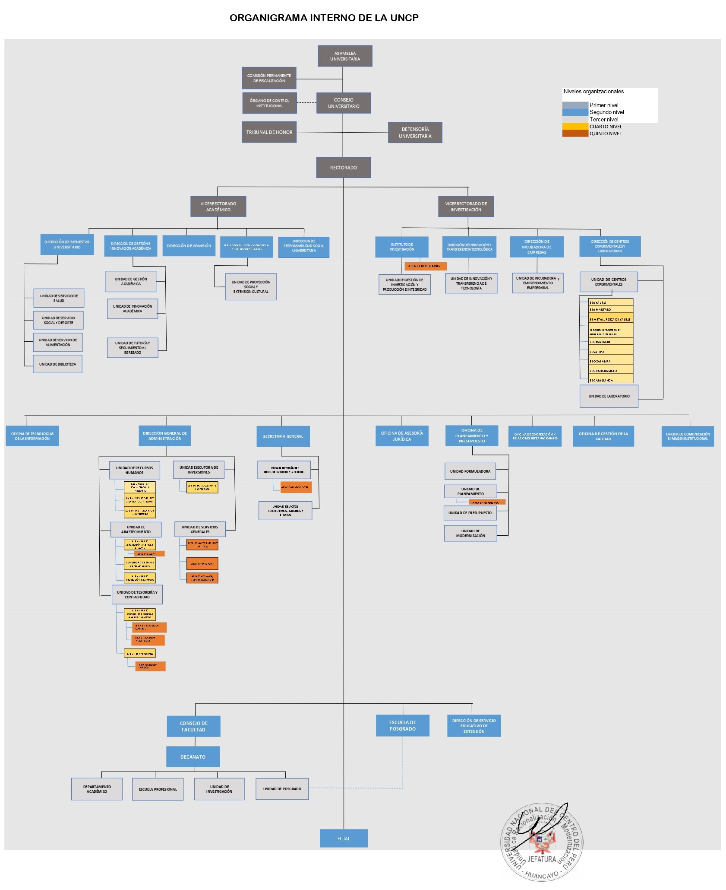

\tableofcontents

\listoftables

\listoffigures
\newpage

## 1. Introduccion

La Universidad Nacional del Centro del Peru (UNCP), con sede principal en la ciudad de Huancayo, region Junin, es una institucion publica de educacion superior que alberga aproximadamente a 10,000 estudiantes en sus diversas facultades y escuelas profesionales. Fundada en 1959, la UNCP ha sido un pilar en la formacion de profesionales en la region central del pais, ofreciendo carreras en areas de ingenieria, ciencias, administracion, educacion y salud.

En el contexto actual, la transformacion digital se ha convertido en un imperativo estrategico para las instituciones de educacion superior. La pandemia de COVID-19 evidencio la necesidad urgente de contar con capacidades digitales robustas para garantizar la continuidad del servicio educativo, la gestion administrativa y la investigacion. La UNCP, como universidad publica, enfrenta el desafio de modernizar sus procesos academicos y administrativos para responder a las expectativas de una generacion de estudiantes digitalmente nativos y a las exigencias de un entorno cada vez mas interconectado.

El presente Plan de Gobierno y Transformación Digital (PGTD) para el periodo 2026-2030 se formula en cumplimiento de la Resolucion de Secretaria de Gobierno y Transformacion Digital N 005-2018-PCM/SGTD, que aprueba los Lineamientos para la formulacion del Plan de Gobierno y Transformación Digital, y en concordancia con el Decreto Legislativo N 1412, Ley de Gobierno Digital. Este plan constituye el instrumento de gestion que define la estrategia de la UNCP para lograr sus objetivos de gobierno digital, orientados a la digitalizacion de servicios, procesos e informacion, haciendo uso intensivo de las tecnologias digitales y la innovacion dirigida por datos.

La UNCP cuenta actualmente con sistemas de informacion como el Sistema Integrado de Gestion Administrativa (SIGA), la plataforma de campus virtual, el repositorio institucional de tesis, el sistema de correo electronico institucional (Microsoft 365) y diversos sistemas administrativos. Sin embargo, estos sistemas operan de manera dispersa, con limitada interoperabilidad y sin un marco de seguridad de la informacion formalmente implementado. El documento "SGSI-UNCP-Marco-Conceptual" ha establecido las bases conceptuales para la implementacion de un Sistema de Gestion de Seguridad de la Informacion (SGSI) basado en la norma ISO/IEC 27001, el cual constituye uno de los pilares fundamentales del presente plan.

Este PGTD se estructura en siete etapas conforme a los lineamientos de la SGTD: identificacion del enfoque estrategico, diagnostico de la situacion actual, definicion de objetivos, desarrollo del portafolio de proyectos, gestion de riesgos, elaboracion del documento y supervision de la implementacion. El horizonte temporal del plan es de cinco anos (2026-2030), con revisiones anuales y actualizaciones conforme a los cambios del entorno tecnologico y las necesidades institucionales.

\newpage
## 2. Base Legal

El presente Plan de Gobierno y Transformacion Digital se sustenta en el siguiente marco normativo nacional e institucional:

### 2.1 Normas Nacionales

\begin{compacttable}[Normas nacionales aplicables al PGTD]
\rowcolors{2}{uncpTableStripe}{white}
\begin{tabularx}{\textwidth}{L{0.36\textwidth} Y}
\toprule
\tableheader Norma & Descripcion \\
\midrule
Constitucion Politica del Peru de 1993 & Marco supremo que reconoce el derecho a la informacion y al uso de tecnologias \\
Ley N 27658 & Ley Marco de Modernizacion de la Gestion del Estado \\
Ley N 29158 & Ley Organica del Poder Ejecutivo \\
Ley N 29733 & Ley de Proteccion de Datos Personales \\
\textbf{Decreto Supremo N 016-2024-JUS} & \textbf{Nuevo Reglamento de la Ley N 29733, vigente desde marzo 2025. Introduce DPIA, regulacion IA y transferencias internacionales de datos} \\
Ley N 27269 & Ley de Firmas y Certificados Digitales \\
Ley N 27444 & Ley del Procedimiento Administrativo General \\
Ley N 27209 & Ley de Presupuesto del Sector Publico \\
Ley N 30220 & Ley Universitaria \\
Ley N 31814 & Ley que promueve el uso de la Inteligencia Artificial en favor del desarrollo economico y social del pais \\
Decreto Supremo N 115-2025-PCM & Reglamento de la Ley N 31814 (IA). Exige auditoria de algoritmos, supervision humana y gestion de riesgos eticos en entidades publicas \\
Decreto Supremo N 017-2024-PCM & Reglamento de la Ley N 30999, Ley de Ciberdefensa \\
Decreto Supremo N 141-2025-PCM & Politica General de Gobierno 2025-2026 \\
Decreto Supremo N 029-2021-PCM & Reglamento de la Ley de Gobierno Digital (modificado por D.S. N 098-2025-PCM) \\
\textbf{Decreto Supremo N 098-2025-PCM} & \textbf{Modifica el D.S. N 029-2021-PCM. Actualiza condiciones de identidad digital, servicios digitales, interoperabilidad y gestion documental electronica en el Estado} \\
Decreto Supremo N 033-2018-PCM & Plataforma Digital Unica del Estado Peruano \\
Decreto Supremo N 103-2023-PCM & Politica Nacional de Transformacion Digital al 2030 \\
Decreto Supremo N 085-2023-PCM & Aprueba la PNTD \\
Decreto Supremo N 004-2013-PCM & Politica Nacional de Modernizacion de la Gestion Publica \\
Decreto Supremo N 066-2011-PCM & Agenda Digital Peruana 2.0 \\
Decreto Supremo N 029-2018-PCM & Reglamento que regula las politicas nacionales \\
Decreto Supremo N 157-2021-PCM & Reglamento del D.U. N 006-2020 - SNTD \\
Resolucion de SGTD N 007-2024-PCM/SGTD & Directiva sobre el uso de la firma digital \\
Resolucion de SGTD N 002-2024-PCM/SGTD & Sello de Accesibilidad Digital \\
\textbf{Resolucion de SGTD N 001-2025-PCM/SGTD} & \textbf{Lineamiento para el diseno y desarrollo de servicios digitales accesibles para personas con discapacidad (WCAG 2.2)} \\
\textbf{Directiva N 001-2025-PCM/SGTD} & \textbf{Directiva que regula el consumo seguro de los servicios de informacion de la PIDE y establece medidas de seguridad digital} \\
Resolucion Ministerial N 119-2018-PCM & Creacion del Comite de Gobierno Digital en cada entidad \\
Resolucion Ministerial N 087-2019-PCM & Disposiciones sobre conformacion y funcionamiento del CGD \\
Decreto Supremo N 050-2018-PCM & Definicion de Seguridad Digital \\
Directiva N 006-2019-CG/INTEG & Implementacion del Sistema de Control Interno \\
Resolucion N 322-2025-CG & Plan de Gobierno y Transformación Digital - Contraloria General de la Republica \\
NTP ISO/IEC 27001:2022 & Tecnologia de la Informacion - SGSI - Requisitos \\
NTP ISO/IEC 38500:2016 & Gobierno de TI para la Organizacion \\
\bottomrule
\end{tabularx}
\end{compacttable}

### 2.2 Normas Institucionales

\begin{compacttable}[Normas institucionales aplicables al PGTD]
\rowcolors{2}{uncpTableStripe}{white}
\begin{tabularx}{\textwidth}{L{0.36\textwidth} Y}
\toprule
\tableheader Norma & Descripcion \\
\midrule
Estatuto de la UNCP & Norma institucional de maximo nivel \\
Plan Estrategico Institucional (PEI) 2024-2030 & Instrumento de planeamiento estrategico de la UNCP aprobado por R. N 3934-CU-2024 \\
Plan Operativo Institucional (POI) 2025 actualizado & Programacion operativa anual aprobada por R. N 3811-R-2025, segun documento convertido \\
Reglamento de Organizacion y Funciones (ROF) & Estructura organizacional de la UNCP \\
\underline{Resolucion N 1862-R-2023} & \underline{Conformacion del Comite de Gobierno Digital UNCP} \\
Politica de Seguridad de la Informacion (en formulacion) & Politica SGSI de la UNCP \\
\bottomrule
\end{tabularx}
\end{compacttable}

\newpage

## 3. Enfoque Estrategico

### 3.1 Mision de la UNCP

Brindar formación profesional, integral y humanista a estudiantes universitarios, desarrollando investigación a través de una gestión de calidad continua, inclusiva con identidad, proyección social, extensión universitaria y responsabilidad social para el desarrollo regional y nacional.

### 3.2 Vision de la UNCP

La UNCP se alinea con la Visión del Perú al 2050: "Al 2050, somos un país democrático, respetuoso del Estado de derecho y de la institucionalidad, integrado al mundo y proyectado hacia un futuro que garantiza la defensa de la persona humana y de su dignidad en todo el territorio nacional. Estamos orgullosos de nuestra identidad, propia de la diversidad étnica, cultural y lingüística del país. Respetamos nuestra historia y patrimonio milenario, y protegemos nuestra biodiversidad. El Estado constitucional es unitario y descentralizado. Su accionar es ético, transparente, eficaz, eficiente, moderno y con enfoque intercultural. Juntos, hemos logrado un desarrollo inclusivo, en igualdad de oportunidades, competitivo y sostenible en todo el territorio nacional, lo que ha permitido erradicar la pobreza extrema y asegurar el fortalecimiento de la familia."

### 3.3 Alineamiento con Planes Nacionales

El presente PGTD se alinea con los siguientes instrumentos de planeamiento nacional:

**Plan Estrategico de Desarrollo Nacional (PEDN) al 2050**

El PEDN al 2050, aprobado mediante Decreto Supremo N 103-2023-PCM, establece una apuesta estratégica centrada en las personas y el uso intensivo del conocimiento. La UNCP se alinea específicamente con los siguientes elementos detallados en el **Tomo II del PEDN**:

- **Objetivo Nacional 1 (OE 1.1):** Garantizar la formación educativa de calidad con énfasis en el **uso de tecnologías digitales**. La UNCP contribuye a la meta nacional de reducir el subempleo por ingresos de egresados de educación superior (Meta 2027: 16.0%, Meta 2030: 15.0%) mediante el fortalecimiento de competencias digitales (OGTD6).
- **Objetivo Nacional 2:** Gestionar el territorio de manera sostenible [...] con el **uso intensivo del conocimiento y las comunicaciones**. La UNCP contribuye mediante la descentralización en sus 4 sedes (Huancayo, Mantaro, Satipo, Tarma) soportada por infraestructura digital.
- **Objetivo Nacional 3 (OE 1.3):** Asegurar la conectividad nacional. La UNCP se alinea al incremento del **Índice de Acceso a las TIC (Network Readiness Index - NRI)**, cuya meta nacional al 2026 es alcanzar un puntaje de 63.22.
- **Objetivo Nacional 4 (AE 4.5.4):** Lograr el gobierno y la **transformación digital en las entidades públicas**. Este PGTD es la respuesta institucional a la acción estratégica nacional para modernizar el Estado bajo la rectoría de la SGTD.

Asimismo, el plan reconoce la importancia de la **Cuarta Revolución Industrial** (IA, Big Data, Robótica) citada en el PEDN como motor de cambio para la competitividad y la educación superior, favoreciendo la articulación entre la academia, el Estado y la industria para el proceso nacional de transformación digital.

**Política Nacional de Cooperación Técnica Internacional (PNCTI) al 2030**

La UNCP, como actor de desarrollo regional, se alinea con la PNCTI para fortalecer la captación de recursos y conocimientos del exterior. La transformación digital de la UNCP busca incrementar la transparencia y eficacia en la gestión de proyectos financiados por la **Cooperación Técnica Internacional (CTI)**, facilitando la rendición de cuentas y el seguimiento de impacto mediante plataformas digitales interoperables alineadas a los estándares de la APCI.

**Politica Nacional de Transformacion Digital (PNTD) al 2030**

Aprobada mediante Decreto Supremo N 103-2023-PCM, la PNTD establece cuatro pilares estrategicos: Conectividad, Educacion, Gobierno y Economia Digital. La UNCP se alinea especificamente con el pilar de Educacion Digital, promoviendo el desarrollo de competencias digitales en la comunidad universitaria, y con el pilar de Gobierno Digital, mediante la digitalizacion de sus procesos y servicios.

Los objetivos prioritarios de la PNTD aplicables a la UNCP son:

\begin{compacttable}[Objetivos prioritarios de la PNTD y alineamiento con la UNCP]
\rowcolors{2}{uncpTableStripe}{white}
\begin{tabularx}{\textwidth}{L{0.40\textwidth} Y}
\toprule
\tableheader Objetivo Prioritario PNTD & Alineamiento UNCP \\
\midrule
OP1: Elevar el ejercicio de ciudadania digital & Formacion de estudiantes y docentes en competencias digitales \\
OP2: Vincular la economia digital a los procesos productivos & Investigacion aplicada y transferencia tecnologica \\
OP3: Garantizar servicios publicos digitales inclusivos & Digitalizacion de servicios academicos y administrativos \\
OP4: Fortalecer la seguridad y confianza digital & Implementacion del SGSI basado en ISO 27001 \\
OP5: Impulsar el talento digital & Programas de capacitacion digital para la comunidad universitaria \\
\bottomrule
\end{tabularx}
\end{compacttable}

**Politica General de Gobierno (PGG) 2025-2026: Transicion Democratica y Reconciliacion Nacional**

Aprobada mediante Decreto Supremo N 141-2025-PCM, la PGG orienta el accionar del Estado hacia la estabilidad y el desarrollo. En su **Quinta Disposicion Complementaria Final**, establece explicitamente que: *"Las entidades públicas hacen uso intensivo de las tecnologías digitales y datos para el cumplimiento de la Política General de Gobierno 2025-2026: Transición Democrática y Reconciliación Nacional, en el marco del proceso nacional de transformación digital."*

Este mandato vinculante sustenta tecnicamente todos los proyectos de digitalizacion, interoperabilidad y seguridad de la informacion contemplados en el presente plan de la UNCP.

### 3.4 Alineamiento con el PEI UNCP 2024-2030

Los objetivos estrategicos institucionales (OEI) del PEI UNCP 2024-2030 que se relacionan directamente con el presente plan han sido tomados del documento PEI incorporado como referencia institucional. El PGTD se articula principalmente con el OEI.04, referido a la modernizacion de la gestion institucional vinculada a la transformacion digital, y complementariamente con los OEI academicos, de investigacion, responsabilidad social y gestion de riesgos.

\begin{compacttable}[Alineamiento del PEI UNCP 2024-2030 con el PGTD]
\rowcolors{2}{uncpTableStripe}{white}
\begin{tabularx}{\textwidth}{C{0.13\textwidth} Y L{0.34\textwidth}}
\toprule
\tableheader OEI & Descripcion & Relacion con PGTD \\
\midrule
OEI.01 & Brindar formacion academica integral y humanista a estudiantes de pregrado y posgrado & Campus virtual, servicios academicos digitales y competencias digitales \\
OEI.02 & Fortalecer la investigacion, desarrollo, innovacion y emprendimiento en la comunidad universitaria & Repositorio digital, plataformas de investigacion, interoperabilidad academica y datos para investigacion \\
OEI.03 & Fortalecer la responsabilidad social, extension universitaria y proyeccion social en la comunidad universitaria & Servicios digitales de extension, transparencia, gobierno abierto y publicacion de informacion \\
OEI.04 & Modernizar la gestion institucional vinculada a la transformacion digital & Digitalizacion de procesos, SGSI, infraestructura TI, gestion documental, interoperabilidad y arquitectura digital \\
OEI.05 & Implementar la gestion de riesgos de desastres en la comunidad universitaria & Continuidad operativa, resiliencia tecnologica, respaldos, recuperacion y comunicaciones de emergencia \\
\bottomrule
\end{tabularx}
\end{compacttable}

### 3.5 Desafios del Gobierno Digital en la UNCP

Teniendo en cuenta el marco estrategico institucional y las disposiciones nacionales, se han identificado los siguientes desafios para el desarrollo del gobierno digital en la UNCP:

\begin{compacttable}[Desafios del gobierno digital en la UNCP]
\rowcolors{2}{uncpTableStripe}{white}
\begin{tabularx}{\textwidth}{C{0.12\textwidth} L{0.26\textwidth} Y}
\toprule
\tableheader Codigo & Desafio & Descripcion \\
\midrule
DGD.01 & Gestion del cambio cultural & Integrar acciones para gestionar el cambio en la cultura organizacional, eliminando resistencias a la transformacion digital \\
DGD.02 & Centralidad en el usuario & Disenar servicios digitales centrados en las necesidades de estudiantes, docentes y administrativos \\
DGD.03 & Seguridad y confianza digital & Preservar la confidencialidad, integridad y disponibilidad de la informacion institucional \\
DGD.04 & Digitalizacion de servicios & Transformar procesos academicos y administrativos a digitales de principio a fin \\
DGD.05 & Competencias digitales & Desarrollar capacidades digitales en toda la comunidad universitaria \\
DGD.06 & Infraestructura tecnologica & Modernizar la plataforma tecnologica para garantizar flexibilidad, escalabilidad e interoperabilidad \\
DGD.07 & Sostenibilidad presupuestal & Asegurar la asignacion de recursos suficientes para los proyectos de gobierno digital \\
\bottomrule
\end{tabularx}
\end{compacttable}

\newpage

## 4. Situacion Actual del Gobierno Digital en la UNCP

### 4.1 Estructura Organizacional del Gobierno Digital

La UNCP actualmente cuenta con las siguientes unidades relacionadas con la gestion de tecnologias digitales:

{width=90%}

**Comite de Gobierno Digital:** conformado formalmente mediante Resolucion N 1862-R-2023, presidido por el Rector e integrado por:

\begin{compacttable}[Composicion del Comite de Gobierno Digital]
\rowcolors{2}{uncpTableStripe}{white}
\begin{tabularx}{\textwidth}{L{0.45\textwidth} Y}
\toprule
\tableheader Cargo en UNCP & Rol en CGTD \\
\midrule
Rector & Titular de la entidad / Presidente del CGTD \\
Director(a) General de Administracion & Lider de Gobierno y Transformacion Digital \\
Jefe(a) de la Oficina de Tecnologias de la Informacion (OTI) & Responsable del area de informatica \\
Oficial de Seguridad de la Informacion & Mg. Rocio Rosanna Damian Alvarado, Jefa de la OTI, integrada al CGD por R. N 2143-R-2023 \\
Jefe(a) de la Unidad de Recursos Humanos & Responsable del area de recursos humanos \\
Jefe(a) de la Unidad de Tramite documentario y Archivo & Responsable del area de atencion al ciudadano \\
Jefe(a) de la Oficina de Asesoria Juridica & Responsable del area legal \\
Jefe(a) de la Oficina de Planeamiento y Presupuesto & Responsable del area de planificacion \\
Responsable de Software Publico & Mg. Rocio Rosanna Damian Alvarado, designada por R. N 2140-R-2023 \\
\bottomrule
\end{tabularx}
\end{compacttable}

**Observaciones sobre la estructura actual:**
- El Comite de Gobierno Digital se encuentra formalmente constituido mediante R. N 1862-R-2023; su periodicidad de sesiones debe sustentarse con actas, convocatorias o reportes recientes.
- La R. N 2143-R-2023 integra al Comite de Gobierno Digital a la Mg. Rocio Rosanna Damian Alvarado, Jefa de la OTI, como Oficial de Seguridad de la Informacion. Antes del cierre operativo deben evidenciarse suplencia, dedicacion y recursos asignados.
- La OTI cuenta con personal tecnico especializado, incluyendo a Rocio Damian y Juan Carlos Garay, aunque se requiere fortalecer el equipo para los nuevos desafios.
- El rol de Lider de Gobierno y Transformacion Digital es ejercido por el Director General de Administracion (DGA).
- La R. N 2140-R-2023 designa a la Mg. Rocio Rosanna Damian Alvarado como Funcionaria Responsable del Software Publico.

**Trazabilidad de resoluciones oficiales:** el portal institucional publica resoluciones rectorales en `https://uncp.edu.pe/la-universidad/resoluciones-rectorales/`, que carga el repositorio `https://resoluciones.uncp.edu.pe/documentos/R-RE`. Las resoluciones directorales se publican en `https://uncp.edu.pe/la-universidad/resoluciones-directorales/`, que carga `https://resoluciones.uncp.edu.pe/documentos/R-DR`. Para cerrar la evidencia del PGTD-UNCP deben incorporarse las conversiones Markdown de las resoluciones citadas y las actas operativas del CGTD.

### 4.2 Infraestructura Tecnologica

**Red de datos:**

La UNCP cuenta con una red de datos que interconecta las diferentes facultades y dependencias administrativas en el campus principal de Huancayo. La red presenta las siguientes caracteristicas:

\begin{compacttable}[Situacion actual de la red de datos]
\rowcolors{2}{uncpTableStripe}{white}
\begin{tabularx}{\textwidth}{L{0.30\textwidth} Y}
\toprule
\tableheader Componente & Situacion Actual \\
\midrule
Red de campus & Fibra optica entre edificios principales, con segmentacion por VLANs \\
Conectividad a internet & 4 Gbps simetricos, con alta velocidad y estabilidad \\
Red inalambrica & Cobertura en facultades, con autenticacion basica \\
Segmentacion de red & Implementada mediante protocolos IPv4 \\
Protocolo IPv6 & En proceso de transicion y adopcion \\
VPN de acceso remoto & Implementacion para acceso administrativo y academico \\
Firewall perimetral & Equipo de generacion anterior, sin actualizacion de licencias \\
\bottomrule
\end{tabularx}
\end{compacttable}

**Servidores e Infraestructura Cloud:**

La UNCP ha migrado significativamente a la nube, utilizando servicios de Huawei Cloud (IaaS y PaaS) para sus aplicaciones criticas.

\begin{compacttable}[Situacion actual de servidores e infraestructura cloud]
\rowcolors{2}{uncpTableStripe}{white}
\begin{tabularx}{\textwidth}{L{0.32\textwidth} C{0.18\textwidth} Y}
\toprule
\tableheader Tipo & Cantidad / Detalle & Observaciones \\
\midrule
Servidores fisicos & 8 & Ubicados en el Datacenter local \\
Servidores virtualizados & 3 & Entorno de virtualizacion local \\
Infraestructura Cloud (IaaS) & 3 servicios & Huawei Cloud: ASP.NET Core, PHP, Desarrollo \\
Plataforma Cloud (PaaS) & 1 servicio & Gestion de bases de datos y servicios gestionados \\
Almacenamiento en Nube & 12 TB (Object Storage) & Servicio de almacenamiento estandar \\
Backup en Nube & 4 TB & Cloud Backup and Recovery \\
\bottomrule
\end{tabularx}
\end{compacttable}

**Detalle de la Infraestructura en la Nube (Huawei Cloud):**
- **Servidor ASP.NET Core:** 96 GB RAM, 24 vCPU, 1024 GB Storage. Incluye balanceador de carga para 50,000 conexiones concurrentes y autoescalado.
- **Base de Datos ASP.NET:** MySQL 8.0.33, 96 GB RAM, 24 vCPU, 2048 GB Storage.
- **Servidor PHP:** 16 GB RAM, 8 vCPU, 3072 GB Storage (Incremental).
- **Base de Datos PHP:** MySQL 5.7.40, 16 GB RAM, 8 vCPU, 1024 GB Storage.
- **Seguridad Perimetral Cloud:** WAF con 20 reglas, Proteccion Anti-DDoS, Certificados SSL Wildcard.
- **Otros:** CDN para entrega de contenido, IAM para gestion de identidades, DNS de alta velocidad.

**Hardware e Inventario de Equipos (Annex 03):**
Segun el inventario de activos digitales de 2025, la UNCP cuenta con:
- **Computadoras de escritorio:** 3,736 total (1,253 operativas de alto rendimiento).
- **Computadoras portatiles:** 1,861 total (773 operativas).
- **Impresoras y Multifuncionales:** 1,200 equipos.
- **Escaneres:** 501 unidades.
- **Equipos de Red:** 143 Access Points, 137 Switches PoE, 9 Firewalls fisicos.

**Sistemas de Informacion:**

\begin{compacttable}[Sistemas de informacion institucionales]
\rowcolors{2}{uncpTableStripe}{white}
\begin{tabularx}{\textwidth}{L{0.32\textwidth} L{0.32\textwidth} Y}
\toprule
\tableheader Sistema & Funcion & Estado \\
\midrule
ERP ADESA (23 Modulos) & Gestion Academica y Administrativa integral & Operativo (Sistema principal) \\
SIGA / SIAF & Gestion administrativa, presupuestal y financiera & Operativo \\
Campus Virtual (Moodle / Teams) & Plataforma de educacion virtual y videoconferencia & Operativo \\
Sistema de Biblioteca (KOHA) & Gestion de prestamos y busqueda de libros & Operativo \\
Repositorio Institucional (DSpace) & Almacenamiento y difusion de tesis e investigacion & Operativo \\
Correo Institucional (Office 365) & Comunicacion oficial (@uncp.edu.pe) & Operativo \\
Tramite Documentario (ERP-ADESA) & Gestion de documentos y expedientes (Interno/Externo) & Operativo \\
Sistema de Centro Medico & Gestion de historias clinicas e inventario farmaceutico & Operativo \\
Sistema de Comedor Universitario & Control de asistencia de beneficiarios & Operativo \\
Sistema de Proyeccion Social & Gestion de procedimientos de proyeccion social & Operativo \\
\bottomrule
\end{tabularx}
\end{compacttable}

**Plataforma GOB.PE:** La UNCP cuenta con presencia institucional en la Plataforma Digital Unica del Estado Peruano en https://www.gob.pe/uncp, con informacion institucional, enlaces a tramites y servicios, y publicacion de normas y documentos.

**Licencias de Software:**

La UNCP cuenta con licencias de software propietario para sistemas operativos, bases de datos y herramientas ofimaticas, aunque existe un porcentaje significativo de equipos con software sin licenciamiento adecuado. No se cuenta con un inventario centralizado de licencias ni con una politica formal de adquisicion de software.

### 4.3 Procesos Digitalizados

A continuacion se detallan los macroprocesos y procesos de la UNCP que cuentan con soporte digital, indicando su nivel de madurez y el detalle de las herramientas utilizadas:

\begin{compacttable}[Procesos digitalizados de la UNCP]
\rowcolors{2}{uncpTableStripe}{white}
\begin{tabularx}{\textwidth}{L{0.25\textwidth} L{0.25\textwidth} C{0.10\textwidth} Y}
\toprule
\tableheader Macroproceso & Proceso & Nivel & Detalle / Comentarios \\
\midrule
\textbf{Posicionamiento Institucional} & Gestion de convenios y movilidad & Total & Modulo de Cooperacion Internacional en ERP ADESA \\
\textbf{Gestion de Admision} & Inscripcion y seleccion & Total & Modulo de admision ERP-ADESA, consulta biometrica \\
\textbf{Formacion Profesional} & Organizacion academica & Total & Modulos de Gestion Docente y Matriculas (ERP ADESA) \\
\textbf{Gestion de Investigacion} & Proyectos e investigacion & Parcial & Seguimiento en ERP ADESA y sistemas de revistas/tesis \\
\textbf{Seguimiento al egresado} & Gestion de egresados & Total & Sistemas digitales dentro de ERP ADESA \\
\textbf{Responsabilidad Social} & Proyeccion Social & Total & Modulo de Proyeccion Social en ERP ADESA \\
\textbf{Gestion de RRHH} & Incorporacion y planillas & Parcial & Uso de SIAF y modulos ERP para convocatorias \\
\textbf{Gestion Academica} & Evaluacion de Desempeño & Total & Modulo Gestion de Docentes (ERP ADESA) \\
\textbf{Gestion de la Inversion} & Formulacion y ejecucion & Parcial & Banco de Inversiones MEF, SIGA y SIAF \\
\textbf{Gestion Financiera} & Captacion y gasto & Total & SIGA, SIAF y Modulo Caja del ERP-ADESA \\
\textbf{Gestion Documental} & Tramite y atencion & Total & Módulo de Trámite Documentario del ERP ADESA \\
\textbf{Gestion de Asuntos Legales} & Procedimientos disciplinarios & Total & Sistema desarrollado por OTI; otros procesos parciales \\
\bottomrule
\end{tabularx}
\end{compacttable}

### 4.4 Servicios Digitales Actuales

La UNCP ofrece actualmente los siguientes servicios digitales:

\begin{compacttable}[Servicios digitales actuales]
\rowcolors{2}{uncpTableStripe}{white}
\begin{tabularx}{\textwidth}{Y C{0.16\textwidth} L{0.34\textwidth}}
\toprule
\tableheader Servicio & Canal & Nivel de Madurez \\
\midrule
Consulta de notas en linea & Web (ERP ADESA) & Transaccional \\
Matricula virtual & Web (ERP ADESA) & Transaccional \\
Consulta de horarios & Web (ERP ADESA) & Transaccional \\
Descarga de boletas de pago & Web (ERP ADESA) & Transaccional \\
Tramite documentario interno (GESDOC/ADESA) & Web & Transaccional \\
Tramite documentario externo (ADESA) & Web/Movil & Transaccional \\
Mesa de Partes Virtual & Web (erpcampus.uncp.edu.pe) & Operativo \\
Correo institucional (Office 365) & Web/Movil & Operativo \\
Campus virtual (Moodle/Teams) & Web/Movil & Operativo \\
Repositorio de tesis (DSpace) & Web & Informativo / Transaccional \\
Biblioteca virtual (MyLOFT) & Web & Operativo \\
Portal de Transparencia & Web & Operativo \\
Convocatorias Virtuales & Web & Operativo \\
\bottomrule
\end{tabularx}
\end{compacttable}

**Problemas identificados en los servicios digitales actuales:**
- Se requiere un portal unificado para mejorar la experiencia del usuario (SSO).
- Los servicios deben alinearse completamente al estandar de accesibilidad (WCAG 2.2).
- Falta de interoperabilidad total entre algunos modulos antiguos y la nueva infraestructura cloud.

### 4.5 Seguridad de la Informacion

De acuerdo con el diagnostico realizado y los datos del plan anterior, la situacion de la seguridad de la informacion en la UNCP es la siguiente:

\begin{compacttable}[Situacion actual de seguridad de la informacion]
\rowcolors{2}{uncpTableStripe}{white}
\begin{tabularx}{\textwidth}{L{0.30\textwidth} Y}
\toprule
\tableheader Dimension & Situacion Actual \\
\midrule
Politicas de seguridad & En proceso de formalizacion y actualizacion bajo ISO 27001 \\
Organizacion de seguridad & Oficial de Seguridad integrado al CGD por Res. N 2143-R-2023; pendiente fortalecer suplencia, dedicacion y recursos operativos \\
Gestion de activos & Inventario de activos digitales realizado en 2025 \\
Control de acceso & Implementacion de protocolos HTTPS, SSL Wildcard e IAM \\
Seguridad de redes & Firewalls fisicos (9) y virtuales (1), segmentacion por VLANs \\
Seguridad Cloud & WAF, Anti-DDoS y monitoreo de eventos en Huawei Cloud \\
Gestion de vulnerabilidades & Realizacion de analisis periodicos en servicios criticos \\
Backups & Cloud Backup and Recovery (4 TB) y backups locales \\
\bottomrule
\end{tabularx}
\end{compacttable}

**Activos criticos de informacion identificados:**

\begin{compacttable}[Activos criticos y riesgos principales]
\rowcolors{2}{uncpTableStripe}{white}
\begin{tabularx}{\textwidth}{L{0.48\textwidth} Y}
\toprule
\tableheader Activo & Riesgo Principal \\
\midrule
Base de datos academica (ERP ADESA) & Compromiso de integridad y disponibilidad \\
Sistema de tesoreria / recaudacion & Fraude financiero o perdida de datos transaccionales \\
Correo institucional (Office 365) & Suplantacion, phishing, fuga de informacion \\
Plataforma campus virtual / Moodle & Interrupcion del servicio educativo \\
Sistemas de investigacion y tesis & Perdida de propiedad intelectual \\
Historias clinicas (Centro Medico) & Acceso no autorizado a datos sensibles \\
\bottomrule
\end{tabularx}
\end{compacttable}

### 4.6 Presupuesto de Gobierno Digital

El presupuesto asignado a tecnologias digitales en la UNCP segun el POI 2025 y proyecciones:

\begin{compacttable}[Presupuesto de gobierno digital]
\rowcolors{2}{uncpTableStripe}{white}
\begin{tabularx}{\textwidth}{Y R{0.24\textwidth} C{0.18\textwidth}}
\toprule
\tableheader Concepto & Presupuesto Estimado (S/) & Porcentaje \\
\midrule
Personal y Capacitacion & 570,000 & 30\% \\
Software, Licencias y Cloud & 475,000 & 25\% \\
Hardware e Infraestructura & 570,000 & 30\% \\
Servicios de Conectividad & 285,000 & 15\% \\
\textbf{Total} & \textbf{1,900,000} & \textbf{100\%} \\
\bottomrule
\end{tabularx}
\end{compacttable}

### 4.7 Cumplimiento Normativo

\begin{compacttable}[Cumplimiento normativo]
\rowcolors{2}{uncpTableStripe}{white}
\begin{tabularx}{\textwidth}{L{0.36\textwidth} Y}
\toprule
\tableheader Norma & Estado de Cumplimiento \\
\midrule
Ley N 29733 (Proteccion de Datos Personales) & Implementado: Controles en bases de datos y seguridad Cloud \\
D.L. N 1412 (Gobierno Digital) & Implementado: Comite de Gobierno Digital constituido y operativo \\
D.S. N 029-2021-PCM (Reglamento LGD) & Cumplimiento: Designacion de roles criticos (Seguridad, Software Publico) \\
Resolucion N 1862-R-2023 (CGD) & Cumplimiento: Comite conformado y liderando la transformacion \\
NTP ISO/IEC 27001 & En proceso: Implementacion del SGSI (Proyecto PGTD-01) \\
D.S. N 033-2018-PCM (GOB.PE) & Implementado: Presencia activa en gob.pe/uncp \\
\bottomrule
\end{tabularx}
\end{compacttable}

### 4.8 Matriz Resumen AS-IS

\begin{compacttable}[Matriz resumen AS-IS]
\rowcolors{2}{uncpTableStripe}{white}
\begin{tabularx}{\textwidth}{L{0.34\textwidth} Y}
\toprule
\tableheader Dimension & Situacion Actual (AS-IS) \\
\midrule
Politicas de seguridad & Basadas en estandares internacionales, en formalizacion \\
Organizacion TI & Comite formalizado; Oficial de Seguridad y Responsable de Software Publico designados, pendiente evidenciar operatividad con actas e informes \\
Infraestructura de red & Fibra optica, 4 Gbps de internet, segmentacion VLAN \\
Infraestructura Cloud & Huawei Cloud (PaaS/IaaS) operativa para sistemas criticos \\
Sistemas de informacion & ERP ADESA integrado con 23 modulos \\
Servicios digitales & Nivel transaccional en procesos clave (matricula, notas) \\
Seguridad de la informacion & Controles tecnicos robustos en nube, SGSI en fase de proyecto \\
Gestion de incidentes & Procedimientos basicos implementados por OTI \\
Cumplimiento normativo & Nivel alto de cumplimiento formal y operativo \\
\bottomrule
\end{tabularx}
\end{compacttable}

### 4.9 Modelo de Madurez de Gobierno Digital (Diagnostico FONAFE)

Para la evaluacion del nivel de madurez de gobierno digital en la UNCP, se empleo el modelo de medicion utilizado por FONAFE en su Plan de Gobierno y Transformación Digital 2023-2026, adaptado al contexto universitario. Este modelo mide las capacidades de gestion tecnologica a traves de cinco dominios ponderados:

\begin{compacttable}[Dominios de madurez de gobierno digital]
\rowcolors{2}{uncpTableStripe}{white}
\begin{tabularx}{\textwidth}{L{0.60\textwidth} C{0.14\textwidth} C{0.18\textwidth}}
\toprule
\tableheader Dominio & Peso & Nivel de Madurez \\
\midrule
D1. Estrategia y Organizacion & 15\% & 2.175 \\
D2. Habilitadores de Gestion de Gobierno Digital & 20\% & 1.800 \\
D3. Habilitadores Tecnologicos de Gobierno Digital & 25\% & 1.475 \\
D4. Servicios Orientados al Ciudadano & 25\% & 1.350 \\
D5. Cultura Digital & 15\% & 1.175 \\
\textbf{Nivel de Madurez UNCP} & \textbf{100\%} & \textbf{1.569} \\
\bottomrule
\end{tabularx}
\end{compacttable}

**Niveles de Madurez:**

\begin{compacttable}[Niveles de madurez de gobierno digital]
\rowcolors{2}{uncpTableStripe}{white}
\begin{tabularx}{\textwidth}{C{0.10\textwidth} L{0.22\textwidth} Y}
\toprule
\tableheader Nivel & Denominacion & Descripcion \\
\midrule
1 & Inicial & No se ha implementado el atributo de Gobierno Digital analizado \\
2 & Experimental & Implementacion incipiente, bajo criterios aislados o a discrecion \\
3 & Analizado & Situacion actual analizada, se cuenta con diseno y propuesta formal (aun no implementado) \\
4 & Definido & Implementado de acuerdo a un diseno y modelo de gestion adecuado \\
5 & Optimizado & Alcanza su proposito e incorpora procesos de evaluacion y mejora continua \\
\bottomrule
\end{tabularx}
\end{compacttable}

Con un puntaje general de **1.569**, la UNCP se ubica en el **Nivel 1-2 (Inicial a Experimental)**, lo que refleja la necesidad de fortalecer todos los dominios para alcanzar al menos el Nivel 3 (Analizado) al cierre del presente plan.

#### Detalle por Sub-Dominios

**D1. Estrategia y Organizacion (15%) - Puntaje: 2.175**

\begin{compacttable}[Subdominios D1: Estrategia y Organizacion]
\rowcolors{2}{uncpTableStripe}{white}
\begin{tabularx}{\textwidth}{L{0.30\textwidth} C{0.10\textwidth} C{0.11\textwidth} C{0.12\textwidth} Y}
\toprule
\tableheader Sub-Dominio & Peso & Puntaje & Ponderado & Justificacion \\
\midrule
SD1. Alineamiento Estrategico & 35\% & 2.5 & 0.875 & PEI 2024-2030 incluye el OEI.04 de modernizacion institucional vinculada a transformacion digital; falta desagregar indicadores TIC especificos del PGTD \\
SD2. Presupuesto de Gobierno Digital & 30\% & 2.0 & 0.600 & Presupuesto TI del 1.2\% del total, sin partida PGTD especifica \\
SD3. Gobernanza y Gestion del Gobierno Digital & 35\% & 2.0 & 0.700 & CGD creado (R. 1862-R-2023) pero con operatividad limitada, sin Lider de GD formal \\
\bottomrule
\end{tabularx}
\end{compacttable}

**D2. Habilitadores de Gestion (20%) - Puntaje: 1.800**

\begin{compacttable}[Subdominios D2: Habilitadores de Gestion]
\rowcolors{2}{uncpTableStripe}{white}
\begin{tabularx}{\textwidth}{L{0.30\textwidth} C{0.10\textwidth} C{0.11\textwidth} C{0.12\textwidth} Y}
\toprule
\tableheader Sub-Dominio & Peso & Puntaje & Ponderado & Justificacion \\
\midrule
SD4. Gestion del Cumplimiento Regulatorio & 25\% & 2.5 & 0.625 & Cumplimiento parcial de la normativa de gobierno digital \\
SD5. Gestion de Portafolio y Proyectos & 15\% & 1.5 & 0.225 & Sin portafolio formal de proyectos de gobierno digital \\
SD6. Gobierno de Datos & 15\% & 1.0 & 0.150 & No existe gobierno de datos formal \\
SD7. Gobierno de Procesos & 20\% & 1.5 & 0.300 & Procesos documentados pero no optimizados digitalmente \\
SD8. Procesos de Negocio Digitalizados & 25\% & 2.0 & 0.500 & Aproximadamente 15\% de procesos con soporte digital \\
\bottomrule
\end{tabularx}
\end{compacttable}

**D3. Habilitadores Tecnologicos (25%) - Puntaje: 1.475**

\begin{compacttable}[Subdominios D3: Habilitadores Tecnologicos]
\rowcolors{2}{uncpTableStripe}{white}
\begin{tabularx}{\textwidth}{L{0.30\textwidth} C{0.10\textwidth} C{0.11\textwidth} C{0.12\textwidth} Y}
\toprule
\tableheader Sub-Dominio & Peso & Puntaje & Ponderado & Justificacion \\
\midrule
SD9. Seguridad de la Informacion & 25\% & 1.5 & 0.375 & Sin SGSI implementado; Oficial de Seguridad integrado al CGD, con capacidad operativa por fortalecer \\
SD10. Interoperabilidad & 20\% & 1.0 & 0.200 & Sin integracion con PIDE, sistemas aislados \\
SD11. Gobierno Abierto & 15\% & 2.0 & 0.300 & Portal de transparencia basico, datos abiertos limitados \\
SD12. Arquitectura Digital & 20\% & 1.0 & 0.200 & Sin arquitectura digital definida \\
SD13. Infraestructura Tecnologica & 20\% & 2.0 & 0.400 & Infraestructura envejecida, capacidad al limite \\
\bottomrule
\end{tabularx}
\end{compacttable}

**D4. Servicios Orientados al Ciudadano (25%) - Puntaje: 1.350**

\begin{compacttable}[Subdominios D4: Servicios Orientados al Ciudadano]
\rowcolors{2}{uncpTableStripe}{white}
\begin{tabularx}{\textwidth}{L{0.30\textwidth} C{0.10\textwidth} C{0.11\textwidth} C{0.12\textwidth} Y}
\toprule
\tableheader Sub-Dominio & Peso & Puntaje & Ponderado & Justificacion \\
\midrule
SD14. Servicios y Canales Digitales & 35\% & 2.0 & 0.700 & Servicios web basicos, sin portal unificado ni app movil. Presencia en GOB.PE implementada \\
SD15. Experiencia y Satisfaccion del Usuario & 30\% & 1.0 & 0.300 & No se mide satisfaccion de usuarios de servicios digitales \\
SD16. Innovacion & 35\% & 1.0 & 0.350 & Sin programa de innovacion digital formal \\
\bottomrule
\end{tabularx}
\end{compacttable}

**D5. Cultura Digital (15%) - Puntaje: 1.175**

\begin{compacttable}[Subdominios D5: Cultura Digital]
\rowcolors{2}{uncpTableStripe}{white}
\begin{tabularx}{\textwidth}{L{0.30\textwidth} C{0.10\textwidth} C{0.11\textwidth} C{0.12\textwidth} Y}
\toprule
\tableheader Sub-Dominio & Peso & Puntaje & Ponderado & Justificacion \\
\midrule
SD17. Capital Humano & 35\% & 1.5 & 0.525 & Competencias digitales limitadas, sin programa de capacitacion formal \\
SD18. Valores & 30\% & 1.0 & 0.300 & Cultura organizacional tradicional, resistencia al cambio \\
SD19. Gestion del Cambio & 35\% & 1.0 & 0.350 & Sin estrategia de gestion del cambio organizacional \\
\bottomrule
\end{tabularx}
\end{compacttable}

#### Metas de Madurez 2027-2028

\begin{compacttable}[Metas de madurez 2027-2028]
\rowcolors{2}{uncpTableStripe}{white}
\begin{tabularx}{\textwidth}{Y R{0.18\textwidth} R{0.15\textwidth} R{0.15\textwidth}}
\toprule
\tableheader Dominio & Linea Base (2025) & Meta 2027 & Meta 2028 \\
\midrule
D1. Estrategia y Organizacion & 2.175 & 3.000 & 4.000 \\
D2. Habilitadores de Gestion & 1.800 & 2.500 & 3.500 \\
D3. Habilitadores Tecnologicos & 1.475 & 2.500 & 3.500 \\
D4. Servicios Orientados al Ciudadano & 1.350 & 2.500 & 3.500 \\
D5. Cultura Digital & 1.175 & 2.000 & 3.000 \\
\textbf{Nivel General} & \textbf{1.569} & \textbf{2.500} & \textbf{3.500} \\
\bottomrule
\end{tabularx}
\end{compacttable}

\newpage

## 5. Objetivos de Gobierno y Transformacion Digital

A partir del analisis de la situacion actual, los desafios identificados y el alineamiento estrategico con el PEI y las politicas nacionales, se definen los siguientes Objetivos de Gobierno y Transformacion Digital (OGTD) para la UNCP en el periodo 2026-2030. Cada OGTD se vincula a uno o mas desafios de gobierno digital (DGD) y a objetivos estrategicos institucionales (OEI) del PEI 2024-2030.

### Matriz de Alineacion OGTD - Desafios - PEI

\begin{compacttable}[Matriz de alineacion OGTD - Desafios - PEI]
\rowcolors{2}{uncpTableStripe}{white}
\begin{tabularx}{\textwidth}{C{0.12\textwidth} Y L{0.19\textwidth} L{0.18\textwidth}}
\toprule
\tableheader OGTD & Descripcion & Desafio Asociado & OEI PEI \\
\midrule
OGTD1 & Optimizar y promover la digitalizacion de procesos academicos y administrativos & DGD.04, DGD.02 & OEI.01, OEI.04 \\
OGTD2 & Fortalecer la interaccion de la comunidad universitaria a traves de servicios digitales integrados & DGD.02, DGD.01 & OEI.01, OEI.03, OEI.04 \\
OGTD3 & Optimizar los mecanismos de seguridad de la informacion para garantizar la proteccion de los activos de informacion & DGD.03 & OEI.04, OEI.05 \\
OGTD4 & Mantener la disponibilidad de la infraestructura tecnologica para atender la demanda de servicios digitales & DGD.06 & OEI.04, OEI.05 \\
OGTD5 & Fortalecer las iniciativas y procesos para la gestion del cambio en la cultura organizacional & DGD.01, DGD.05 & OEI.04 \\
OGTD6 & Fortalecer las competencias digitales de la comunidad universitaria con el fin de innovar procesos y servicios & DGD.05 & OEI.01, OEI.02, OEI.04 \\
\bottomrule
\end{tabularx}
\end{compacttable}

### OGTD1: Digitalizar procesos academicos y administrativos

Optimizar y promover la digitalizacion de los procesos de negocio, a fin de aumentar la eficiencia, la efectividad y la calidad de los servicios ofrecidos a la comunidad universitaria.

**Desafio asociado:** DGD.04 (Digitalizacion de servicios), DGD.02 (Centralidad en el usuario)

\begin{compacttable}[Indicadores del OGTD1]
\rowcolors{2}{uncpTableStripe}{white}
\begin{tabularx}{\textwidth}{Y C{0.18\textwidth} C{0.12\textwidth} C{0.12\textwidth} C{0.12\textwidth}}
\toprule
\tableheader Indicador & Linea Base (2024) & Meta 2026 & Meta 2027 & Meta 2028 \\
\midrule
Porcentaje de procesos administrativos digitalizados & 10\% & 30\% & 50\% & 75\% \\
Porcentaje de tramites academicos iniciados y concluidos en linea & 20\% & 40\% & 65\% & 85\% \\
Reduccion de uso de papel en procesos administrativos & Linea base & 20\% & 40\% & 60\% \\
\bottomrule
\end{tabularx}
\end{compacttable}

### OGTD2: Implementar servicios digitales integrados centrados en la comunidad universitaria

Fortalecer la interaccion de la comunidad universitaria a traves de servicios digitales integrados, accesibles y centrados en las necesidades de estudiantes, docentes y personal administrativo.

**Desafio asociado:** DGD.02 (Centralidad en el usuario), DGD.01 (Gestion del cambio cultural)

\begin{compacttable}[Indicadores del OGTD2]
\rowcolors{2}{uncpTableStripe}{white}
\begin{tabularx}{\textwidth}{Y C{0.18\textwidth} C{0.12\textwidth} C{0.12\textwidth} C{0.12\textwidth}}
\toprule
\tableheader Indicador & Linea Base (2024) & Meta 2026 & Meta 2027 & Meta 2028 \\
\midrule
Cantidad de servicios academicos digitalizados & 5 & 10 & 18 & 25 \\
Nivel de satisfaccion de usuarios con servicios digitales & No medido & 60\% & 70\% & 80\% \\
Tiempo promedio de atencion de tramites academicos en linea & 5 dias & 3 dias & 2 dias & 1 dia \\
\bottomrule
\end{tabularx}
\end{compacttable}

### OGTD3: Fortalecer la seguridad de la informacion institucional

Optimizar los mecanismos de seguridad de la informacion a fin de garantizar la seguridad de los activos de informacion de la UNCP, implementando un SGSI basado en ISO/IEC 27001.

**Desafio asociado:** DGD.03 (Seguridad y confianza digital)

\begin{compacttable}[Indicadores del OGTD3]
\rowcolors{2}{uncpTableStripe}{white}
\begin{tabularx}{\textwidth}{Y C{0.18\textwidth} C{0.12\textwidth} C{0.12\textwidth} C{0.12\textwidth}}
\toprule
\tableheader Indicador & Linea Base (2024) & Meta 2026 & Meta 2027 & Meta 2028 \\
\midrule
Nivel de procesos incorporados al SGSI & 0\% & 30\% & 60\% & 90\% \\
Numero de incidentes de seguridad gestionados formalmente & 0 & 20 & 40 & 60 \\
Tiempo medio de respuesta a incidentes de seguridad & Sin medicion & 72 horas & 48 horas & 24 horas \\
\bottomrule
\end{tabularx}
\end{compacttable}

### OGTD4: Modernizar la infraestructura tecnologica y promover la eco-eficiencia

Mantener la disponibilidad de la infraestructura tecnologica para atender la demanda de los servicios digitales, garantizando flexibilidad, escalabilidad, seguridad y el uso eficiente de los recursos energeticos (Green IT).

**Desafio asociado:** DGD.06 (Infraestructura tecnologica)

\begin{compacttable}[Indicadores del OGTD4]
\rowcolors{2}{uncpTableStripe}{white}
\begin{tabularx}{\textwidth}{Y C{0.18\textwidth} C{0.12\textwidth} C{0.12\textwidth} C{0.12\textwidth}}
\toprule
\tableheader Indicador & Linea Base (2024) & Meta 2026 & Meta 2027 & Meta 2028 \\
\midrule
Nivel de disponibilidad de servicios digitales (uptime) & 95\% & 97\% & 99\% & 99.5\% \\
Porcentaje de servidores con menos de 5 anos de antiguedad & 40\% & 60\% & 80\% & 90\% \\
Reduccion del consumo energetico en el Data Center (Eco-eficiencia) & Linea base & 5\% & 10\% & 15\% \\
Ancho de banda de internet & 300 Mbps & 500 Mbps & 700 Mbps & 1 Gbps \\
\bottomrule
\end{tabularx}
\end{compacttable}

### OGTD5: Gestion del cambio y cultura digital

Fortalecer las iniciativas y procesos para la gestion del cambio en la cultura organizacional basados en innovacion y agilidad, promoviendo la adopcion de tecnologias digitales en toda la comunidad universitaria.

**Desafio asociado:** DGD.01 (Gestion del cambio cultural), DGD.05 (Competencias digitales)

\begin{compacttable}[Indicadores del OGTD5]
\rowcolors{2}{uncpTableStripe}{white}
\begin{tabularx}{\textwidth}{Y C{0.18\textwidth} C{0.12\textwidth} C{0.12\textwidth} C{0.12\textwidth}}
\toprule
\tableheader Indicador & Linea Base (2024) & Meta 2026 & Meta 2027 & Meta 2028 \\
\midrule
Cantidad de proyectos desarrollados con marcos de innovacion & 0 & 2 & 5 & 10 \\
Porcentaje de unidades organicas que adoptan herramientas digitales & 15\% & 30\% & 50\% & 75\% \\
\bottomrule
\end{tabularx}
\end{compacttable}

### OGTD6: Desarrollar competencias digitales en la comunidad universitaria

Fortalecer las competencias digitales de los colaboradores con el fin de innovar procesos y servicios, implementando un programa permanente de formacion y concientizacion.

**Desafio asociado:** DGD.05 (Competencias digitales)

\begin{compacttable}[Indicadores del OGTD6]
\rowcolors{2}{uncpTableStripe}{white}
\begin{tabularx}{\textwidth}{Y C{0.18\textwidth} C{0.12\textwidth} C{0.12\textwidth} C{0.12\textwidth}}
\toprule
\tableheader Indicador & Linea Base (2024) & Meta 2026 & Meta 2027 & Meta 2028 \\
\midrule
Cantidad de trabajadores capacitados en materia digital & 15\% & 40\% & 60\% & 100\% \\
Nivel de cultura digital existente en los trabajadores & 5\% & 10\% & 50\% & 100\% \\
Porcentaje de estudiantes que completan curso de competencias digitales & 0\% & 15\% & 30\% & 50\% \\
\bottomrule
\end{tabularx}
\end{compacttable}

### Mapa Estrategico de Gobierno Digital

\begin{compacttable}[Mapa estrategico de gobierno digital]
\rowcolors{2}{uncpTableStripe}{white}
\begin{tabularx}{\textwidth}{L{0.28\textwidth} Y}
\toprule
\tableheader Dimension & OGTD Asociado \\
\midrule
\textbf{Servicios} & OGTD2 - Servicios digitales integrados \\
\textbf{Procesos} & OGTD1 - Digitalizacion de procesos \\
\textbf{Seguridad} & OGTD3 - Seguridad de la informacion y SGSI \\
\textbf{Tecnologia} & OGTD4 - Modernizacion de infraestructura \\
\textbf{Personas} & OGTD5 - Gestion del cambio \\
 & OGTD6 - Competencias digitales \\
\bottomrule
\end{tabularx}
\end{compacttable}

\newpage

## 6. Proyectos de Gobierno Digital

A continuacion se presenta el portafolio de proyectos de gobierno digital priorizados para el periodo 2026-2030. Cada proyecto incluye su alcance, duracion estimada, costo y responsable.

### 6.0 Trazabilidad con el PGD base

La presente propuesta 2026-2030 toma como insumo el documento base `pgtd/plan_antiguo.md` y actualiza su periodo, alcance normativo y evidencia institucional. Para mantener continuidad metodologica, los proyectos identificados en el documento base se integran en el portafolio renovado de la siguiente forma:

\begin{compacttable}[Trazabilidad entre el PGD base y la propuesta PGTD 2026-2030]
\rowcolors{2}{uncpTableStripe}{white}
\begin{tabularx}{\textwidth}{L{0.30\textwidth} Y L{0.28\textwidth}}
\toprule
\tableheader Linea del PGD base & Integracion en la propuesta 2026-2030 & Tratamiento \\
\midrule
Fortalecimiento del SGSI y gestion de riesgos & PGTD-01: Implementacion del SGSI basado en ISO 27001 & Se amplia a ISO/IEC 27001:2022, gestion de activos, riesgos, auditoria interna y preparacion para certificacion. \\
Plan de transicion y adopcion de IPv6 & PGTD-04: Modernizacion de infraestructura TI & Se mantiene como componente obligatorio de cumplimiento tecnico y escalabilidad de red. Requiere plan formal de transicion solicitado a OTI. \\
Analisis de duplicidad de sistemas y reutilizacion de software & PGTD-03 / PGTD-08 y Responsable de Software Publico & Se incorpora como racionalizacion del portafolio de sistemas, catalogo de APIs y evaluacion de reutilizacion antes de nuevos desarrollos. \\
Gestion formal del cambio y adopcion tecnologica & PGTD-05: Programa de competencias digitales & Se refuerza con gestion del cambio, capacitacion diferenciada, comunicacion y medicion de adopcion. \\
Continuidad y gestion de riesgos del modulo de tramite ERP-ADESA & PGTD-01 / PGTD-04 / PGTD-06 & Se integra a continuidad operativa, resiliencia tecnologica, respaldo, monitoreo y respuesta a incidentes. \\
Consolidacion y optimizacion de infraestructura en la nube & PGTD-04 y componente transversal FinOps & Se incorpora como modernizacion de infraestructura, nube hibrida, seguridad cloud y control de costos. \\
\bottomrule
\end{tabularx}
\end{compacttable}

### PGTD-01: Implementacion del SGSI basado en ISO 27001 y Marco de Ciberdefensa

\begin{compacttable}[Ficha tecnica PGTD-01]
\rowcolors{2}{uncpTableStripe}{white}
\begin{tabularx}{\textwidth}{L{0.24\textwidth} Y}
\toprule
\tableheader Atributo & Descripcion \\
\midrule
Objetivo asociado & OGTD3 \\
Tipo & Proyecto de gestion interna / Seguridad \\
Alcance & Diseno, implementacion y operacion del SGSI en la UNCP bajo el concepto de \textbf{Seguridad desde el Diseño}, conforme a las \textbf{clausulas 4-10 de ISO/IEC 27001:2022} y los controles del \textbf{Anexo A}, integrando los lineamientos de la Ley de Ciberdefensa (D.S. N 017-2024-PCM). \\
Componentes & Elaboracion y aprobacion de la Politica SGSI; fortalecimiento operativo del Oficial de Seguridad de la Informacion integrado al CGD; inventario y clasificacion de activos; evaluacion y tratamiento de riesgos; implementacion de controles prioritarios; plan de concientizacion; auditoria interna y preparacion para certificacion ISO 27001:2022. \\
Duracion estimada & 30 meses \\
Costo estimado & S/ 850,000 \\
Beneficiarios & Toda la comunidad universitaria (10,000+ personas) \\
Responsable & Oficial de Seguridad y Confianza Digital / OTI \\
\bottomrule
\end{tabularx}
\end{compacttable}

### PGTD-02: Portal de servicios digitales integrados con identidad centralizada

\begin{compacttable}[Ficha tecnica PGTD-02]
\rowcolors{2}{uncpTableStripe}{white}
\begin{tabularx}{\textwidth}{L{0.24\textwidth} Y}
\toprule
\tableheader Atributo & Descripcion \\
\midrule
Objetivo asociado & OGTD2 \\
Tipo & Proyecto de cara al ciudadano/estudiante \\
Alcance & Diseno y desarrollo de un portal web unificado que integre todos los servicios digitales de la UNCP, con autenticacion unica (SSO) basada en una arquitectura Identity-First, diseno responsive y accesible conforme a la R.S. N 001-2025-PCM/SGTD. Este proyecto es transversal a todo el portafolio PGTD, ya que la capa de identidad centralizada reduce la superficie de ataque, elimina silos de credenciales y disminuye drasticamente los tickets de soporte. \\
Componentes & Implementacion de una arquitectura de gestion de identidades (IdM) centralizada mediante Keycloak o Azure AD B2C con protocolos OAuth2/SAML; SSO institucional; directorio unico sincronizado con Microsoft 365; portal de servicios con catalogo digital; integracion con SIGA, campus virtual, correo y repositorio; tramites academicos en linea; pasarela de pagos; app movil; dashboard de monitoreo. \\
Duracion estimada & 18 meses \\
Costo estimado & S/ 650,000 \\
Beneficiarios & 10,000+ estudiantes, 1,200+ docentes, 500+ administrativos \\
Responsable & OTI / Lider de Gobierno Digital \\
\bottomrule
\end{tabularx}
\end{compacttable}

### 6.3 Componentes Transversales de Arquitectura

Los siguientes componentes arquitectonicos son transversales a todo el portafolio PGTD y deben ser considerados como habilitadores tecnicos para la ejecucion exitosa de los proyectos:

#### 6.3.1 Gestion de Identidades (IdM/SSO)

\begin{compacttable}[Componente transversal TRV-01: Gestion de Identidades]
\rowcolors{2}{uncpTableStripe}{white}
\begin{tabularx}{\textwidth}{L{0.24\textwidth} Y}
\toprule
\tableheader Atributo & Descripcion \\
\midrule
Proyectos habilitados & PGTD-02, PGTD-03, PGTD-04, PGTD-07 \\
Descripcion & Arquitectura Identity-First que centraliza la autenticacion de toda la comunidad universitaria mediante un unico directorio sincronizado con Microsoft 365. Implementacion de un proveedor de identidad (IdP) basado en Keycloak o Azure AD B2C con protocolos abiertos OAuth2/OIDC/SAML, eliminando silos de credenciales en SGA, Moodle, GESDOC, SIGA y Tesoreria. Reduce la superficie de ataque y minimiza los tickets de soporte por recuperacion de contrasenas. \\
Responsable & OTI / Lider de Gobierno Digital \\
Estimacion & S/ 120,000 (incluido en PGTD-02) \\
\bottomrule
\end{tabularx}
\end{compacttable}

#### 6.3.2 Pasarela de APIs (API Gateway)

\begin{compacttable}[Componente transversal TRV-02: Pasarela de APIs]
\rowcolors{2}{uncpTableStripe}{white}
\begin{tabularx}{\textwidth}{L{0.24\textwidth} Y}
\toprule
\tableheader Atributo & Descripcion \\
\midrule
Proyectos habilitados & PGTD-03, PGTD-08 \\
Descripcion & Implementacion de una capa de mediacion y seguridad para todas las integraciones entre sistemas internos y externos (PIDE, SUNEDU, RENIEC, SUNAT, SINIA, REDIAM). Mediante Kong, WSO2 o Azure API Management, se centraliza el control de acceso, rate limiting, transformacion de protocolos y auditoria de llamadas, evitando exponer servidores web directamente a internet y facilitando la gobernanza de las APIs universitarias. \\
Responsable & OTI / Vicerrectorado de Investigacion \\
Estimacion & S/ 90,000 (incluido en PGTD-08) \\
\bottomrule
\end{tabularx}
\end{compacttable}

#### 6.3.3 Gobernanza de Costos Cloud (FinOps)

\begin{compacttable}[Componente transversal TRV-03: Gobernanza FinOps]
\rowcolors{2}{uncpTableStripe}{white}
\begin{tabularx}{\textwidth}{L{0.24\textwidth} Y}
\toprule
\tableheader Atributo & Descripcion \\
\midrule
Proyectos habilitados & PGTD-04, PGTD-05, PGTD-08 \\
Descripcion & Politica de gestion de costos en entornos cloud y nube hibrida. Incluye: (a) etiquetado obligatorio de recursos por proyecto, unidad y entorno; (b) apagado automatico de entornos de desarrollo y laboratorios en horario no laboral y fines de semana; (c) autoescalado inverso en Kubernetes para reducir nodos en horas valle; (d) alertas presupuestales por umbral de gasto; (e) revision trimestral de reservas de capacidad y contratos de compromiso. La UNCP, con ~10,000 usuarios, puede reducir hasta un 35\% del gasto cloud evitable mediante estas practicas. \\
Responsable & OTI / Oficina de Planeamiento y Presupuesto \\
Estimacion & S/ 40,000 (incluido en PGTD-04, capacitacion y herramientas) \\
\bottomrule
\end{tabularx}
\end{compacttable}

\begin{figure}[H]
\centering
\begin{tikzpicture}[x=0.92cm,y=0.55cm]
\small
\draw[uncpTableRule, line width=0.4pt] (0,0) -- (12,0);
\foreach \x/\label in {0/2026,4/2027,8/2028,12/2030} {
  \draw[uncpTableRule] (\x,0.12) -- (\x,-0.12);
  \node[below, text=uncpMuted] at (\x,-0.18) {\label};
}
\foreach \y/\name/\start/\end in {
  1/PGTD-01 SGSI/0.4/8.7,
  2/PGTD-02 Portal/0.1/5.2,
  3/PGTD-03 Procesos/0.2/6.8,
  4/PGTD-04 Infraestructura/0.7/9.5,
  5/PGTD-05 Competencias/0.3/12.0,
  6/PGTD-06 Incidentes/0.4/5.8,
  7/PGTD-07 Firma digital/0.6/6.2,
  8/PGTD-08 Interoperabilidad/0.8/7.4
} {
  \node[left, text=uncpInk] at (-0.2,\y) {\name};
  \draw[uncpTableRule, line width=3pt] (\start,\y) -- (\end,\y);
  \fill[uncpAccent] (\start,\y) circle (1.4pt);
  \fill[uncpAccent] (\end,\y) circle (1.4pt);
}
\end{tikzpicture}
\caption{Resumen visual del cronograma maestro PGTD 2026-2030.}
\end{figure}

## 8. Presupuesto Estimado

### 8.1 Presupuesto por Proyecto

\begin{compacttable}[Presupuesto por proyecto]
\rowcolors{2}{uncpTableStripe}{white}
\begin{tabularx}{\textwidth}{Y R{0.15\textwidth} R{0.15\textwidth} R{0.15\textwidth} R{0.15\textwidth}}
\toprule
\tableheader Proyecto & 2026 (S/) & 2027 (S/) & 2028 (S/) & Total (S/) \\
\midrule
PGTD-01: Implementacion del SGSI ISO 27001 & 250,000 & 350,000 & 250,000 & 850,000 \\
PGTD-02: Portal de servicios digitales integrados & 200,000 & 350,000 & 100,000 & 650,000 \\
PGTD-03: Digitalizacion de procesos academicos & 180,000 & 350,000 & 250,000 & 780,000 \\
PGTD-04: Modernizacion de infraestructura TI & 600,000 & 1,200,000 & 700,000 & 2,500,000 \\
PGTD-05: Programa de competencias digitales & 100,000 & 120,000 & 130,000 & 350,000 \\
PGTD-06: Sistema de gestion de incidentes & 120,000 & 200,000 & 100,000 & 420,000 \\
PGTD-07: Firma digital y expediente electronico & 200,000 & 250,000 & 100,000 & 550,000 \\
PGTD-08: Plataforma de interoperabilidad & 150,000 & 130,000 & 100,000 & 380,000 \\
\textbf{Total por ano} & \textbf{1,800,000} & \textbf{2,950,000} & \textbf{1,730,000} & \textbf{6,480,000} \\
\bottomrule
\end{tabularx}
\end{compacttable}

### 8.2 Presupuesto por Categoria

\begin{compacttable}[Presupuesto por categoria]
\rowcolors{2}{uncpTableStripe}{white}
\begin{tabularx}{\textwidth}{Y R{0.15\textwidth} R{0.15\textwidth} R{0.15\textwidth} R{0.15\textwidth}}
\toprule
\tableheader Categoria & 2026 (S/) & 2027 (S/) & 2028 (S/) & Total (S/) \\
\midrule
Consultoria y asistencia tecnica & 300,000 & 450,000 & 300,000 & 1,050,000 \\
Software y licencias & 400,000 & 600,000 & 350,000 & 1,350,000 \\
Hardware e infraestructura & 600,000 & 1,200,000 & 650,000 & 2,450,000 \\
Desarrollo e integracion & 300,000 & 450,000 & 250,000 & 1,000,000 \\
Capacitacion y formacion & 120,000 & 150,000 & 130,000 & 400,000 \\
Seguridad (herramientas, auditorias) & 80,000 & 100,000 & 50,000 & 230,000 \\
\textbf{Total por ano} & \textbf{1,800,000} & \textbf{2,950,000} & \textbf{1,730,000} & \textbf{6,480,000} \\
\bottomrule
\end{tabularx}
\end{compacttable}

### 8.3 Fuentes de Financiamiento

\begin{compacttable}[Fuentes de financiamiento]
\rowcolors{2}{uncpTableStripe}{white}
\begin{tabularx}{\textwidth}{Y C{0.24\textwidth}}
\toprule
\tableheader Fuente & Porcentaje Estimado \\
\midrule
Recursos Ordinarios (RO) - Presupuesto institucional & 60\% \\
Recursos Directamente Recaudados (RDR) & 20\% \\
Canon y sobrecanon & 10\% \\
Cooperacion tecnica internacional (proyectos) & 5\% \\
Convenios interinstitucionales & 5\% \\
\bottomrule
\end{tabularx}
\end{compacttable}

### 8.4 Impacto Presupuestal y Sostenibilidad

La ejecucion de los proyectos contemplados en el presente PGTD representa una inversion total estimada de S/ 6,480,000 para el periodo 2026-2030, distribuida en S/ 1,800,000 para 2026, S/ 2,950,000 para 2027 y S/ 1,730,000 para 2028. Este monto equivale aproximadamente al 1.5% anual del presupuesto total de la UNCP, porcentaje que se encuentra dentro de los estandares recomendados para instituciones de educacion superior en proceso de transformacion digital.

Se recomienda que el Comite de Gobierno Digital gestione la inclusion de estos montos en el Plan Operativo Institucional (POI) y en el Presupuesto Institucional de Apertura (PIA) de cada ano fiscal, a traves de la Oficina de Planeamiento y Presupuesto.

\newpage

## 9. Anexos

### Anexo A: Referencias Documentales

\begin{compacttable}[Referencias documentales]
\rowcolors{2}{uncpTableStripe}{white}
\begin{tabularx}{\textwidth}{Y L{0.34\textwidth}}
\toprule
\tableheader Documento & Fuente \\
\midrule
SGSI-UNCP-Marco-Conceptual - Sistema de Gestion de Seguridad de la Informacion & UNCP - Documento interno \\
Lineamientos para la formulacion del Plan de Gobierno y Transformación Digital (R.S. N 005-2018-PCM/SGTD) & Secretaria de Gobierno y Transformacion Digital - PCM \\
Politica Nacional de Transformacion Digital al 2030 - Resumen Ejecutivo & Presidencia del Consejo de Ministros \\
Plan Estrategico Institucional (PEI) UNCP 2024-2030 & UNCP - Oficina de Planeamiento \\
Plan Estrategico de Desarrollo Nacional (PEDN) al 2050 & CEPLAN \\
Decreto Supremo N 029-2021-PCM - Reglamento LGD & PCM \\
ISO/IEC 27001:2022 - Information Security Management Systems & ISO \\
Guia para el Planeamiento Institucional - CEPLAN & CEPLAN \\
\bottomrule
\end{tabularx}
\end{compacttable}

\newpage

### Anexo B: Siglas y Abreviaturas

\begin{compacttable}[Siglas y abreviaturas]
\rowcolors{2}{uncpTableStripe}{white}
\begin{tabularx}{\textwidth}{L{0.18\textwidth} R{0.72\textwidth}}
\toprule
\tableheader Sigla & Significado \\
\midrule
BCP & Business Continuity Plan (Plan de Continuidad del Negocio) \\
CEPLAN & Centro Nacional de Planeamiento Estrategico \\
CERT & Computer Emergency Response Team \\
CGD & Comite de Gobierno Digital \\
CGTD & Comite de Gobierno y Transformacion Digital \\
CGR & Contraloria General de la Republica \\
CID & Confidencialidad, Integridad, Disponibilidad \\
CSIRT & Computer Security Incident Response Team \\
DPIA & Data Protection Impact Assessment (Evaluacion de Impacto a la Proteccion de Datos) \\
D.L. & Decreto Legislativo \\
D.S. & Decreto Supremo \\
DGA & Direccion General de Administracion \\
DRP & Disaster Recovery Plan (Plan de Recuperacion ante Desastres) \\
FinOps & Gobernanza de Costos Cloud (Cloud Financial Operations) \\
GESDOC & Sistema de Gestion Documental \\
IdM & Identity Management (Gestion de Identidades) \\
IdP & Identity Provider (Proveedor de Identidad) \\
IOFE & Infraestructura Oficial de Firma Electronica \\
IPS/IDS & Intrusion Prevention/Detection System \\
ISO & International Organization for Standardization \\
NGFW & Next Generation Firewall \\
OAuth2 & Open Authorization 2.0 (Protocolo de autorizacion) \\
OCDE & Organizacion para la Cooperacion y el Desarrollo Economicos \\
OIDC & OpenID Connect (Protocolo de autenticacion sobre OAuth2) \\
OEI & Objetivo Estrategico Institucional \\
OGD & Objetivo de Gobierno Digital \\
OGTD & Objetivo de Gobierno y Transformacion Digital \\
OTI & Oficina de Tecnologias de la Informacion \\
PCM & Presidencia del Consejo de Ministros \\
PEDN & Plan Estrategico de Desarrollo Nacional \\
PEI & Plan Estrategico Institucional \\
PGTD & Plan de Gobierno y Transformación Digital \\
PIA & Presupuesto Institucional de Apertura \\
PIDE & Plataforma de Interoperabilidad del Estado \\
PNTD & Politica Nacional de Transformacion Digital \\
POI & Plan Operativo Institucional \\
R.M. & Resolucion Ministerial \\
R.S. & Resolucion de Secretaria \\
RENIEC & Registro Nacional de Identificacion y Estado Civil \\
SGTD & Secretaria de Gobierno y Transformacion Digital \\
SGSI & Sistema de Gestion de Seguridad de la Informacion \\
SIEM & Security Information and Event Management \\
SAML & Security Assertion Markup Language (Lenguaje de marcado para autenticacion federada) \\
SIGA & Sistema Integrado de Gestion Administrativa \\
SNTD & Sistema Nacional de Transformacion Digital \\
SoA & Statement of Applicability (Declaracion de Aplicabilidad) \\
SSO & Single Sign-On \\
SUNEDU & Superintendencia Nacional de Educacion Superior Universitaria \\
TI & Tecnologias de la Informacion \\
TUPA & Texto Unico de Procedimientos Administrativos \\
UNCP & Universidad Nacional del Centro del Peru \\
\bottomrule
\end{tabularx}
\end{compacttable}

\newpage

### Anexo C: Matriz de Gestion de Riesgos del PGTD

Se identifican los siguientes riesgos en la implementacion del presente Plan de Gobierno y Transformacion Digital, evaluados mediante el modelo Ocurrencia (1-4) x Impacto (1-4) para determinar el nivel de riesgo, con sus respectivas acciones de tratamiento.

**Escala de Ocurrencia:** 1 = Baja, 2 = Media, 3 = Alta, 4 = Muy Alta
**Escala de Impacto:** 1 = Menor, 2 = Moderado, 3 = Significativo, 4 = Catastrofico
**Nivel de Riesgo:** 1-4 = Bajo, 5-8 = Medio, 9-12 = Alto, 13-16 = Critico

\begin{landscape}
\begin{compacttable}[Matriz de gestion de riesgos del PGTD]
\rowcolors{2}{uncpTableStripe}{white}
\begin{tabularx}{\linewidth}{L{0.25\linewidth} C{0.07\linewidth} C{0.07\linewidth} C{0.07\linewidth} L{0.21\linewidth} Y}
\toprule
\tableheader Descripcion del Riesgo & Ocurr. & Impacto & Riesgo & Causa & Accion de Tratamiento \\
\midrule
Retrasos en la presentacion de entregables de cada proyecto & 2 & 3 & 6 & Mala definicion del alcance de los proyectos & Evaluacion de requerimientos para definir el alcance de los proyectos \\
Modificaciones en el alcance del proyecto & 3 & 3 & 9 & Cambios en la definicion de proyectos & Reporte oportuno de desviaciones y/o modificaciones, y acciones correctivas \\
Poca participacion de las areas responsables & 3 & 4 & 12 & Falta de compromiso de los responsables de areas & Reuniones periodicas de supervision para verificar el cumplimiento de actividades \\
Poca disponibilidad de los responsables de cada area & 3 & 4 & 12 & Sobrecarga laboral del personal & Informe oportuno del cronograma con metas y plazos; contratacion de personal de apoyo \\
Retraso en la ejecucion del proyecto & 4 & 4 & 16 & Falta de recursos financieros & Planificar recursos economicos de acuerdo a nivel de priorizacion de proyectos \\
Falta de recursos humanos & 2 & 3 & 6 & Limitada capacidad de personal OTI & Planificar recursos humanos de acuerdo a nivel de priorizacion de proyectos \\
Falta de recursos informaticos & 2 & 3 & 6 & Equipamiento insuficiente & Planificar recursos informaticos de acuerdo a nivel de priorizacion de proyectos \\
Perdida de informacion & 1 & 4 & 4 & Vulneracion de los sistemas de informacion & Capacitacion sobre medidas de seguridad; divulgacion de medidas de gestion de riesgos \\
Resistencia al cambio del personal & 3 & 3 & 9 & Cultura organizacional tradicional & Programa de gestion del cambio, comunicacion efectiva, involucramiento temprano \\
Dependencia de proveedores externos & 2 & 3 & 6 & Contratos sin SLA claros & Contratos con SLA claros, evaluacion de multiples proveedores \\
\bottomrule
\end{tabularx}
\end{compacttable}
\end{landscape}

\newpage

### Anexo D: Composicion del Comite de Gobierno y Transformacion Digital UNCP

El Comite de Gobierno y Transformacion Digital (CGTD) fue conformado en la UNCP mediante **Resolucion N 1862-R-2023**, de acuerdo a lo establecido en la Resolucion Ministerial N 119-2018-PCM y el Decreto Legislativo N 1412.

\begin{compacttable}[Composicion del CGTD UNCP]
\rowcolors{2}{uncpTableStripe}{white}
\begin{tabularx}{\textwidth}{C{0.08\textwidth} L{0.44\textwidth} Y}
\toprule
\tableheader Nro. & Cargo en UNCP & Rol en CGTD \\
\midrule
1 & Rector & Titular de la entidad / Presidente del CGTD \\
2 & Director(a) General de Administracion & Lider de Gobierno y Transformacion Digital \\
3 & Jefe(a) de la Oficina de Tecnologias de la Informacion (OTI) & Responsable del area de informatica \\
4 & Oficial de Seguridad de la Informacion & Mg. Rocio Rosanna Damian Alvarado, Jefa de la OTI, integrada al CGD por Res. N 2143-R-2023 \\
5 & Jefe(a) de la Unidad de Recursos Humanos & Responsable del area de recursos humanos \\
6 & Jefe(a) de la Unidad de Tramite documentario y Archivo & Responsable del area de atencion al ciudadano \\
7 & Jefe(a) de la Oficina de Asesoria Juridica & Responsable del area legal \\
8 & Jefe(a) de la Oficina de Planeamiento y Presupuesto & Responsable del area de planificacion \\
9 & Responsable de Software Publico & Mg. Rocio Rosanna Damian Alvarado, designada por Res. N 2140-R-2023 \\
\bottomrule
\end{tabularx}
\end{compacttable}

**Nota:** Esta composicion parte de los roles establecidos en la Resolucion N 1862-R-2023 y de las resoluciones complementarias N 2143-R-2023 (Oficial de Seguridad de la Informacion) y N 2140-R-2023 (Software Publico). Antes de la aprobacion final deben anexarse los documentos controlados y las actas recientes del CGD.

**Funciones del CGTD:**
- Aprobar el Plan de Gobierno y Transformacion Digital y sus actualizaciones
- Supervisar la ejecucion de los proyectos del portafolio de gobierno digital
- Evaluar los indicadores y metas de los OGTD
- Gestionar los riesgos asociados a la implementacion del PGTD
- Reportar avances a la SGTD y al Titular de la Entidad

\newpage

### Anexo E: Compromisos Institucionales de Transformación Digital UNCP 2026-2030

A fin de consolidar a la UNCP como un referente en el sistema universitario nacional, se establecen los siguientes compromisos institucionales alineados a la misión académica, investigativa y de gestión:

\begin{compacttable}[Compromisos institucionales de transformacion digital 2026-2030]
\rowcolors{2}{uncpTableStripe}{white}
\begin{tabularx}{\textwidth}{C{0.06\textwidth} L{0.31\textwidth} C{0.15\textwidth} C{0.13\textwidth} Y}
\toprule
\tableheader \# & Compromiso Institucional & Dimension & Estado & Meta 2030 \\
\midrule
1 & \textbf{Matrícula 100\% Digital y Autónoma} & Académica & En proceso & Cero colas físicas y pagos integrados en todas las sedes \\
2 & \textbf{Ecosistema de Investigación Abierta} & Investigación & Parcial & Integración total con ALICIA, SINIA y REDIAM \\
3 & \textbf{Grados y Títulos con Firma Digital} & Gestión & En proceso & Emisión automática y registro inmediato en SUNEDU \\
4 & \textbf{Campus Virtual de Alta Disponibilidad} & Académica & Implementado & Soporte para el 100\% de pregrado y posgrado (Uptime 99.9\%) \\
5 & \textbf{Identidad Digital Universitaria Única} & Tecnología & Pendiente & Implementación de SSO (Single Sign-On) para todos los sistemas \\
6 & \textbf{SGSI bajo ISO 27001 para Datos Sensibles} & Seguridad & En proceso & Certificación de procesos de registros académicos y tesorería \\
7 & \textbf{Analítica para el Éxito Estudiantil} & Académica & Pendiente & Uso de IA para reducir la deserción en un 15\% \\
8 & \textbf{Internacionalización Digital (SIGCTI)} & Cooperación & Pendiente & Gestión automatizada de convenios y fondos internacionales \\
9 & \textbf{Cero Papel en Gestión Administrativa} & Gestión & Parcial & Implementación total de trámites internos vía Firma Digital \\
10 & \textbf{Eco-eficiencia en Infraestructura TI} & Tecnología & Pendiente & Reducción del 15\% en el consumo energético del Data Center \\
\bottomrule
\end{tabularx}
\end{compacttable}

\newpage

### Anexo F: Mecanismo de Actualizacion y Gestion Agil del Plan

La actualizacion y gestion del Plan de Gobierno y Transformacion Digital de la UNCP se realizara bajo un modelo de agilidad institucional, inspirado en los altos estandares de entidades como el BCRP:

- **Comite Trimestral de Priorizacion de Proyectos de TI:** Se establece una instancia de revision trimestral liderada por el CGTD para priorizar la ejecucion de proyectos segun la disponibilidad presupuestal, capacidad tecnica de la OTI y necesidades urgentes de las facultades.
- **Meta de Liderazgo Sectorial:** La UNCP se traza como objetivo estrategico posicionarse en el **primer lugar del Ranking de Gobierno Digital** para universidades publicas nacionales al cierre del 2030.
- La propuesta de actualizacion formal del Plan se realizara anualmente o cuando ocurra cualquiera de los siguientes motivos:
  - Cambios en el marco normativo nacional de gobierno digital (SGTD)
  - Modificaciones significativas en el Plan Estrategico Institucional (PEI 2024-2030)
  - Identificacion de nuevos riesgos criticos de ciberdefensa (D.S. N 017-2024-PCM)
- La actualizacion aprobada debera ser formalizada mediante Resolucion Rectoral.

\newpage

### Anexo G: Matriz RACI del PGTD UNCP

\begin{compacttable}[Matriz RACI del PGTD UNCP]
\rowcolors{2}{uncpTableStripe}{white}
\begin{tabularx}{\textwidth}{Y C{0.09\textwidth} C{0.10\textwidth} C{0.10\textwidth} C{0.08\textwidth} C{0.12\textwidth} C{0.11\textwidth}}
\toprule
\tableheader Actividad / Fase & Rector & CGTD & Lider GD & OTI & Of. Seg. & Unid. Acad. \\
\midrule
Aprobacion del PGTD & A/R & C & C & I & I & I \\
Supervision de ejecucion & A & R & C & I & C & I \\
Implementacion de proyectos & I & A & R & C & C & C \\
Seguimiento de indicadores & I & A & R & C & C & I \\
Gestion de riesgos & I & A & R & C & C & I \\
Reporte de avances & I & A & R & C & C & I \\
Actualizacion anual del PGTD & A & R & C & C & C & I \\
\bottomrule
\end{tabularx}
\end{compacttable}

**Leyenda:** R = Responsable, A = Aprueba, C = Consultado, I = Informado.

\newpage

### Anexo H: Informe Técnico de Arquitectura y Seguridad Digital — Sustento Tecnológico del PGTD

El presente anexo constituye el sustento técnico de la arquitectura TO-BE que soporta los proyectos PGTD-01 (SGSI), PGTD-04 (Modernización de Infraestructura TI) y PGTD-06 (Gestión de Incidentes). Define las directrices de diseño tecnológico y ciberseguridad para las plataformas críticas de la UNCP (SGA-ADESA, Aula Virtual Moodle, Mesa de Partes Digital, SIGA), garantizando la continuidad operativa y el cumplimiento normativo.

#### H.1 Objetivo del Sustento Técnico

Establecer las directrices de diseño tecnológico y ciberseguridad para las plataformas críticas de la UNCP, garantizando la continuidad operativa, el cumplimiento del Decreto Legislativo N° 1412 (Gobierno Digital), las directrices del Marco de Confianza Digital (D.S. 126-2025-PCM) y los controles de la norma NTP-ISO/IEC 27001:2022.

#### H.2 Estrategia de Telemetría y Visibilidad (Control A.8.16)

Para cumplir con el Control A.8.16 (Monitoreo de Eventos) de ISO 27001, la infraestructura de red de la UNCP articulará cuatro tecnologías complementarias:

\begin{figure}[H]
\centering
\begin{tikzpicture}[node distance=0.8cm, auto]
  \tikzstyle{block} = [rectangle, draw, fill=uncpLightBg!60, text=uncpInk, text width=4cm, align=center, minimum height=0.8cm, font=\small]
  \tikzstyle{arrow} = [->, >=stealth, thick]
  \node[block] (internet) {Tráfico de Internet / Alumnos};
  \node[block, below of=internet] (fw) {Firewall / WAF NGFW};
  \node[block, below of=fw] (tap) {TAP FÍSICO (Línea Crítica)};
  \node[block, below of=tap] (core) {Switch Core UNCP};
  \node[block, below of=core] (span) {SPAN PORT (Zonas Académicas)};
  \node[block, below of=span] (snmp) {Servidores / Switches / UPS};
  \node[block, right of=tap, xshift=3.5cm] (ids) {IDS / IPS};
  \node[block, right of=core, xshift=3.5cm] (netflow) {Analizador de Flujos};
  \node[block, right of=span, xshift=3.5cm] (wireshark) {Wireshark / Monitoreo};
  \node[block, right of=snmp, xshift=3.5cm] (nms) {NMS / Zabbix};
  \draw[arrow] (internet) -- (fw);
  \draw[arrow] (fw) -- (tap);
  \draw[arrow] (tap) -- (core);
  \draw[arrow] (core) -- (span);
  \draw[arrow] (span) -- (snmp);
  \draw[arrow] (tap) -- (ids);
  \draw[arrow] (core) -- (netflow);
  \draw[arrow] (span) -- (wireshark);
  \draw[arrow] (snmp) -- (nms);
\end{tikzpicture}
\caption{Arquitectura de telemetría de red UNCP - Fase I}
\end{figure}

| Componente | Descripción | Aplicación UNCP |
|---|---|---|
| **Network TAP (Hardware)** | Desplegado inline en el perímetro del Datacenter. Captura el 100% del tráfico bruto de pasarelas de pago, matrículas y datos personales sin degradar el rendimiento del switch principal | Alimenta al IDS/IPS para detección en tiempo real de intrusiones |
| **SPAN / Port Mirroring** | Configurado en switches de distribución de facultades y laboratorios | Visibilidad económica en redes secundarias y laboratorios |
| **NetFlow / IPFIX** | Exportado desde routers de borde para identificar saturación por subred, IP o aplicación | Control de ancho de banda: detección de streaming en laboratorios |
| **SNMPv3 (Cifrado AES)** | Autenticación y cifrado para monitoreo de CPU, memoria y traps críticos | Salud de hardware: servidores físicos, switches core y sistemas UPS |

#### H.3 Estrategia de Alta Disponibilidad (Control A.5.30)

Para mitigar fallas en la sede central (Huancayo) y cumplir con el Control A.5.30 (Preparación de las TIC para la continuidad del negocio):

| Componente | Descripción | Beneficio para UNCP |
|---|---|---|
| **Nube Híbrida Activo-Activo** | Orquestación automatizada combinando Datacenter On-Premise (nodos hiperconvergentes Proxmox VE/Ceph o VMware vSAN) con nodos en nube pública | Cargas de trabajo distribuidas sin punto único de falla |
| **Contenedorización (Docker/Kubernetes)** | Servicios empaquetados con autoescalado dinámico | Absorbe picos de admisión y matrícula sin colapso del SGA |
| **GSLB (Global Server Load Balancing)** | Enrutamiento inteligente a nivel DNS | Redirección en milisegundos si la sede física pierde conectividad o energía |

#### H.4 Segmentación de Red y Zero Trust (ZTNA)

Bajo el estándar de Gobierno Digital, la red universitaria no puede confiar en un usuario solo por estar conectado al Wi-Fi del campus:

| Medida | Implementación | Impacto |
|---|---|---|
| **Microsegmentación** | VLANs administrativas (SGA, planillas, RRHH) aisladas de red de invitados y laboratorios | Contención de malware: equipo infectado en laboratorio no accede a servidores centrales |
| **SD-WAN** | Reemplazo de enlaces MPLS por túneles IPsec dinámicos entre las 4 sedes | Priorización automática de tráfico académico (videoconferencias, SGA) sobre recreativo |
| **802.1X / Autenticación por Identidad** | Control de acceso a red basado en credenciales Microsoft 365 | Solo usuarios autenticados acceden a recursos de red |

#### H.5 Conectividad Cloud y SIEM

| Componente | Descripción | Aplicación UNCP |
|---|---|---|
| **AWS Direct Connect / Azure ExpressRoute** | Canal privado dedicado del Datacenter UNCP a la nube pública o PNGD-PCM | Replicación sincrónica de bases de datos académicas sin latencia de internet público |
| **SIEM (Wazuh / Microsoft Sentinel)** | Recolector universal de logs: syslogs de servidores, alertas TAP, NetFlow, SNMP | IA para detección automática de DDoS e inyecciones SQL; reporte al Centro Nacional de Seguridad Digital (PCM) |

#### H.6 Mapeo con Proyectos del PGTD

| Componente TO-BE | Proyecto PGTD Asociado | Control ISO 27001 |
|---|---|---|
| TAP físico + IDS/IPS + NetFlow + SNMPv3 | PGTD-04 (Modernización infraestructura TI) + PGTD-06 (Gestión incidentes) | A.8.16 (Monitoreo) |
| Nube Híbrida Activo-Activo + GSLB + Contenedores | PGTD-04 (Modernización infraestructura TI) | A.5.30 (Continuidad TIC) |
| Microsegmentación ZTNA + NGFW + 802.1X | PGTD-04 (Modernización infraestructura TI) | A.13.1 (Redes) |
| SIEM + CSIRT universitario | PGTD-06 (Sistema de gestión de incidentes) | A.16.1 (Incidentes) |
| SD-WAN con IPsec entre sedes | PGTD-04 (Modernización infraestructura TI) | A.13.2 (Transferencia información) |
| Cloud privado (Direct Connect/ExpressRoute) | PGTD-04 (Modernización infraestructura TI) | A.12.1 (Operaciones) |

#### H.7 Garantía Normativa

1. **Ley N° 29733 (Protección de Datos Personales):** La captura de tráfico mediante TAP físico y el cifrado SNMPv3/IPsec garantizan la seguridad física y lógica de los datos personales de estudiantes y trabajadores.
2. **D.S. 126-2025-PCM (Marco de Confianza Digital):** La capacidad de detección, monitoreo y reporte de incidentes mediante SIEM + telemetría cumple con las obligaciones de reporte al Centro Nacional de Seguridad Digital.
3. **D.L. N° 1412 (Gobierno Digital):** La arquitectura de nube híbrida y SD-WAN habilita la continuidad de servicios digitales públicos, alineándose con la Quinta Disposición Complementaria Final del D.S. N° 141-2025-PCM.
