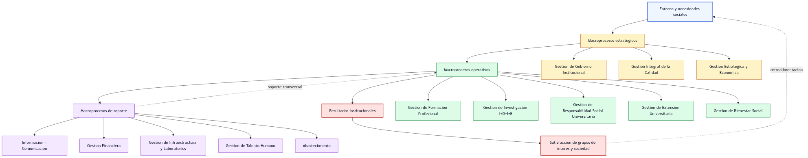
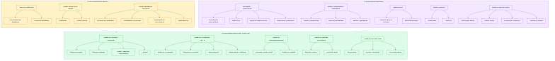

# Mapa de Procesos de la Universidad Nacional del Centro del Perú (UNCP)

> Conversión a formato Markdown entendible de las Resoluciones **N.° 3524-R-2025** y **N.° 3526-R-2025**.

---

## 1. Documentos base

| Documento | Contenido principal | Alcance |
|---|---|---|
| Resolución N.° 3524-R-2025 | Aprueba el **Mapa de Procesos Nivel 0** de la UNCP. | Presenta la estructura general de macroprocesos estratégicos, operativos y de soporte. |
| Resolución N.° 3526-R-2025 | Aprueba el **Mapa de Procesos Nivel 1** de la UNCP. | Desarrolla y detalla los procesos internos asociados a los macroprocesos institucionales. |

---

## 2. Base normativa mencionada

Las resoluciones se sustentan principalmente en las siguientes normas:

- **Ley N.° 30220 - Ley Universitaria**  
  Reconoce la autonomía universitaria en los regímenes normativo, de gobierno, académico, administrativo y económico.

- **Ley N.° 29158 - Ley Orgánica del Poder Ejecutivo**  
  Incluye la modernización de la gestión pública como parte de los sistemas administrativos de aplicación nacional.

- **Ley Marco de Modernización de la Gestión del Estado**  
  Busca mejorar la calidad de la prestación de bienes y servicios públicos.

- **Decreto Supremo N.° 123-2018-PCM**  
  Aprueba el Reglamento del Sistema Administrativo de Modernización de la Gestión Pública.

- **Resolución N.° 002-2025-PCM-SGP**  
  Aprueba la Norma Técnica N.° 002-2025-PCM-SGP para la implementación de la gestión por procesos en entidades públicas.

---

## 3. Finalidad de la gestión por procesos

La gestión por procesos permite a la universidad organizar, dirigir y controlar sus actividades de manera transversal. Su finalidad es:

- Identificar los procesos misionales y de soporte de la universidad.
- Mejorar la eficiencia institucional.
- Alinear los servicios universitarios con las necesidades de la sociedad.
- Contribuir al cumplimiento de la visión, misión, objetivos y metas institucionales.
- Medir, analizar y mejorar continuamente el desempeño de los procesos.

---

## 4. Entorno institucional

El mapa de procesos considera factores externos e internos que influyen en el funcionamiento universitario.

### 4.1 Factores del entorno

- Cambios en las políticas de gobierno, educativas y económicas.
- Competitividad en la Educación Superior Universitaria (ESU).
- Demanda de Educación Superior Universitaria.
- Preferencia empresarial.
- Innovación en Educación Superior Universitaria.
- Cambios climáticos y fenómenos naturales.
- Organizaciones nacionales e internacionales.
- Comunidad con expectativas de responsabilidad social.
- Factores socioculturales.

### 4.2 Demandas y necesidades identificadas

- Población con necesidad de formación profesional.
- Demanda de profesionales.
- Dominio del mercado industrial.
- Naturaleza cambiante de la investigación.
- Empuje de las nuevas tecnologías.
- Política de la diversidad.
- Problemas colectivos y necesidades de ciencia y tecnología.
- Conocimientos científicos y tecnológicos.
- Comunidad científica.
- Necesidades sociales, tecnológicas y culturales.

---

## 5. Necesidades que atiende la universidad

La UNCP orienta sus procesos hacia tres grandes necesidades:

1. **Formación profesional.**
2. **Ciencia y tecnología.**
3. **Necesidades sociales y culturales.**

---

# 6. Mapa de Procesos Nivel 0

El **Mapa de Procesos Nivel 0** presenta la estructura general del sistema de gestión institucional de la UNCP.

## 6.1 Macroprocesos estratégicos

Los macroprocesos estratégicos orientan la dirección institucional y la toma de decisiones.

| Macroproceso estratégico | Propósito general |
|---|---|
| Gestión de Gobierno Institucional | Dirigir la universidad y asegurar la gobernanza institucional. |
| Gestión Integral de la Calidad | Promover la calidad, evaluación y mejora continua. |
| Gestión Estratégica y Económica | Planificar, conducir y administrar estratégicamente los recursos institucionales. |

## 6.2 Macroprocesos operativos

Los macroprocesos operativos representan las funciones misionales de la universidad.

| Macroproceso operativo | Propósito general |
|---|---|
| Gestión de Formación Profesional | Desarrollar la formación académica de pregrado y posgrado. |
| Gestión de Investigación (I+D+I+E) | Generar investigación, innovación y emprendimiento. |
| Gestión de Responsabilidad Social Universitaria | Vincular a la universidad con la sociedad y gestionar impactos. |
| Gestión de Extensión Universitaria | Desarrollar actividades de extensión cultural y proyección social. |
| Gestión de Bienestar Social | Brindar servicios de apoyo al estudiante y a la comunidad universitaria. |

## 6.3 Macroprocesos de soporte

Los macroprocesos de soporte brindan recursos, servicios y apoyo administrativo para el funcionamiento institucional.

| Macroproceso de soporte | Propósito general |
|---|---|
| Información - Comunicación | Gestionar la comunicación, documentación y tecnologías de información. |
| Gestión Financiera | Administrar los recursos financieros de la universidad. |
| Gestión de Infraestructura y Laboratorios | Gestionar infraestructura, equipamiento, mantenimiento, talleres y laboratorios. |
| Gestión de Talento Humano | Administrar el empleo, desarrollo, rendimiento y relaciones humanas. |
| Abastecimiento | Gestionar bienes, servicios y patrimonio institucional. |

---

## 6.4 Representación general del mapa de procesos

La imagen fue generada desde Mermaid con Chromium y se conserva como activo controlado en `UNCP/sgsi/imagenes/mapa-procesos-nivel-0.png`. El archivo fuente editable se mantiene en `UNCP/sgsi/imagenes/mapa-procesos-nivel-0.mmd`.

---

# 7. Mapa de Procesos Nivel 1

El **Mapa de Procesos Nivel 1** desarrolla con mayor detalle los procesos principales identificados en el nivel 0.

---

## 7.1 Macroproceso estratégico

### 7.1.1 Gestión de Gobierno Institucional

| Proceso | Descripción breve |
|---|---|
| Direccionamiento Estratégico | Define la orientación institucional, objetivos y lineamientos estratégicos. |
| Conducción Estratégica | Dirige la ejecución de las decisiones institucionales. |

### 7.1.2 Gestión Integral de la Calidad

| Proceso | Descripción breve |
|---|---|
| Acreditación | Gestiona procesos de evaluación y reconocimiento de calidad. |
| Mejora Continua | Impulsa acciones de revisión, corrección y optimización institucional. |

### 7.1.3 Gestión Estratégica y Económica

| Proceso | Descripción breve |
|---|---|
| Posicionamiento Institucional | Fortalece la imagen y presencia institucional. |
| Elaboración y actualización de documentos de gestión institucional | Formula y actualiza instrumentos normativos y de gestión. |
| Gestión de Planeamiento Institucional | Organiza la planificación institucional. |
| Programación Presupuestal | Ordena los recursos económicos para el cumplimiento de objetivos. |
| Programación de Preinversiones | Planifica inversiones previas para proyectos institucionales. |

---

## 7.2 Macroproceso operativo: Gestión de Formación Profesional

La formación profesional comprende los procesos académicos necesarios para la educación universitaria de pregrado y posgrado.

| Proceso | Descripción breve |
|---|---|
| Formación Profesional | Proceso central de enseñanza y aprendizaje universitario. |
| Desarrollo de Formación Profesional Pregrado | Gestiona la formación académica de estudiantes de pregrado. |
| Desarrollo de Formación Profesional Posgrado | Gestiona la formación académica de estudiantes de posgrado. |
| Gestión Académica Administrativa | Administra procesos académicos y trámites vinculados a la formación. |
| Seguimiento al Estudiante y Egresado | Realiza acompañamiento académico y seguimiento de egresados. |
| Gestión Docente | Organiza y gestiona la labor docente. |
| Admisión | Gestiona el ingreso de nuevos estudiantes. |
| Gestión de Bienestar Social | Apoya la permanencia y desarrollo integral del estudiante. |

---

## 7.3 Macroproceso operativo: Gestión de Investigación (I+D+I+E)

La investigación se orienta a generar conocimiento, innovación, emprendimiento y transformación académica.

| Proceso | Descripción breve |
|---|---|
| Investigación | Proceso central de generación de conocimiento. |
| Gestión de Investigación | Organiza y administra la actividad investigativa. |
| Desarrollo de la Innovación | Promueve nuevas soluciones, productos o mejoras. |
| Emprendimiento | Impulsa iniciativas productivas y académicas basadas en conocimiento. |
| Transformación Académica | Integra los resultados de investigación en la mejora académica. |

---

## 7.4 Macroproceso operativo: Gestión de Responsabilidad Social Universitaria

La responsabilidad social universitaria vincula a la universidad con los grupos de interés y gestiona los impactos institucionales.

| Proceso | Descripción breve |
|---|---|
| Vinculación con los Grupos de Interés | Relaciona a la universidad con la sociedad, instituciones y comunidades. |
| Gestión de Impactos | Evalúa y gestiona los efectos sociales, culturales, ambientales y académicos de la universidad. |

---

## 7.5 Macroproceso operativo: Gestión de Extensión Universitaria

La extensión universitaria promueve la relación de la universidad con la sociedad a través de actividades culturales y sociales.

| Proceso | Descripción breve |
|---|---|
| Extensión Universitaria | Proceso central de articulación universidad-sociedad. |
| Extensión Cultural | Desarrolla actividades culturales, artísticas y académicas abiertas a la comunidad. |
| Proyección Social | Ejecuta acciones de aporte social hacia la población. |
| Gestión de Extensión Universitaria | Administra y organiza las acciones de extensión. |

---

## 7.6 Macroproceso operativo: Gestión de Bienestar Social

El bienestar social universitario se enfoca en brindar servicios de apoyo a la comunidad universitaria.

| Servicio / proceso | Descripción breve |
|---|---|
| Bienestar Social Universitario | Proceso central de apoyo y acompañamiento universitario. |
| Servicio de Salud | Atención y apoyo en salud. |
| Servicio de Alimentación | Apoyo alimentario para la comunidad universitaria. |
| Servicio Social | Evaluación y apoyo social. |
| Servicio Psicopedagógico | Orientación psicológica y pedagógica. |
| Servicio de Recreación y Deporte | Promoción de actividades físicas, recreativas y deportivas. |
| Servicio de Biblioteca | Acceso a recursos bibliográficos y apoyo académico. |

---

## 7.7 Macroproceso de soporte

El macroproceso de soporte agrupa procesos administrativos y técnicos que permiten el funcionamiento de los procesos estratégicos y operativos.

### 7.7.1 Información - Comunicación

| Proceso | Descripción breve |
|---|---|
| Administración Documentaria | Gestiona documentos institucionales. |
| Gestión de TICs | Administra tecnologías de información y comunicación. |
| Gestión de Secretaría General | Gestiona funciones documentarias y administrativas de secretaría. |
| Gestión de Comunicación Institucional | Administra la comunicación interna y externa. |

### 7.7.2 Gestión de Infraestructura y Laboratorios

| Proceso | Descripción breve |
|---|---|
| Gestión Integral de Infraestructura y Equipamiento | Administra infraestructura y equipamiento institucional. |
| Mantenimiento de Infraestructura y Equipamiento | Conserva y mantiene los espacios y equipos. |
| Gestión de Talleres y Laboratorios | Administra ambientes especializados para enseñanza, investigación y práctica. |

### 7.7.3 Abastecimiento

| Proceso | Descripción breve |
|---|---|
| Gestión de Abastecimiento | Gestiona la adquisición de bienes y servicios. |
| Administración de Bienes Patrimoniales | Controla y administra el patrimonio institucional. |

### 7.7.4 Gestión Financiera

| Proceso | Descripción breve |
|---|---|
| Contabilidad - Análisis Financiero | Registra, analiza y controla la información financiera. |
| Tesorería | Administra ingresos, egresos y disponibilidad financiera. |

### 7.7.5 Gestión de Talento Humano

| Proceso | Descripción breve |
|---|---|
| Planificación de Desarrollo de Talento Humano | Planifica necesidades y desarrollo del personal. |
| Gestión de Empleo | Administra incorporación, permanencia y movimientos del personal. |
| Gestión de Rendimiento y Desarrollo | Evalúa desempeño y promueve desarrollo de capacidades. |
| Gestión de Relaciones Humanas y Sociales | Gestiona el clima laboral y relaciones institucionales. |

---

# 8. Resultados esperados

Los procesos institucionales buscan generar los siguientes resultados:

- Profesionales competentes e íntegros.
- Profesionales investigadores.
- Innovación.
- Apoyo social, cultural y tecnológico.
- Resultados de investigación.
- Resultados sociales y culturales atendidos.
- Satisfacción del grupo de interés, principalmente la sociedad.

---

# 9. Resumen ejecutivo

La UNCP estructura su gestión institucional bajo un enfoque de procesos. El **Nivel 0** muestra la arquitectura general de la universidad mediante tres tipos de macroprocesos: estratégicos, operativos y de soporte. El **Nivel 1** desarrolla los procesos específicos que componen cada macroproceso, permitiendo identificar responsabilidades, actividades principales y resultados esperados.

En conjunto, los mapas de procesos buscan ordenar la gestión universitaria, mejorar la calidad de los servicios, fortalecer la formación profesional, impulsar la investigación, atender las demandas sociales y contribuir a la satisfacción de la sociedad.
