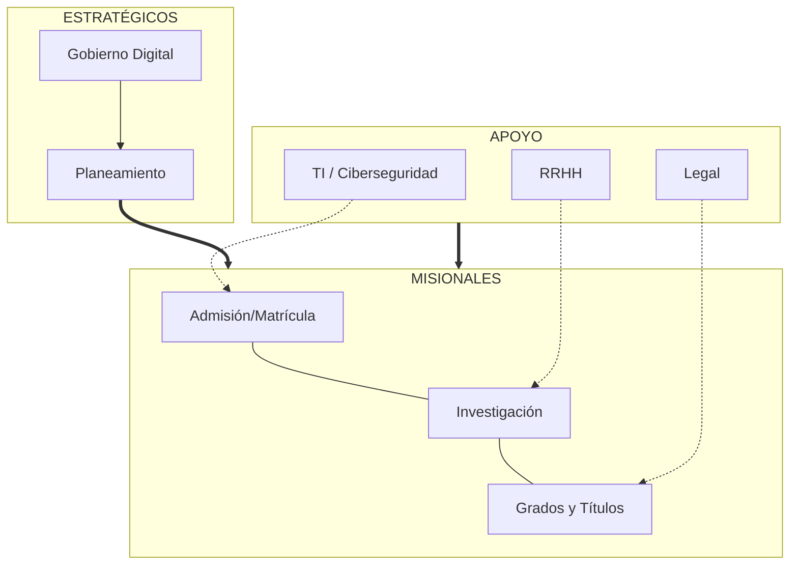

# D-SGSI-07: Mapa de Procesos del SGSI

**Organización:** Universidad Nacional del Centro del Perú (UNCP)
**Versión:** 1.0
**Alineamiento:** ISO/IEC 27001:2022 (Cláusula 4.4)

***

## 1. Clasificación de Procesos para la Seguridad
El SGSI protege la información que fluye a través de los siguientes niveles de procesos:

### A. Procesos Estratégicos (Gestión y Gobierno)
*Son los procesos que definen la dirección de la seguridad y supervisan el cumplimiento.*
1.  **Gobierno Digital:** Liderazgo del Comité de Gobierno Digital (CGD).
2.  **Planeamiento Estratégico:** Alineamiento del SGSI con el PEI y PGTD.
3.  **Gestión de Calidad y Mejora Continua:** Auditorías internas y revisión por la dirección.
4.  **Gestión de Riesgos Institucionales:** Aplicación de ISO 31000.

### B. Procesos Misionales (El "Core" Universitario)
*Son los procesos que generan valor a la sociedad. Su interrupción es crítica.*
1.  **Gestión Académica:** Admisión, matrícula, formación profesional, grados y títulos (Activo crítico: ERP ADESA).
2.  **Investigación y Posgrado:** Desarrollo de tesis, patentes y publicaciones (Activo crítico: DSpace).
3.  **Responsabilidad Social:** Proyección social y extensión universitaria.
4.  **Servicios Estudiantiles:** Comedor, Centro Médico y Bienestar (Activo crítico: Historias Clínicas).

### C. Procesos de Apoyo (Soporte Técnico y Administrativo)
*Son los procesos necesarios para que los misionales funcionen de forma segura.*
1.  **Tecnologías de la Información (OTI):** Gestión de infraestructura, redes, cloud y seguridad (CSIRT).
2.  **Gestión de Recursos Humanos:** Contratación, capacitación y desvinculación segura.
3.  **Gestión Financiera y Abastecimiento:** Contabilidad, tesorería y relación con proveedores (Activo crítico: SIGA/SIAF).
4.  **Gestión Documentaria:** Mesa de partes, archivo central y expedientes digitales.
5.  **Asesoría Jurídica:** Cumplimiento legal (Protección de Datos / Ciberdefensa).

***

## 2. Diagrama de Interacción de Seguridad

*Nota: La seguridad de la información (TI/CSIRT) actúa como un habilitador transversal para todos los procesos misionales.*
