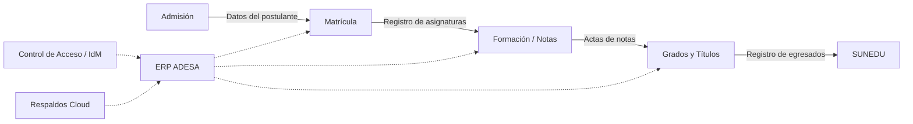
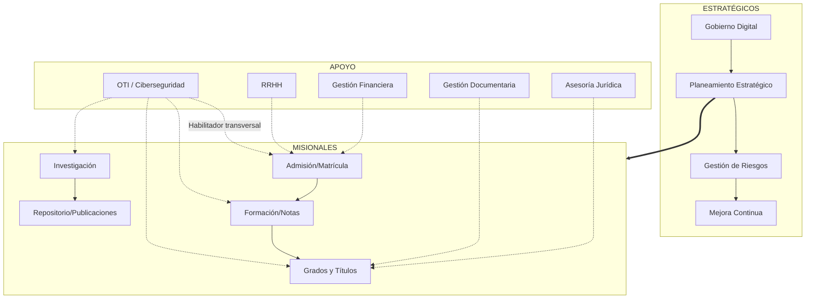

# D-SGSI-07: Mapa de Procesos del SGSI

**Organización:** Universidad Nacional del Centro del Perú (UNCP)
**Versión:** 2.0
**Alineamiento:** ISO/IEC 27001:2022 (Cláusula 4.4 — Sistema de Gestión y sus Procesos)
**Documentos Relacionados:** D-SGSI-01 (Contexto Estratégico), D-SGSI-02 (Alcance del SGSI), P-SGSI-02 (Gestión de Incidentes)

***

## 1. Clasificación de Procesos para la Seguridad
El SGSI protege la información que fluye a través de los siguientes niveles de procesos. Cada nivel tiene distintos requerimientos de seguridad según su criticidad y exposición.

### A. Procesos Estratégicos (Gestión y Gobierno)
*Son los procesos que definen la dirección de la seguridad y supervisan el cumplimiento. Su afectación compromete la gobernabilidad de la UNCP.*

| Proceso | Descripción | Activo de Información Clave | Riesgo de Indisponibilidad |
|---|---|---|---|
| Gobierno Digital | Liderazgo del Comité de Gobierno Digital (CGD); aprobación de políticas; supervisión del PGTD | Actas del CGD, resoluciones rectorales | Alto — retraso en la toma de decisiones |
| Planeamiento Estratégico | Alineamiento del SGSI con el PEI, PGTD y presupuesto institucional | PEI, PGTD, reports de avance | Alto — desalineación estratégica |
| Gestión de Calidad y Mejora Continua | Auditorías internas, revisión por la dirección, acciones correctivas | Informes de auditoría, actas de revisión, RACs | Medio — pérdida de trazabilidad |
| Gestión de Riesgos Institucionales | Aplicación de ISO 31000; identificación y tratamiento de riesgos institucionales | Matriz de riesgos, SoA | Alto — riesgos no mitigados |

### B. Procesos Misionales (El "Core" Universitario)
*Son los procesos que generan valor directo a la sociedad. Su interrupción afecta la formación de estudiantes, la investigación y la responsabilidad social.*

| Proceso | Descripción | Activo de Información Clave | Sistema Asociado | Flujo de Datos Crítico |
|---|---|---|---|---|
| Gestión Académica | Admisión, matrícula, formación profesional, emisión de grados y títulos | Notas, actas, expedientes de estudiantes, grados emitidos | ERP ADESA | Datos personales de estudiantes -> admisión -> notas -> grados -> SUNEDU |
| Investigación y Posgrado | Desarrollo de tesis, patentes, publicaciones y proyectos de investigación | Tesis, papers, datos de investigación, patentes | Repositorio DSpace | Investigadores -> recolección de datos -> análisis -> publicación -> repositorio |
| Responsabilidad Social | Proyección social, extensión universitaria y voluntariado | Convenios, informes de proyección social, registros de beneficiarios | Portal web / sistemas de extensión | Comunidad -> proyectos -> informes -> rendición de cuentas |
| Servicios Estudiantiles | Comedor universitario, Centro Médico, bienestar universitario, actividades culturales y deportivas | Historias clínicas, registros de becas, fichas socioeconómicas | Sistema de bienestar universitario | Estudiante -> solicitud -> evaluación -> beneficio -> seguimiento |

#### B.1. Flujo de Datos del Proceso Misional Crítico: Gestión Académica

### C. Procesos de Apoyo (Soporte Técnico y Administrativo)
*Son los procesos necesarios para que los misionales funcionen de forma segura y eficiente.*

| Proceso | Descripción | Activo de Información Clave | Sistema Asociado |
|---|---|---|---|
| Tecnologías de la Información (OTI) | Gestión de infraestructura, redes, cloud, seguridad, CSIRT y soporte técnico | Configuraciones de red, credenciales de administración, logs de seguridad, inventario de activos | SIEM, monitoreo, MDM, sistema de tickets |
| Gestión de Recursos Humanos | Contratación, capacitación, evaluación de desempeño y desvinculación de personal | Expedientes de personal, planillas, contratos, evaluaciones | SIGA / SIAF - Módulo RRHH |
| Gestión Financiera y Abastecimiento | Contabilidad, tesorería, presupuesto, adquisiciones y relación con proveedores | Registros contables, órdenes de compra, facturas, contratos | SIGA / SIAF |
| Gestión Documentaria | Mesa de partes, archivo central, gestión de expedientes digitales y notificaciones | Documentos recibidos y emitidos, resoluciones, memorandos | Sistema de trámite documentario (GESDOC) |
| Asesoría Jurídica | Cumplimiento legal, protección de datos personales, contratos, defensa institucional | Contratos, resoluciones, directivas, informes legales | Gestor documental |
| Comunicaciones e Imagen | Gestión de la comunicación institucional, portal web, redes sociales y atención al ciudadano | Contenido web, comunicados oficiales, redes sociales | Portal web, gestor de contenidos |

---

## 2. Matriz de Dependencias entre Procesos

| Proceso | Depende de (Entrada) | Provee a (Salida) | Sistema Transversal |
|---|---|---|---|
| Admisión | RRHH (convocatoria), Abastecimiento (bienes/servicios) | Matrícula, SUNEDU | ERP ADESA, Portal web |
| Matrícula | Admisión, Servicios Estudiantiles (becas) | Formación, Tesorería | ERP ADESA |
| Formación / Notas | Matrícula, RRHH (docentes) | Grados y Títulos | ERP ADESA, Campus Virtual |
| Grados y Títulos | Formación, Asesoría Jurídica (legalidad) | SUNEDU, Archivo Central | ERP ADESA, Repositorio DSpace |
| Investigación | RRHH (investigadores), Abastecimiento (equipos) | Repositorio, Publicaciones | DSpace, Laboratorios |
| Tesorería | Matrícula (pagos), Abastecimiento (proveedores) | Contabilidad, SUNAT | SIGA / SIAF |

**Impacto en seguridad:** La interrupción de un proceso de apoyo (ej. OTI) afecta a todos los procesos misionales. Por ello, los controles de seguridad deben aplicarse de forma transversal, con énfasis en la disponibilidad de los sistemas compartidos.

---

## 3. Controles de Seguridad por Nivel de Proceso

| Nivel | Controles Prioritarios (ISO 27001) | Enfoque |
|---|---|---|
| **Estratégico** | A.5.1 (Políticas), A.5.2 (Roles), A.5.8 (Gestión de proyectos), A.5.24 (Gestión de incidentes) | Gobernanza, cumplimiento y supervisión |
| **Misional** | A.8.13 (Respaldos), A.8.2 (Privilegios), A.8.20 (Seguridad de redes), A.5.30 (Continuidad) | Disponibilidad e integridad de los datos críticos |
| **Apoyo** | A.8.8 (Gestión de vulnerabilidades), A.8.16 (Monitoreo), A.5.19 (Proveedores), A.7.1 (Seguridad física) | Operatividad y protección de la infraestructura |

---

## 4. Responsables de Procesos (Dueños de Activos)

| Proceso | Dueño del Proceso | Rol en el SGSI |
|---|---|---|
| Gestión Académica | Vicerrector Académico | Clasificar y proteger la información académica; autorizar accesos |
| Investigación | Vicerrector de Investigación | Proteger la propiedad intelectual y datos de investigación |
| Tecnologías de la Información | Jefe de la OTI | Implementar y operar los controles técnicos del SGSI |
| Gestión Financiera | Director de Administración | Asegurar la confidencialidad e integridad de la información financiera |
| Recursos Humanos | Jefe de RRHH | Gestionar la confidencialidad de los datos personales del personal |

---

## 5. Diagrama de Interacción de Seguridad

---

## 6. Documentos Relacionados

| Código | Nombre |
|---|---|
| D-SGSI-01 | Análisis del Contexto Estratégico |
| D-SGSI-02 | Alcance del SGSI |
| D-SGSI-06 | Marco Conceptual del SGSI |
| R-SGSI-01 | Inventario de Activos de Información |
| R-SGSI-02 | Matriz de Evaluación y Tratamiento de Riesgos |

***

**Versión 2.0 — Actualizado con flujos de datos, tabla de dependencias y controles por nivel de proceso.**
