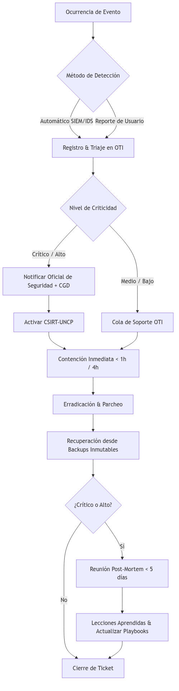

# Marco de Respuesta ante Incidentes de Seguridad (CSIRT-UNCP)

**Organización:** Universidad Nacional del Centro del Perú (UNCP)
**Norma:** ISO/IEC 27001:2022 (Controles A.5.24 -- A.5.28)
**Alineamiento:** PGTD-06 (Sistema de Gestión de Incidentes), D.S. N.° 029-2021-PCM (Marco de Confianza Digital)

***

## Propósito

Este procedimiento establece el ciclo de vida para la detección, reporte, respuesta, recuperación y aprendizaje ante incidentes de seguridad de la información en la UNCP. Adopta un enfoque de monitoreo continuo con detección automatizada y respuesta basada en playbooks, minimizando el impacto en los servicios académicos y administrativos.

## Alcance

Aplica a todos los incidentes de seguridad que afecten o puedan afectar la confidencialidad, integridad o disponibilidad de los activos de información de la UNCP, incluyendo:

- Sistemas core (ERP ADESA, Campus Virtual Moodle, SIGA/SIAF, Microsoft 365)
- Infraestructura tecnológica (servidores, red, cloud, equipos de usuario)
- Datos personales bajo la Ley N.° 29733
- Servicios digitales ofrecidos a la comunidad universitaria

## Clasificación de Incidentes

| Nivel | Definición | Ejemplos UNCP | Tiempo de Respuesta |
|:------|:-----------|:--------------|:-------------------:|
| **Crítico** | Impacto severo en la misión institucional. Pérdida de datos críticos o indisponibilidad prolongada de servicios core | Alteración masiva de notas en ERP ADESA, caída total de red durante periodo de matrícula, fuga de datos personales de estudiantes (>1,000 registros), ransomware con cifrado de backups | < 1 hora |
| **Alto** | Impacto significativo en procesos misionales. Indisponibilidad de servicios importantes | Infección por ransomware en una facultad, DDoS que afecta el portal web, acceso no autorizado a datos sensibles, phishing masivo exitoso | < 4 horas |
| **Medio** | Impacto moderado en procesos internos. Sin afectación directa a estudiantes | Phishing dirigido a personal administrativo, escaneo de vulnerabilidades desde IP sospechosa, infección aislada de malware en equipo de usuario | < 24 horas |
| **Bajo** | Impacto menor o potencial. Sin consecuencias inmediatas | Intento de escaneo de puertos bloqueado por firewall, spam desde cuenta institucional comprometida (menor), alerta falsa de SIEM | < 72 horas |

## Ciclo de Vida del Incidente

### Preparación (Planificar)

- **Telemetría de Red:** Captura de tráfico mediante TAP físicos y NetFlow (Anexo H.2 del PGTD) para establecer la línea de base del tráfico de la red universitaria.
- **SIEM Centralizado:** Centralización de logs de Huawei Cloud, ERP ADESA, Moodle, firewall y sistemas core en el SIEM (Wazuh / Microsoft Sentinel) para detección de anomalías en tiempo real.
- **CSIRT UNCP:** Equipo de respuesta conformado por:
  - Oficial de Seguridad y Confianza Digital (coordinador)
  - Administradores de sistemas OTI (soporte técnico)
  - Asesoría Jurídica (aspectos legales y notificación a autoridades)
  - Comunicaciones (gestión de crisis y comunicación institucional)
- **Canales de Reporte:**
  - Automático: Alertas generadas por el SIEM
  - Manual: Correo `incidentes-seguridad@uncp.edu.pe`
  - Manual: Portal de auto-servicio para la comunidad universitaria
  - Telefónico: Línea directa OTI (solo para incidentes críticos)

### Detección y Reporte (Hacer)

| Fuente de Detección | Método | Herramientas |
|:--------------------|:-------|:-------------|
| Automática | Correlación de logs, umbrales de anomalía, firmas IDS/IPS | Wazuh/Sentinel, Fortinet IDS, NetFlow |
| Reporte de usuario | Correo, portal web, llamada telefónica | Mesa de ayuda OTI |
| Monitoreo proactivo | Análisis de vulnerabilidades, threat hunting | Escáner de vulnerabilidades, feeds de inteligencia de amenazas |
| Terceros | Notificación de proveedores (Huawei, Microsoft), entes de control | Canales oficiales |

Al recibir una alerta, el CSIRT realiza las siguientes acciones:

1. **Registro:** Asignar un ID único al incidente en el sistema de gestión de incidentes (F-SGSI-03).
2. **Triaje:** Clasificar el incidente según la tabla de clasificación (Crítico, Alto, Medio, Bajo).
3. **Notificación Inicial:** Informar al Oficial de Seguridad y, si es crítico, al Comité de Gobierno Digital.

### Contención, Erradicación y Recuperación (Hacer)

| Fase | Acciones | Responsable |
|:-----|:---------|:------------|
| **Contención Inmediata** | Aislar sistemas afectados (desconectar de red, bloquear IP en firewall, deshabilitar cuentas comprometidas). Para ataques DDoS o inyección SQL, el WAF debe aplicar reglas de bloqueo automáticas. | OTI (Seguridad) |
| **Contención a Mediano Plazo** | Aplicar parches temporales, crear reglas de firewall adicionales, habilitar MFA forzoso, realizar copia forense de evidencias. | OTI (Seguridad + Sistemas) |
| **Erradicación** | Eliminar la causa raíz: limpiar malware, cerrar vulnerabilidades, reinstalar sistemas comprometidos, rotar credenciales afectadas. | OTI (Sistemas) |
| **Recuperación** | Restaurar servicios desde backups limpios, verificar integridad de datos, monitorear sistemas restaurados por 48 horas. | OTI (Sistemas) |

### Análisis Forense

Para incidentes de nivel Alto o Crítico, se realizará un análisis forense con los siguientes lineamientos:

- Preservación de evidencias: clonar discos (imagen forense bit a bit), capturar volcado de memoria RAM, conservar logs originales.
- Cadena de custodia: documentar quién, cuándo y cómo se recopiló cada evidencia (F-SGSI-04).
- Análisis: determinar causa raíz, alcance del compromiso, datos afectados y vectores de ataque.
- Informe: documento formal con hallazgos, conclusiones y recomendaciones (R-SGSI-04).

### Monitoreo y Verificación (Verificar)

- **Dashboards de Seguridad:** Visualización en tiempo real del estado de incidentes activos, cerrados y en investigación.
- **KPIs de Gestión de Incidentes:**

| Indicador | Descripción | Meta |
|:----------|:------------|:----:|
| MTTD (Tiempo Medio de Detección) | Tiempo entre la ocurrencia del incidente y su detección | < 2 horas (críticos) |
| MTTR (Tiempo Medio de Respuesta) | Tiempo entre la detección y la resolución | < 24 horas (críticos) |
| Incidentes Recurrentes | % de incidentes del mismo tipo que ocurren dentro de 6 meses | < 5% |
| Cobertura de Playbooks | % de incidentes con playbook documentado aplicado | > 90% |

### Lecciones Aprendidas y Mejora (Actuar)

1. **Post-Mortem:** Reunión obligatoria dentro de los 5 días hábiles posteriores a la resolución de incidentes Críticos y Altos.
2. **Informe de Lecciones Aprendidas:** Documentar qué funcionó, qué falló, y qué mejorar (R-SGSI-04).
3. **Actualización de Playbooks:** Si el incidente reveló una vulnerabilidad nueva o una brecha en el proceso, actualizar los playbooks y reglas de seguridad (firewall, WAF, SIEM) dentro de los 5 días hábiles.
4. **Mejora Continua:** Incorporar los hallazgos en el plan de tratamiento de riesgos (R-SGSI-02) y en el programa de capacitación (P-SGSI-08).

## Playbooks de Respuesta Rápida

| Tipo de Incidente | Playbook Asociado |
|:------------------|:------------------|
| Ransomware | Aislar sistema → identificar cepa → restaurar desde backup → notificar a PCM si aplica |
| Phishing masivo | Bloquear remitente → resetear contraseñas de afectados → publicar alerta → actualizar reglas anti-spam |
| Fuga de datos personales | Contener acceso → evaluar alcance (Ley N.° 29733) → notificar a Autoridad de Protección de Datos (72 hrs) → informar a afectados |
| DDoS | Activar mitigación en WAF/cloud → contactar proveedor de internet → implementar reglas de rate-limiting |
| Acceso no autorizado | Deshabilitar cuenta → revisar logs de acceso → determinar alcance → rotar credenciales |
| Defacement web | Desconectar portal → restaurar desde backup limpio → parchear vulnerabilidad → implementar monitoreo de integridad |

## Notificación a Autoridades

Conforme al D.S. N.° 029-2021-PCM y la Ley N.° 29733, el Oficial de Seguridad debe notificar:

| Supuesto | Autoridad | Plazo |
|:---------|:----------|:------|
| Incidente que afecta datos personales | Autoridad Nacional de Protección de Datos Personales (ANPDP) | 72 horas |
| Incidente de ciberseguridad que afecta infraestructura crítica | Centro Nacional de Seguridad Digital (CNSD) — PCM | 24 horas |
| Delito informático (acceso ilícito, sabotaje, etc.) | Policía Nacional (División de Investigación de Delitos de Alta Tecnología) | Inmediato |

## Responsabilidades

| Rol | Responsabilidad |
|:----|:----------------|
| **Oficial de Seguridad y Confianza Digital** | Liderar el CSIRT, coordinar con CNSD-PCM, aprobar informes post-mortem, reportar al CGD |
| **OTI — Administradores de Sistemas** | Ejecutar la contención técnica, erradicación y recuperación de servicios |
| **OTI — Administradores de Red** | Aislar segmentos de red, actualizar reglas de firewall, gestionar VPN |
| **Asesoría Jurídica** | Evaluar implicaciones legales, gestionar notificaciones a autoridades |
| **Comunicaciones / Imagen Institucional** | Gestionar comunicación interna y externa, evitar pánico o desinformación |
| **Usuarios (Comunidad Universitaria)** | Reportar actividades sospechosas de forma temprana, seguir instrucciones del CSIRT |

## Documentos Relacionados

| Código | Nombre |
|:-------|:-------|
| F-SGSI-03 | Registro de Incidente de Seguridad |
| F-SGSI-04 | Cadena de Custodia Forense |
| R-SGSI-02 | Plan de Tratamiento de Riesgos |
| R-SGSI-04 | Informe de Lecciones Aprendidas |
| P-SGSI-08 | Plan de Capacitación y Concientización |
| D-SGSI-04 | Metodología de Evaluación de Riesgos |

***

*Este documento es una guía dinámica y se actualiza trimestralmente según la evolución de las amenazas detectadas y las lecciones aprendidas.*