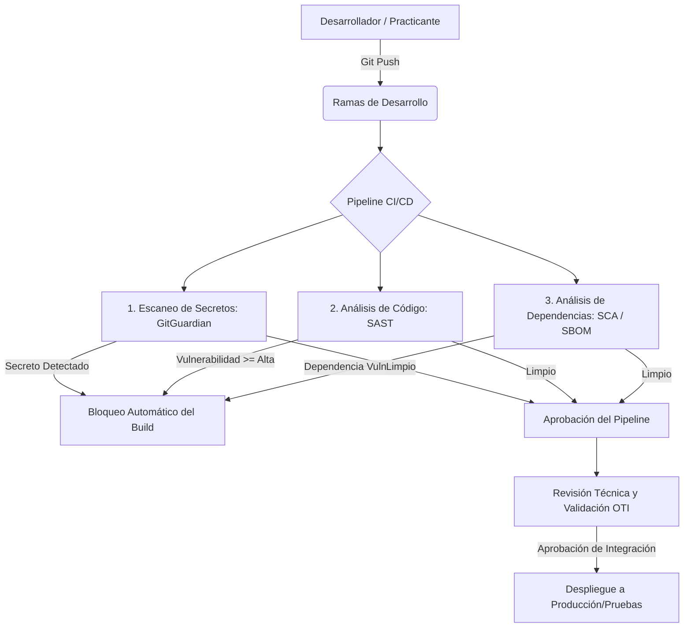

# Política de Seguridad en el Desarrollo de Software y APIs

**Organización:** Universidad Nacional del Centro del Perú (UNCP)  
**Norma:** ISO/IEC 27001:2022 (Controles A.8.25, A.8.26, A.8.27, A.8.28, A.8.29, A.8.30, A.8.31, A.8.32)  
**Alineamiento:** P-SGSI-04 (Gestión de Cambios), P-SGSI-03 (Gestión de Accesos), D-SGSI-05 (SoA)  

***

## 1. Objetivo

Establecer los principios, directrices y controles de seguridad para el ciclo de vida de desarrollo de software y APIs en la UNCP. Esta política promueve la adopción de prácticas de desarrollo ágil y seguro (DevSecOps), asegurando que el ERP ADESA y las aplicaciones institucionales sean robustas frente a amenazas externas, protejan la privacidad de los datos personales y mitiguen los vectores de ataque en entornos de nube e interoperabilidad.

## 2. Alcance

Esta política es de cumplimiento obligatorio para:
1. Todo el equipo de desarrollo de la OTI (11 profesionales permanentes, practicantes presenciales y remotos).
2. Todo desarrollo y evolución de sistemas internos, con especial prioridad en el ERP ADESA (23 módulos), Campus Virtual Moodle 4.1, Sistema GESDOC y bases de datos institucionales.
3. Todo desarrollo de APIs de integración expuestas para consumo de sedes periféricas o entidades externas (SUNEDU, RENIEC, PIDE).
4. Proveedores y consultores externos subcontratados para el desarrollo de software de la universidad.

---

## 3. Infraestructura y Control de Versiones

### 3.1 Plataforma de Control de Versiones e Integración de Código
* Todo código fuente desarrollado por o para la UNCP debe residir de forma obligatoria en una plataforma o servidor Git institucional (ej. GitHub, GitLab o servidor Git autohospedado bajo la infraestructura y dominio de la universidad), una vez implementada bajo el proyecto PGTD-01.
* Los repositorios de código institucional deben ser configurados de forma predeterminada como **Privados**. Queda estrictamente prohibido alojar código en repositorios públicos o cuentas personales de desarrolladores o practicantes.
* El acceso a los repositorios institucionales se autenticará mediante credenciales corporativas (integradas con el proveedor de identidad de la universidad) y requiriendo de forma obligatoria Autenticación Multifactor (MFA).

### 3.2 Control de Ramas y Flujo de Integración de Código
* Se implementará una política de restricción y protección para las ramas principales y estables de código.
* Queda prohibido realizar cambios directos sobre las ramas de producción o entornos estables sin validación previa.
* Todo cambio debe realizarse mediante ramas de desarrollo secundarias. Para integrar o fusionar el código a las ramas estables o desplegar en producción, se requiere:
  1. Un proceso formal de control de cambios e integración técnica.
  2. La validación, revisión y aprobación por personal de planta permanente de la OTI o la supervisión de seguridad antes de los pases a producción. Los practicantes no tienen permisos para autorizar fusiones ni despliegues en producción.
  3. La ejecución exitosa sin errores de los pipelines y pruebas de seguridad automatizadas definidos en el flujo de integración.

---

## 4. Pipeline de Integración y Despliegue Continuo (CI/CD)

La UNCP adopta la automatización de controles de seguridad en el flujo de desarrollo mediante pipelines de CI/CD (integrados en la plataforma de control de versiones). El pipeline se activará automáticamente ante cada proceso de integración, fusión de ramas o preparación de pases a producción y ejecutará obligatoriamente los siguientes escaneos:

### 4.1 Escaneo de Secretos
* Se integrará una herramienta de escaneo de secretos (ej. GitGuardian o similar) en el pipeline de CI/CD de la UNCP.
* La herramienta escaneará en tiempo real cada push en búsqueda de credenciales expuestas, llaves criptográficas, API keys (de Azure, AWS, Huawei Cloud), contraseñas de bases de datos o tokens de acceso.
* **Bloqueo Preventivo:** Si se detecta un secreto expuesto, el pipeline de CI/CD fallará y bloqueará automáticamente la fusión de la rama o el pase a producción. El desarrollador deberá invalidar el secreto expuesto y rotar la credencial de forma inmediata siguiendo el protocolo de incidentes.

### 4.2 Análisis Estático de Seguridad (SAST)
* Se integrarán herramientas de escaneo de código estático (ej. Semgrep, SonarQube o soluciones equivalentes de análisis estático) para detectar patrones vulnerables y malas prácticas (OWASP Top 10) en el código propio.
* Los umbrales de severidad que causan el fallo del pipeline son:
  * **Crítica o Alta (CVSS >= 7.0):** Causa fallo del build. No se permite la fusión ni el despliegue del código.
  * **Media o Baja (CVSS < 7.0):** Se registra en el backlog de deuda técnica para corregirse en un plazo máximo de 30 días.

### 4.3 Análisis de Composición de Software (SCA) y SBOM
* Habilitación de herramientas SCA (ej. Dependabot o herramientas equivalentes de análisis de dependencias) para auditar vulnerabilidades en librerías y dependencias externas de terceros utilizadas en los módulos del ERP ADESA y Moodle.
* El pipeline rechazará dependencias desactualizadas o con vulnerabilidades de severidad Alta/Crítica conocidas (CVE).
* Se generará y mantendrá actualizado automáticamente el **Software Bill of Materials (SBOM)** en cada compilación del release.

---

## 5. Buenas Prácticas de Codificación Segura

Todo desarrollador y practicante debe programar alineado a los estándares de **OWASP (Open Web Application Security Project)**, aplicando las siguientes directrices en el código:

1. **Validación de Entradas (Input Validation):** Validar y sanitizar en el backend todas las solicitudes recibidas.
2. **Consultas Parametrizadas (Prevención de SQLi):** Queda estrictamente prohibido concatenar cadenas para construir consultas SQL. Todas las consultas al ERP ADESA y bases de datos deben utilizar placeholders y consultas parametrizadas a través del ORM institucional o PDO.
3. **Codificación de Salidas (Prevención de XSS):** Sanitizar los datos que se renderizan en el navegador del estudiante o administrativo.
4. **Manejo de Secretos:** Los secretos nunca deben hardcodearse en el código fuente (ej. `config.php` o `.env` subidos al repo). Se deben leer como variables de entorno inyectadas de forma segura por el API Gateway o mediante el almacén de secretos corporativo o Vault en producción.
5. **Separación de Entornos (Control A.8.31):** Los entornos de Desarrollo, Pruebas (Staging) y Producción deben estar estrictamente separados lógica y físicamente. Queda prohibido usar bases de datos reales de estudiantes en entornos de desarrollo; se debe aplicar **enmascaramiento de datos** o generación de datos sintéticos.

---

## 6. Responsabilidades y Mitigación del Conflicto de Interés

Para garantizar la independencia de la función de seguridad y dar cumplimiento al control **A.5.2 (Roles y responsabilidades)** sin incurrir en conflictos de interés, se define la siguiente matriz organizativa:

| Rol | Responsabilidad Operativa en Desarrollo Seguro | Mitigación de Conflicto de Interés |
|:---|:---|:---|
| **Desarrollador / Practicante** | Escribir código seguro; corregir vulnerabilidades detectadas; documentar cambios. | No poseen privilegios para subir código a producción o aprobar de forma unilateral sus propios despliegues. |
| **Líder Técnico de la OTI** | Configurar y dar mantenimiento a los pipelines de CI/CD; revisar los logs de seguridad y análisis SAST. | Reporta técnicamente a la Jefa de la OTI pero reporta incidentes de código directamente al Oficial de Seguridad. |
| **Oficial de Seguridad Suplente / Auditor Adjunto** | Auditar de forma independiente que los procesos de control de cambios y despliegue seguro estén activos. | **Designación formal:** Un profesional sénior de la OTI (no involucrado en el desarrollo diario) es designado como Auditor de Seguridad de TI para auditar los despliegues de la OTI, reportando directamente al Comité de Gobierno Digital (CGD), mitigando el conflicto de interés de la Jefa de la OTI. |
| **Oficial de Seguridad Principal (Mg. Rocío Rosanna Damián)** | Supervisar y mantener la política general; elevar informes de cumplimiento del SoA al CGD. | Aprueba las excepciones de seguridad y gestiona los recursos presupuestales (PGTD-01). |

---

## 7. Documentos Relacionados

* [POL-SGSI-04](file:///home/blink/Documentos/practicas/SGSI/UNCP/sgsi/09_POLITICAS_Y_PROCEDIMIENTOS/POL-SGSI-04-Proveedores.md) - Política de Seguridad con Proveedores
* [P-SGSI-03](file:///home/blink/Documentos/practicas/SGSI/UNCP/sgsi/05_OPERACION/P-SGSI-03-Gestion-Accesos.md) - Gestión de Identidades y Control de Acceso
* [P-SGSI-04](file:///home/blink/Documentos/practicas/SGSI/UNCP/sgsi/05_OPERACION/P-SGSI-04-Gestion-Cambios.md) - Procedimiento de Gestión de Cambios en TI
* [D-SGSI-05](file:///home/blink/Documentos/practicas/SGSI/UNCP/sgsi/03_PLANIFICACION/D-SGSI-05-SoA.md) - Declaración de Aplicabilidad (SoA)

***
