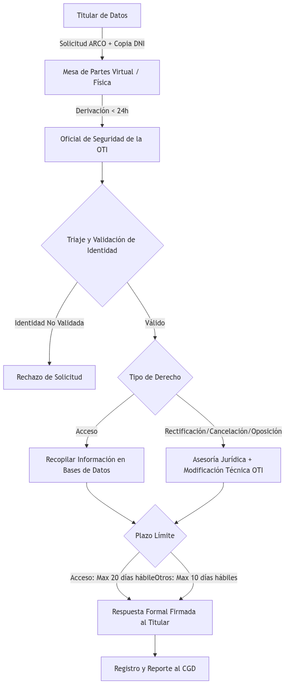

# Política de Privacidad y Protección de Datos Personales

**Organización:** Universidad Nacional del Centro del Perú (UNCP)  
**Norma:** ISO/IEC 27001:2022 (Control A.5.34), Ley N.° 29733 (Ley de Protección de Datos Personales de Perú) y su Reglamento (D.S. N.° 003-2013-JUS)  
**Alineamiento:** P-SGSI-03 (Gestión de Accesos), POL-SGSI-01 (Desarrollo Seguro), D-SGSI-05 (SoA)  

***

## 1. Objetivo

Establecer las directrices obligatorias para el tratamiento de datos personales en la UNCP, garantizando el respeto de los principios de legalidad, consentimiento, finalidad, proporcionalidad, calidad, seguridad y confidencialidad exigidos por la Ley N.° 29733. Esta política asegura la adecuada protección de los datos de postulantes, estudiantes, docentes, egresados, personal administrativo y pacientes del Centro Médico Universitario, y regula el ejercicio de sus derechos ARCO (Acceso, Rectificación, Cancelación y Oposición).

## 2. Alcance

Aplica a todo tratamiento de datos personales contenidos en bancos de datos bajo administración de la UNCP, ya sea en soporte lógico (sistemas informáticos, ERP ADESA, bases de datos en la nube de Huawei Cloud y M365) o físico (expedientes en archivos impresos). El cumplimiento de esta política es obligatorio para todo el personal de la UNCP, incluyendo autoridades, docentes, administrativos, contratistas y practicantes de la OTI.

---

## 3. Principios Rectores del Tratamiento

El personal y los sistemas de la UNCP deben cumplir estrictamente con los siguientes principios:

* **Principio de Consentimiento:** Todo tratamiento de datos personales requiere el consentimiento previo, informado, expreso e inequívoco del titular. Se exceptúan únicamente los casos permitidos por el Artículo 14 de la Ley N.° 29733 (como el cumplimiento de un mandato legal o contractual de educación superior).
* **Principio de Finalidad:** Los datos deben recopilarse únicamente para la prestación del servicio educativo, trámites administrativos, investigación autorizada o atención de salud, no pudiendo utilizarse para fines distintos (ej. comercialización) sin autorización explícita.
* **Principio de Proporcionalidad:** Solo se solicitarán los datos que sean estrictamente necesarios para cumplir con la finalidad del servicio.
* **Principio de Seguridad:** Se deben aplicar medidas de seguridad técnicas, organizativas y legales para evitar la pérdida, alteración o acceso no autorizado a los datos, conforme al Anexo de Seguridad de la Directiva de Seguridad de la ANPDP.

---

## 4. Clasificación y Registro de Bancos de Datos

La UNCP mantiene e inscribe obligatoriamente ante el Registro Nacional de Protección de Datos Personales (RNPDP) los siguientes bancos de datos principales:

| ID | Nombre del Banco de Datos | Tipo de Datos | Finalidad del Tratamiento | Custodio Operativo |
|:---|:--------------------------|:-------------:|:--------------------------|:-------------------|
| **BD-01** | Postulantes y Estudiantes | Datos Personales, Académicos, Biométricos | Gestión de admisión, matrícula, registro de notas e historial académico. | OTI / Oficina de Asuntos Académicos |
| **BD-02** | Personal y Docentes | Datos Personales, Financieros, Planillas | Gestión de recursos humanos, pago de haberes, escalafón docente. | OTI / Unidad de Recursos Humanos |
| **BD-03** | Egresados y Graduados | Datos Personales y de Contacto | Seguimiento de egresados, bolsa de trabajo y emisión de grados. | OTI / Unidad de Grados y Títulos |
| **BD-04** | Salud Universitaria | **Datos Sensibles (Historias Clínicas)** | Prestación de servicios médicos preventivos y de seguro estudiantil. | OTI / Centro Médico Universitario |
| **BD-05** | Visitantes y Seguridad | Nombres, DNI, Imágenes de Videovigilancia | Seguridad física del campus y control de ingreso. | OTI / Unidad de Seguridad Patrimonial |

---

## 5. Medidas de Seguridad Obligatorias

### 5.1 Cifrado y Anonimización
* Las bases de datos que contienen datos personales (especialmente `BD-01`, `BD-02`, `BD-03`) y datos sensibles de salud (`BD-04`) deben cifrarse en reposo (AES-256) en los servidores del Data Center y Huawei Cloud.
* Para labores de desarrollo, pruebas técnicas o capacitación de practicantes en la OTI, se prohíbe el uso de datos reales. Se debe implementar obligatoriamente el **enmascaramiento o anonimización** de la información sensible de los estudiantes y personal.

### 5.2 Control y Auditoría de Accesos
* Se restringirá el acceso a los bancos de datos mediante perfiles de usuario basados en el principio de mínimo privilegio (RBAC).
* Todo acceso a datos sensibles (ej. consulta de historias clínicas o récord de notas) debe quedar registrado en una **bitácora de auditoría inmutable (logs)** que contenga: usuario, fecha, hora, registro accedido y acción realizada.

### 5.3 Transferencia Internacional y Flujo Transfronterizo
* Dado que el correo electrónico institucional y herramientas de colaboración operan en la nube (Microsoft 365 y Huawei Cloud), el Oficial de Seguridad debe verificar que los contratos de estos proveedores incluyan cláusulas estándar de protección de datos y que los servidores de almacenamiento cumplan con las exigencias legales sobre flujo transfronterizo de la ANPDP de Perú.

---

## 6. Consentimiento y Transparencia en Portales Web

### 6.1 Banner y Política de Cookies
* El sitio web institucional (`uncp.edu.pe`), el Campus Virtual y el ERP ADESA deben mostrar un banner informativo sobre el uso de cookies y un enlace directo a la Política de Privacidad Web.

### 6.2 Cláusulas de Consentimiento (Opt-In)
* En todos los formularios de recolección de datos (ficha de matrícula, postulación a admisión, convocatorias de personal) se debe incluir una casilla de verificación (checkbox) desmarcada de forma predeterminada para que el usuario preste su consentimiento de forma libre y expresa:

> [!IMPORTANT]
> **Modelo de Consentimiento UNCP:**  
> *"Autorizo de manera libre, expresa, previa e informada a la UNCP para el tratamiento de mis datos personales en su banco de datos, conforme a lo establecido en su [Política de Privacidad](file:///home/blink/Documentos/practicas/SGSI/UNCP/sgsi/09_POLITICAS_Y_PROCEDIMIENTOS/POL-SGSI-08-Privacidad-Datos.md) para fines académicos y administrativos. Declaro conocer que puedo ejercer mis derechos ARCO mediante solicitud dirigida a mesadepartes@uncp.edu.pe."*

---

## 7. Procedimiento de Ejercicio de Derechos ARCO

Todo titular de datos personales en custodia de la UNCP puede ejercer de forma gratuita sus derechos ARCO mediante el siguiente procedimiento:

1. **Presentación:** Envío de una solicitud formal utilizando el formato de mesa de partes virtual (`mesadepartes@uncp.edu.pe`) o presencial, adjuntando copia simple de su DNI.
2. **Recepción y Derivación:** Mesa de Partes deriva la solicitud a la Jefa de la OTI (Oficial de Seguridad de la Información) en un plazo no mayor a **24 horas**.
3. **Plazos de Respuesta Legal:**
   * **Acceso:** Máximo **20 días hábiles** desde la presentación.
   * **Rectificación, Cancelación u Oposición:** Máximo **10 días hábiles** desde la presentación.
4. **Ejecución:** La OTI realiza las modificaciones, eliminaciones lógicas o bloqueos correspondientes y responde formalmente por escrito al titular, notificando al CGD.

---

## 8. Responsabilidades

* **Comité de Gobierno Digital (CGD):** Aprobar la política de privacidad y supervisar el cumplimiento de la Ley N.° 29733 a nivel institucional.
* **Oficial de Seguridad de la Información (Mg. Rocío Rosanna Damián):** Liderar las auditorías de privacidad, responder ante las fiscalizaciones de la ANPDP, registrar los bancos de datos en el RNPDP, y resolver las solicitudes ARCO.
* **Oficina de Tecnologías de la Información (OTI):** Implementar los controles técnicos de seguridad (cifrado, logs de auditoría, VPN, control de acceso de practicantes y proveedores).
* **Unidad de Recursos Humanos y Asuntos Académicos:** Asegurar que el personal a su cargo firme acuerdos de confidencialidad y recolecte los consentimientos de docentes, administrativos y estudiantes.

---

## 9. Documentos Relacionados

* [P-SGSI-03](file:///home/blink/Documentos/practicas/SGSI/UNCP/sgsi/05_OPERACION/P-SGSI-03-Gestion-Accesos.md) - Gestión de Identidades y Control de Acceso
* [POL-SGSI-01](file:///home/blink/Documentos/practicas/SGSI/UNCP/sgsi/09_POLITICAS_Y_PROCEDIMIENTOS/POL-SGSI-01-Desarrollo-Seguro.md) - Política de Desarrollo Seguro y APIs
* [R-SGSI-01](file:///home/blink/Documentos/practicas/SGSI/UNCP/sgsi/03_PLANIFICACION/R-SGSI-01-Inventario-Activos.md) - Inventario de Activos de Información

***
